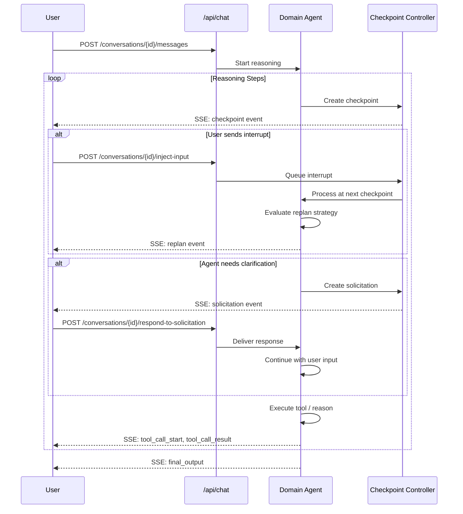

# Interruptible Reasoning

> Last verified: 2026-03-24

---

## Overview

Interruptible Reasoning allows you to **interact with the AI agent while it is thinking**, rather than waiting for it to finish.

### What It Enables

- **Context Injection**: Add information mid-reasoning
- **Course Correction**: Request the agent to change direction
- **Cancellation**: Stop reasoning if no longer needed
- **Agent Questions**: Agent can ask you for clarification

### Why Use It?

Traditional AI interactions are one-way. Interruptible Reasoning makes it a **conversation**:

```
Traditional:
You: "Optimize my query"
Agent: [thinks for 2 minutes]
Agent: "Here are 10 recommendations"
You: "Actually, I only care about indexes"
Agent: [thinks for 2 more minutes]

Interruptible:
You: "Optimize my query"
Agent: [starts thinking]
Agent: [checkpoint - analyzing schema]
You: [inject] "Focus only on indexes"
Agent: [replans immediately]
Agent: "Here are index recommendations" [30 seconds saved!]
```

### When to Use

Use when:

- You want real-time feedback during long operations
- You might need to provide additional context mid-execution
- The problem space is exploratory
- You want to cancel early if the direction is wrong

Do not use when:

- You just want simple request-response
- The task is fully specified upfront
- You will not be monitoring progress

---

## Core Concepts

### 1. Checkpoints

**What**: Pause points in reasoning where interrupts can be processed.

**Types**:

- `REASONING_STEP` -- After agent completes a thought
- `TOOL_CALL` -- Before/after calling a tool
- `SOLICITATION` -- When agent asks a question
- `REPLAN` -- After processing an interrupt
- `FINAL_OUTPUT` -- Before returning result

### 2. User Interrupts

**What**: Your input injected during agent reasoning.

**Types**:

- `context_injection` -- Add information
- `replan_request` -- Ask agent to change approach
- `cancel_request` -- Stop reasoning immediately
- `tool_override` -- Override tool selection (advanced)

### 3. Replan Strategies

**How the agent responds to your interrupt:**

- `CONTINUE` -- Acknowledge but do not change (low impact)
- `SOFT_REPLAN` -- Incorporate input, adjust approach (medium)
- `HARD_REPLAN` -- Reset reasoning, start fresh (high impact)
- `CANCEL` -- Stop immediately (cancellation request)

### 4. Agent Solicitations

**What**: Agent asks **you** a question when it needs clarification.

**When**: Agent detects:

- Repeated errors (same error 2+ times)
- Stuck (no progress after 3 steps)
- Missing critical information
- Ambiguous goal

---

## API Reference

### Inject User Input

**Endpoint**: `POST /api/chat/conversations/{id}/inject-input`

**Request**:
```json
{
  "input_type": "context_injection",
  "content": "Focus on partition pruning",
  "checkpoint_id": "ckpt_123"
}
```

**Response** (`200 OK`):
```json
{
  "input_id": "input_abc123",
  "status": "accepted",
  "checkpoint_id": "ckpt_123",
  "message": "Input will be processed at next checkpoint"
}
```

### Respond to Solicitation

**Endpoint**: `POST /api/chat/conversations/{id}/respond-to-solicitation`

**Request**:
```json
{
  "solicitation_id": "sol_123",
  "content": "Use principal_a"
}
```

**Response** (`200 OK`):
```json
{
  "response_id": "resp_xyz789",
  "status": "accepted",
  "solicitation_id": "sol_123",
  "response_time_ms": 5432.1
}
```

### Get Recent Checkpoints

**Endpoint**: `GET /api/chat/conversations/{id}/checkpoints?limit=10`

**Response** (`200 OK`):
```json
{
  "checkpoints": [
    {
      "checkpoint_id": "ckpt_005",
      "step_number": 5,
      "checkpoint_type": "reasoning_step",
      "timestamp": "2026-03-24T10:35:22Z",
      "can_interrupt": true
    }
  ],
  "active_checkpoint": "ckpt_005"
}
```

---

## Interrupt Flow



*Figure 1: Interrupt flow showing checkpoints, user interrupts, and agent solicitations.*

---

## Event Streaming

### SSE Stream

**Endpoint**: `GET /api/chat/conversations/{id}/stream`

**Event Types**:

| Event | Description | When Emitted |
|-------|-------------|--------------|
| `thinking` | Agent's reasoning content | During LLM generation |
| `checkpoint` | Reasoning checkpoint | After each step |
| `interrupt_received` | User interrupt detected | When interrupt processed |
| `replan` | Replan strategy decision | After interrupt analysis |
| `solicitation` | Agent asks question | When needs input |
| `tool_call_start` | Tool execution starts | Before tool call |
| `tool_call_result` | Tool execution ends | After tool call |
| `final_output` | Complete result | End of reasoning |
| `error` | Error occurred | On failure |

**JavaScript Example**:
```javascript
const eventSource = new EventSource(
  '/api/chat/conversations/conv_123/stream'
);

eventSource.addEventListener('checkpoint', (event) => {
  const data = JSON.parse(event.data);
  if (data.can_interrupt) {
    showInterruptButton(data.checkpoint_id);
  }
});

eventSource.addEventListener('solicitation', (event) => {
  const data = JSON.parse(event.data);
  showQuestionDialog(data);
});

eventSource.addEventListener('final_output', (event) => {
  const data = JSON.parse(event.data);
  showFinalReport(data);
  eventSource.close();
});
```

---

## Usage Patterns

### Pattern 1: Guided Exploration

Start broad, then narrow based on what the agent discovers.

1. User: "Analyze performance issues"
2. Agent: "Analyzing query patterns... Found 50 slow queries..."
3. User: [inject] "Focus on queries hitting orders table"
4. Agent: "Analyzing orders queries... Found partition skew..."

### Pattern 2: Early Cancellation

Stop agent when going in wrong direction.

1. User: "Recommend indexes"
2. Agent: "Analyzing all 500 tables..."
3. User: [cancel] "Stop -- I only care about orders table"
4. User: "Recommend indexes for orders table"

### Pattern 3: Agent-Driven Clarification

Agent encounters error and needs your help.

1. User: "Optimize query_123"
2. Agent: Encounters "Permission denied on table X"
3. Agent: Tries again... same error
4. Agent: [solicits] "Which service principal should I use?"
5. User: "Use principal_a"
6. Agent: "Using principal_a... Success!"

### Pattern 4: Collaborative Refinement

You and agent refine solution together.

1. User: "Recommend partitioning strategy"
2. Agent: "Recommend partitioning by date..."
3. User: [inject] "Consider customer_id as partition key"
4. Agent: "Analyzing customer_id... High cardinality..."
5. User: [inject] "Use date partitioning with customer_id clustering"
6. Agent: "Confirmed! Here is the DDL..."

---

## Best Practices

### When to Interrupt

**Do**:

- Interrupt when agent is going off-track
- Provide context as soon as relevant
- Cancel early if question was wrong

**Do not**:

- Interrupt every single checkpoint
- Inject contradictory information rapidly
- Interrupt with unrelated information

### Writing Good Interrupts

Good: "Focus on partition pruning. The orders table is partitioned by date."
-- Clear, specific, actionable

Bad: "Also check indexes and maybe partitions and stuff"
-- Vague, unfocused, not actionable

### Responding to Solicitations

**Do**:

- Respond within timeout (default 5 minutes)
- Be specific and direct
- Choose from suggestions if provided

**Do not**:

- Let it timeout
- Give vague or contradictory answers
- Ignore the question

---

## Troubleshooting

### Interrupts Not Being Processed

**Diagnosis**:

1. Check if checkpoint controller is enabled
2. Check if conversation is still processing
3. Verify conversation_id matches

**Solution**:

- Ensure controller created before sending message
- Check logs for `interrupt_received` events

### Replan Strategy Always CONTINUE

**Diagnosis**:

1. Check if interrupt content is specific enough
2. Check impact score in replan event

**Solution**:

- Provide more specific, actionable context
- Wait for relevant checkpoint (not at final output)

### Solicitations Not Appearing

**Diagnosis**:

- Has same error occurred 2+ times?
- Has agent made no progress after 3 steps?

**Solution**:

- Verify error detection is working
- Review solicitation heuristics

### Events Not Streaming

**Diagnosis**:

1. Check network connectivity
2. Verify conversation exists

**Solution**:

- Use SSE-compatible client (keep-alive)
- Check for proxy/firewall blocking SSE

---

## Summary

Interruptible Reasoning enables real-time collaboration with the AI agent:

- **Context Injection** -- Add information as you discover it
- **Course Correction** -- Guide the agent's approach
- **Early Stopping** -- Cancel when not needed
- **Agent Questions** -- Clarify ambiguities together

Use it for exploratory tasks where you learn as the agent thinks, not for simple request-response interactions.

---

**Last Updated**: 2026-03-24
**Version**: 2.0
