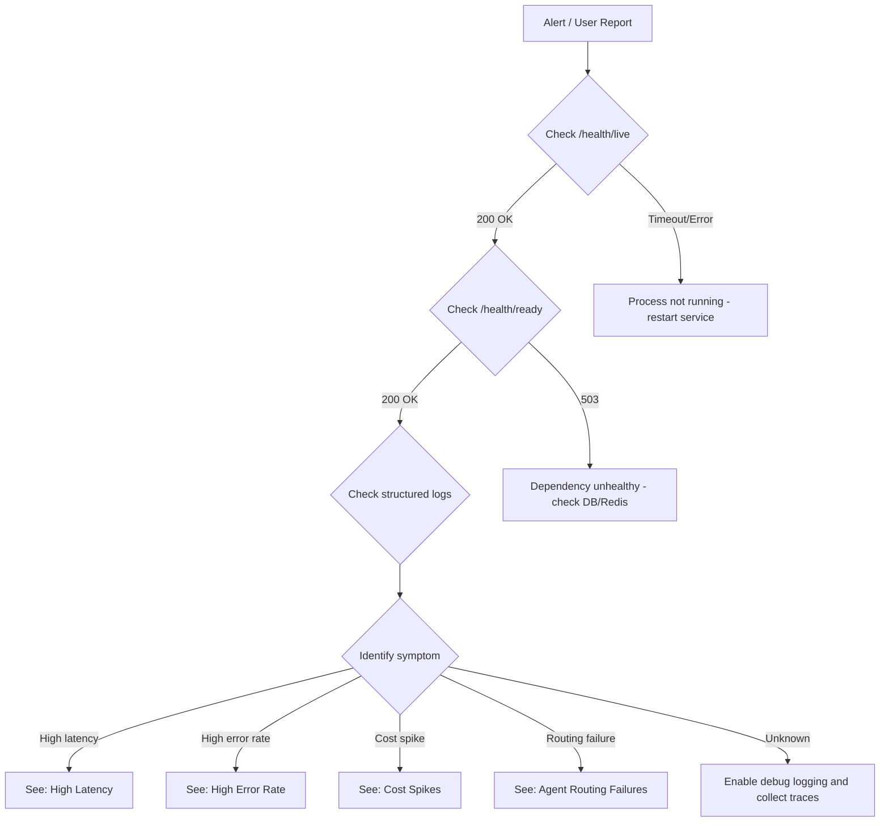

# Operations Runbook

> Last verified: 2026-03-24

Operational procedures for the Starboard AI Agent in production. Every instruction
in this document is designed to be copy-pasteable by on-call engineers.

---

## Triage Flowchart

Use this flowchart when you first encounter an alert or user report:



---

## Health Check Verification

Starboard exposes two health endpoints. Both are unauthenticated and excluded from
rate limiting.

### Liveness Probe -- /health/live

Confirms the process is running and the HTTP server is accepting connections.

```bash
curl -s http://localhost:8000/health/live | jq .
```

**Expected response** (HTTP 200):

```json
{"status": "ok"}
```

**If unhealthy:**

1. The process is not running or the port is not bound.
2. **Restart the service:**
   ```bash
   # Systemd
   sudo systemctl restart starboard-server

   # Manual
   uvicorn starboard.main:create_app --factory --host 0.0.0.0 --port 8000
   ```
3. Check for crash loops in process manager logs.

### Readiness Probe -- /health/ready

Confirms the service is ready to accept traffic. Checks database connectivity and
cache availability.

```bash
curl -s http://localhost:8000/health/ready | jq .
```

**Expected response** (HTTP 200):

```json
{"status": "ok", "checks": [...]}
```

**If unhealthy** (HTTP 503):

```json
{"status": "not_ready", "error": "..."}
```

1. **Identify the failing check** from the response body.
2. **Database probe failed** -- verify database connectivity (see Database Operations).
3. **Redis probe failed** -- verify Redis connectivity:
   ```bash
   redis-cli -u "$REDIS_URL" ping
   ```
4. **Container not initialized** -- the server may still be starting. Wait 10 seconds
   and retry.

---

## Common Issues: High Latency

### Symptom

- p95 time-to-first-token > 2 seconds
- p95 total completion time > 60 seconds
- Users report "slow" or "stuck" responses

### Cause

| Cause | How to Confirm |
|-------|---------------|
| Too many reasoning steps (>20) | Check `reasoning_steps` in structured logs |
| Large message history (token overflow) | Check `tokens_used` exceeding budget |
| Slow Databricks API calls | Check `latency_ms` on tool call spans |
| LLM rate limiting (429 responses) | Check for `rate_limit` error events |

### Diagnosis Steps

1. **Check recent request latencies:**
   ```bash
   # Structured logs (JSON mode)
   # Filter for high-latency requests
   jq 'select(.latency_ms > 30000)' < /dev/stdin
   ```

2. **Check LLM call latencies:**
   ```bash
   # Look for slow LLM calls in structured logs
   jq 'select(.event == "llm_call_completed" and .latency_ms > 10000)' < /dev/stdin
   ```

3. **Check Databricks API status:**
   ```bash
   curl -s -H "Authorization: Bearer $DATABRICKS_TOKEN" \
     "$DATABRICKS_HOST/api/2.0/clusters/list" | jq '.clusters | length'
   ```

### Resolution

1. **Reduce `max_steps`** -- Lower the maximum reasoning steps per turn via the
   `LLM_MAX_TOKENS` environment variable or the frontend Configuration page.
2. **Enable message compression** -- Reduces context window usage by 30-50%.
3. **Check Databricks API status** -- External API degradation is the most common
   cause of high latency.
4. **Review retry backoff settings** -- Aggressive retries on rate-limited calls
   compound latency.

### Verification

```bash
curl -s http://localhost:8000/health/ready | jq .
# Confirm status is "ok" and response time < 500ms
```

---

## Common Issues: Cost Spikes

### Symptom

- Per-request cost > $0.50 for typical queries
- Per-request cost > $2.00 for complex analyses
- Daily spend exceeds budget thresholds

### Cause

| Cause | How to Confirm |
|-------|---------------|
| Large conversation history | Check `tokens_used` per request |
| Too many reasoning steps | Check `reasoning_steps` count |
| Missing message compression | Check if compression is enabled |
| Infinite reasoning loops | Check for repeated tool calls in logs |

### Diagnosis Steps

1. **Check per-request token usage:**
   ```bash
   # Look for high-token requests in structured logs
   jq 'select(.event == "llm_call_completed") | {model, tokens_used, cost_usd}' < /dev/stdin
   ```

2. **Check for runaway conversations:**
   ```bash
   # Look for conversations with excessive steps
   jq 'select(.event == "reasoning_step" and .step_number > 15) | {trace_id, step_number}' < /dev/stdin
   ```

### Resolution

1. **Enable message compression** if not already active (reduces token usage 30-50%).
2. **Set token budgets per session** -- Configure `LLM_MAX_TOKENS` appropriately:
   - Simple queries: 50,000 tokens
   - Complex queries: 100,000 tokens
   - Job optimization: 150,000+ tokens
3. **Reduce `max_steps`** to limit reasoning depth.
4. **Review prompt efficiency** -- Verbose system prompts consume budget on every call.

### Verification

Monitor `cost_usd` in structured logs for the next 10 requests to confirm costs
are within expected range.

---

## Common Issues: High Error Rate

### Symptom

- Success rate drops below 90%
- Error count increasing in monitoring dashboards
- Users reporting failures

### Cause

| Error Pattern | Likely Cause |
|---------------|-------------|
| `timeout` | External API timeouts (Databricks, LLM provider) |
| `rate_limit` | LLM provider rate limiting (HTTP 429) |
| `missing_data` | Tables, jobs, or clusters not found in Databricks |
| `invalid_arguments` | Tool parameter validation failures |
| `permission_denied` | Databricks token lacks required permissions |
| `connection_error` | Network connectivity to external services |

### Diagnosis Steps

1. **Categorize errors by type:**
   ```bash
   # Count errors by event type in structured logs
   jq 'select(.level == "error") | .event' < /dev/stdin | sort | uniq -c | sort -rn
   ```

2. **Check external API connectivity:**
   ```bash
   # Databricks API
   curl -s -o /dev/null -w "%{http_code}" \
     -H "Authorization: Bearer $DATABRICKS_TOKEN" \
     "$DATABRICKS_HOST/api/2.0/clusters/list"

   # LLM provider
   curl -s -o /dev/null -w "%{http_code}" \
     -H "Authorization: Bearer $LLM_API_KEY" \
     "$LLM_BASE_URL/models"
   ```

3. **Check for permission errors:**
   ```bash
   jq 'select(.event == "permission_denied" or .error_type == "permission_denied")' < /dev/stdin
   ```

### Resolution

1. **External API down** -- Check provider status pages. Enable circuit breakers to
   fail fast (see Emergency Procedures).
2. **Rate limiting** -- Reduce concurrent requests or increase retry backoff.
3. **Permission errors** -- Verify the `DATABRICKS_TOKEN` has required scopes.
4. **Invalid arguments** -- Review tool call logs; this often indicates a prompt
   regression.

### Verification

```bash
# After resolution, monitor error rate for 5 minutes
jq 'select(.level == "error")' < /dev/stdin | wc -l
# Should trend toward 0
```

---

## Common Issues: Agent Routing Failures

### Symptom

- User questions routed to the wrong specialist agent
- Router returning unexpected domains
- Users reporting "off-topic" responses

### All Agent Domains (9 total)

| Domain | Agent | Specialty |
|--------|-------|-----------|
| `router` | Intent Router | Classifies user intent and selects specialist |
| `query` | Query Expert | SQL optimization and execution plans |
| `job` | Job Expert | Databricks job performance tuning |
| `uc` | Unity Catalog Expert | Metadata, lineage, governance, storage optimization |
| `cluster` | Cluster Expert | Cluster configuration and optimization |
| `analytics` | FinOps Expert | Cost analysis, billing, budget forecasting |
| `diagnostic` | Diagnostic Expert | Troubleshooting, debugging, root cause analysis |
| `warehouse` | Warehouse Expert | SQL warehouse portfolio optimization |
| `discovery` | Discovery Expert | Workspace health assessments |

### Diagnosis Steps

1. **Check routing decisions in logs:**
   ```bash
   jq 'select(.event == "intent_classified" or .event == "agent_selected") | {trace_id, domain, confidence}' < /dev/stdin
   ```

2. **Verify the router agent is receiving the full user message** -- Truncated
   messages lose routing signals.

3. **Check if a domain is disabled:**
   ```bash
   echo $DISABLED_AGENT_DOMAINS
   # Should be empty or only contain intentionally disabled domains
   ```

4. **Verify service catalog is loaded:**
   ```bash
   jq 'select(.event == "service_catalog_initialized")' < /dev/stdin
   ```

### Resolution

1. **Wrong domain selected** -- The intent router uses both pattern matching and LLM
   classification. If routing is consistently wrong for a query type, review the
   router prompts.
2. **Domain disabled** -- Remove the domain from `DISABLED_AGENT_DOMAINS` if it was
   disabled unintentionally.
3. **Low confidence routing** -- If the router confidence is consistently low, the
   user's query may be ambiguous. The router should request clarification in these
   cases.
4. **Service catalog issues** -- Verify the catalog file is valid:
   ```bash
   python -c "import yaml; yaml.safe_load(open('packages/starboard-server/starboard/config/service_catalog.yaml'))"
   ```

### Verification

Send a test query for each domain and confirm correct routing:

```bash
# Example: should route to "job" domain
curl -s http://localhost:8000/api/chat \
  -H "Content-Type: application/json" \
  -d '{"message": "Analyze job 12345"}' | jq .agent_domain
```

---

## Monitoring and Alerting

### Structured Logging Fields

Every structured log entry should include these fields for effective monitoring
and debugging:

| Field | Description | Example |
|-------|-------------|---------|
| `trace_id` | Distributed trace identifier | `abc123def456` |
| `span_id` | Span within the trace | `span_789` |
| `user_id` | Authenticated user identifier | `user@company.com` |
| `session_id` | Conversation session | `sess_abc123` |
| `model` | LLM model used | `databricks-claude-sonnet-4-5` |
| `prompt_version` | Version of the prompt template | `v2` |
| `tokens_used` | Total tokens consumed | `45000` |
| `latency_ms` | Request or operation latency | `3200` |
| `cost_usd` | Estimated cost of the LLM call | `0.12` |

### Key Metrics to Monitor

| Metric | Warning Threshold | Critical Threshold |
|--------|------------------|--------------------|
| **Latency (p95)** | > 30s | > 60s |
| **Error rate** | > 5% | > 20% |
| **Token usage per request** | > 100k | > 200k |
| **Cost per request** | > $0.50 | > $2.00 |
| **Cost per day** | > $50 | > $200 |
| **Concurrent sessions** | > 50 | > 100 |
| **Health check failures** | Any /health/ready 503 | /health/live timeout |

### Alerting Rules (Prometheus)

```yaml
groups:
  - name: starboard
    rules:
      - alert: HighErrorRate
        expr: rate(errors_total[5m]) > 0.05
        for: 5m
        labels:
          severity: warning
        annotations:
          summary: "Error rate exceeds 5%"

      - alert: HighLatency
        expr: histogram_quantile(0.95, request_duration_seconds) > 30
        for: 5m
        labels:
          severity: warning

      - alert: HighCost
        expr: rate(cost_usd[1h]) > 10
        for: 1h
        labels:
          severity: critical

      - alert: HealthCheckFailing
        expr: up{job="starboard-server"} == 0
        for: 1m
        labels:
          severity: critical
```

---

## Emergency Procedures

### Circuit Breaker Activation

The circuit breaker pattern is implemented in
`starboard/infra/reliability/circuit_breaker.py`. It protects against cascading
failures when external dependencies (Databricks API, LLM provider) are degraded.

**When to activate:** External dependency is returning errors for > 50% of requests.

1. **Check circuit breaker state in logs:**
   ```bash
   jq 'select(.event | test("circuit_breaker"))' < /dev/stdin
   ```

2. **Circuit breaker states:**
   - `closed` -- Normal operation, requests pass through.
   - `open` -- Requests are rejected immediately (fail fast).
   - `half_open` -- Testing if dependency has recovered.

3. **If the circuit breaker is open**, the dependency is down. Check the provider
   status page and wait for recovery.

### Safe Mode

Safe mode disables all external API calls. Use it when you need the service running
but cannot reach external dependencies.

```bash
# Enable safe mode
export SAFE_MODE=true

# Restart the service
uvicorn starboard.main:create_app --factory --host 0.0.0.0 --port 8000
```

!!! danger "Safe mode limits functionality"
    In safe mode, agents can only use offline-safe tools (code analysis,
    `request_user_input`, `complete`). All Databricks API tools and LLM-based
    analysis tools are disabled. Use this only as a temporary measure.

### Disabling Specific Agent Domains

If a specific agent domain is causing failures, you can disable it without affecting
other domains:

```bash
# Disable one or more domains (comma-separated)
export DISABLED_AGENT_DOMAINS="diagnostic,discovery"

# Restart the service
uvicorn starboard.main:create_app --factory --host 0.0.0.0 --port 8000
```

!!! warning "Disabled domains are invisible to the router"
    Disabling a domain means the router will never select it. User queries that
    would normally route to that domain will be handled by the closest alternative
    or trigger a clarification request.

### Critical Error Rate (>50% failures)

1. **Check external API status** (Databricks, LLM provider).
2. **Review recent changes** (prompts, config, code deployments).
3. **Check circuit breaker status** in logs.
4. **Enable safe mode** if external dependencies are down.
5. **Rollback recent deployments** if the issue started after a release.
6. **Scale down traffic** if the issue is system-wide.

### Cost Runaway (>$10/request)

1. **Check token usage immediately** in structured logs.
2. **Enable safe mode** to stop all LLM calls.
3. **Reduce `LLM_MAX_TOKENS`** to the minimum viable value.
4. **Check for infinite reasoning loops** (repeated tool calls in the same trace).
5. **Temporarily reduce concurrent session limits.**

### Complete Outage (100% failures)

1. **Check /health/live** -- is the process running?
2. **Check /health/ready** -- are dependencies reachable?
3. **Verify credentials** (`DATABRICKS_TOKEN`, `LLM_API_KEY`) are valid.
4. **Check network connectivity** to external services.
5. **Review recent deployments** for breaking changes.
6. **Enable circuit breakers** and safe mode as temporary measures.
7. **Engage on-call engineer** (see Contact and Escalation).

---

## Database Operations

### State Backend Health

Starboard supports three database backends: `sqlite` (default for development),
`postgres` (recommended for production), and `databricks` (Lakebase).

**Check current backend:**

```bash
echo $DATABASE_BACKEND
# Expected: sqlite, postgres, or databricks
```

**SQLite health check:**

```bash
# Verify SQLite files exist and are not corrupted
sqlite3 "$SQLITE_STATE_PATH" "PRAGMA integrity_check;"
# Expected: ok
```

**Postgres health check:**

```bash
# Verify connection
psql "$DATABASE_URL" -c "SELECT 1;"

# Check connection pool usage
psql "$DATABASE_URL" -c "SELECT count(*) FROM pg_stat_activity WHERE datname = current_database();"
```

### Connection Pool Monitoring (Postgres)

Key configuration values:

| Setting | Env Var | Default |
|---------|---------|---------|
| Min pool size | `POSTGRES_MIN_POOL_SIZE` | 5 |
| Max pool size | `POSTGRES_MAX_POOL_SIZE` | 20 |
| Command timeout | `POSTGRES_COMMAND_TIMEOUT` | 60s |

**Symptoms of pool exhaustion:**

- Increasing latency on all requests
- `connection_pool_exhausted` events in logs
- `/health/ready` returns 503

**Resolution:**

1. **Increase pool size** (if the database can handle more connections):
   ```bash
   export POSTGRES_MAX_POOL_SIZE=40
   ```
2. **Check for connection leaks** -- look for long-running queries:
   ```sql
   SELECT pid, now() - pg_stat_activity.query_start AS duration, query
   FROM pg_stat_activity
   WHERE state != 'idle'
   ORDER BY duration DESC;
   ```
3. **Restart the service** to reset the connection pool as a last resort.

### Cache Backend

| Backend | Env Var | Use Case |
|---------|---------|----------|
| `memory` | `CACHE_BACKEND=memory` | Development (non-persistent) |
| `redis` | `CACHE_BACKEND=redis` | Production (shared, persistent) |
| `postgres` | `CACHE_BACKEND=postgres` | Production (co-located with state) |

**Redis health check:**

```bash
redis-cli -u "$REDIS_URL" ping
# Expected: PONG

redis-cli -u "$REDIS_URL" info memory | grep used_memory_human
```

---

## Log Analysis

### Structured Log Field Reference

Starboard uses `structlog` for structured logging. In JSON mode (`LOG_JSON=true`),
every log entry is a single JSON object.

**Enable JSON logging for production:**

```bash
export LOG_JSON=true
export LOG_LEVEL=INFO
```

### Useful Queries

#### By Deployment Type

**Systemd/journalctl:**

```bash
# All errors in the last hour
journalctl -u starboard-server --since "1 hour ago" | \
  jq 'select(.level == "error")'

# High-latency LLM calls
journalctl -u starboard-server --since "1 hour ago" | \
  jq 'select(.event == "llm_call_completed" and .latency_ms > 10000)'

# Cost tracking
journalctl -u starboard-server --since "1 day ago" | \
  jq 'select(.cost_usd != null) | .cost_usd' | \
  awk '{sum+=$1} END {printf "Total cost: $%.2f\n", sum}'
```

**Docker:**

```bash
# All errors
docker logs starboard-server 2>&1 | jq 'select(.level == "error")'

# Trace a specific request
docker logs starboard-server 2>&1 | jq 'select(.trace_id == "TARGET_TRACE_ID")'
```

**Kubernetes:**

```bash
# All errors
kubectl logs deployment/starboard-server | jq 'select(.level == "error")'

# Follow logs in real time
kubectl logs -f deployment/starboard-server | jq 'select(.level == "error")'
```

#### Common Log Queries

**Find all events for a specific trace:**

```bash
jq 'select(.trace_id == "TARGET_TRACE_ID")' < logs.jsonl
```

**Summarize token usage by model:**

```bash
jq 'select(.event == "llm_call_completed") | {model, tokens_used}' < logs.jsonl | \
  jq -s 'group_by(.model) | map({model: .[0].model, total_tokens: (map(.tokens_used) | add), count: length})'
```

**Find routing decisions:**

```bash
jq 'select(.event == "intent_classified") | {trace_id, domain, confidence}' < logs.jsonl
```

**Find tool failures:**

```bash
jq 'select(.event | test("tool.*failed|tool.*error"))' < logs.jsonl
```

---

## Contact and Escalation

**Before escalating**, confirm you have:

1. Checked this runbook for the relevant issue.
2. Collected recent structured logs (at least the last 30 minutes).
3. Checked external service status pages (Databricks, LLM provider).
4. Noted the `trace_id` of affected requests.

**Escalation path:**

| Level | Who | When |
|-------|-----|------|
| **L1** | On-call engineer | Operational issues: service down, high error rate, high latency |
| **L2** | Agent team lead | Agent behavior issues: wrong routing, bad recommendations, prompt regressions |
| **L3** | Platform team | Infrastructure issues: database failures, networking, deployment pipeline |
| **L4** | External support | Provider API issues: Databricks support, LLM provider support |

**Include in every escalation:**

- Symptom description and time of onset
- Affected `trace_id` values
- Health check outputs (`/health/live`, `/health/ready`)
- Relevant structured log excerpts
- Any recent changes (deployments, config changes)
