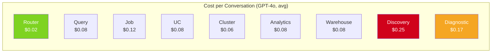

# LLM Cost Estimation Guide

> **Docs** > **Administration** > **Cost Estimation**
> Reading time: 8 minutes

## What You'll Learn

- How to estimate monthly LLM API costs for your Starboard deployment
- Token usage patterns by agent type and conversation complexity
- Cost optimization strategies that can reduce spend by 30--60%
- How to set up cost monitoring and budget alerts

---

## Cost Model Overview

LLM API costs are determined by three factors:

1. **Tokens per conversation** -- How many tokens each agent conversation consumes (system prompt + user messages + tool results + agent reasoning + final output).
2. **Conversations per month** -- How many conversations your users initiate.
3. **Price per token** -- Your LLM provider's pricing (varies by model and provider).

```
Monthly Cost = Conversations/Month x Avg Tokens/Conversation x Price/Token
```

---

## Token Usage by Agent

Each domain agent has different token requirements based on the complexity of its analysis and the number of tools it calls.

| Agent | Avg. Input Tokens | Avg. Output Tokens | Total (Avg.) | Total (Complex) |
|-------|-------------------|--------------------|--------------|--------------------|
| **Router** | 1,500 | 500 | 2,000 | 5,000 |
| **Query** | 12,000 | 5,000 | 17,000 | 40,000 |
| **Job** | 18,000 | 7,000 | 25,000 | 60,000 |
| **UC** | 12,000 | 5,000 | 17,000 | 50,000 |
| **Cluster** | 8,000 | 4,000 | 12,000 | 30,000 |
| **Analytics** | 12,000 | 5,000 | 17,000 | 40,000 |
| **Warehouse** | 12,000 | 5,000 | 17,000 | 40,000 |
| **Discovery** | 35,000 | 15,000 | 50,000 | 100,000 |
| **Diagnostic** | 25,000 | 10,000 | 35,000 | 80,000 |

> Token counts are approximate. Actual usage depends on conversation length, number of reasoning steps, and tool result sizes.

!!! note "Router tokens are always consumed"
    Every conversation starts with the Intent Router, which adds 2,000--5,000 tokens to the total. The router cost is included in all estimates below.

---

## Cost per Conversation

### By Model (Single Conversation, Average Complexity)

| Model | Input Price (per 1M) | Output Price (per 1M) | Avg. Cost/Conv | Complex Cost/Conv |
|-------|---------------------|----------------------|----------------|-------------------|
| **GPT-4o** | $2.50 | $10.00 | $0.08--0.20 | $0.25--0.60 |
| **GPT-4o-mini** | $0.15 | $0.60 | $0.005--0.01 | $0.02--0.04 |
| **Claude Sonnet 4** | $3.00 | $15.00 | $0.11--0.25 | $0.35--0.75 |
| **Databricks DBRX** | Varies by workspace | Varies | Check your endpoint | Check your endpoint |

> Prices as of early 2026. Check your provider for current rates.

### By Agent Domain (GPT-4o Pricing)



*Estimated cost per conversation by agent domain. Discovery and Diagnostic are the most expensive due to multi-phase analysis.*

---

## Monthly Cost Projections

### Scenario 1: Small Team (5 users, occasional use)

| Parameter | Value |
|-----------|-------|
| Users | 5 |
| Conversations/day | 3--5 |
| Conversations/month | ~100 |
| Avg. tokens/conversation | 20,000 |
| Model | GPT-4o |
| **Estimated monthly cost** | **$15--30** |

### Scenario 2: Active Team (20 users, daily use)

| Parameter | Value |
|-----------|-------|
| Users | 20 |
| Conversations/day | 15--25 |
| Conversations/month | ~500 |
| Avg. tokens/conversation | 25,000 |
| Model | GPT-4o |
| **Estimated monthly cost** | **$75--175** |

### Scenario 3: Department-Wide (50 users, frequent use)

| Parameter | Value |
|-----------|-------|
| Users | 50 |
| Conversations/day | 50--100 |
| Conversations/month | ~2,000 |
| Avg. tokens/conversation | 30,000 |
| Model | GPT-4o |
| **Estimated monthly cost** | **$350--700** |

### Scenario 4: Enterprise (100+ users)

| Parameter | Value |
|-----------|-------|
| Users | 100+ |
| Conversations/day | 200--500 |
| Conversations/month | ~10,000 |
| Avg. tokens/conversation | 30,000 |
| Model | GPT-4o |
| **Estimated monthly cost** | **$1,500--3,500** |

!!! tip "Use GPT-4o-mini for the router"
    Setting `DOMAIN_MODEL_OVERRIDES='{"router": "gpt-4o-mini"}'` reduces router costs by 95%. For 10,000 conversations/month, this saves approximately $150--200/month.

---

## Cost Optimization Strategies

### 1. Model Selection (Saves 20--80%)

Use cheaper models where full capability is not needed:

```bash
# Use a cheaper model for intent routing
DOMAIN_MODEL_OVERRIDES='{"router": "gpt-4o-mini"}'

# Use a cheaper model for all agents (trade quality for cost)
LLM_MODEL=gpt-4o-mini
```

| Strategy | Quality Impact | Cost Savings |
|----------|---------------|-------------|
| Cheaper router model | None (routing is simple) | 5--10% overall |
| GPT-4o-mini for all agents | Moderate (less detailed analysis) | 80--90% |
| Mix: mini for router, 4o for agents | None | 5--10% |

### 2. Semantic Caching (Saves 10--30%)

Enable semantic caching to reuse results for similar queries:

```bash
ENABLE_SEMANTIC_CACHE=true
SEMANTIC_CACHE_THRESHOLD=0.95   # Similarity threshold (0.0--1.0)
```

When a user asks a question similar to a recent one, the cached result is returned without an LLM call. The default TTL is 5 minutes for tool results.

### 3. Token Budget Limits (Prevents Spikes)

Set a maximum token budget per conversation to prevent runaway costs:

```bash
LLM_MAX_TOKENS=75000   # Default; reduce to 50000 for cost-sensitive deployments
```

!!! warning "Budget too low"
    Setting `LLM_MAX_TOKENS` below 30,000 may cause agents to hit the limit before completing complex analyses. Monitor for "budget exhausted" errors.

### 4. Disable Unused Agents (Saves 0--100% for those domains)

If your team does not use certain agents, disable them:

```bash
DISABLED_AGENT_DOMAINS=discovery,diagnostic
```

This prevents accidental routing to expensive agents.

### 5. Message Compression (Saves 15--30%)

For long multi-turn conversations, message compression reduces the context window by removing redundant information:

- System-level compression reduces token usage by 30--50% for conversations with 5+ turns.
- This is handled automatically by the conversation manager.

---

## Monitoring Costs

### Structured Log Fields

Every LLM call logs the following fields:

```json
{
  "event": "llm_call_completed",
  "model": "gpt-4o",
  "tokens_used": 15420,
  "cost_usd": 0.082,
  "trace_id": "abc123",
  "domain": "query",
  "conversation_id": "conv_xyz"
}
```

### Building a Cost Dashboard

Aggregate the structured logs to build a cost dashboard:

1. **Total cost per day/week/month** -- Sum `cost_usd` across all log entries.
2. **Cost per agent domain** -- Group by `domain` field.
3. **Cost per user** -- Group by `user_id` (if available in your auth layer).
4. **Cost per conversation** -- Group by `conversation_id`.

### Budget Alerts

Set up alerts at these thresholds:

| Metric | Warning | Critical |
|--------|---------|----------|
| Daily LLM spend | > 120% of daily average | > 200% of daily average |
| Single conversation cost | > $1.00 | > $5.00 |
| Monthly total | > 80% of budget | > 95% of budget |
| Token budget exhaustion rate | > 5% of conversations | > 15% of conversations |

---

## Next Steps

- [Capacity Planning](capacity-planning.md) -- Overall infrastructure sizing
- [Monitoring and Observability](monitoring.md) -- Setting up dashboards
- [Configuration Reference](../CONFIGURATION.md) -- All LLM-related environment variables
- [Security Hardening](security-hardening.md) -- Rate limiting to prevent cost abuse
