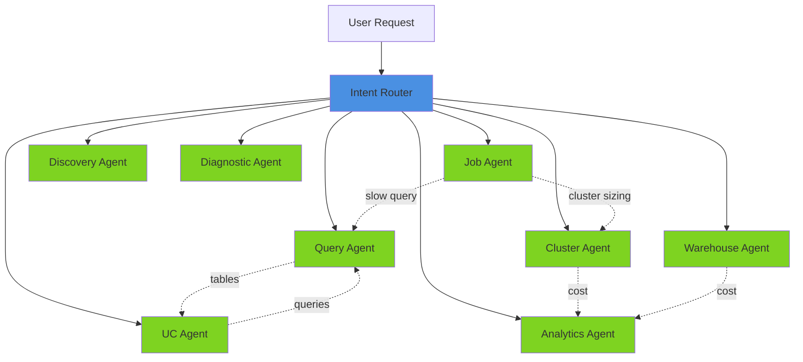

# Agent Documentation

> **Docs** > **Agents** > **Overview**
> Reading time: 8 minutes

**What you'll learn:**

- All 8 domain agents and their capabilities
- Agent routing and handoff patterns
- Tool sharing strategy
- How to navigate agent documentation

---

## Overview

The Starboard multi-agent system uses specialized domain agents that each handle a specific area of Databricks optimization. An Intent Router classifies incoming requests and dispatches them to the appropriate agent. Agents can hand off to each other when they discover issues outside their domain.



*All 8 domain agents with Intent Router at center, showing common handoff paths between agents.*

---

## Domain Agents

| Agent | Domain | Purpose | Tools | Report Type |
|-------|--------|---------|-------|-------------|
| **[Query](domain/query.md)** | `query` | SQL query optimization, execution plan analysis | 8 | `advisor` |
| **[Job](domain/job.md)** | `job` | Job/workflow optimization, Spark tuning, code quality | 14 | `advisor` |
| **[UC](domain/uc.md)** | `uc` | Unity Catalog governance, lineage, schema drift, costs | 18 | `advisor` |
| **[Cluster](domain/cluster.md)** | `cluster` | Cluster configuration, health, sizing, autoscaling | 8 | `compute` |
| **[Analytics](domain/analytics.md)** | `analytics` | FinOps cost analysis via agentic RAG and SQL generation | 6 | `analytics` |
| **[Warehouse](domain/warehouse.md)** | `warehouse` | SQL warehouse portfolio optimization, SLO, chargeback | 11 | `compute` |
| **[Discovery](domain/discovery.md)** | `discovery` | Workspace-wide health assessment (4-phase pipeline) | 6 | `advisor` |
| **[Diagnostic](domain/diagnostic.md)** | `diagnostic` | Cross-domain troubleshooting, root cause analysis | ALL | `advisor` |

Tool counts are from `packages/starboard/starboard/agents/tool_categories.py` and include core tools (`request_user_input`, `complete`).

---

## Framework Agents

| Agent | Domain | Purpose | Report Type |
|-------|--------|---------|-------------|
| **[Intent Router](framework/intent.md)** | `router` | Classifies user intent and routes to domain specialists | N/A |

---

## Quick Reference by Use Case

**Query Performance Issues**:
1. Start: [Query Agent](domain/query.md)
2. May route to: [UC Agent](domain/uc.md) (tables), [Warehouse Agent](domain/warehouse.md) (warehouse config)

**Job Failures or Slow Jobs**:
1. Start: [Job Agent](domain/job.md)
2. May route to: [Cluster Agent](domain/cluster.md) (sizing), [Query Agent](domain/query.md) (SQL tasks), [Diagnostic Agent](domain/diagnostic.md) (failures)

**Cost Reduction**:
1. Start: [Analytics Agent](domain/analytics.md)
2. May route to: [Job Agent](domain/job.md) (expensive jobs), [Warehouse Agent](domain/warehouse.md) (warehouse costs), [Cluster Agent](domain/cluster.md) (cluster costs)

**Table Management & Governance**:
1. Start: [UC Agent](domain/uc.md)
2. May route to: [Query Agent](domain/query.md) (downstream queries), [Job Agent](domain/job.md) (ETL jobs), [Analytics Agent](domain/analytics.md) (table costs)

**Warehouse Optimization**:
1. Start: [Warehouse Agent](domain/warehouse.md)
2. May route to: [Query Agent](domain/query.md) (expensive queries), [Analytics Agent](domain/analytics.md) (cost deep-dive)

**Workspace Health Assessment**:
1. Start: [Discovery Agent](domain/discovery.md)
2. May route to: domain-specific agents based on findings

**Error Investigation**:
1. Start: [Diagnostic Agent](domain/diagnostic.md)
2. May route to: [Cluster Agent](domain/cluster.md) (memory issues), [Query Agent](domain/query.md) (SQL errors), [Job Agent](domain/job.md) (job config)

---

## Architecture Patterns

### Multi-Agent Handoff

All domain agents follow a standard handoff pattern:

```
Agent A analyzes request
    |
    v
If specialist needed:
    [Handoff Context]
    resource_ids: [IDs discovered during analysis]
    Previous analysis summary: [Key findings]
    |
    v
Agent B receives context
    -> Uses provided IDs immediately (no re-asking)
    -> References previous findings
    -> Continues analysis
```

See: [System Architecture](../architecture/SYSTEM_ARCHITECTURE.md)

### Tool Sharing Strategy (80/20 Rule)

- **80% of operations**: Agents complete independently (strategic tool overlap)
- **20% of complex operations**: Delegate to domain specialist (no tool needed)

Examples:
- Query Agent has table tools --> can analyze schemas without UC Agent
- Job Agent has cluster tools --> can review cluster config without Cluster Agent
- UC Agent is the table expert --> handles complex lineage that Query Agent delegates

See: [Tool Architecture](../TOOL_ARCHITECTURE.md)

---

## Report Type Matrix

| Report Type | Primary UI Components | Used By |
|-------------|----------------------|---------|
| `advisor` | FindingCard, RecommendationCard, CodeBlock | Query, Job, UC, Diagnostic, Discovery |
| `analytics` | CostSummary, ChartVisualization, SavingsCard | Analytics, UC (cost-focused), Cluster (cost-focused) |
| `compute` | PortfolioOverview, HealthGauge, TopologyCard | Cluster, Warehouse |

---

## Evaluation Summary

| Agent | Completeness | Complexity | Key Strength |
|-------|-------------|------------|--------------|
| **Query** | 4.8/5 | Medium | Efficient 4-6 tool call completion |
| **Job** | 5.0/5 | High | Serverless branching, multi-task strategies |
| **UC** | 4.8/5 | Medium | 3 primary patterns with parallel execution |
| **Cluster** | 4.6/5 | Low | Simple fleet/health/deep patterns |
| **Analytics** | 4.8/5 | Low-Medium | Agentic RAG with reflexion loop |
| **Warehouse** | 5.0/5 | Medium | Multiple pattern types (portfolio/health/topology) |
| **Discovery** | 5.0/5 | Medium | 4-phase pipeline with domain analysis |
| **Diagnostic** | 5.0/5 | High | Multi-step artifact analysis, confidence calibration |
| **Intent Router** | 5.0/5 | Low-Medium | Declarative configuration |

---

## Related Documentation

- [Agent Implementation Guide](../developer/agent/IMPLEMENTATION_GUIDE.md) -- How to build new agents
- [Tool Architecture](../TOOL_ARCHITECTURE.md) -- Three-layer tool design
- [Tool Catalog](../tools/TOOL_CATALOG.md) -- Complete tool reference
- [System Architecture](../architecture/SYSTEM_ARCHITECTURE.md) -- Full system design

---

## Contributing

When documenting new agents, follow this structure:

1. **Overview** -- Purpose, capabilities, strengths
2. **Agent Architecture** -- Prompt structure, tool budget, patterns
3. **Example Prompts** -- Real-world user requests
4. **Tools & Tool Usage** -- Complete tool catalog with costs
5. **Hand-off Routes** -- Incoming/outgoing routes with context
6. **Patterns** -- Design patterns and operational strategies
7. **Evaluation Matrix** -- Completeness, complexity, strengths, weaknesses
8. **Diagram** -- Visual workflow (Mermaid)

See existing agent documentation (e.g., [Query Agent](domain/query.md)) for the gold standard template.
