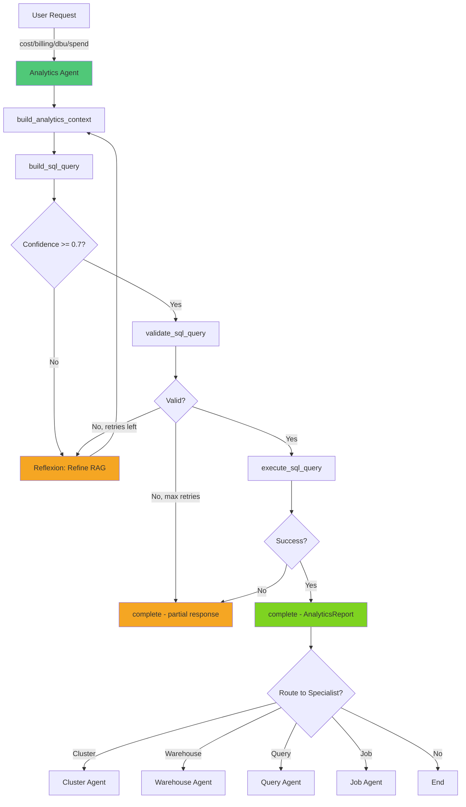

# Analytics Agent

> **Domain**: Analytics (FinOps)
> **Version**: 1.0.0
> **Report Type**: `analytics`
> **Prompt Version**: 1.0.0

---

## Overview

The Analytics Agent is a specialized domain agent focused on **Databricks FinOps and cost analytics**. It uses an agentic RAG (Retrieval-Augmented Generation) pattern to answer cost, billing, usage, and budget questions by dynamically discovering relevant data, generating SQL queries, and providing evidence-based financial insights with visualization support.

### Primary Capabilities
- Cost analysis and billing breakdowns (by workspace, warehouse, job, user)
- DBU consumption tracking and trend analysis
- Waste detection and cost optimization recommendations
- Usage attribution and chargeback analysis
- Budget forecasting and anomaly detection
- Automated data visualization (charts and tables)

### Key Strengths
- **Agentic RAG**: Agent controls RAG discovery dynamically, adapting context retrieval to query complexity
- **Reflexion Loop**: Self-corrects SQL generation failures by gathering additional context (up to 3 attempts)
- **Token-Efficient**: Uses opaque context handles to avoid serializing full RAG context into LLM conversation (saves ~12K tokens per call)
- **Visualization-First**: Automatically generates chart configurations alongside query results
- **DBU/Dollar Separation**: Strict cost unit handling prevents mixing incompatible metrics
- **Evidence-Based**: All findings backed by actual query results from Databricks system tables

---

## Agent Architecture

### System Prompt Structure

The Analytics Agent's behavior is defined by a comprehensive system prompt that includes:

1. **Global Laws**: 12 immutable rules governing workflow, completion, and data integrity
2. **Cost Unit Rules**: Strict DBU vs. dollar separation (never mix units)
3. **Agentic RAG Workflow**: 5-step mandatory workflow with reflexion loop
4. **Reasoning Output**: Guidelines for transparent, conversational reasoning between tool calls
5. **Handoff Context**: Integration with multi-agent routing system
6. **Result Interpretation**: Pattern identification, trend analysis, visualization
7. **Output Schema**: AnalyticsReport with findings, cost_summary, visualization, next_steps
8. **Error Handling**: Failure response patterns (always call `complete`, even on failure)

### Tool Budget & Efficiency

**Token Budget**: Not explicitly budgeted (workflow-driven)
**Target**: 5 tool calls (mandatory 5-step workflow)
**Completion Strategy**: Complete after all 5 steps, or after validation/execution failure
**Reflexion**: Up to 3 additional RAG + SQL generation attempts on validation failure

### Architecture Pattern

```
User Request
    |
[Intent Router] -> Analytics Agent
    |
1. build_analytics_context (RAG discovery -> context_handle)
    |
2. build_sql_query (context_handle -> SQL + confidence)
    |
   IF confidence < 0.7:
     Reflexion loop (max 3):
       build_analytics_context (refined) -> build_sql_query (retry)
    |
3. validate_sql_query (syntax + optional EXPLAIN)
    |
   IF validation fails:
     Reflexion loop (max 3):
       build_analytics_context (more context) -> build_sql_query -> validate
    |
4. execute_sql_query (returns data + visualization)
    |
5. complete (AnalyticsReport with findings, cost_summary, visualization)
```

---

## Example Prompts

### Cost Analysis
```
"What are our total costs for the last 30 days?"
"Show me cost breakdown by workspace"
"Which warehouses are most expensive?"
"How much did we spend on jobs last month?"
```

### DBU Consumption
```
"Show DBU usage trends over the past 90 days"
"Which jobs consume the most DBUs?"
"How many DBUs did warehouse X use last week?"
"DBU consumption by product type"
```

### Waste Detection
```
"Are there any underutilized warehouses?"
"Show idle cluster costs"
"Where are we wasting money?"
"Find cost optimization opportunities"
```

### Budget & Trends
```
"Is our spending increasing or decreasing?"
"Cost forecast for next quarter"
"Compare this month's costs to last month"
"Show billing trends by team"
```

### Handoff from Other Agents
- **From Job Agent**: "Job 12345 is expensive, show cost attribution"
- **From Warehouse Agent**: "Warehouse X needs cost deep-dive"
- **From Query Agent**: "Top expensive query needs cost analysis"
- **From Cluster Agent**: "Cluster cost breakdown needed"

---

## Tools & Tool Usage Context

### RAG Context Tool

| Tool | Cost | When to Use | Purpose |
|------|------|-------------|---------|
| `build_analytics_context` | ~200 tokens | ALWAYS first (Step 1) | Build RAG context from vector store (tables, nuance, codebook, facets, learnings) |

### SQL Generation & Execution Tools

| Tool | Cost | When to Use | Purpose |
|------|------|-------------|---------|
| `build_sql_query` | ~300 tokens | After RAG context (Step 2) | LLM-powered SQL generation from context_handle |
| `validate_sql_query` | ~100 tokens | Before execution (Step 3) | Two-gate validation: SQLglot syntax + optional EXPLAIN |
| `execute_sql_query` | ~500 tokens | After validation (Step 4) | Execute SQL on Databricks, profile results, generate visualization |

### Core Tools

| Tool | Cost | When to Use | Purpose |
|------|------|-------------|---------|
| `request_user_input` | 0 tokens | Ambiguous cost questions | Ask for clarification (time range, resource type) |
| `complete` | 0 tokens | ALWAYS last (Step 5) | Provide AnalyticsReport with findings and visualization |

### Tool Usage Strategy

**Mandatory 5-Step Workflow**: Every request follows build_analytics_context -> build_sql_query -> validate_sql_query -> execute_sql_query -> complete. No steps may be skipped (except execute on validation failure).

**Context Handle Pattern** (Token-Efficient):
```
build_analytics_context(user_query, rag_resource_domains, ...)
  -> Returns: { context_handle: "ctx_abc123", summary: { tables_found: 5, ... } }

build_sql_query(user_query, context_handle="ctx_abc123")
  -> Uses cached context server-side (agent never sees full context)
  -> Saves ~12K tokens per call
```

**Reflexion Loop** (Self-Correction):
```
IF build_sql_query confidence < 0.7:
    1. Check missing_context list from build_sql_query
    2. Call build_analytics_context with refined parameters
       (add codebook, facets, or learnings collections)
    3. Retry build_sql_query with new context_handle
    4. Repeat up to 3 times

IF validate_sql_query fails:
    1. Use error messages to identify missing context
    2. Call build_analytics_context with broader domains
    3. Rebuild SQL with new context
    4. Re-validate (max 3 attempts total)
```

**RAG Resource Domains**: The `rag_resource_domains` parameter controls which billing/usage tables are searched. Common domains:
- `finops_billing` - Core billing and usage tables
- `compute_warehouses` - Warehouse-specific metrics
- `compute_jobs` - Job cost attribution
- `compute_clusters` - Cluster usage data

---

## Hand-off Routes

### Incoming Routes (Who Routes to Analytics Agent)

| Source Agent | Trigger Pattern | Context Passed |
|--------------|-----------------|----------------|
| **Intent Router** | "cost", "billing", "spend", "dbu", "finops", "expensive" | User request |
| **Job Agent** | Cost deep-dive for specific job | `job_id`, cost context |
| **Warehouse Agent** | Warehouse cost analysis | `warehouse_id`, cost context |
| **Query Agent** | Expensive query cost attribution | `statement_id`, cost data |
| **Cluster Agent** | Cluster cost breakdown | `cluster_id`, context |
| **UC Agent** | Table storage cost analysis | `tables`, context |

### Outgoing Routes (Analytics Agent Routes to)

| Target Agent | When to Route | Context to Pass |
|--------------|---------------|-----------------|
| **Cluster Agent** | Cluster optimization needed | `cluster_id`, cost context |
| **Warehouse Agent** | Warehouse configuration optimization | `warehouse_id`, cost context |
| **Query Agent** | Expensive SQL query optimization | `statement_id`, cost context |
| **Job Agent** | Job DBU consumption optimization | `job_id`, cost context |
| **UC Agent** | Table storage optimization | `tables`, cost context |

### Handoff Context Format

**Received from previous agent:**
```
[Handoff Context]
warehouse_id: 0123456789abcdef
Previous analysis summary: Warehouse is top cost driver at $5,400/month
```

**Passed to next agent (Warehouse Agent):**
```json
{
  "action_type": "route",
  "target_agent": "warehouse",
  "parameters": {
    "warehouse_id": "0123456789abcdef",
    "context": "Cost analysis shows 40% over-provisioning"
  }
}
```

**Analytics-Specific Handoff Behavior:**
- When receiving resource IDs -> Use in cost/usage queries
- When receiving `warehouse_id:` -> Focus on warehouse cost analysis
- When receiving `job_id:` -> Focus on job cost attribution
- Use DBUs as primary metric (convert dollars only when requested)

**ROUTING PRINCIPLE:** Choose `target_agent` based on PRIMARY ENTITY:
- Analyzing JOB (job_id, job runs, job DBU usage) -> target_agent: "job"
- Analyzing SQL QUERIES (statement_id, query plans) -> target_agent: "query"
- Analyzing CLUSTERS (cluster_id, cluster config) -> target_agent: "cluster"
- Analyzing WAREHOUSES (warehouse_id, warehouse config) -> target_agent: "warehouse"
- Analyzing TABLES (table metadata, schema) -> target_agent: "uc"

---

## Patterns Used/Followed

### 1. **Agentic RAG Pattern**

The Analytics Agent controls RAG discovery rather than receiving pre-built context:

```
Traditional RAG:
  Orchestrator retrieves context -> Passes to LLM -> LLM generates response

Agentic RAG:
  Agent decides what context to retrieve
  -> Calls build_analytics_context with targeted domains
  -> Reviews summary (tables_found, nuance_found)
  -> If insufficient, refines and re-retrieves
  -> Passes context_handle to SQL generator
```

### 2. **Reflexion Loop Pattern**

Self-correcting workflow for SQL generation failures:

```
Attempt 1:
  build_analytics_context(domains=["finops_billing"])
  -> build_sql_query -> confidence: 0.6, missing: ["warehouse_names"]

Attempt 2 (refined):
  build_analytics_context(domains=["finops_billing", "compute_warehouses"],
                          include_codebook=True)
  -> build_sql_query -> confidence: 0.85

Attempt 3 (if needed):
  build_analytics_context(include_facets=True, include_learnings=True)
  -> build_sql_query -> confidence: 0.9

Max 3 attempts, then proceed to validation with best result.
```

### 3. **DBU/Dollar Separation Pattern**

**CRITICAL**: DBUs and USD are treated as independent, incompatible units:

```
Rules:
1. NEVER aggregate, add, or combine DBUs with USD
2. NEVER infer conversion rates
3. Identify primary cost unit from column names:
   - "cost", "price" columns -> USD
   - "dbu", "usage_quantity" columns -> DBU
4. If both present: USD is primary, DBUs referenced separately
5. Only convert if query results contain explicit "dbu_to_usd_rate"
```

### 4. **Visualization Pipeline Pattern**

Visualization is generated deterministically from LLM hints during SQL generation:

```
build_sql_query
  -> Returns: sql + visualization_hints (chart_type, primary_metric, etc.)

execute_sql_query
  -> Profiles results (numeric stats, categorical distributions, trends)
  -> Builds chart config from hints + data profile
  -> Returns: formatted_results + visualization (chart_config, data_reference)

complete
  -> Copies visualization object directly (do NOT rebuild chart_config)
```

### 5. **Mandatory Completion Pattern**

**CRITICAL**: The `complete` tool must ALWAYS be called, even on failure:

```
On Success:
  complete(report_type="analytics", summary=..., findings=...,
           cost_summary=..., visualization=..., next_steps=...)

On Validation Failure:
  complete(report_type="analytics",
           summary={ overview: "Validation failed because..." },
           findings=[], cost_summary={ total: 0, mean: 0, max: 0 },
           visualization={ data_reference: null, has_visualization: false },
           next_steps=[{ action_type: "continue", title: "Retry with clarification" }])
```

### 6. **Single Query Execution Pattern**

Execute EXACTLY ONE SQL query per user request:

```
BAD:  Execute query 1 -> Execute query 2 -> Combine results
GOOD: Build comprehensive query -> Validate -> Execute once -> Analyze results
```

### 7. **Context Handle Reuse Pattern**

Context handles are valid for 1 hour and can be reused:

```
build_analytics_context -> context_handle: "ctx_abc123"

build_sql_query(context_handle="ctx_abc123")  # First attempt
build_sql_query(context_handle="ctx_abc123")  # Retry (same context)

# Only get new handle if more context needed
build_analytics_context (refined) -> context_handle: "ctx_def456"
build_sql_query(context_handle="ctx_def456")  # New context
```

---

## Evaluation Matrix

### Completeness

| Dimension | Score | Evidence |
|-----------|-------|----------|
| **Core Functionality** | 5/5 | Covers all FinOps use cases (billing, DBU, cost attribution, waste detection, trends) |
| **Tool Coverage** | 4/5 | 4 domain tools + RAG context builder; delegates resource-specific optimization to specialists |
| **Error Handling** | 5/5 | Comprehensive error handling (validation failure, execution failure, mandatory completion) |
| **Mode Support** | 4/5 | ONLINE mode only (requires Databricks SQL for all operations) |
| **Documentation** | 5/5 | Extensive prompt with 12 global laws, schema documentation, reflexion patterns |

**Overall Completeness**: 4.6/5

### Complexity

| Dimension | Assessment |
|-----------|------------|
| **Workflow Complexity** | High - 5-step mandatory workflow with reflexion loop (up to 3 retries) |
| **Decision Logic** | High - RAG domain selection, confidence-based reflexion, cost unit detection |
| **Tool Orchestration** | High - Sequential dependencies, context handle passing, visualization pipeline |
| **Output Structure** | High - AnalyticsReport with findings, cost_summary, visualization, next_steps |
| **Handoff Logic** | Medium - Entity-based routing (job/warehouse/cluster/query) |

**Complexity Rating**: **High** - Most complex RAG-based agent due to multi-step agentic workflow and reflexion loop.

### Strengths

1. **Agentic RAG**: Agent-controlled context retrieval adapts to query complexity
2. **Reflexion Loop**: Self-corrects SQL generation failures (up to 3 attempts)
3. **Token Efficiency**: Context handles reduce token usage by ~12K per call
4. **Visualization**: Automatic chart generation alongside query results
5. **Cost Unit Safety**: Strict DBU/dollar separation prevents metric confusion
6. **Mandatory Completion**: Always provides user-facing response, even on failure
7. **Transparent Reasoning**: Explains decision-making process between tool calls

### Weaknesses

1. **Online Only**: Requires live Databricks SQL connection (no offline mode)
2. **Single Query Limit**: One SQL query per request (complex multi-table analysis may require multiple turns)
3. **RAG Dependency**: Quality depends on vector store content and embedding quality
4. **No Direct SQL**: Agent cannot write SQL manually (always uses LLM SQL generator)
5. **Reflexion Cost**: Up to 3 retry loops can consume significant tokens on complex queries
6. **No Historical Comparisons**: Cannot natively compare across time periods in a single query without explicit SQL support

### Optimization Opportunities

1. **Semantic Caching**: Cache RAG context for common query patterns (billing, warehouse costs)
2. **Query Templates**: Pre-built SQL templates for frequent FinOps questions
3. **Multi-Query Support**: Allow chained queries for complex multi-dimensional analysis
4. **Offline Cost Estimates**: Cached billing summaries for offline mode
5. **Proactive Insights**: Automated anomaly detection on billing data
6. **Learning Integration**: Store reflexion outcomes as learnings for future queries

---

## Diagram



---

## Related Documentation

- [Agent Implementation Guide](../../developer/agent/IMPLEMENTATION_GUIDE.md)
- [Tool Architecture](../../TOOL_ARCHITECTURE.md)
- [System Architecture](../../architecture/SYSTEM_ARCHITECTURE.md)
- [Analytics Prompt Source](../../../packages/starboard-server/starboard_server/prompts/analytics/v1.py)
- [Tool Categories](../../../packages/starboard-server/starboard_server/agents/tool_categories.py)
