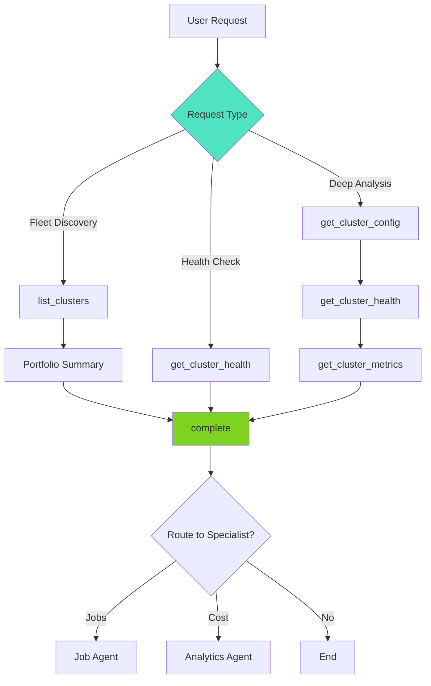

# Cluster Agent

> **Domain**: Cluster Configuration  
> **Version**: 1.0.0  
> **Report Type**: `compute`  
> **Prompt Version**: 1.0.0

---

## Overview

The Cluster Agent is a specialized domain agent focused on **Databricks cluster configuration optimization**. It analyzes cluster settings, resource utilization, health metrics, and provides evidence-based recommendations for cost reduction, performance improvement, and reliability enhancement.

### Primary Capabilities
- Cluster fleet discovery and management
- Cluster configuration analysis (autoscaling, instance types, Spark configs)
- Resource utilization monitoring (CPU, memory, I/O)
- Health scoring and risk assessment (0-100 scale)
- Autoscaling optimization
- Spot vs. on-demand instance recommendations

### Key Strengths
- **Health Scoring**: Comprehensive 0-100 health scores with metric breakdown
- **Fleet Intelligence**: Can analyze entire cluster fleet or individual clusters
- **Lifecycle-Aware**: Understands ephemeral cluster behavior (terminated is normal)
- **Evidence-Based**: All recommendations backed by actual metrics
- **Cost-Focused**: Quantifies cost savings from rightsizing

---

## Agent Architecture

### System Prompt Structure

The Cluster Agent's behavior is defined by a comprehensive system prompt that includes:

1. **Core Principles**: Understand cluster lifecycle, require cluster_id for analysis
2. **Tool Catalog**: 7 tools for discovery, config, health, metrics, events, logs
3. **Lifecycle Understanding**: Ephemeral clusters (terminated is normal)
4. **Workflow Patterns**: Fleet discovery, health check, deep analysis
5. **Output Format**: Structured ClusterOptimizationReport with health metrics
6. **Warehouse Routing**: Routes warehouse analysis to Warehouse Agent

### Tool Budget & Efficiency

**Token Budget**: 75,000 tokens (default, configurable)  
**Target**: 3-5 tool calls, ~700-2,000 tokens  
**Completion Strategy**: Complete after 3-5 tool calls or 1-2 failures

### Architecture Pattern

```
User Request
    ↓
[Intent Router] → Cluster Agent
    ↓
Pattern Detection:
├── FLEET: list_clusters → [portfolio summary] → complete
├── HEALTH: get_cluster_health → complete
└── DEEP: get_cluster_config → get_cluster_health → get_cluster_metrics → complete
```

---

## Example Prompts

### Fleet Discovery
```
"Show me all my clusters"
"List clusters with recent activity"
"What clusters do I have running?"
"Give me a fleet overview"
```

### Health Check
```
"Check health of cluster 1201-090640-dwj7ygpe"
"Is my cluster healthy?"
"Review cluster health"
"What's the health score for cluster X?"
```

### Cluster Analysis
```
"Optimize cluster 1201-090640-dwj7ygpe"
"Analyze cluster configuration"
"Review cluster sizing"
"Check autoscaling settings"
"Why is my cluster expensive?"
```

### Handoff from Other Agents
- **From Job Agent**: "Cluster 1201-090640-dwj7ygpe used by job 266829928906781, analyze it"
- **From Analytics Agent**: "Cluster X is top cost driver, optimize it"
- **From Diagnostic Agent**: "Cluster failed with resource issues"

---

## Tools & Tool Usage Context

### Discovery Tools

| Tool | Cost | When to Use | Purpose |
|------|------|-------------|---------|
| `list_clusters` | ~400 tokens | Fleet overview, "show me clusters" | List all clusters with recent activity (default: 30 days) |

### Cluster Tools (Domain Expert)

| Tool | Cost | When to Use | Purpose |
|------|------|-------------|---------|
| `get_cluster_config` | ~100 tokens | FIRST for specific cluster | Get cluster settings (instance type, autoscaling, Spark config) |
| `get_cluster_health` | ~500 tokens | Health checks, "check health" | Health score (0-100), risk analysis, recommendations |
| `get_cluster_metrics` | ~300 tokens | Performance analysis | CPU, memory, I/O utilization metrics |
| `get_cluster_events` | ~500 tokens | Scaling behavior | Review scaling events and state changes |

### Shared Tools

| Tool | Cost | When to Use | Purpose |
|------|------|-------------|---------|
| `get_spark_logs` | ~1-2K tokens | Spark bottlenecks | Spark UI analysis for performance issues (SHARED with Job Agent) |

### Core Tools

| Tool | Cost | When to Use | Purpose |
|------|------|-------------|---------|
| `request_user_input` | 0 tokens | Missing cluster_id | Ask for cluster identifier |
| `complete` | 0 tokens | After analysis (3-5 calls) | Provide recommendations |

### Tool Usage Strategy

**Discovery-First**: For fleet questions, start with `list_clusters` to enumerate options.

**Health-First**: For single cluster analysis, start with `get_cluster_health` for quick assessment.

**Prioritize Config & Health**: Focus on configuration and health tools over logs (more efficient).

---

## Hand-off Routes

### Incoming Routes (Who Routes to Cluster Agent)

| Source Agent | Trigger Pattern | Context Passed |
|--------------|-----------------|----------------|
| **Intent Router** | "cluster", "autoscaling", "spark config", "cluster_id" | `cluster_id`, user request |
| **Job Agent** | Cluster sizing/config issues (STANDARD jobs) | `cluster_id`, `job_id` |
| **Analytics Agent** | Cluster is top cost driver | `cluster_id`, cost data |
| **Diagnostic Agent** | Resource issues, cluster failures | `cluster_id`, error context |
| **Query Agent** | Cluster performance issues (non-serverless) | `cluster_id`, `statement_id` |

### Outgoing Routes (Cluster Agent Routes to)

| Target Agent | When to Route | Context to Pass |
|--------------|---------------|-----------------|
| **Job Agent** | Analyze jobs on cluster | `cluster_id`, `job_id` (if known), context |
| **Analytics Agent** | Cost deep-dive | `cluster_id`, cost context |
| **Warehouse Agent** | Warehouse analysis | `warehouse_id`, context |

### Handoff Context Format

**Received from previous agent:**
```
[Handoff Context]
cluster_id: 1201-090640-dwj7ygpe
job_id: 266829928906781
Previous analysis summary: Job agent identified over-provisioning
```

**Cluster-Specific Behavior:**
- When receiving `cluster_id:` → Use directly with `get_cluster_config`
- When receiving `job_id:` → Cross-reference with cluster workload patterns
- For warehouse analysis → Route to warehouse agent

---

## Patterns Used/Followed

### 1. **Cluster Lifecycle Understanding Pattern**

**CRITICAL**: Databricks clusters are ephemeral - terminated state is NORMAL.

```
Cluster States:
- RUNNING: Currently active
- STOPPED: Auto-stopped or manually stopped (normal)
- STARTING: Booting up
- STOPPING: Shutting down
- TERMINATED: Completed execution (normal for job clusters)

Cluster Sources:
- JOB: Created automatically for job runs (ephemeral, terminated after completion)
- UI: Created manually via workspace UI
- API: Created programmatically

DO NOT flag TERMINATED as problematic!
```

### 2. **Fleet Discovery Pattern**

For "show me clusters" or "my clusters":

```
Step 1: list_clusters (30-day default window)
Step 2: Present summary by state (running/terminated/pending)
Step 3: Offer to analyze specific clusters

Fleet Analysis (>10 clusters):
- Summarize by: state, size, source (JOB vs UI vs API)
- Highlight outliers (underutilized, over-provisioned, frequently terminated)
- Focus on RUNNING clusters for real-time analysis
- Focus on recently-TERMINATED for workload pattern analysis
```

### 3. **Health Scoring Pattern**

Health scores use a 0-100 scale with metric breakdown:

```json
{
  "health_metrics": {
    "overall_score": 72,
    "metric_scores": {
      "cpu_utilization": 65,
      "memory_utilization": 80,
      "disk_io": 75,
      "network_io": 68
    },
    "risk_factors": [
      "Autoscaling disabled - cluster cannot respond to load changes"
    ]
  }
}
```

**Scoring Guidelines:**
- `overall_score`: 0-100 based on weighted average
- `cpu_utilization`: 100 = 40-70% (optimal), penalize <20% (waste) or >90% (bottleneck)
- `memory_utilization`: 100 = 50-80% (optimal), penalize <30% or >95%
- `disk_io`: Penalize disk spill, high I/O wait
- `network_io`: Penalize excessive shuffle, network bottlenecks

### 4. **Workflow Pattern Selection**

```
IF user_request == "show clusters" OR "my clusters":
    Workflow A: Fleet Discovery
    → list_clusters → summary → complete

ELSE IF cluster_id known:
    IF user_request == "health" OR "check cluster":
        Workflow B: Health Check
        → get_cluster_health → complete
    
    ELSE:
        Workflow C: Deep Analysis
        → get_cluster_config → get_cluster_health → get_cluster_metrics → complete
```

### 5. **Warehouse vs. Cluster Routing Pattern**

```
IF resource_type == "SQL Warehouse":
    → Route to Warehouse Agent (specialized portfolio management)

ELSE IF resource_type == "Databricks Cluster":
    → Handle in Cluster Agent
```

### 6. **Context Passing Pattern**

When routing to Job Agent:

```json
{
  "action_type": "route",
  "target_agent": "job",
  "parameters": {
    "cluster_id": "1201-090640-dwj7ygpe",
    "context": "Jobs using this cluster for optimization"
  }
}
```

**Note**: May not always have `job_id`, use `context` to describe what to analyze.

---

## Evaluation Matrix

### Completeness

| Dimension | Score | Evidence |
|-----------|-------|----------|
| **Core Functionality** | ⭐⭐⭐⭐⭐ 5/5 | Covers all cluster optimization use cases (config, health, metrics) |
| **Tool Coverage** | ⭐⭐⭐⭐ 4/5 | 7 tools; adequate for cluster analysis |
| **Error Handling** | ⭐⭐⭐⭐⭐ 5/5 | Comprehensive error handling (missing IDs, metrics unavailable) |
| **Mode Support** | ⭐⭐⭐⭐ 4/5 | ONLINE mode focus (clusters require live API) |
| **Documentation** | ⭐⭐⭐⭐⭐ 5/5 | Extensive prompt with lifecycle understanding |

**Overall Completeness**: ⭐⭐⭐⭐⭐ 4.6/5

### Complexity

| Dimension | Assessment |
|-----------|------------|
| **Workflow Complexity** | Low - Three simple patterns (fleet, health, deep) |
| **Decision Logic** | Low - Clear workflow selection based on request type |
| **Tool Orchestration** | Low - Sequential execution, no complex dependencies |
| **Output Structure** | Medium - ClusterOptimizationReport with health metrics |
| **Handoff Logic** | Low - Standard patterns |

**Complexity Rating**: **Low** - Straightforward cluster analysis with well-defined workflows.

### Strengths

1. **Health Scoring**: Comprehensive 0-100 health scores with metric-level breakdown
2. **Fleet Intelligence**: Can analyze entire fleet or individual clusters
3. **Lifecycle-Aware**: Understands ephemeral behavior (terminated is normal)
4. **Cost-Focused**: Quantifies savings from rightsizing
5. **Evidence-Based**: Recommendations backed by actual metrics
6. **Efficient**: Completes in 3-5 tool calls
7. **Clear Workflows**: Three distinct patterns for different use cases

### Weaknesses

1. **Limited Spark Tuning**: Basic Spark config analysis (not deep tuning)
2. **No Predictive Analysis**: Reactive (analyzes current state, not future needs)
3. **Warehouse Overlap**: Must route to Warehouse Agent for SQL warehouse analysis
4. **Fleet Limits**: Large fleets (100+ clusters) may be slow to enumerate
5. **Metrics Dependency**: Requires cluster to be running for live metrics
6. **No Historical Trends**: Analyzes current snapshot, not historical patterns

### Optimization Opportunities

1. **Predictive Rightsizing**: ML-based cluster size prediction
2. **Cost Forecasting**: Project future costs based on usage patterns
3. **Automated Tuning**: Suggest Spark configs based on workload patterns
4. **Fleet-Level Insights**: Cross-cluster pattern detection
5. **Integration with Job Agent**: Unified job+cluster optimization

---

## Diagram

See: `/docs/diagrams/source/agents/cluster-agent-workflow.mmd`



---

## Related Documentation

- [Agent Implementation Guide](../../developer/agent/IMPLEMENTATION_GUIDE.md)
- [Tool Architecture](../../TOOL_ARCHITECTURE.md)
- [System Architecture](../../architecture/SYSTEM_ARCHITECTURE.md)
- [Cluster Prompt Source](../../../packages/starboard-server/starboard/prompts/cluster/v1.py)
- [Tool Categories](../../../packages/starboard-server/starboard/agents/tool_categories.py)

