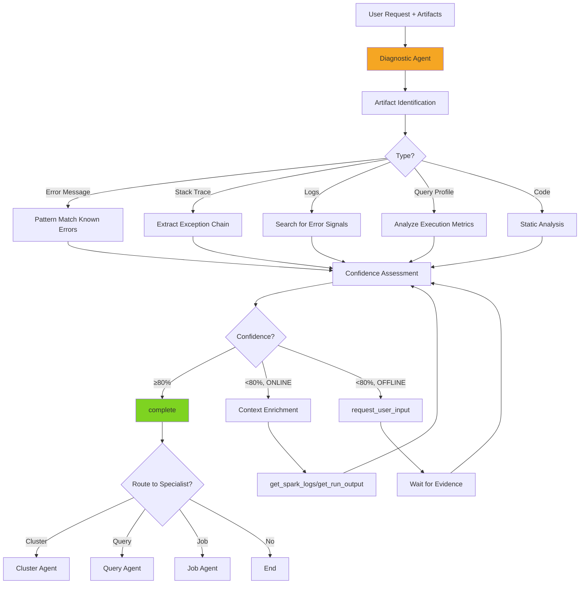

# Diagnostic Agent

> **Domain**: Troubleshooting & Root Cause Analysis  
> **Version**: 1.2.0  
> **Report Type**: `advisor`  
> **Prompt Version**: 1.2.0

---

## Overview

The Diagnostic Agent is a specialized domain agent focused on **troubleshooting, error investigation, and root cause analysis** for Databricks environments. It performs artifact-first, evidence-based diagnostics on logs, stack traces, error messages, query profiles, and code to identify failure causes and provide actionable remediation steps.

### Primary Capabilities
- Artifact-first analysis (logs, errors, stack traces, query profiles)
- Exit code interpretation (137, 143, 139, 1)
- Root cause analysis with confidence levels
- Evidence-based diagnosis (every claim cited)
- Large file exploration (>50KB artifacts)
- Handoff-ready fingerprinting for specialist routing

### Key Strengths
- **Artifact-First**: Analyzes provided evidence BEFORE asking for context
- **Evidence-Based**: Every finding cites specific line numbers and verbatim quotes
- **Confidence-Calibrated**: States confidence explicitly (HIGH/MEDIUM/LOW)
- **Mode-Aware**: ONLINE (fetch context via IDs) or OFFLINE (artifacts only)
- **Exit Code Expert**: Interprets exit codes with required corroborating evidence
- **All Tools Available**: Unrestricted tool access for investigation

---

## Agent Architecture

### System Prompt Structure

The Diagnostic Agent's behavior is defined by a comprehensive system prompt that includes:

1. **Core Operating Principles**: Artifact-first, evidence-based, confidence-calibrated, mode-aware
2. **Operational Modes**: ONLINE (with IDs) vs OFFLINE (artifacts only)
3. **Diagnostic Workflow**: Artifact identification → pattern matching → confidence assessment → context enrichment
4. **Exit Code Interpretation**: HOW vs. WHY (exit codes indicate HOW, not WHY)
5. **Large File Exploration**: `explore_artifact` tool for >50KB files
6. **Output Format**: DiagnosticReport with findings, evidence windows, metrics summary
7. **Handoff Protocol**: Structured fingerprints for specialist routing

### Tool Budget & Efficiency

**Token Budget**: 75,000 tokens (default, configurable)  
**Tool Budget**: Stop after 5-6 focused calls or when confidence ≥ 80%  
**Completion Strategy**: Complete after sufficient evidence or 1-2 tool failures

### Architecture Pattern

```
User Request (with artifacts)
    ↓
[Intent Router] → Diagnostic Agent
    ↓
1. Artifact Identification (error/stack/logs/code/profile)
2. Pattern Matching (known signatures)
3. Confidence Assessment (≥90%, 70-89%, 50-69%, <50%)
    ↓
4. Context Enrichment (ONLINE mode only):
   - High Priority: get_spark_logs, get_run_output (stderr)
   - Medium Priority: get_cluster_events, analyze_job_history
   - Low Priority: resolve_job/query/cluster (metadata)
    ↓
5. complete (DiagnosticReport with evidence refs)
```

---

## Example Prompts

### Error Investigation
```
"Why did my job fail with exit code 137?"
"OOM error in task, what's the cause?"
"Debug this error: [error message]"
"Analyze this stack trace: [stack trace]"
"What caused this exception?"
```

### Log Analysis
```
"Analyze these Spark logs: [logs]"
"Review executor logs for failures"
"What's wrong with this log file?"
"Investigate GC warnings in logs"
```

### Query Profile Analysis
```
"Optimize this query profile: [profile]"
"Why is this query slow? [query plan]"
"Analyze execution bottlenecks"
```

### Code Review
```
"Review this notebook code: [code]"
"What's wrong with this SQL?"
"Debug this PySpark script"
```

### File Attachment
```
User uploads >50KB log file
→ Diagnostic agent auto-routes (no explicit prompt needed)
→ Uses explore_artifact for targeted analysis
```

---

## Tools & Tool Usage Context

### Special: ALL Tools Available

**Diagnostic Agent is the ONLY agent with unrestricted tool access.**

```
Tool Access: "all"
Reason: Diagnostics may need any tool based on investigation
```

### Artifact Exploration Tool

| Tool | Cost | When to Use | Purpose |
|------|------|-------------|---------|
| `explore_artifact` | ~500-1K tokens | Large files (>50KB) | Targeted exploration with natural language focus |

**Example**:
```python
explore_artifact(
    attachment_id="att_xxx",
    focus="range join hints, shuffle operations, slow operators",
    detail_level="detailed"  # summary | detailed | exhaustive
)
```

**Focus Selection Guide**:
- Joins → "join strategies, join hints, join algorithms"
- Slowness → "slow operators, execution time, bottlenecks"
- Skew → "data skew, partition distribution, task metrics"
- I/O → "scan operations, table reads, data sources"

### High Priority Tools (Direct Error Evidence)

| Tool | Cost | When to Use | Purpose |
|------|------|-------------|---------|
| `get_spark_logs` | ~1-2K tokens | Spark exceptions | Driver/executor stderr for exceptions |
| `get_run_output` | ~800/run | Task failures | Task failure messages and stack traces |

### Medium Priority Tools (Temporal Context)

| Tool | Cost | When to Use | Purpose |
|------|------|-------------|---------|
| `get_cluster_events` | ~500 tokens | Cluster state changes | Events around failure time |
| `analyze_job_history` | ~500 tokens | Failure patterns | Patterns across runs |

### Low Priority Tools (Metadata)

| Tool | Cost | When to Use | Purpose |
|------|------|-------------|---------|
| `resolve_job` | ~50 tokens | Job metadata | Entity configuration details |
| `resolve_query` | ~50 tokens | Query metadata | Query configuration details |
| `get_cluster_config` | ~100 tokens | Cluster metadata | Cluster configuration details |

### Core Tools

| Tool | Cost | When to Use | Purpose |
|------|------|-------------|---------|
| `request_user_input` | 0 tokens | Evidence gaps, confidence <70% | Request specific evidence |
| `complete` | 0 tokens | After analysis, confidence ≥70% | Provide diagnosis |

---

## Hand-off Routes

### Incoming Routes (Who Routes to Diagnostic Agent)

| Source Agent | Trigger Pattern | Context Passed |
|--------------|-----------------|----------------|
| **Intent Router** | "error", "exception", "fail", "crash", "debug", "exit code", stack traces | Artifacts, error context |
| **Job Agent** | Complex failure, OOM, exit codes | `job_id`, `run_id`, logs |
| **Query Agent** | Query failure, AnalysisException | `statement_id`, error context |
| **Cluster Agent** | Cluster failures, resource issues | `cluster_id`, error context |
| **Analytics Agent** | Cost anomalies, usage spikes | Resource IDs, anomaly data |
| **Warehouse Agent** | Warehouse failures, performance issues | `warehouse_id`, error context |

### Outgoing Routes (Diagnostic Agent Routes to)

**After initial diagnosis, route to specialist for deeper optimization:**

| Target Agent | When to Route | Context to Pass |
|--------------|---------------|-----------------|
| **Cluster Agent** | Memory/sizing issues | `cluster_id`, diagnostic fingerprint |
| **Query Agent** | Query plan optimization | `statement_id`, evidence snippets |
| **Job Agent** | Job configuration issues | `job_id`, diagnostic fingerprint |
| **UC Agent** | Permissions/governance | `tables`, error context |
| **Warehouse Agent** | Warehouse patterns | `warehouse_id`, diagnostic fingerprint |

### Handoff Protocol (Diagnostic Fingerprint)

When routing to specialist:

```json
{
  "diagnostic_fingerprint": {
    "primary_symptom": "oom",
    "likely_root_causes": ["memory_pressure", "broadcast_too_large"],
    "extracted_context": {
      "job_id": "12345",
      "cluster_id": "1234-567890-abc12",
      "run_id": "9876543210"
    },
    "evidence_snippets": [
      {
        "window_id": "ev_abc123",
        "content": "java.lang.OutOfMemoryError: Java heap space",
        "line_ref": "line 45-48"
      }
    ],
    "confidence": 0.85
  }
}
```

**Routing Logic**:
- Memory/sizing → Cluster Agent
- Query plan optimization → Query Agent
- Job configuration → Job Agent
- Permissions/governance → UC Agent
- Warehouse patterns → Warehouse Agent

---

## Patterns Used/Followed

### 1. **Artifact-First Analysis Pattern**

**CRITICAL**: Analyze artifacts IMMEDIATELY, never ask for context when artifacts exist.

```
IF artifacts present (logs, errors, stack traces):
    → Start analysis immediately
    → Extract evidence windows
    → Pattern match against known signatures
    → NEVER ask "what issue are you experiencing?"

ELSE IF no artifacts but IDs present (job_id, cluster_id):
    → ONLINE mode: Fetch artifacts via tools
    → Analyze retrieved artifacts

ELSE:
    → OFFLINE mode: Request specific artifacts
```

### 2. **Evidence-Based Diagnosis Pattern**

Every finding MUST cite specific evidence:

```json
{
  "finding": {
    "title": "Broadcast join exceeding executor memory",
    "confidence": "high",
    "evidence_refs": ["ev_001", "ev_002"]
  },
  "evidence_windows": [
    {
      "id": "ev_001",
      "type": "error",
      "line_start": 45,
      "line_end": 52,
      "content": "java.lang.OutOfMemoryError: Java heap space\n  at org.apache.spark.broadcast..."
    }
  ]
}
```

### 3. **Confidence Assessment Pattern**

| Confidence | Response Strategy |
|------------|-------------------|
| ≥90% | Definitive diagnosis: "The root cause is..." |
| 70-89% | Likely diagnosis: "The likely cause is... Confirm by checking..." |
| 50-69% | Hypothesis with gaps: "This could be... Need evidence on..." |
| <50% | Multiple possibilities: "Please provide [specific evidence]" |

### 4. **Exit Code Interpretation Pattern**

**CRITICAL**: Exit codes indicate HOW a process ended, not WHY.

```
Exit Code    Signal     Requires Evidence Of
-----------  ---------  ------------------------------
137          SIGKILL    "OOMKilled" reason, oom-killer logs, memory metrics
143          SIGTERM    "Job cancelled" messages, timeout markers
139          SIGSEGV    Native crash, JNI errors, corrupted heap
1            Error      Exception in logs, config issues

NEVER assume 137 = OOM without proof signals:
- "OOMKilled" in logs
- oom-killer invocation
- Memory enforcement notices
- Heap exhaustion metrics
```

### 5. **Large File Exploration Pattern**

For files >50KB, use `explore_artifact`:

```python
# User uploads 2MB Spark log
explore_artifact(
    attachment_id="att_xxx",
    focus="OutOfMemoryError, heap space, broadcast join",
    detail_level="detailed"
)

# Returns targeted excerpts matching focus
→ Extract relevant evidence windows
→ Pattern match against known issues
→ Provide diagnosis with line references
```

### 6. **Context Enrichment Pattern (ONLINE Mode)**

Use tools strategically based on initial findings:

```
Initial Finding: OOM error in logs

High Priority (direct evidence):
→ get_spark_logs: Executor stderr for OOM details

Medium Priority (temporal context):
→ get_cluster_events: Cluster state around failure

Low Priority (metadata):
→ get_cluster_config: Memory configuration

Stop after 5-6 calls or confidence ≥ 80%
```

### 7. **Operational Mode Pattern**

```
OFFLINE Mode (default when no IDs):
- Diagnose from artifacts alone
- Request specific evidence if confidence < 70%
- Guide user to retrieve missing context

ONLINE Mode (when job_id/cluster_id/run_id detected):
- Extract IDs from artifacts or handoff context
- Fetch corroborating evidence via tools (max 6 calls)
- Prioritize: stderr logs → cluster events → run output
```

---

## Evaluation Matrix

### Completeness

| Dimension | Score | Evidence |
|-----------|-------|----------|
| **Core Functionality** | ⭐⭐⭐⭐⭐ 5/5 | Covers all diagnostic use cases (errors, logs, stack traces, profiles) |
| **Tool Coverage** | ⭐⭐⭐⭐⭐ 5/5 | ALL tools available (unrestricted access) |
| **Error Handling** | ⭐⭐⭐⭐⭐ 5/5 | Comprehensive error handling, confidence calibration |
| **Mode Support** | ⭐⭐⭐⭐⭐ 5/5 | Full ONLINE/OFFLINE mode support |
| **Documentation** | ⭐⭐⭐⭐⭐ 5/5 | Extensive prompt with exit code interpretation, evidence rules |

**Overall Completeness**: ⭐⭐⭐⭐⭐ 5.0/5

### Complexity

| Dimension | Assessment |
|-----------|------------|
| **Workflow Complexity** | High - Multi-step: artifact ID → pattern match → confidence → enrichment |
| **Decision Logic** | High - Confidence-based branching, mode detection, tool prioritization |
| **Tool Orchestration** | High - Strategic tool selection based on findings |
| **Output Structure** | High - DiagnosticReport with evidence windows, metrics, fingerprints |
| **Handoff Logic** | High - Structured fingerprints with evidence snippets |

**Complexity Rating**: **High** - Most sophisticated diagnostic workflow with evidence-based reasoning.

### Strengths

1. **Artifact-First**: Analyzes evidence BEFORE asking for context
2. **Evidence-Based**: Every finding cites specific line numbers and verbatim quotes
3. **Confidence-Calibrated**: Explicitly states confidence (HIGH/MEDIUM/LOW)
4. **Exit Code Expert**: Proper interpretation (HOW vs. WHY) with corroboration
5. **Large File Support**: Can explore >50KB artifacts with targeted focus
6. **All Tools Available**: Unrestricted access for comprehensive investigation
7. **Mode-Aware**: ONLINE (fetch context) or OFFLINE (artifacts only)
8. **Handoff-Ready**: Structured fingerprints for specialist routing

### Weaknesses

1. **Artifact Dependency**: Limited when artifacts are unavailable or incomplete
2. **Confidence Thresholds**: May request more evidence when confident diagnosis is possible
3. **Large Artifacts**: Very large files (>10MB) may hit token limits
4. **Historical Context**: Analyzes single incident, not patterns over time
5. **Proactive Detection**: Reactive (diagnoses failures, not prevents them)
6. **Tool Budget**: May hit 5-6 tool limit before complete diagnosis

### Optimization Opportunities

1. **Pattern Library**: Build library of known failure signatures for faster matching
2. **ML-Based Classification**: Use ML to classify errors and predict root causes
3. **Historical Analysis**: Cross-reference with past incidents for patterns
4. **Proactive Monitoring**: Detect issues before failures occur
5. **Automated Remediation**: Suggest automated fixes for common issues
6. **Integration with Monitoring**: Connect to real-time monitoring systems

---

## Diagram

See: `/docs/diagrams/source/agents/diagnostic-agent-workflow.mmd`



---

## Related Documentation

- [Agent Implementation Guide](../../developer/agent/IMPLEMENTATION_GUIDE.md)
- [Tool Architecture](../../TOOL_ARCHITECTURE.md)
- [System Architecture](../../architecture/SYSTEM_ARCHITECTURE.md)
- [Diagnostic Prompt Source](../../../packages/starboard-server/starboard_server/prompts/diagnostic/v1.py)
- [Tool Categories](../../../packages/starboard-server/starboard_server/agents/tool_categories.py)

