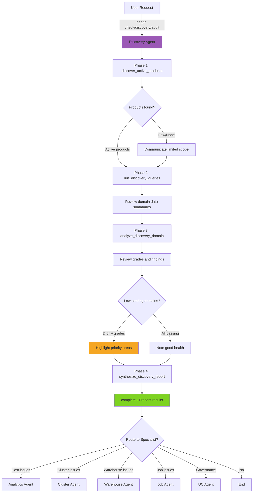

# Discovery Agent

> **Domain**: Discovery (Workspace Health)
> **Version**: 2.0.0
> **Report Type**: `discovery`
> **Prompt Version**: 2.0.0

---

## Overview

The Discovery Agent is a specialized domain agent focused on **Databricks workspace health assessment**. It executes a systematic, 4-phase pipeline across Databricks system tables to audit active products, gather usage data, analyze domain-specific health, and produce graded report cards with prioritized, actionable recommendations.

### Primary Capabilities
- Workspace-wide product audit (active Databricks products detection)
- System table querying across multiple domains (billing, compute, governance, etc.)
- Domain health grading (A-F scale with numeric scores)
- Heuristic-based and LLM-assisted analysis per domain
- Executive summary synthesis with prioritized findings
- Output file generation (Markdown reports, JSON data)

### Key Strengths
- **4-Phase Pipeline**: Structured audit -> query -> analyze -> synthesize workflow with agent reasoning between each phase
- **Adaptive Scope**: Automatically adjusts to active products (skips inactive domains)
- **Evidence-Based Grading**: Every domain grade backed by system table query data and deterministic heuristics
- **Progressive Reporting**: Shares partial results as phases complete (does not wait until end)
- **Parallel Analysis**: Bounded parallelism for multi-domain analysis with per-domain timeouts
- **DBU-Only Metrics**: Expresses all resource consumption in DBUs (never dollar amounts)

---

## Agent Architecture

### System Prompt Structure

The Discovery Agent's behavior is defined by a system prompt (v2) that includes:

1. **Role Definition**: Databricks Platform Health Expert specializing in workspace discovery
2. **4-Phase Workflow**: Sequential phases with agent reasoning between each step
3. **Presenting Results**: Structure for final output (health summary, report cards, findings, actions)
4. **Key Rules**: DBU-only metrics, evidence-based analysis, adaptive scope, progressive communication

### Tool Budget & Efficiency

**Token Budget**: Configurable (default from agent config)
**Target**: 4 tool calls (one per phase) + `complete`
**Completion Strategy**: Complete after all 4 phases, or with partial results if phases fail

### Architecture Pattern

```
User Request
    |
[Intent Router] -> Discovery Agent
    |
Phase 1: discover_active_products
    -> Active products list, available domains
    |
Phase 2: run_discovery_queries
    -> Per-domain query results, row counts, success/failure summary
    |
Phase 3: analyze_discovery_domain (ALL domains in single call)
    -> Per-domain grades (A-F), scores, findings, recommendations
    |
Phase 4: synthesize_discovery_report
    -> Executive summary, report cards, top findings, output files
    |
complete (present results to user)
```

---

## Example Prompts

### Full Workspace Assessment
```
"Run a workspace health check"
"Discover my workspace"
"How healthy is my Databricks workspace?"
"Run a platform health assessment"
"Audit my workspace"
```

### Scoped Discovery
```
"Run discovery on billing and compute domains"
"Health check for the last 90 days"
"Assess workspace health for governance only"
"Run a 60-day workspace scan"
```

### System Table Analysis
```
"Analyze system tables for optimization opportunities"
"What does our system table data tell us about workspace health?"
"Run a best practice audit"
```

### Handoff from Other Agents
- **From Analytics Agent**: "Workspace costs are high, run a full health check"
- **From Cluster Agent**: "Multiple cluster issues detected, assess platform health"
- **From Warehouse Agent**: "Fleet-wide issues, suggest workspace discovery"

---

## Tools & Tool Usage Context

### Phase 1: Audit

| Tool | Cost | When to Use | Purpose |
|------|------|-------------|---------|
| `discover_active_products` | ~200 tokens | ALWAYS first (Phase 1) | Query `system.billing.usage` to detect active Databricks products |

**Parameters:**
- `lookback_days`: Time window for audit (30, 60, or 90 days; default: 30)

**Returns:** Active product list, available domains, pack count

### Phase 2: Query

| Tool | Cost | When to Use | Purpose |
|------|------|-------------|---------|
| `run_discovery_queries` | ~500 tokens | After audit (Phase 2) | Execute SQL query packs against system tables for selected domains |

**Parameters:**
- `domains`: Optional list of specific domains to query (omit for all active domains)

**Returns:** Per-domain query summaries (succeeded, failed, total rows), `domains_with_data` list

### Phase 3: Analyze

| Tool | Cost | When to Use | Purpose |
|------|------|-------------|---------|
| `analyze_discovery_domain` | ~1-2K tokens | After queries (Phase 3) | Run heuristics + LLM analysis per domain (grades, findings, recommendations) |

**Parameters:**
- `domains`: List of ALL domains from `domains_with_data` (Phase 2 output). **Call ONCE with all domains** -- the tool handles parallelism internally.

**Returns:** Per-domain grades (A-F), scores, summaries, top findings with priority and impact

### Phase 4: Synthesize

| Tool | Cost | When to Use | Purpose |
|------|------|-------------|---------|
| `synthesize_discovery_report` | ~500 tokens | After analysis (Phase 4) | Assemble final report with executive summary and output files |

**Returns:** Executive summary, report cards, top findings, recommended actions, output file paths

### Core Tools

| Tool | Cost | When to Use | Purpose |
|------|------|-------------|---------|
| `request_user_input` | 0 tokens | Ambiguous scope | Ask for clarification (lookback period, specific domains) |
| `complete` | 0 tokens | After synthesis | Present discovery results to user |

### Tool Usage Strategy

**Sequential Phase Execution**: Phases must execute in order (1 -> 2 -> 3 -> 4). Each phase depends on the previous phase's output.

**Single-Call Analysis** (Phase 3):
```
GOOD: analyze_discovery_domain(domains=["billing", "compute", "governance"])
  -> Single call, internal parallelism, bounded by max_parallelism

BAD:  analyze_discovery_domain(domain="billing")
      analyze_discovery_domain(domain="compute")
      analyze_discovery_domain(domain="governance")
  -> Multiple calls, wastes tokens, no parallelism benefit
```

**Adaptive Scope**:
- If audit finds few active products, adjust expectations and communicate to user
- If a domain has no data from Phase 2, it is automatically skipped in Phase 3
- Focus discussion on low-scoring domains (D or F grades)

---

## Hand-off Routes

### Incoming Routes (Who Routes to Discovery Agent)

| Source Agent | Trigger Pattern | Context Passed |
|--------------|-----------------|----------------|
| **Intent Router** | "discovery", "health check", "workspace health", "workspace scan", "audit" | User request |
| **Analytics Agent** | Broad cost concerns suggest workspace-wide assessment | Cost context |
| **Diagnostic Agent** | Systemic issues suggest platform health review | Error context |

### Outgoing Routes (Discovery Agent Routes to)

| Target Agent | When to Route | Context to Pass |
|--------------|---------------|-----------------|
| **Analytics Agent** | Cost-related findings need deeper analysis | Domain findings, cost context |
| **Cluster Agent** | Cluster configuration issues identified | `cluster_id`, findings |
| **Warehouse Agent** | Warehouse health issues identified | `warehouse_id`, findings |
| **Job Agent** | Job performance issues identified | `job_id`, findings |
| **UC Agent** | Governance or table quality issues identified | Domain findings |

### Handoff Context Format

**Received from previous agent:**
```
[Handoff Context]
Previous analysis summary: High costs detected across multiple products, recommend full workspace audit
```

**Passed to next agent (Analytics Agent):**
```json
{
  "action_type": "route",
  "target_agent": "analytics",
  "parameters": {
    "context": "Discovery found billing domain scored D (42/100). Top finding: 35% of DBU spend on idle clusters."
  }
}
```

---

## Patterns Used/Followed

### 1. **4-Phase Pipeline Pattern**

The discovery workflow is structured as four sequential phases with agent reasoning between each:

```
Phase 1: Audit
  discover_active_products(lookback_days=30)
  -> Agent reviews: "Found 6 active products, 4 domains available"

Phase 2: Query
  run_discovery_queries(domains=["billing", "compute", "governance", "jobs"])
  -> Agent reviews: "Billing has 15K rows, compute has 8K, governance has 200"

Phase 3: Analyze
  analyze_discovery_domain(domains=["billing", "compute", "governance", "jobs"])
  -> Agent reviews: "Billing: C (65), Compute: D (42), Governance: A (92), Jobs: B (78)"
  -> Agent notes: "Compute scored poorly -- priority area"

Phase 4: Synthesize
  synthesize_discovery_report()
  -> Agent presents: Executive summary, report cards, top 5 findings, actions
```

### 2. **Adaptive Scope Pattern**

The agent adjusts its workflow based on intermediate results:

```
IF audit finds few products:
  -> Communicate limited scope to user
  -> Adjust expectations for findings

IF domain has no query data:
  -> Skip automatically in Phase 3
  -> Report as "No data available"

IF domain scores D or F:
  -> Highlight as priority area
  -> Provide more detailed findings
  -> Suggest follow-up with specialist agent
```

### 3. **Progressive Communication Pattern**

Share results as they become available:

```
After Phase 1: "Found 6 active products across 4 domains. Running queries now."
After Phase 2: "Gathered data from all 4 domains. Billing has the most activity. Analyzing..."
After Phase 3: "Analysis complete. Compute scored D (42/100) -- this is a priority area."
After Phase 4: "Full report generated. Here are the key findings..."
```

### 4. **Graded Assessment Pattern**

Each domain receives a letter grade (A-F) based on deterministic heuristic scoring:

```
A (90-100): Excellent - following best practices
B (80-89):  Good - minor optimization opportunities
C (65-79):  Fair - several areas need attention
D (50-64):  Poor - significant issues detected
F (0-49):   Critical - immediate action required

Scoring is based on:
- Heuristic rules (deterministic, rule-based checks)
- LLM analysis (deeper pattern recognition)
- Data coverage (query success rate)
```

### 5. **Bounded Parallelism Pattern**

Phase 3 uses internal parallelism with safeguards:

```
analyze_discovery_domain(domains=["billing", "compute", "governance", "jobs"])
  -> DomainAnalyzer uses asyncio.gather with:
     - Semaphore (max_parallelism, default 4) gates concurrent LLM calls
     - Per-domain timeout (120 seconds) prevents hanging
     - Failed domains reported separately (do not block others)
```

### 6. **DBU-Only Reporting Pattern**

All resource consumption is expressed in DBUs:

```
GOOD: "Top finding: Cluster X consumed 45,000 DBUs in the last 30 days"
BAD:  "Top finding: Cluster X cost $12,500 in the last 30 days"

Rationale:
- DBUs are directly measurable from system tables
- Dollar values depend on pricing tier, discounts, commitments
- DBUs provide consistent, comparable metrics across workspaces
```

### 7. **Output File Generation Pattern**

Phase 4 writes structured output files for detailed review:

```
discovery_output/
  +-- report.md          # Full Markdown report with all domains
  +-- report.json        # Machine-readable report data
  +-- domain_*.md        # Per-domain detailed findings
```

---

## Configuration

### Environment Variables

| Variable | Description | Default | Valid Values |
|----------|-------------|---------|--------------|
| `DISCOVERY_LOOKBACK_DAYS` | Time window for system table analysis | `30` | `30`, `60`, `90` |
| `DISCOVERY_MAX_PARALLELISM` | Max concurrent domain analyses | `4` | `1` - `16` |
| `DISCOVERY_OUTPUT_DIR` | Directory for output report files | `./discovery_output` | Any valid path |
| `DISCOVERY_LLM_MODEL` | LLM model for domain analysis | Agent default | Any supported model |
| `DISCOVERY_LLM_TEMPERATURE` | LLM temperature for analysis | `0.3` | `0.0` - `1.0` |

---

## Evaluation Matrix

### Completeness

| Dimension | Score | Evidence |
|-----------|-------|----------|
| **Core Functionality** | 5/5 | Full workspace assessment with audit, query, analysis, and synthesis |
| **Tool Coverage** | 5/5 | 4 phase tools covering the entire discovery pipeline |
| **Error Handling** | 4/5 | Per-domain timeouts and failure isolation; domains with no data skipped gracefully |
| **Mode Support** | 3/5 | ONLINE mode only (requires Databricks SQL for all operations) |
| **Documentation** | 4/5 | Clear v2 prompt with workflow phases and rules |

**Overall Completeness**: 4.2/5

### Complexity

| Dimension | Assessment |
|-----------|------------|
| **Workflow Complexity** | Medium - 4 sequential phases with clear dependencies |
| **Decision Logic** | Medium - Adaptive scope based on active products and data availability |
| **Tool Orchestration** | Medium - Sequential phases, single-call analysis with internal parallelism |
| **Output Structure** | High - Executive summary, report cards, findings, actions, output files |
| **Handoff Logic** | Low - Primarily an entry-point agent; routes to specialists based on findings |

**Complexity Rating**: **Medium** - Well-structured pipeline with clear phase dependencies and adaptive scope handling.

### Strengths

1. **Comprehensive Coverage**: Audits all active Databricks products and domains
2. **4-Phase Pipeline**: Structured workflow enables agent reasoning between phases
3. **Adaptive Scope**: Automatically adjusts to workspace activity (skips empty domains)
4. **Graded Assessment**: A-F grades with numeric scores provide clear health indicators
5. **Bounded Parallelism**: Internal parallelism with semaphore and timeouts prevents resource exhaustion
6. **Progressive Communication**: Shares partial results during long-running assessments
7. **Output Files**: Generates persistent reports for team review and historical tracking

### Weaknesses

1. **Online Only**: Requires live Databricks SQL connection (no offline mode)
2. **Long Execution Time**: Full workspace assessment may take 2-5 minutes across all phases
3. **LLM Dependency**: Domain analysis quality depends on LLM reasoning (mitigated by heuristics)
4. **No Historical Comparison**: Assesses current snapshot, not trends over multiple assessments
5. **Fixed Lookback Windows**: Only supports 30, 60, or 90 day windows
6. **No Scheduled Runs**: Manual invocation only (no automated periodic assessment)

### Optimization Opportunities

1. **Trend Tracking**: Store historical assessments for grade trend analysis
2. **Scheduled Discovery**: Automated periodic workspace health checks
3. **Custom Heuristics**: User-configurable scoring rules per domain
4. **Incremental Scans**: Only re-analyze domains that changed since last assessment
5. **Alert Integration**: Trigger alerts when domain grades drop below threshold
6. **Cross-Workspace**: Compare health across multiple Databricks workspaces

---

## Diagram



---

## Related Documentation

- [Agent Implementation Guide](../../developer/agent/IMPLEMENTATION_GUIDE.md)
- [Tool Architecture](../../TOOL_ARCHITECTURE.md)
- [System Architecture](../../architecture/SYSTEM_ARCHITECTURE.md)
- [Discovery Prompt Source (v2)](../../../packages/starboard-server/starboard/prompts/discovery/v2.py)
- [Tool Categories](../../../packages/starboard-server/starboard/agents/tool_categories.py)
