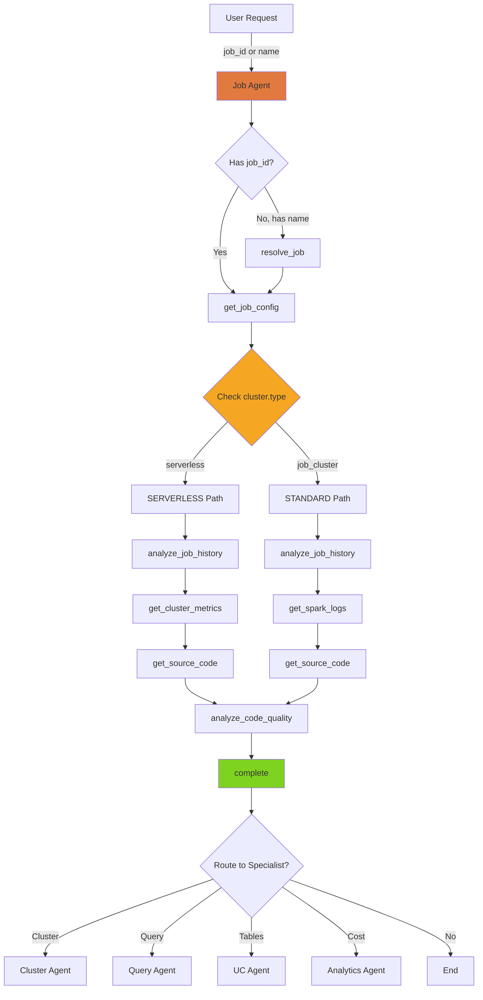

# Job Agent

> **Domain**: Job (Workflow)  
> **Version**: 1.0.0  
> **Report Type**: `advisor`  
> **Prompt Version**: 1.0.0

---

## Overview

The Job Agent is a specialized domain agent focused on **Databricks job and workflow optimization**. It analyzes job configurations, task performance, source code quality, and provides evidence-based recommendations for improving job reliability, reducing execution time, and optimizing resource utilization.

### Primary Capabilities
- Job configuration analysis and optimization
- Task-level performance debugging
- Source code quality analysis (notebooks, scripts)
- Cluster resource optimization for jobs
- Spark execution log analysis
- Multi-task job workflow optimization

### Key Strengths
- **Code-First Analysis**: Inspects actual source code to find root causes
- **Serverless-Aware**: Detects serverless compute and adjusts analysis approach
- **Multi-Task Intelligence**: Efficient strategies for jobs with 10+ tasks
- **Evidence-Based**: All recommendations backed by job history, logs, and code analysis
- **Strategic Tool Overlap**: Cluster and table tools for comprehensive analysis

---

## Agent Architecture

### System Prompt Structure

The Job Agent's behavior is defined by a comprehensive system prompt that includes:

1. **Core Principles**: Always inspect source code, require job_id, serverless detection
2. **Tool Catalog**: 11 tools with strategic overlap (cluster, table, code analysis)
3. **Serverless Detection**: Critical workflow branching based on compute type
4. **Multi-Task Patterns**: Optimized strategies for large workflows
5. **Workflow Patterns**: ONLINE (full SDK) vs OFFLINE (static analysis) modes
6. **Output Format**: Structured JobOptimizationReport with findings and code fixes

### Tool Budget & Efficiency

**Token Budget**: 95,000 tokens (default, configurable)  
**Target**: 6-8 tool calls, ~3,000-5,000 tokens  
**Completion Strategy**: Complete after 6-8 tool calls or 1-2 failures  
**Focus**: Code quality over metrics (code issues are #1 root cause)

### Architecture Pattern

```
User Request
    ↓
[Intent Router] → Job Agent
    ↓
1. resolve_job (job_id/name → metadata)
2. get_job_config (tasks, dependencies, CHECK cluster.type)
3. analyze_job_history (patterns, failures, get cluster_id)
    ↓
4. BRANCH on cluster.type:
   - serverless → skip get_spark_logs, use get_cluster_metrics
   - job_cluster → get_spark_logs(cluster_id)
    ↓
5. get_source_code (PARALLEL, 1-2 tasks, prioritize failing)
6. analyze_code_quality (anti-pattern detection)
    ↓
7. complete (JobOptimizationReport)
```

---

## Example Prompts

### Direct Job Analysis
```
"Optimize job 266829928906781"
"Why is job 'daily_etl_pipeline' failing?"
"Analyze job performance for job_id:12345"
"Review my job configuration"
```

### Performance Issues
```
"My job is taking 2 hours, how can I speed it up?"
"Job tasks are failing intermittently"
"Reduce execution time for my ETL workflow"
"Why is task 'aggregate_sales' so slow?"
```

### Failure Investigation
```
"Job failed with OOM error, what's wrong?"
"Task keeps retrying, need root cause"
"Debug job failure on run 9876543210"
"Investigate why job run failed last night"
```

### Handoff from Other Agents
- **From Analytics Agent**: "Job 12345 is the top DBU consumer, optimize it"
- **From Diagnostic Agent**: "Job failed with exit code 137, analyze cluster/code"
- **From Cluster Agent**: "Cluster is over-provisioned, check job efficiency"

---

## Tools & Tool Usage Context

### Primary Tools (Job-Specific)

| Tool | Cost | When to Use | Purpose |
|------|------|-------------|---------|
| `resolve_job` | ~50 tokens | FIRST if job_id or name provided | Get job metadata |
| `get_job_config` | ~300 tokens | ALWAYS after resolve | Get tasks, dependencies, **CHECK cluster.type** |
| `analyze_job_history` | ~500 tokens | For performance/failures | Review runs, get cluster_id |
| `get_run_output` | ~800/run | Failed runs | Get ALL task outputs (overview) |
| `get_task_logs` | ~300/task | Specific task failure | Drill into SPECIFIC task logs |
| `get_source_code` | ~800/task | ESSENTIAL for root cause | Inspect notebook/script code (1-2 tasks, PARALLEL) |
| `analyze_code_quality` | ~400 tokens | After source code | Static analysis for anti-patterns |

### Strategic Overlap Tools (Cluster Analysis)

| Tool | Cost | When to Use | Purpose |
|------|------|-------------|---------|
| `get_cluster_config` | ~200 tokens | Resource issues | Cluster settings for job |
| `get_spark_logs` | ~1-2K tokens | STANDARD jobs only | Runtime metrics (get cluster_id from analyze_job_history) |
| `get_cluster_metrics` | ~300 tokens | SERVERLESS jobs | Performance via system tables |

### Strategic Overlap Tools (Table Context)

| Tool | Cost | When to Use | Purpose |
|------|------|-------------|---------|
| `get_table_metadata` | ~200/table | Job queries tables | Schema/partition context (1-2 max) |
| `discover_tables` | ~100 tokens | Extract table refs | Find tables in SQL or code |

### Core Tools

| Tool | Cost | When to Use | Purpose |
|------|------|-------------|---------|
| `request_user_input` | 0 tokens | ONLY if cannot proceed | Ask for job_id or name |
| `complete` | 0 tokens | After analysis (6-8 calls) | Provide recommendations |

### Tool Usage Strategy

**Code-First Philosophy**: Source code inspection is ESSENTIAL. Code issues are the #1 root cause of job failures.

**Serverless Detection** (CRITICAL):
```
get_job_config → CHECK cluster.type
IF cluster.type == "serverless":
    ❌ SKIP: get_spark_logs (not available)
    ✅ USE: get_cluster_metrics (system tables)
    FOCUS: Code optimization, task parallelism, data layout
ELSE:
    ✅ USE: get_spark_logs(cluster_id) for runtime metrics
```

**Multi-Task Efficiency** (10+ tasks):
1. **Critical Path Focus**: Analyze longest-running tasks first
2. **Pattern Recognition**: Group similar tasks, fix pattern once
3. **Sampling**: Analyze 2-3 representative samples, not all tasks
4. **Failure Analysis**: Focus on FIRST failure in chain

---

## Hand-off Routes

### Incoming Routes (Who Routes to Job Agent)

| Source Agent | Trigger Pattern | Context Passed |
|--------------|-----------------|----------------|
| **Intent Router** | "job", "workflow", "task", "job_id", "pipeline" | `job_id`, user request |
| **Analytics Agent** | Top DBU consumer, expensive job | `job_id`, cost data |
| **Cluster Agent** | Cluster used by specific job | `job_id`, `cluster_id` |
| **Query Agent** | Query is part of job workflow | `job_id`, `statement_id` |
| **Diagnostic Agent** | Job failure needs deeper analysis | `job_id`, `run_id`, error context |
| **UC Agent** | ETL job writes to tables | `job_id`, `tables` |

### Outgoing Routes (Job Agent Routes to)

| Target Agent | When to Route | Context to Pass |
|--------------|---------------|-----------------|
| **Cluster Agent** | Cluster sizing/config issues (STANDARD jobs only) | `cluster_id`, `job_id` |
| **Query Agent** | SQL query optimization in task | `statement_id`, `job_id` |
| **UC Agent** | Table partitioning/schema issues | `tables`, `job_id` |
| **Analytics Agent** | Cost deep-dive needed | `job_id`, cost context |
| **Diagnostic Agent** | Complex failure requiring artifact analysis | `job_id`, `run_id`, logs |

### Handoff Context Format

**Received from previous agent:**
```
[Handoff Context]
job_id: 266829928906781
cluster_id: 1201-090640-dwj7ygpe
Previous analysis summary: Cluster is over-provisioned, check job efficiency
```

**Passed to next agent (Cluster Agent):**
```json
{
  "action_type": "route",
  "target_agent": "cluster",
  "parameters": {
    "cluster_id": "1201-090640-dwj7ygpe",
    "job_id": "266829928906781"
  }
}
```

**CRITICAL**: When routing to cluster agent, ALWAYS include BOTH `cluster_id` (from `analyze_job_history`) AND `job_id`. Never use placeholder values.

---

## Patterns Used/Followed

### 1. **Serverless Detection Pattern**

```
Step 1: get_job_config
Step 2: CHECK cluster.type field

IF cluster.type == "serverless":
    Serverless Workflow:
    - SKIP: get_spark_logs (not available)
    - SKIP: get_cluster_config (no cluster)
    - USE: get_cluster_metrics (system tables)
    - FOCUS: Code optimization, task parallelism, data layout
    - NEVER recommend: Cluster sizing, Spark configs, executor tuning
ELSE:
    Standard Job Workflow:
    - USE: get_spark_logs(cluster_id) for runtime metrics
    - USE: get_cluster_config for resource analysis
    - Recommend: Cluster sizing, autoscaling, Spark configs
```

### 2. **Code-First Analysis Pattern**

**Principle**: Code issues are the #1 root cause of job failures.

```
Priority Order:
1. get_source_code (1-2 tasks, PARALLEL, prioritize failing)
2. analyze_code_quality (anti-pattern detection)
3. get_spark_logs (runtime metrics)

Common Code Anti-Patterns:
- collect() on large DataFrames
- Broadcast joins exceeding memory
- Missing checkpointing
- Inefficient UDFs
- Suboptimal join strategies
```

### 3. **Multi-Task Job Strategy Pattern**

For jobs with 10+ tasks:

```
1. Critical Path Focus:
   - Identify LONGEST-RUNNING tasks (critical path)
   - Optimize critical path first (50% improvement = 50% job speedup)

2. Pattern Recognition:
   - Group tasks by: notebook source, cluster config, data source
   - If many similar tasks are slow, fix the pattern once

3. Sampling Strategy:
   - 10+ homogeneous tasks → analyze 2-3 representative samples
   - Heterogeneous tasks → analyze slowest from each group
   - Don't waste tokens analyzing every task

4. Failure Analysis:
   - Focus on FIRST failure in chain (cascading failures are noise)
   - Check retry patterns: intermittent vs. consistent failures
```

### 4. **Task-Level Debugging Pattern**

```
Step 1: get_run_output(run_id)
→ Overview of ALL tasks, identify which failed

Step 2: get_task_logs(run_id, task_key)
→ Deep dive into specific failing task

This two-step approach is more efficient than fetching all logs.
```

### 5. **Spark Logs Workflow Pattern**

**IMPORTANT**: `analyze_job_history` returns `cluster_id` but NOT Spark logs.

```
Step 1: analyze_job_history(job_id=...)
→ Returns: cluster_id, run history, failure patterns

Step 2: get_spark_logs(cluster_id=...)
→ Returns: Spark UI analysis (jobs, stages, tasks, metrics)

Use Spark logs when:
- STANDARD jobs only (not serverless)
- Need runtime metrics (shuffle, task duration, OOMs)
- Investigating performance bottlenecks
```

### 6. **Dependency-Aware Tool Execution Pattern**

**CRITICAL**: Never call dependent tools until dependencies are satisfied.

```
❌ BAD:
Call resolve_job and get_job_config in parallel
→ get_job_config needs job_id from resolve_job

✅ GOOD:
Step 1: resolve_job (wait for job_id)
Step 2: get_job_config(job_id)
```

### 7. **Context Passing Pattern**

When routing to Cluster Agent:

```json
{
  "action_type": "route",
  "target_agent": "cluster",
  "parameters": {
    "cluster_id": "1201-090640-dwj7ygpe",  // From analyze_job_history
    "job_id": "266829928906781"
  }
}
```

**WRONG**:
```json
{
  "parameters": {
    "context": "cluster running job 266829928906781"  // ❌ Missing cluster_id!
  }
}
```

---

## Evaluation Matrix

### Completeness

| Dimension | Score | Evidence |
|-----------|-------|----------|
| **Core Functionality** | ⭐⭐⭐⭐⭐ 5/5 | Covers all job optimization use cases (config, tasks, code, logs) |
| **Tool Coverage** | ⭐⭐⭐⭐⭐ 5/5 | 11 tools with strategic overlap (cluster, table, code analysis) |
| **Error Handling** | ⭐⭐⭐⭐⭐ 5/5 | Comprehensive error handling (missing IDs, tool failures, serverless) |
| **Mode Support** | ⭐⭐⭐⭐⭐ 5/5 | Full ONLINE/OFFLINE mode support with serverless detection |
| **Multi-Task Support** | ⭐⭐⭐⭐⭐ 5/5 | Optimized strategies for jobs with 10+ tasks |

**Overall Completeness**: ⭐⭐⭐⭐⭐ 5.0/5

### Complexity

| Dimension | Assessment |
|-----------|------------|
| **Workflow Complexity** | High - Serverless detection branching, multi-task strategies |
| **Decision Logic** | High - Cluster type detection, task prioritization, sampling logic |
| **Tool Orchestration** | High - Dependencies (resolve_job before others), parallel source code |
| **Output Structure** | High - JobOptimizationReport with code rewrites, config changes |
| **Handoff Logic** | Medium - Standard patterns but requires extracted IDs (cluster_id) |

**Complexity Rating**: **High** - Most complex domain agent due to serverless branching and multi-task intelligence.

### Strengths

1. **Code-First Philosophy**: Inspects actual source code (notebooks, scripts) for root cause
2. **Serverless Intelligence**: Detects serverless compute and adjusts tool usage
3. **Multi-Task Optimization**: Efficient strategies for large workflows (10+ tasks)
4. **Strategic Tool Overlap**: Can analyze clusters and tables without handoff
5. **Comprehensive Analysis**: Job config + task performance + code quality + runtime metrics
6. **Evidence-Based**: All recommendations backed by job history, logs, and code analysis
7. **Critical Path Focus**: Prioritizes longest-running tasks for maximum impact

### Weaknesses

1. **Source Code Access**: Recommendations limited if source code is restricted
2. **Spark Log Availability**: Serverless jobs have no Spark logs (uses system tables instead)
3. **Long Analysis Time**: 6-8 tool calls can take 60-120s in ONLINE mode
4. **Complex Workflows**: Large DAGs (50+ tasks) may exceed tool budget
5. **Cluster Analysis Depth**: Limited cluster tuning (delegates to Cluster agent for deep analysis)
6. **No Historical Trends**: Analyzes recent runs, not long-term patterns

### Optimization Opportunities

1. **Code Pattern Library**: Build library of common anti-patterns for faster detection
2. **Task Sampling AI**: Use ML to identify which tasks to sample in large workflows
3. **Caching**: Cache source code and job configs for frequently-analyzed jobs
4. **Batch Analysis**: Analyze multiple runs in parallel for pattern detection
5. **Integration with CI/CD**: Proactive analysis before deployment

---

## Diagram

See: `/docs/diagrams/source/agents/job-agent-workflow.mmd`



---

## Related Documentation

- [Agent Implementation Guide](../../developer/agent/IMPLEMENTATION_GUIDE.md)
- [Tool Architecture](../../TOOL_ARCHITECTURE.md)
- [System Architecture](../../architecture/SYSTEM_ARCHITECTURE.md)
- [Job Prompt Source](../../../packages/starboard/starboard/prompts/job/v1.py)
- [Tool Categories](../../../packages/starboard/starboard/agents/tool_categories.py)

