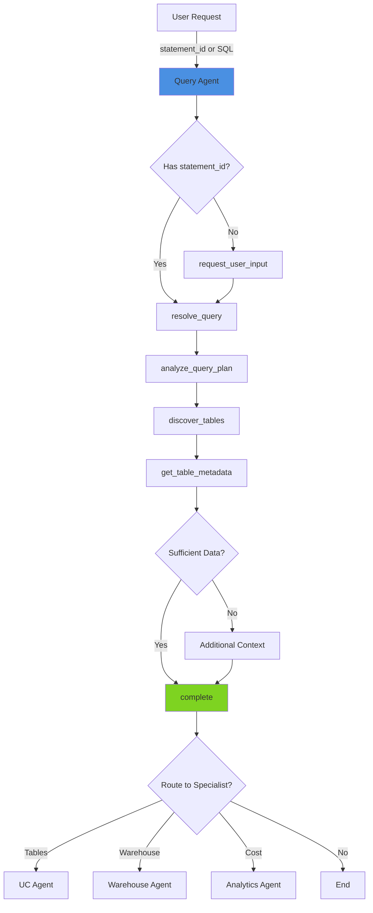

# Query Agent

> **Domain**: Query (SQL)  
> **Version**: 1.1.0  
> **Report Type**: `advisor`  
> **Prompt Version**: 1.1.0

---

## Overview

The Query Agent is a specialized domain agent focused on **SQL query optimization** for Databricks environments. It analyzes query execution plans, identifies performance bottlenecks, and provides evidence-based recommendations for improving query performance, reducing cost, and enhancing correctness.

### Primary Capabilities
- SQL query performance analysis
- Execution plan optimization (EXPLAIN analysis)
- Table schema and partition strategy recommendations
- Cost reduction through data scanning optimization
- Serverless compute detection and optimization

### Key Strengths
- **Evidence-Based**: All recommendations backed by actual tool outputs (execution plans, table metadata, metrics)
- **Efficient**: Completes analysis in 4-6 tool calls (~1,000-1,500 tokens)
- **Mode-Aware**: Operates in ONLINE (full SDK access) or OFFLINE (static analysis) modes
- **Table-Aware**: Strategic overlap with table tools for schema/partition analysis

---

## Agent Architecture

### System Prompt Structure

The Query Agent's behavior is defined by a comprehensive system prompt that includes:

1. **Core Principles**: Immutable rules (e.g., always require statement_id before analysis)
2. **Tool Catalog**: Available tools with cost estimates and usage guidelines
3. **Workflow Patterns**: Mode-specific workflows (ONLINE vs OFFLINE)
4. **Output Format**: Structured OptimizerAdvisorReport with findings and recommendations
5. **Handoff Context**: Integration with multi-agent routing system

### Tool Budget & Efficiency

**Token Budget**: 60,000 tokens (default, configurable)  
**Target**: 4-6 tool calls, ~1,000-1,500 tokens  
**Completion Strategy**: Complete after 4-6 tool calls or 1-2 failures

### Architecture Pattern

```
User Request
    ↓
[Intent Router] → Query Agent
    ↓
1. resolve_query (statement_id → SQL text)
2. analyze_query_plan (EXPLAIN analysis)
3. discover_tables (table references)
4. get_table_metadata (schemas, partitions) [PARALLEL]
    ↓
5. complete (OptimizerAdvisorReport)
```

---

## Example Prompts

### Direct Statement Analysis
```
"Optimize query statement_id:01948a0b-1ebb-17a4-959c-70dde9c5e3fc"
"Why is my query stmt_abc123xyz so slow?"
"Analyze the execution plan for statement abc123"
```

### SQL Text Analysis
```
"Optimize this query: SELECT * FROM sales WHERE date > '2024-01-01'"
"How can I improve this SQL: [SQL text]"
"Review my query performance"
```

### Specific Issues
```
"My query is doing a full table scan - how do I fix it?"
"Reduce the cost of this expensive query"
"Optimize shuffle operations in my query"
"Why is my query scanning 10TB of data?"
```

### Handoff from Other Agents
- **From Job Agent**: "Job found slow query stmt_abc123, analyze it"
- **From Diagnostic Agent**: "Query failed with AnalysisException, review SQL"
- **From Analytics Agent**: "Top expensive query stmt_xyz needs optimization"

---

## Tools & Tool Usage Context

### Primary Tools (Query-Specific)

| Tool | Cost | When to Use | Purpose |
|------|------|-------------|---------|
| `resolve_query` | ~50 tokens | FIRST call if statement_id provided | Get SQL text from statement_id |
| `analyze_query_plan` | ~500 tokens | MANDATORY in ONLINE mode | Run EXPLAIN and analyze execution plan |
| `get_query_runtime_metrics` | ~100 tokens | When metrics_summary missing | Get actual execution metrics (duration, bytes read) |

### Strategic Overlap Tools (Shared with UC Agent)

| Tool | Cost | When to Use | Purpose |
|------|------|-------------|---------|
| `get_table_metadata` | ~200/table | After discovering tables | Get schemas, partitions, statistics (1-3 tables max) |
| `discover_tables` | ~100 tokens | After getting SQL text | Extract table references from SQL |
| `get_table_history` | ~300/table | For optimization context | Check recent table operations |

### Core Tools

| Tool | Cost | When to Use | Purpose |
|------|------|-------------|---------|
| `request_user_input` | 0 tokens | Missing statement_id/SQL | Ask for required information |
| `complete` | 0 tokens | After analysis (4-6 calls) | Provide structured recommendations |

### Tool Usage Strategy

**80/20 Rule**: Query agent has strategic table tool overlap to handle 80% of query optimization independently. Complex lineage or advanced table operations delegate to UC agent.

**Parallel Execution**: Use PARALLEL calls for `get_table_metadata` when analyzing multiple tables (max 3).

**Tool Call Ordering** (ONLINE mode):
1. `resolve_query` → Get SQL (~50 tokens)
2. `analyze_query_plan` → **MANDATORY** EXPLAIN (~500 tokens)
3. `discover_tables` → Find table references (~100 tokens)
4. `get_table_metadata` (PARALLEL) → Schemas/partitions (~200-600 tokens)
5. `complete` → Recommendations (0 tokens)

**Optimization (BB-06)**: `resolve_query` now returns `plan_summary` and `metrics_summary` when available, potentially saving 1-2 follow-up tool calls.

---

## Hand-off Routes

### Incoming Routes (Who Routes to Query Agent)

| Source Agent | Trigger Pattern | Context Passed |
|--------------|-----------------|----------------|
| **Intent Router** | "optimize query", "statement_id", "sql", "slow query" | `statement_id`, user request |
| **Job Agent** | Identifies slow query in job task | `statement_id`, `job_id`, performance context |
| **Diagnostic Agent** | Query failure with SQL issues | `statement_id`, error context |
| **Analytics Agent** | Top expensive query needs optimization | `statement_id`, cost data |
| **UC Agent** | Downstream query performance impact | `statement_id`, `tables` |

### Outgoing Routes (Query Agent Routes to)

| Target Agent | When to Route | Context to Pass |
|--------------|---------------|-----------------|
| **UC Agent** | Complex table optimization (lineage, advanced schema) | `tables`, `statement_id`, analysis summary |
| **Warehouse Agent** | Warehouse configuration issues | `warehouse_id`, `statement_id`, context |
| **Cluster Agent** | Cluster sizing/config issues (not serverless) | `cluster_id`, context |
| **Job Agent** | Query is part of job workflow | `job_id`, context |
| **Analytics Agent** | Cost deep-dive needed | `statement_id`, cost context |

### Handoff Context Format

**Received from previous agent:**
```
[Handoff Context]
statement_id: 01948a0b-1ebb-17a4-959c-70dde9c5e3fc
tables: cprice_main.core.orders, cprice_main.core.products
Previous analysis summary: Job identified slow query in task 3
```

**Passed to next agent:**
```json
{
  "action_type": "route",
  "target_agent": "uc",
  "parameters": {
    "tables": ["cprice_main.core.orders", "cprice_main.core.products"],
    "query_id": "01948a0b-1ebb-17a4-959c-70dde9c5e3fc",
    "context": "Query optimization analysis completed"
  }
}
```

---

## Patterns Used/Followed

### 1. **Evidence-Based Recommendations Pattern**
All findings must cite actual evidence from tool outputs:
```json
{
  "proofs": {
    "evidence": [
      "Explain plan shows full table scan on 'sales' (10TB, 50B rows)",
      "Table metadata shows partitioning by 'date' column"
    ],
    "code_line_refs": [{"object": "explain_plan", "line": 12}]
  }
}
```

### 2. **Mode-Aware Execution Pattern**

**ONLINE Mode** (Full SDK access):
- Execute EXPLAIN for actual execution plans
- Fetch live table metadata
- Get runtime metrics

**OFFLINE Mode** (Static analysis only):
- Skip `analyze_query_plan` (requires execution)
- Provide pattern-based recommendations
- Focus on SQL structure and anti-patterns

### 3. **Serverless Detection Pattern**

```
IF warehouse_id == "0000000000000000":
    - warehouse_tier = "Serverless"
    - Focus on query/table optimization
    - DO NOT suggest warehouse configuration changes
    - Recommend: Partitioning, caching, clustering
```

### 4. **Parallel Tool Execution Pattern**

When analyzing multiple tables, execute `get_table_metadata` in PARALLEL:
```python
# Good: Parallel execution
[get_table_metadata(table_1), get_table_metadata(table_2), get_table_metadata(table_3)]

# Bad: Sequential execution (wastes time)
get_table_metadata(table_1) → wait → get_table_metadata(table_2) → wait → ...
```

### 5. **Interactive Next Steps Pattern**

Always provide 2-5 structured next steps for user selection:
```json
{
  "next_steps": [
    {
      "id": "implement_recommendations_1",
      "title": "Implement these query optimizations",
      "action_type": "continue"
    },
    {
      "id": "analyze_tables_2",
      "title": "Analyze table optimization opportunities",
      "action_type": "route",
      "target_agent": "uc",
      "parameters": {"tables": ["actual.table.names"], "query_id": "..."}
    }
  ]
}
```

### 6. **Tool Deduplication Pattern**

NEVER call the same tool twice with identical parameters:
```
❌ BAD: resolve_query(stmt_abc) → ... → resolve_query(stmt_abc)
✅ GOOD: resolve_query(stmt_abc) → use cached result
```

### 7. **Early Completion Pattern**

Complete immediately after:
- 4-6 tool calls (normal case)
- 1-2 tool failures (error case)
- Sufficient evidence gathered (efficiency)

**DO NOT** keep reasoning after failures - call `complete` with best-effort recommendations.

---

## Evaluation Matrix

### Completeness

| Dimension | Score | Evidence |
|-----------|-------|----------|
| **Core Functionality** | ⭐⭐⭐⭐⭐ 5/5 | Covers all query optimization use cases (execution plans, table metadata, cost analysis) |
| **Tool Coverage** | ⭐⭐⭐⭐ 4/5 | Has 7 tools; strategic overlap with table tools but delegates complex lineage |
| **Error Handling** | ⭐⭐⭐⭐⭐ 5/5 | Comprehensive error handling (missing IDs, tool failures, timeouts) |
| **Mode Support** | ⭐⭐⭐⭐⭐ 5/5 | Full ONLINE/OFFLINE mode support with appropriate fallbacks |
| **Documentation** | ⭐⭐⭐⭐⭐ 5/5 | Extensive prompt documentation with examples and workflows |

**Overall Completeness**: ⭐⭐⭐⭐⭐ 4.8/5

### Complexity

| Dimension | Assessment |
|-----------|------------|
| **Workflow Complexity** | Medium - Linear workflow with optional table metadata |
| **Decision Logic** | Low - Clear mode-based branching (ONLINE vs OFFLINE) |
| **Tool Orchestration** | Medium - Parallel execution for table metadata, sequential for others |
| **Output Structure** | High - Complex OptimizerAdvisorReport with findings, proofs, impacts |
| **Handoff Logic** | Medium - Standard handoff patterns with context passing |

**Complexity Rating**: **Medium** - Straightforward query analysis workflow with well-defined tool sequencing.

### Strengths

1. **Efficiency**: Completes in 4-6 tool calls with ~1,000-1,500 tokens
2. **Evidence-Based**: All recommendations cite actual tool outputs (no fabrication)
3. **Serverless-Aware**: Detects serverless compute and adjusts recommendations
4. **Strategic Tool Overlap**: Can analyze tables without UC agent handoff (80% independent)
5. **Optimization**: BB-06 improvements reduce tool calls via `plan_summary`/`metrics_summary`
6. **Interactive**: Provides structured next steps for continued exploration
7. **Quantified Impact**: Includes % improvement estimates with confidence levels

### Weaknesses

1. **Limited Lineage**: Cannot trace complex table lineage (delegates to UC agent)
2. **No Query Rewriting**: Suggests rewrites but doesn't execute them
3. **Partition Assumptions**: Relies on table metadata accuracy (may be stale)
4. **Warehouse-Agnostic**: Limited warehouse-specific optimization (delegates to Warehouse agent)
5. **No Historical Trends**: Analyzes single query, not query pattern over time
6. **Cost Estimation Accuracy**: Impact estimates are approximations, not guarantees

### Optimization Opportunities

1. **Query Plan Caching**: Cache EXPLAIN results for frequently-analyzed queries
2. **Pattern Library**: Build library of common anti-patterns for faster detection
3. **ML-Based Impact**: Use historical data to improve impact estimate accuracy
4. **Query Rewrite Validation**: Automatically validate suggested rewrites in test environment
5. **Workspace Context**: Learn workspace-specific patterns (commonly used tables, schemas)

---

## Diagram

See: `/docs/diagrams/source/agents/query-agent-workflow.mmd`



---

## Related Documentation

- [Agent Implementation Guide](../../developer/agent/IMPLEMENTATION_GUIDE.md)
- [Tool Architecture](../../TOOL_ARCHITECTURE.md)
- [System Architecture](../../architecture/SYSTEM_ARCHITECTURE.md)
- [Query Prompt Source](../../../packages/starboard-server/starboard/prompts/query/v1.py)
- [Tool Categories](../../../packages/starboard-server/starboard/agents/tool_categories.py)

