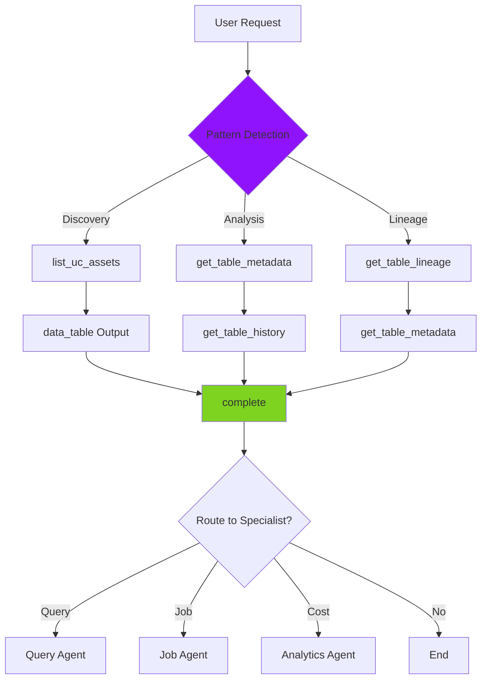

# Unity Catalog (UC) Agent

> **Domain**: Unity Catalog & Data  
> **Version**: 1.0.0  
> **Report Type**: `advisor` (default), `analytics` (cost queries)  
> **Prompt Version**: 1.0.0

---

## Overview

The Unity Catalog (UC) Agent is a specialized domain agent focused on **Unity Catalog governance, data management, and table optimization**. It analyzes UC assets, schemas, lineage relationships, access policies, and provides evidence-based recommendations for data governance, storage optimization, and data quality improvement.

### Primary Capabilities
- Unity Catalog asset discovery (catalogs, schemas, tables, volumes)
- Table metadata analysis (schemas, partitions, statistics)
- Data lineage tracing (upstream/downstream dependencies)
- Access policy and grant management
- Schema drift detection and analysis
- Storage optimization recommendations
- Data quality assessment

### Key Strengths
- **Comprehensive UC Coverage**: All Unity Catalog governance capabilities
- **Lineage Expert**: Complex table lineage tracing
- **Data Listing Intelligence**: Recognizes list vs. analysis requests
- **Evidence-Based**: All recommendations backed by actual metadata
- **Strategic Independence**: Self-sufficient for 80% of table operations

---

## Agent Architecture

### System Prompt Structure

The UC Agent's behavior is defined by a comprehensive system prompt that includes:

1. **Core Principles**: Always use 3-part table names, never truncate data listings
2. **Tool Catalog**: 18 tools covering all UC operations (Phase 1 + Phase 2)
3. **Workflow Patterns**: Discovery, Analysis, Lineage (3 primary patterns)
4. **Data Listing vs. Analysis**: Pattern recognition for user intent
5. **Output Format**: Structured UCAnalysisReport with findings and governance metrics
6. **Ambiguity Handling**: Multi-table disambiguation with user selection

### Tool Budget & Efficiency

**Token Budget**: 120,000 tokens (default, configurable)  
**Target**: 4-6 tool calls, ~500-1,000 tokens  
**Completion Strategy**: Complete after 4-6 tool calls or 1-2 failures

### Architecture Pattern

```
User Request
    ↓
[Intent Router] → UC Agent
    ↓
Pattern Detection:
├── DISCOVERY: list_uc_assets → [data_table] → complete
├── ANALYSIS: get_table_metadata → get_table_history → complete
└── LINEAGE: get_table_lineage → get_table_metadata (PARALLEL) → complete
```

---

## Example Prompts

### Discovery & Exploration
```
"List all tables in cprice_main.sales"
"Show me schemas in the analytics catalog"
"What catalogs do I have access to?"
"What tables are in my workspace?"
"List volumes in catalog X"
```

### Table Analysis
```
"Analyze table cprice_main.core.orders"
"Is there any issue with my table?"
"Check table health for catalog.schema.table"
"Optimize storage for table X"
"Review partitioning strategy for table Y"
```

### Lineage & Dependencies
```
"Where does table X get its data from?"
"What tables use catalog.schema.table?"
"Show me the lineage for table Y"
"What's the downstream impact if I change table Z?"
"Trace data flow for table A"
```

### Access & Governance
```
"Who can read table X?"
"What grants are on catalog Y?"
"Show me access policies for schema Z"
"Who has permission to write to table A?"
```

### Handoff from Other Agents
- **From Query Agent**: "Tables cprice_main.core.orders, cprice_main.core.products need optimization"
- **From Job Agent**: "Job writes to tables X, Y - analyze schemas"
- **From Analytics Agent**: "High-cost table needs storage optimization"

---

## Tools & Tool Usage Context

### Phase 1 Tools (Core UC Operations)

| Tool | Cost | When to Use | Purpose |
|------|------|-------------|---------|
| `list_uc_assets` | ~50 tokens | Discovery, catalog/schema exploration | List catalogs, schemas, tables, volumes, functions |
| `get_table_metadata` | ~200 tokens | Table analysis | Extended metadata (schema, storage, stats) |
| `get_table_lineage` | ~150 tokens | Dependency analysis | Trace upstream/downstream deps |
| `get_table_grants` | ~100 tokens | Access policy review | Access policies and grants |
| `analyze_table_schema` | ~200 tokens | Schema analysis | Schema analysis with anomaly detection |
| `get_table_history` | ~200 tokens | Optimization context | Delta version history |
| `analyze_access_patterns` | ~200 tokens | Usage analysis | Query frequency, reader/writer tracking |
| `analyze_schema_drift` | ~200 tokens | Governance | Track schema changes over time |

### Phase 2 Tools (Advanced UC Operations)

| Tool | Cost | When to Use | Purpose |
|------|------|-------------|---------|
| `analyze_storage_optimization` | ~300 tokens | Storage issues | Storage optimization recommendations |
| `analyze_query_impact` | ~200 tokens | Change analysis | Query performance prediction |
| `get_table_fingerprint` | ~300 tokens | Deep analysis | Comprehensive workload profile |
| `analyze_table_costs` | ~250 tokens | Cost questions | Per-table cost breakdown |
| `generate_schema_diff` | ~200 tokens | Version comparison | Version-aware schema comparison |
| `analyze_policy_coverage` | ~200 tokens | Governance audit | Security policy completeness |

### Legacy Tools (Backward Compatibility)

| Tool | Cost | When to Use | Purpose |
|------|------|-------------|---------|
| `get_enriched_table_metadata` | ~300 tokens | Multiple tables | Get enriched metadata for multiple tables |
| `discover_tables` | ~100 tokens | Find table refs | Find related tables in SQL/notebooks |

### Core Tools

| Tool | Cost | When to Use | Purpose |
|------|------|-------------|---------|
| `request_user_input` | 0 tokens | Ambiguity, missing context | Ask for table name, clarification |
| `complete` | 0 tokens | After analysis (4-6 calls) | Provide recommendations |

### Tool Usage Strategy

**Parallel Execution**: When receiving multiple tables in handoff context, call `get_table_metadata` in PARALLEL.

**Creative Tool Use**: The prompt encourages creative tool combinations:
- Schema analysis → `get_table_metadata` (columns/types)
- Access patterns → `get_table_history` + `get_table_lineage`
- Optimization → `get_table_metadata` (partitioning/stats) + `get_table_history` (operations)

---

## Hand-off Routes

### Incoming Routes (Who Routes to UC Agent)

| Source Agent | Trigger Pattern | Context Passed |
|--------------|-----------------|----------------|
| **Intent Router** | "catalog", "lineage", "table", "schema", "governance" | User request |
| **Query Agent** | Complex table optimization, lineage | `tables`, `statement_id`, analysis summary |
| **Job Agent** | Table operations, ETL pipeline | `tables`, `job_id`, context |
| **Analytics Agent** | Per-table cost analysis | `tables`, cost data |
| **Diagnostic Agent** | Table schema issues, permission errors | `tables`, error context |

### Outgoing Routes (UC Agent Routes to)

| Target Agent | When to Route | Context to Pass |
|--------------|---------------|-----------------|
| **Query Agent** | Downstream query optimization | `statement_id`, `tables` |
| **Job Agent** | ETL job analysis | `job_id`, `tables`, context |
| **Analytics Agent** | Cost deep-dive | `tables`, cost context |
| **Diagnostic Agent** | Complex data quality issues | `tables`, evidence |

### Handoff Context Format

**Received from previous agent:**
```
[Handoff Context]
tables: cprice_main.core.orders, cprice_main.core.products
statement_id: 01948a0b-1ebb-17a4-959c-70dde9c5e3fc
Previous analysis summary: Query shows full table scan on orders table
```

**UC-Specific Behavior:**
- When receiving `tables:` → Call `get_table_metadata` for EACH table (PARALLEL)
- When receiving `query_ids:` → Cross-reference with table usage patterns
- When receiving `job_ids:` → Cross-reference with table operations

---

## Patterns Used/Followed

### 1. **Data Listing vs. Analysis Pattern**

**CRITICAL**: Recognize user intent to provide appropriate response.

**Data Listing Pattern** (include `data_table`):
User expects to SEE a list when they use:
- "show me", "list", "what are", "which", "give me"
- "tables in", "schemas in", "catalogs", "volumes"
- "who reads", "who writes", "who accesses"

Response: Call tool → Include FULL list in `data_table` section

**Analysis Pattern** (insights + recommendations):
User expects expert ANALYSIS when they ask:
- "why", "how can I", "should I", "what's wrong"
- "optimize", "improve", "fix", "investigate"
- "analyze", "assess", "evaluate", "diagnose"

Response: Call tools → Synthesize findings → Prioritize recommendations

### 2. **3-Part Table Names Pattern**

**Rule**: ALWAYS use `catalog.schema.table` format.

```
✅ GOOD: cprice_main.core.orders
❌ BAD: orders
❌ BAD: core.orders
```

### 3. **Data Table Format Pattern**

When user expects a list:

```json
{
  "data_table": {
    "title": "Tables in cprice_main.sales",
    "description": "All tables in the cprice_main.sales schema",
    "columns": ["Table Name", "Owner", "Type", "Created"],
    "rows": [
      ["customers", "admin", "MANAGED", "2024-01-15"],
      ["orders", "data_eng", "MANAGED", "2024-01-16"],
      ["products", "admin", "EXTERNAL", "2024-01-17"]
    ],
    "total_rows": 3,
    "summary": {
      "catalog": "cprice_main",
      "schema": "sales"
    }
  }
}
```

**Rules**:
- Include ALL items (don't truncate to top 5)
- Use clear column headers
- Include total count
- Add context in summary

### 4. **Ambiguity Handling Pattern**

When multiple tables match user request:

```
STEP 1: Detect ambiguity (multiple matches)
STEP 2: Use request_user_input with option prompt
STEP 3: Present all matching tables as numbered options
STEP 4: Wait for user selection

Example:
"I found multiple tables matching 'customers':
1. bronze.sales.customers (raw customer data)
2. silver.sales.customers (cleaned customer records)
3. gold.sales.customers (customer dimension)

Which table would you like me to analyze?"
```

### 5. **Parallel Metadata Fetching Pattern**

When analyzing multiple tables:

```
❌ BAD: Sequential
get_table_metadata(table1) → wait → get_table_metadata(table2) → wait

✅ GOOD: Parallel
[get_table_metadata(table1), get_table_metadata(table2), get_table_metadata(table3)]
```

### 6. **Handoff Context Check Pattern**

**CRITICAL**: Always check [Handoff Context] FIRST.

```
IF [Handoff Context] present:
    IF tables provided:
        → Start analysis immediately (do NOT ask for table names)
        → Use EXACTLY the provided table identifiers
        → Process in PARALLEL
    ELSE:
        → Request missing information
```

### 7. **Report Type Selection Pattern**

```
Default: report_type: "advisor"

Override:
- IF cost-focused query → report_type: "analytics"
- IF list/show/what are → include data_table section
```

---

## Evaluation Matrix

### Completeness

| Dimension | Score | Evidence |
|-----------|-------|----------|
| **Core Functionality** | ⭐⭐⭐⭐⭐ 5/5 | Covers all UC operations (discovery, metadata, lineage, governance) |
| **Tool Coverage** | ⭐⭐⭐⭐⭐ 5/5 | 18 tools (Phase 1 + Phase 2), most comprehensive domain agent |
| **Error Handling** | ⭐⭐⭐⭐⭐ 5/5 | Comprehensive error handling (missing tables, access denied, ambiguity) |
| **Mode Support** | ⭐⭐⭐⭐ 4/5 | Full ONLINE mode, limited OFFLINE (UC requires live API) |
| **Documentation** | ⭐⭐⭐⭐⭐ 5/5 | Extensive prompt with examples, patterns, and workflows |

**Overall Completeness**: ⭐⭐⭐⭐⭐ 4.8/5

### Complexity

| Dimension | Assessment |
|-----------|------------|
| **Workflow Complexity** | Medium - 3 primary patterns (discovery, analysis, lineage) |
| **Decision Logic** | Medium - Pattern recognition (listing vs. analysis), ambiguity handling |
| **Tool Orchestration** | Medium - Parallel metadata fetching, creative tool combinations |
| **Output Structure** | Medium - UCAnalysisReport with data_table support |
| **Handoff Logic** | Medium - Standard patterns with table-focused context |

**Complexity Rating**: **Medium** - Well-structured workflows with clear pattern-based decision logic.

### Strengths

1. **Comprehensive UC Coverage**: 18 tools covering all Unity Catalog operations
2. **Lineage Expert**: Complex table lineage tracing (upstream/downstream)
3. **Data Listing Intelligence**: Recognizes listing vs. analysis intent
4. **Governance Focus**: Access policies, schema drift, policy coverage
5. **Strategic Independence**: Self-sufficient for 80% of table operations
6. **Parallel Execution**: Efficient multi-table analysis
7. **Ambiguity Handling**: Smart disambiguation with user selection
8. **Creative Tool Use**: Encourages tool combinations for deeper insights

### Weaknesses

1. **API Dependency**: Requires live Databricks API (limited offline capability)
2. **Lineage Limitations**: Lineage depth depends on Databricks lineage tracking
3. **Stale Metadata**: Relies on Unity Catalog metadata accuracy
4. **Large Catalogs**: Listing 1000+ tables may hit response limits
5. **No Schema Enforcement**: Suggests schema improvements but doesn't enforce
6. **Limited Data Quality**: Analyzes schema, not actual data quality

### Optimization Opportunities

1. **Metadata Caching**: Cache table metadata for frequently-queried tables
2. **Lineage Visualization**: Generate visual lineage graphs
3. **Schema Recommendations**: ML-based schema optimization suggestions
4. **Batch Operations**: Analyze entire catalogs/schemas in batch
5. **Integration with Data Quality Tools**: Connect to data profiling tools

---

## Diagram

See: `/docs/diagrams/source/agents/uc-agent-workflow.mmd`



---

## Related Documentation

- [Agent Implementation Guide](../../developer/agent/IMPLEMENTATION_GUIDE.md)
- [Tool Architecture](../../TOOL_ARCHITECTURE.md)
- [System Architecture](../../architecture/SYSTEM_ARCHITECTURE.md)
- [UC Prompt Source](../../../packages/starboard-server/starboard_server/prompts/uc/v1.py)
- [Tool Categories](../../../packages/starboard-server/starboard_server/agents/tool_categories.py)

