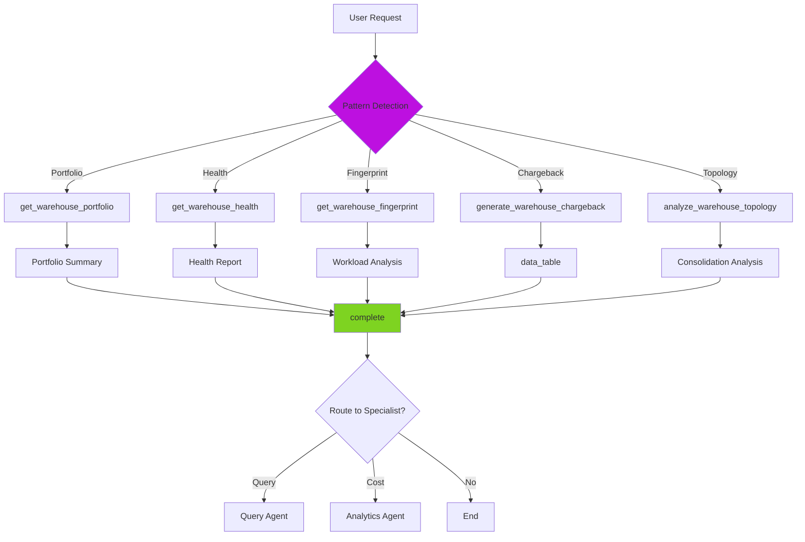

# Warehouse Agent

> **Domain**: SQL/DW Warehouse  
> **Version**: 1.1.0  
> **Report Type**: `warehouse` (default), `analytics` (cost queries)  
> **Prompt Version**: 1.1.0

---

## Overview

The Warehouse Agent is a specialized domain agent focused on **SQL warehouse portfolio optimization** for Databricks environments. It analyzes warehouse configurations, workload patterns, health metrics, SLO compliance, and provides evidence-based recommendations for cost reduction, performance improvement, and reliability enhancement.

### Primary Capabilities
- SQL warehouse portfolio analysis and management
- Warehouse fingerprinting (workload patterns, latency baselines)
- Health scoring and SLO management (0-100 scale)
- Cost attribution and chargeback (user-level)
- Topology analysis (consolidation opportunities)

### Key Strengths
- **Portfolio Intelligence**: Fleet-wide analysis and optimization
- **Fingerprinting**: Deep workload pattern analysis (P50, P75, P90, P95, P99 latencies)
- **Health & SLO**: Comprehensive health scoring with SLO compliance tracking
- **Chargeback**: User-level cost allocation (runtime, queries, bytes)
- **Serverless-Aware**: Understands serverless auto-start/stop behavior
- **Name or ID**: Automatically resolves warehouse names to IDs

---

## Agent Architecture

### System Prompt Structure

The Warehouse Agent's behavior is defined by a comprehensive system prompt that includes:

1. **Core Principles**: Use actual IDs, never truncate data, STOPPED serverless is normal
2. **Capabilities**: Portfolio analysis, fingerprinting, health scoring, chargeback, topology
3. **Tool Catalog**: 8 tools for portfolio, fingerprint, health, SLO, activity, chargeback, topology
4. **Serverless Understanding**: Auto-start/stop behavior is expected (not problematic)
5. **Report vs. Analysis**: Pattern recognition for user intent
6. **Output Format**: WarehouseReport with portfolio, health, topology, data_table sections

### Tool Budget & Efficiency

**Token Budget**: 72,000 tokens (default, configurable)  
**Target**: 3-5 tool calls  
**Completion Strategy**: Complete after 3-5 tool calls or 1-2 failures

### Architecture Pattern

```
User Request
    ↓
[Intent Router] → Warehouse Agent
    ↓
Pattern Detection:
├── PORTFOLIO: get_warehouse_portfolio → [portfolio summary] → complete
├── HEALTH: get_warehouse_health → complete
├── FINGERPRINT: get_warehouse_fingerprint → complete
├── CHARGEBACK: generate_warehouse_chargeback → [data_table] → complete
└── TOPOLOGY: analyze_warehouse_topology → [consolidation analysis] → complete
```

---

## Example Prompts

### Portfolio Analysis
```
"Show me our warehouses"
"List all SQL warehouses"
"Warehouse fleet overview"
"What warehouses do we have?"
```

### Warehouse Analysis
```
"How is my analytics warehouse doing?"
"Analyze warehouse lt-sql-endpoint"
"Check warehouse health"
"Review warehouse fingerprint"
"What's the health score for warehouse X?"
```

### User Activity & Chargeback
```
"Who's using my warehouse?"
"Generate chargeback report for warehouse X"
"User activity breakdown"
"Cost allocation by user"
"Generate chargeback report" (all warehouses)
```

### Topology & Consolidation
```
"Are any of our warehouses redundant?"
"Check for warehouse overlap"
"Consolidation opportunities"
"Analyze warehouse topology"
```

### Handoff from Other Agents
- **From Analytics Agent**: "Warehouse X is top cost driver, analyze it"
- **From Query Agent**: "Warehouse executed expensive queries, review config"
- **From Cluster Agent**: "Route warehouse analysis to Warehouse Agent"

---

## Tools & Tool Usage Context

### Portfolio Tools

| Tool | Cost | When to Use | Purpose |
|------|------|-------------|---------|
| `get_warehouse_portfolio` | ~200 tokens | ALWAYS first for overview | List all warehouses with metrics |

### Warehouse Tools

| Tool | Cost | When to Use | Purpose |
|------|------|-------------|---------|
| `get_warehouse_fingerprint` | ~500 tokens | Detailed analysis | Query types, concurrency, timing, latency baselines (P50-P99) |
| `get_warehouse_health` | ~300 tokens | Health checks | Health score (0-100), SLO compliance, risk factors |
| `get_query_runtime_metrics` | ~100 tokens | Query metrics | Query metrics for warehouse analysis (SHARED) |

### SLO Management

| Tool | Cost | When to Use | Purpose |
|------|------|-------------|---------|
| `configure_warehouse_slo` | ~100 tokens | Only when user requests | Configure SLO targets |

### User Activity & Chargeback

| Tool | Cost | When to Use | Purpose |
|------|------|-------------|---------|
| `get_warehouse_user_activity` | ~400 tokens | User breakdown | User activity breakdown |
| `generate_warehouse_chargeback` | ~500 tokens | Single warehouse chargeback | Cost allocation per user (runtime/queries/bytes) |
| `generate_portfolio_chargeback` | ~600 tokens | Portfolio-wide chargeback | Cost attribution across all warehouses |

### Topology Tools

| Tool | Cost | When to Use | Purpose |
|------|------|-------------|---------|
| `analyze_warehouse_topology` | ~600 tokens | Consolidation analysis | Cross-warehouse overlap detection |

### Core Tools

| Tool | Cost | When to Use | Purpose |
|------|------|-------------|---------|
| `request_user_input` | 0 tokens | Missing information | Ask for warehouse name/ID |
| `complete` | 0 tokens | After analysis (3-5 calls) | Provide recommendations |

### Tool Usage Strategy

**Automatic Name Resolution**: All tools accept EITHER warehouse ID OR warehouse name. The system handles lookup internally - just pass what the user provides.

**Portfolio-First**: For fleet questions, start with `get_warehouse_portfolio`.

**Chargeback Workflow**:
1. `get_warehouse_portfolio` → get total cost
2. `generate_warehouse_chargeback(warehouse_id, total_cost_usd)` → cost allocation
3. Include ALL allocations in `data_table`

---

## Hand-off Routes

### Incoming Routes (Who Routes to Warehouse Agent)

| Source Agent | Trigger Pattern | Context Passed |
|--------------|-----------------|----------------|
| **Intent Router** | "warehouse", "chargeback", "slo", "warehouse_id" | `warehouse_id`, user request |
| **Analytics Agent** | Warehouse cost analysis | `warehouse_id`, cost data |
| **Query Agent** | Warehouse config optimization | `warehouse_id`, `statement_id` |
| **Cluster Agent** | Warehouse analysis (not cluster) | `warehouse_id`, context |

### Outgoing Routes (Warehouse Agent Routes to)

| Target Agent | When to Route | Context to Pass |
|--------------|---------------|-----------------|
| **Query Agent** | SQL query optimization | `statement_id`, `warehouse_id` |
| **Analytics Agent** | Deep cost analysis | `warehouse_id`, cost context |

### Handoff Context Format

**Received from previous agent:**
```
[Handoff Context]
warehouse_id: 75fd8278393d07eb
Previous analysis summary: Expensive warehouse, needs optimization
```

**Warehouse-Specific Behavior:**
- When receiving `warehouse_id:` → Start with portfolio or fingerprint tools
- When receiving `query_ids:` → Cross-reference with warehouse performance
- For fleet-wide analysis → Use `get_warehouse_portfolio` first

---

## Patterns Used/Followed

### 1. **Serverless Warehouse Understanding Pattern**

**CRITICAL**: Serverless SQL warehouses auto-start/stop frequently - this is NORMAL.

```
Serverless Behavior:
1. Auto-start: Automatically starts when query arrives
2. Auto-stop: Automatically stops after idle timeout (10-15 min)
3. Rapid cycling: May start/stop dozens of times per day - EXPECTED
4. No manual management: Users don't start/stop manually

Warehouse State vs. Query History:
- state field: CURRENT moment (RUNNING, STOPPED, STARTING, STOPPING)
- Query history: queries from PAST (e.g., last 7 days)
- STOPPED warehouse with query history is NORMAL
  (warehouse was running when queries executed, then auto-stopped)

DO NOT recommend:
❌ "Investigate why warehouse is STOPPED but has queries"
❌ "Consider keeping warehouse running"
❌ "Review auto-stop settings"
❌ "Migrate users to an active warehouse"

Valid concerns:
✅ High startup latency (cold start impact)
✅ Cost optimization (size, query efficiency)
✅ Queue times during high concurrency
✅ Error rates or query failures
```

### 2. **Report vs. Analysis Pattern**

**Report Pattern** (include `data_table`):
User expects to SEE data when they use:
- "report", "generate report", "create report"
- "show me", "list", "give me", "what are all"
- "breakdown", "table", "export"
- "who is using", "which users", "chargeback"

Response: Call tool → Include FULL data in `data_table`

**Analysis Pattern** (insights + recommendations):
User expects expert ANALYSIS when they ask:
- "why", "how can I", "should I", "what's wrong"
- "optimize", "improve", "fix", "investigate"
- "analyze", "assess", "evaluate"

Response: Call tools → Synthesize findings → Prioritize recommendations

### 3. **Data Table Format Pattern**

```json
{
  "data_table": {
    "title": "Warehouse Chargeback Report - lt-sql-endpoint",
    "description": "Cost allocation by user for the past 30 days",
    "columns": ["User", "Queries", "Runtime (sec)", "Cost ($)", "Share (%)"],
    "rows": [
      ["alice@example.com", 500, 3600, 540.82, 35.5],
      ["bob@example.com", 250, 1800, 304.69, 20.0]
    ],
    "total_rows": 17,
    "summary": {
      "total_cost_usd": 1523.45,
      "period": "30 days",
      "allocation_method": "runtime"
    }
  }
}
```

**Rules**:
- Include ALL rows (don't truncate to top 5)
- Use clear column headers with units
- Include summary with totals/aggregates

### 4. **Report Type Selection Pattern**

```
Default: report_type: "warehouse"
  Use for: portfolio, health, topology, fingerprint

Override: report_type: "analytics"
  Use for: cost-focused queries (billing, chargeback, spend)
```

### 5. **Chargeback Workflow Pattern**

```
User: "Generate chargeback report for X warehouse"

Step 1: get_warehouse_portfolio OR billing data → get total_cost_usd
Step 2: generate_warehouse_chargeback(warehouse_id="X", total_cost_usd=<cost>)
Step 3: Present allocations data in data_table (ALL users, not just top 5)
```

### 6. **Portfolio Chargeback Pattern**

```
User: "Generate chargeback report" (no specific warehouse)

Step 1: generate_portfolio_chargeback()
Step 2: Present cost allocation across ALL warehouses
```

---

## Evaluation Matrix

### Completeness

| Dimension | Score | Evidence |
|-----------|-------|----------|
| **Core Functionality** | ⭐⭐⭐⭐⭐ 5/5 | Covers all warehouse optimization use cases (portfolio, health, chargeback, topology) |
| **Tool Coverage** | ⭐⭐⭐⭐⭐ 5/5 | 8 tools; comprehensive warehouse management |
| **Error Handling** | ⭐⭐⭐⭐⭐ 5/5 | Comprehensive error handling (missing IDs, access denied) |
| **Mode Support** | ⭐⭐⭐⭐⭐ 5/5 | Full ONLINE mode with warehouse API integration |
| **Documentation** | ⭐⭐⭐⭐⭐ 5/5 | Extensive prompt with serverless understanding |

**Overall Completeness**: ⭐⭐⭐⭐⭐ 5.0/5

### Complexity

| Dimension | Assessment |
|-----------|------------|
| **Workflow Complexity** | Medium - Multiple patterns (portfolio, health, fingerprint, chargeback, topology) |
| **Decision Logic** | Medium - Pattern recognition (report vs. analysis), serverless handling |
| **Tool Orchestration** | Low - Sequential execution, no complex dependencies |
| **Output Structure** | Medium - WarehouseReport with multiple section types |
| **Handoff Logic** | Low - Standard patterns |

**Complexity Rating**: **Medium** - Well-structured workflows with multiple analysis patterns.

### Strengths

1. **Portfolio Intelligence**: Fleet-wide analysis and management
2. **Fingerprinting**: Deep workload analysis (query types, concurrency, latency baselines)
3. **Health & SLO**: Comprehensive health scoring with SLO compliance
4. **Chargeback**: User-level cost allocation (multiple methods: runtime, queries, bytes)
5. **Serverless-Aware**: Understands auto-start/stop behavior (doesn't flag as problematic)
6. **Name or ID**: Automatic warehouse name-to-ID resolution
7. **Topology Analysis**: Cross-warehouse consolidation detection
8. **Report Intelligence**: Recognizes listing vs. analysis requests

### Weaknesses

1. **Limited Historical Trends**: Analyzes current snapshot, not long-term patterns
2. **No Predictive Analysis**: Reactive (current state, not future needs)
3. **Chargeback Cost Dependency**: Requires total cost input (from portfolio or billing)
4. **Large Fleets**: Many warehouses (50+) may be slow to analyze
5. **SLO Configuration**: Manual SLO target configuration required
6. **No Auto-Tuning**: Suggests optimizations but doesn't apply them

### Optimization Opportunities

1. **Predictive Sizing**: ML-based warehouse size prediction
2. **Automated SLO Management**: Learn SLO targets from historical patterns
3. **Cost Forecasting**: Project future costs based on usage trends
4. **Auto-Tuning**: Automatically apply safe optimizations
5. **Fleet-Level Insights**: Cross-warehouse pattern detection
6. **Integration with Query Agent**: Unified query+warehouse optimization

---

## Diagram

See: `/docs/diagrams/source/agents/warehouse-agent-workflow.mmd`



---

## Related Documentation

- [Agent Implementation Guide](../../developer/agent/IMPLEMENTATION_GUIDE.md)
- [Tool Architecture](../../TOOL_ARCHITECTURE.md)
- [System Architecture](../../architecture/SYSTEM_ARCHITECTURE.md)
- [Warehouse Prompt Source](../../../packages/starboard-server/starboard_server/prompts/warehouse/v1.py)
- [Tool Categories](../../../packages/starboard-server/starboard_server/agents/tool_categories.py)

