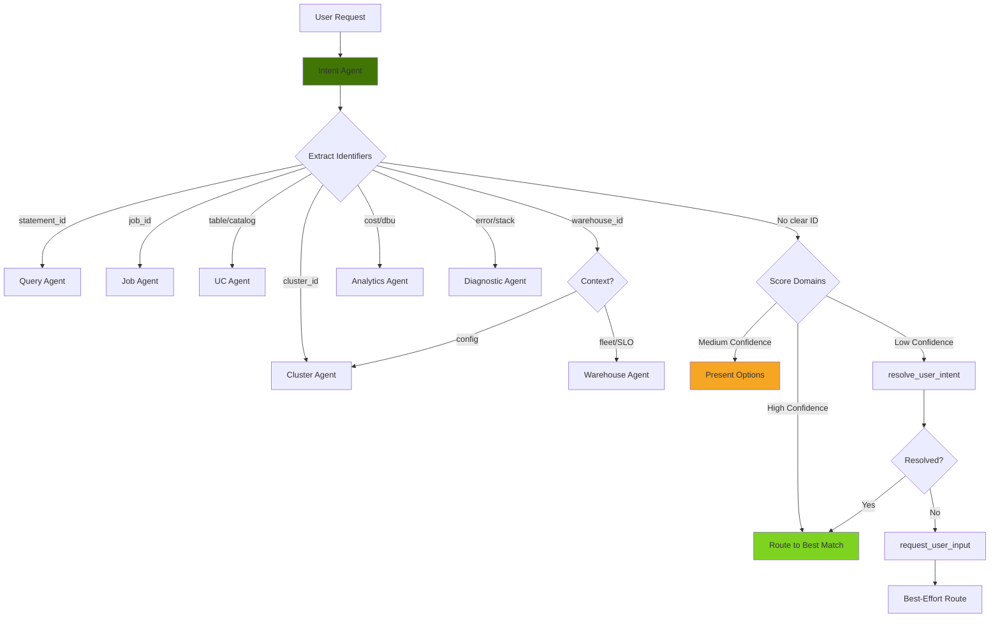

# Intent Agent (Router)

> **Domain**: Framework - Intent Classification  
> **Version**: 1.0.0  
> **Report Type**: N/A (routing only)  
> **Prompt Version**: 1.0.0

---

## Overview

The Intent Agent (also called "Router") is a **framework agent** responsible for **intent classification and routing** in the multi-agent system. It analyzes user requests, determines which domain specialist should handle them, and routes the conversation accordingly. Unlike domain agents, the Intent Agent does NOT perform optimization or analysis - it solely focuses on routing decisions.

### Primary Capabilities
- Intent classification (domain identification)
- Request routing to appropriate specialist
- Identifier extraction (statement_id, job_id, cluster_id, etc.)
- Ambiguity resolution (multiple domain options)
- Fast classification (minimize tool calls)

### Key Strengths
- **Scoring-Based Routing**: Parallel domain scoring (not sequential rules)
- **Fast Classification**: Minimal tool calls, high confidence routing
- **Identifier-Aware**: Explicit identifiers → immediate routing
- **Option Presentation**: Presents choices when confidence is medium (0.4-0.6)
- **Multi-Domain Handling**: Suggests starting point for broad requests

---

## Agent Architecture

### System Prompt Structure

The Intent Agent's behavior is defined by a focused routing prompt that includes:

1. **Core Principles**: Route FAST, use explicit identifiers, present options when uncertain
2. **Domain Specialists**: Complete list of available specialists and their capabilities
3. **Tools Available**: Only 3 tools (resolve_user_intent, request_user_input, complete)
4. **Workflow**: Analyze → Route immediately OR resolve_user_intent OR request_user_input
5. **Option Presentation**: Interactive pattern for medium confidence (0.4-0.6)
6. **Multi-Domain Handling**: Guidance for broad "optimize everything" requests

### Tool Budget & Efficiency

**Token Budget**: 30,000 tokens (default, configurable)  
**Target**: 1-3 tool calls (fast routing)  
**Completion Strategy**: Complete after 1 clarification attempt maximum

### Architecture Pattern

```
User Request
    ↓
Intent Agent
    ↓
1. Extract Identifiers (statement_id, job_id, etc.)
    ↓
2. IF clear identifier OR high confidence (>0.7):
       → Route immediately via complete
    ↓
3. ELSE IF ambiguous:
       → resolve_user_intent OR request_user_input
    ↓
4. IF still unclear after 1 clarification:
       → Make best-effort routing decision
    ↓
5. complete (RouteDecision)
```

---

## Example Prompts

### Clear Identifiers (Immediate Routing)
```
"Optimize query statement_id:abc123" → Query Agent
"Analyze job 266829928906781" → Job Agent
"List tables in catalog cprice_main" → UC Agent
"Check cluster health 1201-xyz" → Cluster Agent
"Generate warehouse chargeback" → Warehouse Agent
"What are my costs?" → Analytics Agent
"Why did my job fail with exit code 137?" → Diagnostic Agent
```

### Keyword-Based Routing
```
"Optimize my SQL query" → Query Agent
"Job performance issues" → Job Agent
"Table lineage" → UC Agent
"Cluster sizing" → Cluster Agent
"Warehouse health" → Warehouse Agent
"Cost breakdown" → Analytics Agent
"Debug this error" → Diagnostic Agent
```

### Ambiguous Requests (Present Options)
```
"Help me optimize" → Present options (query? job? cluster?)
"Everything is slow" → Route to Diagnostic (identify bottleneck first)
"Reduce costs" → Route to Analytics (cost overview first)
"Optimize my pipeline" → Route to Job (pipelines are jobs)
```

---

## Tools & Tool Usage Context

### Intent Tools (Framework)

| Tool | Cost | When to Use | Purpose |
|------|------|-------------|---------|
| `resolve_user_intent` | ~100 tokens | Ambiguous requests | LLM-based intent classification |
| `request_user_input` | 0 tokens | High ambiguity, unclear request | Ask for clarification (MAX 1 attempt) |
| `complete` | 0 tokens | After classification (1-3 calls) | Confirm routing decision |

### Tool Usage Strategy

**Fast Routing Priority**:
1. **Explicit Identifiers** → Route immediately (no tools needed)
2. **Clear Keywords** → Route directly (no tools needed)
3. **Ambiguous** → Use `resolve_user_intent` (1 call)
4. **Still Unclear** → Use `request_user_input` (MAX 1 attempt)
5. **After 1 Clarification** → Make best-effort decision

**DO NOT** loop on classification - after 1 clarification attempt, make a decision.

---

## Routing Logic

### Domain Intent Configuration

The routing logic uses a **declarative, scoring-based approach** defined in `domain_intents.py`:

```python
DOMAIN_INTENTS: dict[str, DomainIntent] = {
    "query": DomainIntent(
        simple_keywords=["query", "sql", "select", "statement"],
        compound_patterns=[("query", "optimize"), ("sql", "performance")],
        exclusive_patterns=["statement_id", "query plan"],
        identifier_types=["statement_id"],
        specificity=2
    ),
    "job": DomainIntent(...),
    "uc": DomainIntent(...),
    "cluster": DomainIntent(...),
    "warehouse": DomainIntent(...),
    "analytics": DomainIntent(...),
    "diagnostic": DomainIntent(...)
}
```

### Scoring Algorithm

```
For each domain:
    1. Check identifier types (statement_id → query domain)
    2. Score exclusive patterns (highest weight)
    3. Score compound patterns (high weight)
    4. Score simple keywords (base weight)
    5. Apply specificity as tiebreaker

Return highest-scoring domain
```

### Identifier-Based Routing

| Identifier | Target Domain |
|------------|---------------|
| `statement_id` | Query Agent |
| `job_id` | Job Agent |
| `cluster_id` | Cluster Agent |
| `warehouse_id` | Warehouse Agent (fleet/portfolio/health/SLO) OR Cluster Agent (config only) |
| `table_name`, `catalog`, `schema` | UC Agent |
| Error messages, stack traces | Diagnostic Agent |

### Compound Pattern Examples

| Pattern | Domain | Weight |
|---------|--------|--------|
| ("warehouse", "chargeback") | Warehouse | 0.95 |
| ("query", "optimize") | Query | 0.9 |
| ("job", "failed") | Job | 0.9 |
| ("cost", "breakdown") | Analytics | 0.9 |
| ("exit", "code") | Diagnostic | 0.95 |

---

## Routing Patterns

### Pattern 1: Immediate Routing (High Confidence)

```
IF explicit identifier present (statement_id, job_id, etc.):
    → Route immediately to corresponding domain

IF clear keywords + high confidence (>0.7):
    → Route immediately to best-matching domain

Example:
"Optimize query statement_id:abc123"
→ Immediate route to Query Agent (no tool calls)
```

### Pattern 2: Ambiguity Resolution (Medium Confidence 0.4-0.6)

```
IF confidence between 0.4-0.6:
    → Present structured options for user selection

Example:
"Help me optimize"
→ Present options: Query, Job, Cluster, or Diagnostic
```

### Pattern 3: Multi-Domain Requests

```
IF broad request ("optimize everything", "help with my pipeline"):
    → Acknowledge scope
    → Suggest starting point based on context
    → Route to best starting domain

Examples:
"Optimize my pipeline" → Job Agent (pipelines are jobs)
"Everything is slow" → Diagnostic Agent (identify bottleneck)
"Reduce costs" → Analytics Agent (cost overview first)
"Help with my data" → UC Agent (data needs catalog context)
```

### Pattern 4: LLM Fallback

```
IF no patterns match (score = 0):
    → Use resolve_user_intent (LLM classification)
    → If still unclear → request_user_input (MAX 1 attempt)
    → After 1 clarification → Make best-effort decision
```

---

## Patterns Used/Followed

### 1. **Scoring-Based Routing Pattern**

**Replaces sequential rule matching with parallel scoring:**

```
OLD (Sequential):
IF statement_id → Query
ELSE IF job_id → Job
ELSE IF "query" in text → Query
... (order-dependent)

NEW (Scoring):
Score all domains simultaneously:
- Query: 0.85 (keyword "query" + "optimize")
- Job: 0.3 (keyword "optimize" only)
- Analytics: 0.2 (no strong signals)
→ Route to Query (highest score)
```

### 2. **Option Presentation Pattern**

When confidence is MEDIUM (0.4-0.6):

```json
{
  "route_decision": {
    "domain": "diagnostic",
    "confidence": 0.5,
    "reasoning": "Ambiguous - could be query or job optimization"
  },
  "next_steps": [
    {
      "id": "route_query_1",
      "number": 1,
      "title": "Analyze as SQL query optimization",
      "action_type": "route",
      "target_agent": "query"
    },
    {
      "id": "route_job_2",
      "number": 2,
      "title": "Analyze as job performance",
      "action_type": "route",
      "target_agent": "job"
    }
  ]
}
```

**DO NOT present options when:**
- Confidence > 0.7 (route immediately)
- Clear identifiers present
- User already selected from previous options
- Emergency/error scenarios

### 3. **Fast Classification Pattern**

```
Priority 1: Explicit Identifiers (0 tool calls)
Priority 2: Clear Keywords (0 tool calls)
Priority 3: Scoring-Based (0 tool calls)
Priority 4: LLM Fallback (1 tool call - resolve_user_intent)
Priority 5: Clarification (1 tool call - request_user_input)
Priority 6: Best-Effort Decision (after 1 clarification)

NEVER: Loop on classification - max 1 clarification attempt
```

### 4. **Warehouse vs. Cluster Disambiguation Pattern**

```
IF warehouse_id present:
    IF request mentions "fleet", "portfolio", "health", "SLO", "chargeback":
        → Warehouse Agent (specialized portfolio management)
    ELSE:
        → Cluster Agent (configuration only)
```

### 5. **Multi-Domain Starting Point Pattern**

```
Broad Request: "Optimize my pipeline"
→ Analyze context
→ Has job_id/job name? → Start with Job Agent
→ Has slow query mentioned? → Start with Query Agent
→ Has cost concerns? → Start with Analytics Agent
→ Unclear? → Route to Diagnostic (they'll ask right questions)
```

---

## Evaluation Matrix

### Completeness

| Dimension | Score | Evidence |
|-----------|-------|----------|
| **Core Functionality** | ⭐⭐⭐⭐⭐ 5/5 | Complete intent classification and routing |
| **Tool Coverage** | ⭐⭐⭐⭐⭐ 5/5 | 3 tools; focused on routing only |
| **Error Handling** | ⭐⭐⭐⭐⭐ 5/5 | Comprehensive ambiguity handling, fallbacks |
| **Mode Support** | ⭐⭐⭐⭐⭐ 5/5 | Single mode (routing) |
| **Documentation** | ⭐⭐⭐⭐⭐ 5/5 | Clear prompt with routing rules and examples |

**Overall Completeness**: ⭐⭐⭐⭐⭐ 5.0/5

### Complexity

| Dimension | Assessment |
|-----------|------------|
| **Workflow Complexity** | Low - Simple: analyze → classify → route |
| **Decision Logic** | Medium - Scoring algorithm, confidence thresholds |
| **Tool Orchestration** | Low - Sequential, max 3 calls |
| **Output Structure** | Low - RouteDecision with next_steps |
| **Handoff Logic** | Low - Standard routing patterns |

**Complexity Rating**: **Low-Medium** - Simple routing workflow with declarative intent configuration.

### Strengths

1. **Scoring-Based Routing**: Parallel domain scoring (no sequence dependency)
2. **Fast Classification**: Minimal tool calls (0-3), high confidence
3. **Identifier-Aware**: Explicit identifiers → immediate routing
4. **Option Presentation**: Interactive choices for ambiguous requests
5. **Multi-Domain Intelligence**: Smart starting point suggestions
6. **Declarative Configuration**: Easy to add new domains or patterns
7. **No Looping**: Max 1 clarification attempt, then decide

### Weaknesses

1. **Limited Context**: Doesn't analyze content deeply (delegates to specialists)
2. **Static Patterns**: Keyword-based (no learning from past routing decisions)
3. **No Multi-Intent**: Routes to single domain (can't split to multiple)
4. **Confidence Calibration**: Fixed thresholds (0.4-0.6) may not be optimal
5. **No Route History**: Doesn't consider previous routing patterns

### Optimization Opportunities

1. **ML-Based Classification**: Train model on routing decisions for better accuracy
2. **Route History**: Learn from user's typical routing patterns
3. **Multi-Intent Support**: Split complex requests to multiple domains
4. **Dynamic Thresholds**: Adjust confidence thresholds based on success rate
5. **Context Awareness**: Consider conversation history for better routing

---

## Diagram

See: `/docs/diagrams/source/agents/intent-agent-workflow.mmd`



---

## Related Documentation

- [Agent Implementation Guide](../../developer/agent/IMPLEMENTATION_GUIDE.md)
- [System Architecture](../../architecture/SYSTEM_ARCHITECTURE.md)
- [System Architecture](../../architecture/SYSTEM_ARCHITECTURE.md)
- [Router Prompt Source](../../../packages/starboard-server/starboard/prompts/router/v1.py)
- [Domain Intents Source](../../../packages/starboard-server/starboard/agents/routing/domain_intents.py)
- [Intent Router Source](../../../packages/starboard-server/starboard/agents/routing/intent_router.py)

