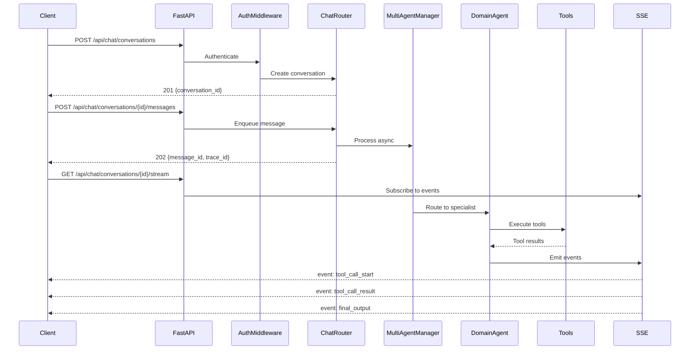

# Starboard AI Agent - API Reference

> Last verified: 2026-03-24

**Base URL**: `http://localhost:8000`

---

## Table of Contents

1. [Overview](#overview)
2. [Authentication](#authentication)
3. [Health Endpoints](#health-endpoints) (2 endpoints)
4. [Chat - Conversation Management](#chat---conversation-management) (7 endpoints)
5. [Chat - Message Handling](#chat---message-handling) (4 endpoints)
6. [Chat - Streaming](#chat---streaming) (1 endpoint)
7. [Chat - Configuration](#chat---configuration) (3 endpoints)
8. [Feedback](#feedback) (2 endpoints)
9. [Clarification](#clarification) (1 endpoint)
10. [Data](#data) (1 endpoint)
11. [Visualization](#visualization) (1 endpoint)
12. [MCP](#mcp)
13. [Request Flow](#request-flow)
14. [Error Handling](#error-handling)

---

## Overview

The Starboard AI Agent exposes a RESTful API with Server-Sent Events (SSE) for real-time streaming. Endpoints are organized under these prefixes:

| Prefix | Purpose | Router |
|--------|---------|--------|
| `/health` | Liveness and readiness probes | Inline in `main.py` |
| `/api/chat` | Conversations, messages, streaming, config | `chat_router`, `streaming_router` |
| `/api` | Feedback submission, clarification responses | `feedback_router`, `clarification_router` |
| `/api/data` | Cached query result retrieval | `data_router` |
| `/api/visualization` | Chart rendering | `visualization_router` |
| `/mcp` | Model Context Protocol (Streamable HTTP) | Conditional mount |

### Base Configuration

```
Protocol:     HTTP/HTTPS
Base URL:     http://localhost:8000
Content-Type: application/json
Streaming:    Server-Sent Events (SSE) at /api/chat/conversations/{id}/stream
API Docs:     http://localhost:8000/docs (disabled in production)
```

---

## Authentication

Authentication is handled by the `AuthMiddleware` using Databricks platform auth. The middleware sets `request.state.user` with `id`, `username`, and `display_name` fields.

**Excluded paths** (no auth required):

- `/health/live`
- `/health/ready`
- `/docs`, `/redoc`, `/openapi.json`

All other endpoints require a valid Databricks authentication token passed via the platform's forwarded headers.

---

## Health Endpoints

These endpoints are defined directly in `starboard_server.main` (not behind any API prefix).

### GET /health/live

Liveness probe. Returns `200` if the server process is running.

**Response** (`200 OK`):
```json
{"status": "ok"}
```

### GET /health/ready

Readiness probe. Checks database and cache connectivity.

**Response** (`200 OK`):
```json
{
  "status": "ok",
  "checks": [
    {"name": "database", "status": "ok", "latency_ms": 2.1},
    {"name": "redis", "status": "ok", "latency_ms": 0.8}
  ]
}
```

**Response** (`503 Service Unavailable`):
```json
{"status": "not_ready", "error": "Container not initialized..."}
```

---

## Chat - Conversation Management

**Prefix**: `/api/chat/conversations`

### POST /api/chat/conversations

Create a new conversation session.

**Rate Limit**: 10 requests/minute per user

**Request Body**:
```json
{
  "context": {"workspace_id": "ws_abc"},
  "config": {"temperature": 0.4, "max_tokens": 2048},
  "initial_message": "Analyze job 12345",
  "metadata": {"source": "web"}
}
```

All fields are optional. If `initial_message` is provided, it is automatically enqueued for processing.

**Response** (`201 Created`):
```json
{
  "conversation_id": "conv_abc123",
  "user_id": "user_123",
  "created_at": "2026-03-24T12:34:56Z",
  "config": {
    "temperature": 0.4,
    "max_tokens": 2048,
    "safe_mode": false,
    "streaming": true,
    "model": "databricks-claude-sonnet-4-5"
  }
}
```

### GET /api/chat/conversations

List conversations for the authenticated user, ordered by most recent first.

**Query Parameters**:

| Parameter | Type | Default | Description |
|-----------|------|---------|-------------|
| `limit` | int | 20 | Max results (1-100) |
| `offset` | int | 0 | Pagination offset |

**Response** (`200 OK`): `list[ConversationResponse]`

### GET /api/chat/conversations/{conversation_id}

Get conversation metadata.

**Response** (`200 OK`): Conversation dict with `conversation_id`, `user_id`, `exists` status.

### HEAD /api/chat/conversations/{conversation_id}

Lightweight existence check. No response body.

**Response**: `204 No Content` if exists, `404 Not Found` if not.

### GET /api/chat/conversations/{conversation_id}/history

Get complete conversation history with all messages and metadata.

**Response** (`200 OK`):
```json
{
  "conversation_id": "conv_abc123",
  "messages": [
    {
      "message_id": "msg_1",
      "role": "user",
      "content": "Analyze job 12345",
      "timestamp": "2026-03-24T12:34:56Z",
      "status": "completed",
      "tool_calls": []
    },
    {
      "message_id": "msg_2",
      "role": "assistant",
      "content": "Here is the analysis...",
      "timestamp": "2026-03-24T12:35:10Z",
      "status": "completed",
      "tool_calls": [],
      "metadata": {
        "tokens": 1523,
        "cost": 0.023,
        "latency_ms": 14200
      }
    }
  ],
  "metadata": {
    "total_messages": 2,
    "total_tokens": 1523,
    "total_cost": 0.023,
    "created_at": "2026-03-24T12:34:55Z",
    "updated_at": "2026-03-24T12:35:10Z"
  }
}
```

### GET /api/chat/conversations/{conversation_id}/export

Export a conversation in markdown or JSON format.

**Query Parameters**:

| Parameter | Type | Default | Description |
|-----------|------|---------|-------------|
| `format` | string | `markdown` | `markdown` or `json` |

**Response**: `text/markdown` or `application/json` with `Content-Disposition` header for download.

### DELETE /api/chat/conversations/{conversation_id}

Delete a conversation and all its messages.

**Response**: `204 No Content`

### DELETE /api/chat/conversations

Delete all conversations for the authenticated user (batch operation).

**Response**: `204 No Content`

---

## Chat - Message Handling

**Prefix**: `/api/chat/conversations/{conversation_id}`

### POST /api/chat/conversations/{conversation_id}/messages

Send a user message and trigger async AI processing.

**Rate Limit**: 30 requests/minute per user

**Request Body**:
```json
{
  "content": "What is the status of job 12345?",
  "attachments": [],
  "metadata": {"source": "ui", "session_id": "sess_xyz"}
}
```

**Response** (`202 Accepted`):
```json
{
  "message_id": "msg_xyz789",
  "conversation_id": "conv_abc123",
  "trace_id": "trace_def456",
  "status": "queued",
  "timestamp": "2026-03-24T12:35:00Z"
}
```

Then subscribe to SSE for real-time updates:
```bash
curl -N http://localhost:8000/api/chat/conversations/conv_abc123/stream
```

### POST /api/chat/conversations/{conversation_id}/inject-input

Inject user input during active agent reasoning. Processed at the next checkpoint.

**Request Body**:
```json
{
  "input_type": "context_injection",
  "content": "Focus on partition pruning optimizations",
  "checkpoint_id": "ckpt_def456"
}
```

`input_type` options: `context_injection`, `replan_request`, `cancel_request`, `tool_override`

**Response** (`200 OK`):
```json
{
  "input_id": "input_abc123",
  "status": "accepted",
  "checkpoint_id": "ckpt_def456",
  "message": "Input will be processed at next checkpoint"
}
```

### POST /api/chat/conversations/{conversation_id}/respond-to-solicitation

Respond to an agent's explicit question (solicitation).

**Request Body**:
```json
{
  "solicitation_id": "sol_abc123",
  "content": "Service principal: sp-prod-databricks"
}
```

**Response** (`200 OK`):
```json
{
  "response_id": "resp_xyz789",
  "status": "accepted",
  "solicitation_id": "sol_abc123",
  "response_time_ms": 12345.6
}
```

### GET /api/chat/conversations/{conversation_id}/checkpoints

Get recent reasoning checkpoints for a conversation.

**Query Parameters**:

| Parameter | Type | Default | Description |
|-----------|------|---------|-------------|
| `limit` | int | 10 | Max checkpoints (1-50) |

**Response** (`200 OK`):
```json
{
  "checkpoints": [
    {
      "checkpoint_id": "ckpt_005",
      "step_number": 5,
      "checkpoint_type": "reasoning_step",
      "timestamp": "2026-03-24T10:35:22Z",
      "can_interrupt": true
    }
  ],
  "active_checkpoint": "ckpt_005"
}
```

---

## Chat - Streaming

**Prefix**: `/api/chat`

### GET /api/chat/conversations/{conversation_id}/stream

Establish an SSE connection to receive real-time events for a conversation.

**Response**: `text/event-stream`

**Headers**:
```
Cache-Control: no-cache
X-Accel-Buffering: no
Connection: keep-alive
```

**SSE Event Format**:
```
retry: 3000

event: message_delta
data: {"event_id": "...", "type": "message_delta", "data": {...}, "timestamp": "..."}

: heartbeat
```

Heartbeats are sent every 15 seconds. The client retry interval is set to 3000ms.

**Event Types**:

| Event | Description | When Emitted |
|-------|-------------|--------------|
| `thinking` | Agent reasoning content | During LLM generation |
| `checkpoint` | Reasoning checkpoint | After each reasoning step |
| `interrupt_received` | User interrupt detected | When interrupt is processed |
| `replan` | Replan strategy decision | After interrupt analysis |
| `solicitation` | Agent asks user a question | When clarification needed |
| `tool_call_start` | Tool execution begins | Before tool call |
| `tool_call_result` | Tool execution completes | After tool call |
| `routing.decision` | Domain routing decision | After intent classification |
| `agent.transition` | Agent handoff | On domain change |
| `message_delta` | Incremental message content | During response streaming |
| `final_output` | Complete result | End of reasoning |
| `error` | Error occurred | On failure |

**JavaScript Example**:
```javascript
const eventSource = new EventSource(
  '/api/chat/conversations/conv_123/stream'
);

eventSource.addEventListener('message_delta', (event) => {
  const data = JSON.parse(event.data);
  appendToUI(data);
});

eventSource.addEventListener('final_output', (event) => {
  const data = JSON.parse(event.data);
  showFinalReport(data);
  eventSource.close();
});
```

---

## Chat - Configuration

**Prefix**: `/api/chat`

### GET /api/chat/config

Get server configuration including model defaults and domain overrides.

**Response** (`200 OK`):
```json
{
  "default_model": "databricks-claude-sonnet-4-5",
  "default_temperature": 0.4,
  "default_max_tokens": 120000,
  "domain_model_overrides": {},
  "domain_temperature_overrides": {}
}
```

### GET /api/chat/health

Chat API health check (separate from system health probes).

**Response** (`200 OK`):
```json
{
  "status": "healthy",
  "service": "chat_api",
  "version": "2.0"
}
```

### GET /api/chat/me

Get information about the currently authenticated user.

**Response** (`200 OK`):
```json
{
  "user_id": "b822cc87-fae3-4192-abd4-89ce0ea19c87",
  "username": "user@databricks.com",
  "display_name": "User Name"
}
```

---

## Feedback

**Prefix**: `/api`

### POST /api/conversations/{conversation_id}/feedback

Submit user feedback on an agent response.

**Request Body**:
```json
{
  "message_id": "msg_456",
  "rating": "negative",
  "categories": ["inaccurate", "too_vague"],
  "comment": "The response was not specific enough"
}
```

`rating`: `positive` or `negative`

**Response** (`201 Created`):
```json
{
  "feedback_id": "fb_xyz789",
  "conversation_id": "conv_123",
  "message_id": "msg_456",
  "rating": "negative",
  "categories": ["inaccurate", "too_vague"],
  "comment": "The response was not specific enough",
  "timestamp": "2026-03-24T12:00:00Z"
}
```

### GET /api/feedback/agents/{agent_name}/performance

Get agent performance metrics based on user feedback.

**Query Parameters**:

| Parameter | Type | Default | Description |
|-----------|------|---------|-------------|
| `days` | int | 7 | Period in days (1-365) |

**Response** (`200 OK`):
```json
{
  "agent_name": "query_agent",
  "period_days": 30,
  "total_feedback": 150,
  "positive_count": 125,
  "negative_count": 25,
  "satisfaction_rate": 0.833,
  "negative_categories": {
    "inaccurate": 8,
    "too_vague": 12,
    "missing_info": 5
  },
  "generated_at": "2026-03-24T12:00:00Z"
}
```

---

## Clarification

**Prefix**: `/api`

### POST /api/conversations/{conversation_id}/clarifications/{clarification_id}/respond

Respond to a framework-generated clarification request.

**Request Body**:
```json
{
  "clarification_id": "clar_abc",
  "response_type": "option_selected",
  "selected_option_id": "2"
}
```

`response_type`: `option_selected` or `custom_text`

**Response** (`200 OK`):
```json
{
  "response_id": "resp_xyz",
  "clarification_id": "clar_abc",
  "status": "accepted",
  "enriched_query": "help with query optimization",
  "message": "Clarification accepted, continuing with execution",
  "created_at": "2026-03-24T12:00:00Z"
}
```

---

## Data

**Prefix**: `/api/data`

### GET /api/data/{data_reference}

Retrieve cached query results by data reference. Data is cached with a TTL (default 60 minutes).

**Response** (`200 OK`):
```json
{
  "version": 1,
  "orientation": "records",
  "schema": {"fields": [...]},
  "data": [{"col1": "val1", "col2": 42}],
  "row_count": 100
}
```

**Response** (`404 Not Found`): Data reference expired or not found.

---

## Visualization

**Prefix**: `/api/visualization`

### POST /api/visualization/render

Render a chart from a ChartConfig and cached data reference.

**Request Body**:
```json
{
  "chart_config": {
    "chart_type": "bar",
    "title": "Top Jobs by Cost",
    "encodings": {"x": "job_name", "y": "total_cost"}
  },
  "data_reference": "data_ref_abc123",
  "format": "png"
}
```

`format`: `png` or `svg`

**Response** (`200 OK`): Binary image (`image/png`) or SVG (`image/svg+xml`).

---

## MCP

**Path**: `/mcp`

The Model Context Protocol endpoint is conditionally mounted when MCP configuration is present. It provides Streamable HTTP transport for MCP clients.

!!! note
    MCP is only available when `MCP_CONFIG` environment variables are set. The server logs `mcp_server_mounted` on successful initialization.

---

## Request Flow



*Figure 1: Request lifecycle from message submission through SSE streaming.*

---

## Error Handling

### HTTP Status Codes

| Code | Meaning | When |
|------|---------|------|
| 200 | OK | Successful request |
| 201 | Created | Resource created (conversation, feedback) |
| 202 | Accepted | Async message processing started |
| 204 | No Content | Successful deletion |
| 400 | Bad Request | Invalid request or conversation not processing |
| 404 | Not Found | Resource not found |
| 413 | Payload Too Large | Request exceeds `max_request_size` |
| 422 | Unprocessable Entity | Pydantic validation error |
| 429 | Too Many Requests | Rate limit exceeded |
| 500 | Internal Server Error | Unhandled server error |
| 503 | Service Unavailable | Dependencies not ready |

### Error Response Format

All error responses use FastAPI's standard `detail` field:

```json
{"detail": "Conversation conv_abc123 not found"}
```

!!! note
    In production (`ENVIRONMENT=production`), the `ErrorSanitizationMiddleware` strips internal details from 500 responses to prevent information leakage.

### Retry Strategy

**Retryable** (5xx, 429):

- Exponential backoff: 1s, 2s, 4s
- Max retries: 3
- Jitter: +/-25%

**Non-retryable** (4xx except 429):

- Fix the request and retry manually
- 422 errors include validation details

---

## Related Documentation

- [Tool Catalog](../tools/TOOL_CATALOG.md) -- Complete tool reference
- [System Architecture](../architecture/SYSTEM_ARCHITECTURE.md) -- System design
- [Interruptible Reasoning](../INTERRUPTIBLE_REASONING.md) -- SSE streaming and interrupts
- [Quickstart](../QUICKSTART.md) -- Getting started

---

**Last Updated**: 2026-03-24
**Version**: 2.0
