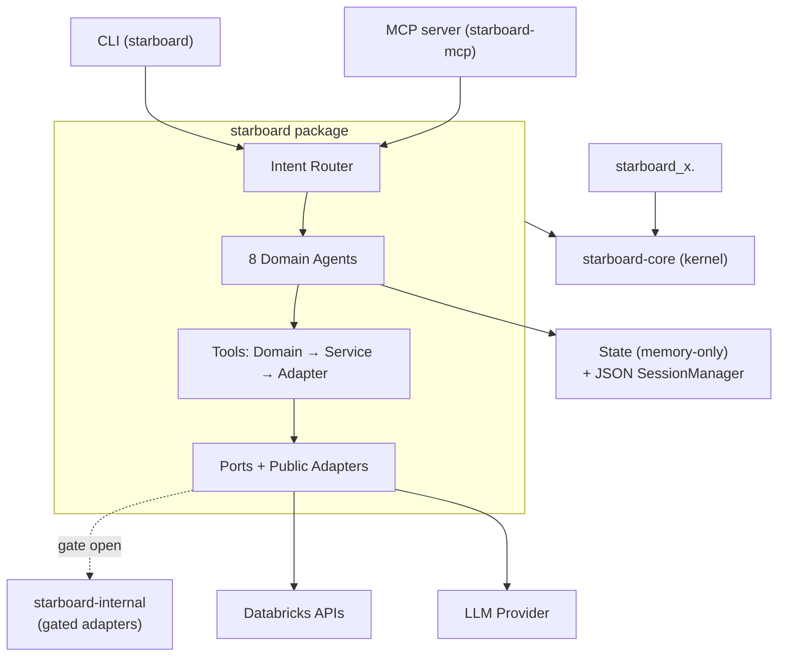
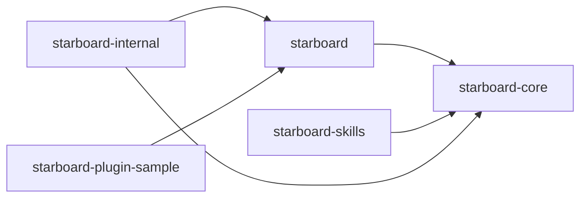

# Architecture

Starboard is AI-powered Databricks workload analysis delivered over three surfaces — **CLI** (`starboard`), **MCP server** (`starboard-mcp`), and **Skills** (Claude Code plugin) — all sharing one kernel.

All analysis uses public `system.*` data. Any dollar figures are **list-price DBU estimates**.

---

## System overview



---

## Packages

Five packages in a **uv workspace**. Run `uv sync --all-packages --all-extras` for a full dev install.

| Package | Import name(s) | Role | Distribution |
|---------|---------------|------|-------------|
| **starboard-core** | `starboard_core`, `starboard_x` | Pure kernel: DTOs, ports, analyzers, RuleRegistry, Spark log parser + `starboard_x` progressive CLIs | PyPI (public) |
| **starboard** | `starboard` | Full-experience wheel: adapters + tools + CLI + optional MCP server | PyPI (public) |
| **starboard-skills** | `starboard_skills` | Canonical skills tree + `starboard-helper` | PyPI (public) |
| **starboard-internal** | `starboard_internal` | Gated internal port adapters | Internal index only |
| **starboard-plugin-sample** | `starboard_plugin_sample` | Reference `starboard.mcp_tools` plugin scaffold | Reference only |



Dependency flows one way only: `internal → public`. The reverse is forbidden and enforced.

### Kernel purity — 4 import-linter contracts

Run by `make test-architecture` (`lint-imports`). All four are **kept** — do not break them.

| # | Contract |
|---|---------|
| 1 | `starboard_core` imports no `databricks-sdk` / `openai` / `fastapi` / `mcp` |
| 2 | `starboard_x` diagnostics-core trio is stdlib-only (no SDK / heavy deps) |
| 3 | `starboard_x` pure analyzers (`warehouse` / `uc` / `review`) are SDK-free |
| 4 | Public packages import no `starboard_internal` |

### `starboard-core`: kernel vs. `starboard_x`

`starboard-core` ships two namespaces from one wheel:

- **`starboard_core`** — pure domain models/DTOs, ports (protocols), RuleRegistry + `Finding` scorer, Spark log parser, reference-file RAG knowledge. Zero SDK/LLM/FastAPI/MCP imports.
- **`starboard_x`** — self-contained progressive CLIs (`python -m starboard_x.<cap>`) with a stable JSON envelope and exit-code contract (`starboard_x.contract`). Shipped caps: `diagnostic`, `discovery`, `review`, `sparklog`, `uc`, `warehouse`.

### Public API facade

`starboard/__init__.py` re-exports a curated public API lazily (PEP 562). First-party CLI code composes through this facade — never through `starboard.infra` / `starboard.adapters` / `starboard.tools` internals. The boundary is enforced by `tests/architecture/test_package_boundaries.py`.

`import starboard` pulls nothing heavy into `sys.modules` until a symbol is first accessed.

---

## Ports + internal-data gate

Kernel ports (`starboard_core.ports`) are protocol abstractions for `state_store`, `memory_store`, `cache_store`, `log_retrieval`, `diagnostic_backend`, `fleet_sql`, and `nl_query`. Public packages ship the ports, public adapters, and the `starboard.port_adapters` entry-point **contract**.

**The gate is closed by default**: `internal_context_host_allowlist = []`. `starboard-internal` registers gated internal adapters under `[project.entry-points."starboard.port_adapters"]`. `starboard.ports.discovery` loads them and lets an internal-tier provider supersede the public adapter **only when the gate is open**. Removing `starboard-internal` entirely leaves a fully functional public path.

**Tool plugins** (a separate seam) register per-domain thin wheels under `[project.entry-points."starboard.mcp_tools"]`. `starboard-plugin-sample` is the reference scaffold. Plugins are not MCP servers; an absent plugin degrades cleanly — every built-in tool keeps working.

---

## Tool system

Three layers, each with a clear responsibility boundary:

```
Domain (pure logic, no I/O)  →  Service (orchestration + I/O)  →  Adapter (agent-facing interface)
```

| Layer | Location | Testability |
|-------|---------|------------|
| **Domain** | `tools/domain/` | Pure functions, no mocking needed |
| **Service** | `tools/services/` | Mock protocols only |
| **Adapter** | `tools/adapters/` | Integration tests |

Each tool runs in a **dedicated thread with its own event loop**, isolating synchronous SDK calls from the main asyncio event loop and keeping the event stream responsive. Thread pool size is configurable via `TOOL_PARALLELISM` (default: 4).

The 8 domain agents, the Intent Router, and which tools each agent gets are described in [Agents](overview/agents.md).

---

## State, RAG, cache, auth

| Concern | Implementation |
|---------|---------------|
| **Conversation state** | Memory-only (`database_backend = "memory"`): in-process dict, ephemeral per process |
| **Session persistence** | JSON-file `SessionManager` (`starboard.cli.sessions`) — durable across CLI invocations |
| **RAG** | Reference-file only: curated `.md` files under `starboard_core/rag/knowledge/domains/` + query packs. No vector DB, no embeddings pipeline. |
| **Cache** | In-memory by default (TTL 300 s). Redis opt-in: `pip install 'starboard[redis]'` + set `REDIS_URL` |
| **Auth** | Delegates to the Databricks SDK credential chain (`--profile` / ambient env; PAT optional). Apps OBO via the `credentials_strategy` seam. No custom credential management. |

Config: `packages/starboard/starboard/infra/core/config.py`; env template: `examples/env.example`.

---

## Token budgeting

Every agent turn tracks cumulative input + output tokens against **per-domain soft and hard limits**.

- **Soft limit** triggers progressive truncation: oldest tool results dropped first, then conversation history trimmed, then system prompt sections compressed.
- **Hard limit** terminates the reasoning loop immediately; the agent emits `token_budget_exceeded` in the event stream.

Every LLM call logs `prompt_tokens`, `completion_tokens`, `cost_usd`, and `budget_remaining`.

Key files:
- `packages/starboard/starboard/agents/config/agent_config.py` — `DEFAULT_TOKEN_BUDGETS` per-domain config
- `packages/starboard/starboard/tools/domain/diagnostic/tool_governance.py` — enforcement logic

---

## Output contracts

Agent output is delivered through an **in-process event stream** to the CLI/SDK (not an HTTP SSE endpoint):

```
DomainAgent.run()  →  AgentOutput  →  FinalOutputEvent (JSON)  →  CLI / SDK
```

### `FinalOutputEvent` envelope

| Field | Required | Notes |
|-------|----------|-------|
| `status` | Yes | `success` / `error` / `budget_exceeded` / `max_steps_reached` |
| `complete_report` | No | Typed by `report_type`: `advisor` / `analytics` / `warehouse` |
| `next_steps` | No | Actions: `continue` / `route` / `tool_call` |
| `tokens_used`, `cost_usd`, `duration_seconds`, `steps_taken` | Yes | Always ≥ 0; `cost_usd` is a list-price DBU estimate |
| `formatted_markdown` | No | Pre-rendered markdown of the report |

### `starboard_x` contract

Progressive CLIs emit a stable JSON envelope (`starboard_x.contract`) with a consistent `status` + `data` shape and UNIX exit codes. This allows scripted pipelines without pulling in the full `starboard` wheel.

### Workload Review `Finding`

`starboard review` / `python -m starboard_x.review` emits `WorkloadReview` of `ReviewFinding`s from `starboard_core.domain.models.finding`:

| Field | Type | Notes |
|-------|------|-------|
| `severity` | `critical` / `high` / `medium` / `low` | Weights: 4 / 3 / 2 / 1 |
| `impact` | int 1–5 | Score multiplier |
| `effort` | `XS` / `S` / `M` / `L` / `XL` | Score divisor: 1–5 |
| `score` | float (computed) | `(severity_weight × impact) / effort_points` |
| `bucket` | computed | ≥20 Fix Immediately / ≥10 This Sprint / ≥4 Backlog / else Nice-to-Have |
| `source` | str or null | Public reference only — never an internal link |

Findings are ranked deterministically (score desc, severity desc, id asc) and de-duplicated by concrete `location`.

Contract tests: `tests/contract/test_agent_output_contract.py` (`make test-contract`).

---

## See also

- [Agents](overview/agents.md) — Intent Router, 8 domain agents, handoff protocol
- [CLI reference](guide/cli.md)
- [Skills](guide/skills.md)
- [Contributing](contributing.md)
