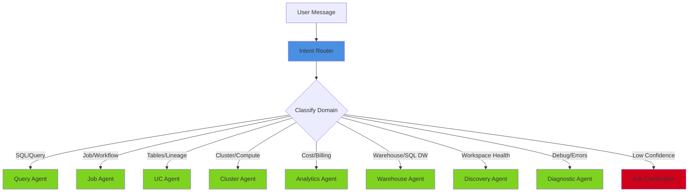
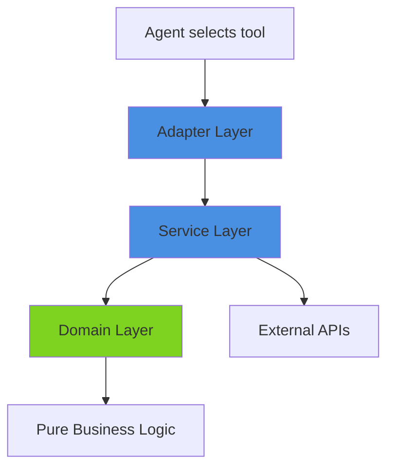

# System Architecture

> **Docs** > **Architecture** > **System Architecture**
> Reading time: 20 minutes

**What you'll learn:**

- High-level system topology and component relationships
- Multi-agent conversation system design
- Tool system three-layer architecture
- State management and storage backends
- Streaming architecture (SSE)
- Design principles and patterns

---

## System Overview

Starboard AI Agent is a multi-agent AI system for Databricks workload optimization. It uses LLM-driven reasoning, dynamic tool selection, and real-time SSE streaming to provide intelligent analysis and recommendations.

### High-Level Architecture

```
+---------------------------------------------------------+
|                    User Interfaces                       |
|       CLI (starboard)      |    MCP (starboard-mcp)     |
+----------+-----------------+----------+-----------------+
           |                            |
           v                            v
+---------------------------------------------------------+
|                  starboard package                       |
|  +-------------+  +------------------------------+      |
|  |Intent Router |->| Multi-Agent Conversation Mgr |      |
|  +-------------+  +------------------------------+      |
|                           |                             |
|  +------------------------+-------------------------+   |
|  | Query | Job | UC | Cluster | Analytics | Warehouse|   |
|  | Discovery | Diagnostic    (8 Domain Agents)       |   |
|  +------------------------+-------------------------+   |
|                           |                             |
|  +------------------------+-------------------------+   |
|  |              45+ Tools (3-Layer)                  |   |
|  |   Domain (Logic) -> Service (I/O) -> Adapter      |   |
|  +------------------------+-------------------------+   |
+--------------------------+----------------------------+
                           |
             +-------------+-------------+
             v             v             v
       Databricks      LLM Provider    State Store
       APIs            (Multi-provider) (SQLite/PG/Lakebase)
```

*High-level system topology showing CLI and MCP interfaces, multi-agent system, tool layers, and external services.*

### Key Components

1. **User Layer**: CLI (`starboard`), MCP server (`starboard-mcp`)
2. **Multi-Agent System**: Intent Router + 8 domain agents with conversation management
3. **Tool System**: 45+ tools in three-layer architecture (Domain, Service, Adapter)
4. **State Management**: Conversation persistence with 5 storage backends
5. **External Services**: Databricks API, multi-provider LLM (OpenAI, Azure, Databricks Model Serving), log storage

---

## Architecture Principles

### 1. Multi-Agent Design

Specialized agents for different domains rather than a single general-purpose agent.

- **Domain expertise**: Each agent has specialized prompts and tools
- **Better performance**: Smaller, focused context windows
- **Easier maintenance**: Isolate changes to specific domains
- **Flexible composition**: Combine agents for complex cross-domain tasks

### 2. Continuous Reasoning

Agents reason step-by-step, evaluating data before deciding next actions. Unlike predefined workflow graphs, agents dynamically adapt their plans based on intermediate results, recover from tool failures, and change course when they discover unexpected data.

### 3. Hexagonal Architecture

Pure domain logic at the core, I/O at boundaries:

```
domain/      -> Pure logic, no I/O, 100% testable
services/    -> Orchestration, business workflows
adapters/    -> I/O boundaries (APIs, databases, files)
app/         -> Entry points (FastAPI, CLI)
```

### 4. Protocol-Oriented Programming

Interfaces defined via protocols (PEP 544), not inheritance. This enables flexible implementations, easy testing with fakes, and clean contracts between components.

### 5. Immutability

Data structures are immutable by default using `@dataclass(frozen=True)` and tuples. This ensures thread safety, cacheability, and predictable behavior.

### 6. Streaming First

Results stream to users in real-time via SSE. The event-based architecture enables interruptible reasoning -- users can provide additional context or redirect the agent mid-analysis.

---

## Multi-Agent System

### Intent Router

The Intent Router classifies user requests and dispatches them to the appropriate domain agent:



*Intent Router dispatching user requests to 8 domain agents, with clarification fallback for low-confidence classifications.*

**Classification strategy**: Hybrid approach combining keyword pattern matching with LLM classification. If confidence is below threshold, the router asks the user for clarification. Multi-domain requests start with the primary domain and allow agent handoffs.

### Domain Agents (8)

| Agent | Domain | Purpose | Tools |
|-------|--------|---------|-------|
| **Query** | `query` | SQL optimization, execution plan analysis | 8 |
| **Job** | `job` | Job performance, Spark tuning, code quality | 14 |
| **UC** | `uc` | Unity Catalog governance, lineage, schema drift | 18 |
| **Cluster** | `cluster` | Cluster configuration, health, utilization | 8 |
| **Analytics** | `analytics` | FinOps cost analysis via agentic RAG | 6 |
| **Warehouse** | `warehouse` | SQL warehouse portfolio optimization, SLO | 11 |
| **Discovery** | `discovery` | Workspace-wide health assessment (4-phase) | 6 |
| **Diagnostic** | `diagnostic` | Cross-domain troubleshooting | ALL |

**Source**: `packages/starboard/starboard/agents/tool_categories.py`

### Conversation Manager

The `MultiAgentConversationManager` orchestrates agent lifecycle:

1. Create agent with domain-specific config (prompt, tools, model)
2. Load shared context from state store
3. Process user message through reasoning loop
4. Stream events to API via SSE
5. Persist conversation state
6. Optionally hand off to another agent

### Agent Handoff Protocol

Agents can transfer control to specialists when they discover issues outside their domain:

1. Agent A detects need for Agent B's expertise
2. Agent A passes handoff context (resource IDs, partial findings)
3. Conversation Manager persists shared context
4. Agent A completes with partial results
5. Agent B loads context and continues analysis seamlessly

**Shared context structure**:

```python
{
    "conversation_id": "conv_123",
    "current_domain": "query",
    "previous_domains": ["job"],
    "working_memory": {
        "job_id": 123,
        "statement_ids": ["abc", "def"],
        "identified_issues": [...]
    },
    "agent_transitions": [
        {"from": "job", "to": "query", "reason": "Slow SQL in task 3"}
    ]
}
```

---

## Tool System Architecture

### Three-Layer Design



*Three-layer tool architecture: Adapter (agent-facing interface), Service (orchestration and I/O), Domain (pure logic).*

| Layer | Responsibility | I/O | Testability |
|-------|---------------|-----|-------------|
| **Domain** | Pure business logic, data transformations | None | 100% unit testable |
| **Service** | Orchestrate adapters, compose operations, error handling | Yes | Mock adapters |
| **Adapter** | Agent-facing interface, parameter validation, result formatting | Yes | Integration tests |

### Tool Categories (45+ Tools)

| Category | Count | Key Tools |
|----------|-------|-----------|
| **Query** | 3 | `resolve_query`, `analyze_query_plan`, `get_query_runtime_metrics` |
| **Job** | 7 | `resolve_job`, `get_job_config`, `analyze_job_history`, `get_run_output`, `get_task_logs`, `get_source_code`, `analyze_code_quality` |
| **UC** | 16 | `list_uc_assets`, `get_table_metadata`, `get_table_lineage`, `get_table_grants`, `analyze_table_schema`, `get_table_history`, `analyze_access_patterns`, `analyze_schema_drift`, `analyze_storage_optimization`, `analyze_query_impact`, `get_table_fingerprint`, `analyze_table_costs`, `generate_schema_diff`, `analyze_policy_coverage`, `get_enriched_table_metadata`, `discover_tables` |
| **Cluster** | 6 | `list_clusters`, `get_cluster_config`, `get_cluster_health`, `get_cluster_metrics`, `get_cluster_events`, `get_spark_logs` |
| **Warehouse** | 8 | `get_warehouse_portfolio`, `get_warehouse_fingerprint`, `get_warehouse_health`, `configure_warehouse_slo`, `analyze_warehouse_topology`, `get_warehouse_user_activity`, `generate_warehouse_chargeback`, `generate_portfolio_chargeback` |
| **Analytics** | 4 | `build_analytics_context`, `build_sql_query`, `validate_sql_query`, `execute_sql_query` |
| **Discovery** | 4 | `discover_active_products`, `run_discovery_queries`, `analyze_discovery_domain`, `synthesize_discovery_report` |
| **Intent** | 1 | `resolve_user_intent` |
| **Core** | 2 | `request_user_input`, `complete` (available to all agents) |

### Tool Sharing Strategy (80/20 Rule)

- **80% of operations**: Agents complete independently using strategic tool overlap
- **20% of complex operations**: Delegate to domain specialist via handoff

Examples:
- Query Agent has `get_table_metadata` and `discover_tables` (needs schemas for EXPLAIN analysis)
- Query Agent does NOT have `get_table_lineage` (delegates to UC Agent)
- Diagnostic Agent has ALL tools (unrestricted access for cross-domain investigation)

### Tool Execution Pipeline

1. **Tool Selection**: Agent decides which tool to use via LLM reasoning
2. **Parameter Validation**: Pydantic schema validation of parameters
3. **Cache Check**: Look for cached result (5min TTL for tool results, 1hr for metadata)
4. **Execution**: Call through Domain --> Service --> Adapter layers
5. **Result Processing**: Transform to structured domain model
6. **Caching**: Store result for future requests
7. **Event Emission**: Stream `ToolEndEvent` to client via SSE

**Error handling**: `ValidationError` returns error to agent; `ToolExecutionError` retries with exponential backoff; `TimeoutError` cancels and reports timeout.

---

## State Management

### Storage Backends (5)

| Backend | Use Case | Features |
|---------|----------|----------|
| **SQLite** | Development, testing | Embedded, aiosqlite, sqlite-vec for vectors |
| **PostgreSQL** | Production | SQLAlchemy async, pgvector, connection pooling |
| **Databricks Lakebase** | Cloud deployment | Postgres-compatible, OAuth refresh, serverless |
| **Redis** | Caching | Session storage (5min TTL), rate limiting, distributed locks |
| **InMemory** | Testing | Dictionary-based, no persistence, fast |

### Data Models

| Model | Purpose |
|-------|---------|
| **Conversation** | Persistent interaction session with message history |
| **Message** | Single user or assistant message with metadata (tool calls, tokens, cost) |
| **Episode** | Working memory segment summary within a conversation |
| **Fact** | Long-term memory with confidence score and optional vector embedding |
| **UserProfile** | User preferences and history |

### Caching Strategy

- **L1 (In-Memory)**: LRU cache for frequently accessed data, 1000 items max
- **L2 (Redis)**: Session data (5min TTL), tool results (5min TTL), user profiles (1hr TTL)
- **L3 (Database)**: Persistent conversation history, facts, user data

---

## Streaming Architecture (SSE)

Starboard uses **Server-Sent Events (SSE)** for real-time streaming from server to client.

### Event Types

| Event | Purpose |
|-------|---------|
| `ThinkingEvent` | Agent reasoning step |
| `ToolStartEvent` | Tool execution beginning |
| `ToolEndEvent` | Tool execution result |
| `StepCompleteEvent` | Reasoning step completed |
| `UserInputRequestEvent` | Agent requests user input |
| `FinalOutputEvent` | Structured report output |
| `ErrorEvent` | Error with recovery status |

### Why SSE Over WebSockets

- **Simpler**: One-way server-to-client communication is sufficient
- **HTTP-native**: Works through firewalls and proxies without special configuration
- **Auto-reconnect**: Built into browser EventSource API
- **Sufficient**: Agent reasoning only needs server-to-client data push

---

## Design Patterns

### Repository Pattern
Abstract repositories with protocol interfaces decouple domain logic from storage implementation. Swap SQLite for Postgres without changing business logic.

### Factory Pattern
`AgentFactory` encapsulates complex agent creation: filtering tools for domain, loading prompts, applying model overrides, and instantiating `DomainAgent` instances.

### Strategy Pattern
Pluggable storage strategies (`SQLiteStrategy`, `PostgresStrategy`, etc.) implement a common protocol, selected at startup based on configuration.

### Observer Pattern (Event-Driven)
`ConversationManager` emits events (`ThinkingEvent`, `ToolEndEvent`, `FinalOutputEvent`) to subscribed handlers for streaming, logging, and observability.

### Adapter Pattern
`DatabricksAdapter` translates between the Databricks SDK interface and the internal tool interface, isolating external API changes from business logic.

---

## Deployment Architecture

### Development

```
Local Machine
  +-- starboard CLI / starboard-mcp (stdio)
  +-- SQLite (embedded state)
  --> Databricks API (external)
  --> LLM Provider (external)
```

### Production

```
Load Balancer (if HTTP mode)
  --> starboard (Docker, 2-N instances, auto-scaling)
      --> PostgreSQL / Lakebase (multi-AZ, automated backups)
      --> Redis (cluster mode, automatic failover)
      --> Databricks API
      --> LLM Provider
```

---

## Performance and Scalability

**Response times** (p95): Simple queries 2-5s, complex multi-step 10-30s, job analysis with logs 30-60s.

**Horizontal scaling**: Multiple stateless backend instances behind a load balancer, with shared state in Postgres/Redis.

**Rate limiting**: Configurable per-user and per-IP limits with exponential backoff for exceeded limits.

---

## Related Documentation

- [Quick Reference](../QUICK_REFERENCE.md) -- Single-page cheat sheet
- [Agent Documentation](../agents/README.md) -- All 8 domain agents
- [Tool Catalog](../tools/TOOL_CATALOG.md) -- Complete tool reference
- [API Reference](../api/API_REFERENCE.md) -- REST API specification
- [Configuration Guide](../CONFIGURATION.md) -- Environment variables
- [Deployment Guide](../DEPLOYMENT.md) -- Production deployment

---

**Last Updated**: 2026-03-24
**Version**: 2.0
