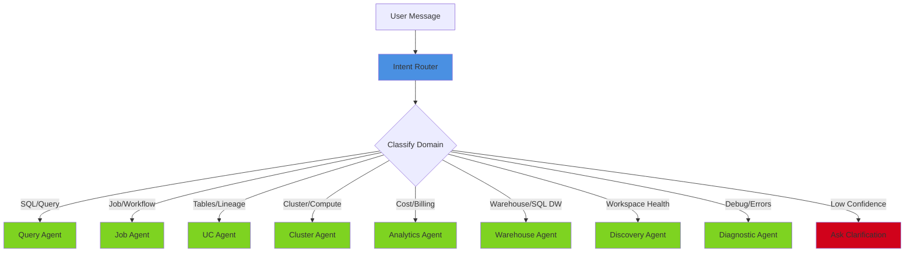
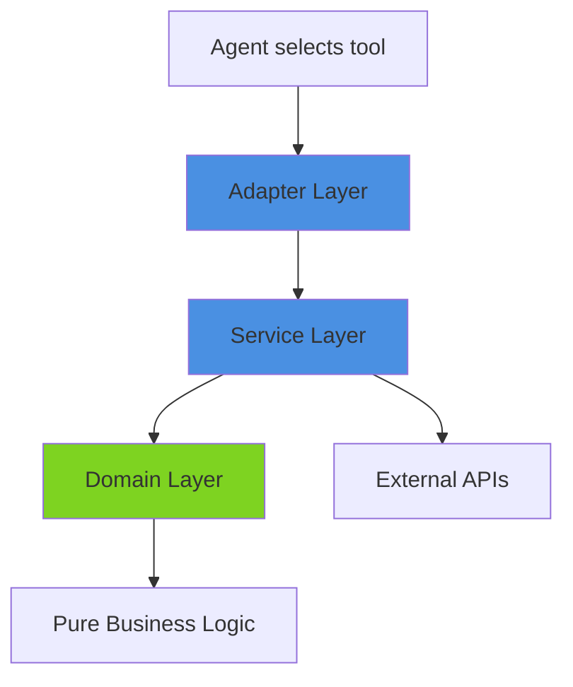

# System Architecture

> **Docs** > **Architecture** > **System Architecture**
> Reading time: 20 minutes

**What you'll learn:**

- High-level system topology and component relationships
- The 5-package layout and the kernel / `starboard_x` split
- Multi-agent conversation system design
- Tool system three-layer architecture + entry-point plugin seam
- The ports + internal-data enablement gate (closed-by-default)
- Workload Review (RuleRegistry + Finding scorer)
- State management and storage backends (memory default; UC-native durable)
- The in-process event/streaming model
- Design principles and patterns

---

## System Overview

Starboard AI Agent is a multi-agent AI system for Databricks workload optimization. It
uses LLM-driven reasoning and dynamic tool selection to provide analysis and
recommendations. It is delivered as a **CLI and an MCP server** (plus progressive
`python -m starboard_x.<cap>` helpers) — **not** a hosted REST application. The agent
runs **in-process** in the CLI; a minimal FastAPI process (`starboard-server`) exists
only for health probes and an optional MCP HTTP mount.

All analysis uses **public `system.*` data**; any dollar figures are **list-price DBU
estimates**, never finance-grade.

### High-Level Architecture

```
+---------------------------------------------------------+
|                    User Interfaces                       |
|  CLI (starboard) | MCP (starboard-mcp) | starboard_x.<cap>|
+----------+-----------------+----------+-----------------+
           |                            |
           v                            v
+---------------------------------------------------------+
|                  starboard package                       |
|  +-------------+  +------------------------------+      |
|  |Intent Router |->| Multi-Agent Conversation Mgr |      |
|  +-------------+  +------------------------------+      |
|                           |                             |
|  +------------------------+-------------------------+   |
|  | Query | Job | UC | Cluster | Analytics | Warehouse|   |
|  | Discovery | Diagnostic    (8 Domain Agents)       |   |
|  +------------------------+-------------------------+   |
|                           |                             |
|  +------------------------+-------------------------+   |
|  |            Tools (3-Layer) + Plugins              |   |
|  |   Domain (Logic) -> Service (I/O) -> Adapter      |   |
|  +------------------------+-------------------------+   |
|                           |                             |
|  +------------------------+-------------------------+   |
|  |  Ports  ->  Public adapters  |  Internal-data gate |   |
|  +------------------------+-------------------------+   |
+--------------------------+----------------------------+
                           |
             +-------------+-------------+
             v             v             v
       Databricks      LLM Provider    State Store
       APIs            (Multi-provider) (memory / UC / extras)
```

*High-level topology: CLI / MCP / `starboard_x` interfaces, the multi-agent system, the
tool layers + plugin seam, the ports + internal-data gate, and external services.*

### Key Components

1. **User Layer**: CLI (`starboard`), MCP server (`starboard-mcp`), progressive CLIs
   (`python -m starboard_x.<cap>`), and a minimal FastAPI process (`starboard-server`).
2. **Multi-Agent System**: Intent Router + 8 domain agents with conversation management.
3. **Tool System**: three-layer tools (Domain, Service, Adapter) plus an entry-point
   plugin seam (`starboard.mcp_tools`).
4. **Ports + internal-data gate**: kernel ports with public adapters; internal adapters
   registered via `starboard.port_adapters` in `starboard-internal` only, closed by default.
5. **Workload Review**: RuleRegistry + `Finding` priority scorer + optional validator
   council + Action-Rate re-scan.
6. **State Management**: conversation persistence; default `memory`, durable option
   UC-native, others behind extras.
7. **External Services**: Databricks API, multi-provider LLM (OpenAI, Azure, Databricks
   Model Serving).

---

## Packages (5)

| Package | Import name(s) | Role |
|---------|----------------|------|
| **starboard-core** | `starboard_core`, `starboard_x` | Pure kernel (DTOs, ports, analyzers, rules, log parser) **+** `starboard_x` progressive CLIs |
| **starboard** | `starboard` | FastAPI server + adapters + tools + CLI + MCP; the public API facade |
| **starboard-skills** | `starboard_skills` | Canonical skills tree + `starboard-helper` |
| **starboard-internal** | `starboard_internal` | Gated internal port adapters (internal-index-only; never in a public wheel) |
| **starboard-plugin-sample** | `starboard_plugin_sample` | Reference per-domain tool-plugin scaffold |

**Kernel purity** is a build property enforced by import-linter (`make test-architecture`,
4 kept contracts): `starboard_core` never imports `databricks-sdk` / `openai` /
`fastapi` / `mcp`, and no public package imports `starboard_internal`. See
[Package Integration](../integration/PACKAGE_INTEGRATION.md) for the full boundary map.

---

## Architecture Principles

### 1. Multi-Agent Design

Specialized agents for different domains rather than a single general-purpose agent.

- **Domain expertise**: Each agent has specialized prompts and tools
- **Better performance**: Smaller, focused context windows
- **Easier maintenance**: Isolate changes to specific domains
- **Flexible composition**: Combine agents for complex cross-domain tasks

### 2. Continuous Reasoning

Agents reason step-by-step, evaluating data before deciding next actions. Unlike predefined workflow graphs, agents dynamically adapt their plans based on intermediate results, recover from tool failures, and change course when they discover unexpected data.

### 3. Hexagonal Architecture

Pure domain logic at the core, I/O at boundaries:

```
domain/      -> Pure logic, no I/O, 100% testable
services/    -> Orchestration, business workflows
adapters/    -> I/O boundaries (APIs, databases, files)
app/         -> Entry points (FastAPI, CLI)
```

### 4. Protocol-Oriented Programming

Interfaces defined via protocols (PEP 544), not inheritance. This enables flexible implementations, easy testing with fakes, and clean contracts between components.

### 5. Immutability

Data structures are immutable by default using `@dataclass(frozen=True)` and tuples. This ensures thread safety, cacheability, and predictable behavior.

### 6. Event-Driven, Interruptible Reasoning

The agent emits a typed event stream (reasoning steps, tool start/end, final output,
user-input requests, errors) as it works. These events are delivered **in-process** to
the CLI/SDK — they are **not** an HTTP SSE endpoint. The event model enables
interruptible reasoning: users can inject additional context or redirect the agent
mid-analysis. See [Interruptible Reasoning](../INTERRUPTIBLE_REASONING.md).

---

## Multi-Agent System

### Intent Router

The Intent Router classifies user requests and dispatches them to the appropriate domain agent:


```mermaid
graph TD
    A[User Message] --> B[Intent Router]
    B --> C{Classify Domain}
    C -->|SQL/Query| D[Query Agent]
    C -->|Job/Workflow| E[Job Agent]
    C -->|Tables/Lineage| F[UC Agent]
    C -->|Cluster/Compute| G[Cluster Agent]
    C -->|Cost/Billing| H[Analytics Agent]
    C -->|Warehouse/SQL DW| I[Warehouse Agent]
    C -->|Workspace Health| J[Discovery Agent]
    C -->|Debug/Errors| K[Diagnostic Agent]
    C -->|Low Confidence| L[Ask Clarification]

    style B fill:#4A90E2
    style D fill:#7ED321
    style E fill:#7ED321
    style F fill:#7ED321
    style G fill:#7ED321
    style H fill:#7ED321
    style I fill:#7ED321
    style J fill:#7ED321
    style K fill:#7ED321
    style L fill:#D0021B
```

*Intent Router dispatching user requests to 8 domain agents, with clarification fallback for low-confidence classifications.*

**Classification strategy**: Hybrid approach combining keyword pattern matching with LLM classification. If confidence is below threshold, the router asks the user for clarification. Multi-domain requests start with the primary domain and allow agent handoffs.

### Domain Agents (8)

| Agent | Domain | Purpose | Tools |
|-------|--------|---------|-------|
| **Query** | `query` | SQL optimization, execution plan analysis | 8 |
| **Job** | `job` | Job performance, Spark tuning, code quality | 14 |
| **UC** | `uc` | Unity Catalog governance, lineage, schema drift | 18 |
| **Cluster** | `cluster` | Cluster configuration, health, utilization | 8 |
| **Analytics** | `analytics` | FinOps cost analysis via agentic RAG | 6 |
| **Warehouse** | `warehouse` | SQL warehouse portfolio optimization, SLO | 11 |
| **Discovery** | `discovery` | Workspace-wide health assessment (4-phase) | 6 |
| **Diagnostic** | `diagnostic` | Cross-domain troubleshooting | ALL |

**Source**: `packages/starboard/starboard/agents/tool_categories.py`

### Conversation Manager

The `MultiAgentConversationManager` orchestrates agent lifecycle:

1. Create agent with domain-specific config (prompt, tools, model)
2. Load shared context from state store
3. Process user message through reasoning loop
4. Stream events to API via SSE
5. Persist conversation state
6. Optionally hand off to another agent

### Agent Handoff Protocol

Agents can transfer control to specialists when they discover issues outside their domain:

1. Agent A detects need for Agent B's expertise
2. Agent A passes handoff context (resource IDs, partial findings)
3. Conversation Manager persists shared context
4. Agent A completes with partial results
5. Agent B loads context and continues analysis seamlessly

**Shared context structure**:

```python
{
    "conversation_id": "conv_123",
    "current_domain": "query",
    "previous_domains": ["job"],
    "working_memory": {
        "job_id": 123,
        "statement_ids": ["abc", "def"],
        "identified_issues": [...]
    },
    "agent_transitions": [
        {"from": "job", "to": "query", "reason": "Slow SQL in task 3"}
    ]
}
```

---

## Tool System Architecture

### Three-Layer Design


```mermaid
graph TD
    A[Agent selects tool] --> B[Adapter Layer]
    B --> C[Service Layer]
    C --> D[Domain Layer]
    D --> E[Pure Business Logic]
    C --> F[External APIs]

    style B fill:#4A90E2
    style C fill:#4A90E2
    style D fill:#7ED321
```

*Three-layer tool architecture: Adapter (agent-facing interface), Service (orchestration and I/O), Domain (pure logic).*

| Layer | Responsibility | I/O | Testability |
|-------|---------------|-----|-------------|
| **Domain** | Pure business logic, data transformations | None | 100% unit testable |
| **Service** | Orchestrate adapters, compose operations, error handling | Yes | Mock adapters |
| **Adapter** | Agent-facing interface, parameter validation, result formatting | Yes | Integration tests |

### Tool Categories (57 Tools)

| Category | Count | Key Tools |
|----------|-------|-----------|
| **Query** | 3 | `resolve_query`, `analyze_query_plan`, `get_query_runtime_metrics` |
| **Job** | 7 | `resolve_job`, `get_job_config`, `analyze_job_history`, `get_run_output`, `get_task_logs`, `get_source_code`, `analyze_code_quality` |
| **UC** | 16 | `list_uc_assets`, `get_table_metadata`, `get_table_lineage`, `get_table_grants`, `analyze_table_schema`, `get_table_history`, `analyze_access_patterns`, `analyze_schema_drift`, `analyze_storage_optimization`, `analyze_query_impact`, `get_table_fingerprint`, `analyze_table_costs`, `generate_schema_diff`, `analyze_policy_coverage`, `get_enriched_table_metadata`, `discover_tables` |
| **Cluster** | 6 | `list_clusters`, `get_cluster_config`, `get_cluster_health`, `get_cluster_metrics`, `get_cluster_events`, `get_spark_logs` |
| **Warehouse** | 8 | `get_warehouse_portfolio`, `get_warehouse_fingerprint`, `get_warehouse_health`, `configure_warehouse_slo`, `analyze_warehouse_topology`, `get_warehouse_user_activity`, `generate_warehouse_chargeback`, `generate_portfolio_chargeback` |
| **Analytics** | 4 | `build_analytics_context`, `build_sql_query`, `validate_sql_query`, `execute_sql_query` |
| **Discovery** | 4 | `discover_active_products`, `run_discovery_queries`, `analyze_discovery_domain`, `synthesize_discovery_report` |
| **Intent** | 1 | `resolve_user_intent` |
| **Core** | 2 | `request_user_input`, `complete` (available to all agents) |

### Tool Sharing Strategy (80/20 Rule)

- **80% of operations**: Agents complete independently using strategic tool overlap
- **20% of complex operations**: Delegate to domain specialist via handoff

Examples:
- Query Agent has `get_table_metadata` and `discover_tables` (needs schemas for EXPLAIN analysis)
- Query Agent does NOT have `get_table_lineage` (delegates to UC Agent)
- Diagnostic Agent has ALL tools (unrestricted access for cross-domain investigation)

### Tool Execution Pipeline

1. **Tool Selection**: Agent decides which tool to use via LLM reasoning
2. **Parameter Validation**: Pydantic schema validation of parameters
3. **Cache Check**: Look for cached result (5min TTL for tool results, 1hr for metadata)
4. **Execution**: Call through Domain --> Service --> Adapter layers
5. **Result Processing**: Transform to structured domain model
6. **Caching**: Store result for future requests
7. **Event Emission**: Stream `ToolEndEvent` to client via SSE

**Error handling**: `ValidationError` returns error to agent; `ToolExecutionError` retries with exponential backoff; `TimeoutError` cancels and reports timeout.

---

## State Management

### Storage Backends

State is configured by `database_backend` (`starboard.infra.core.config`). The default
is **`memory`**; durable options are opt-in.

| Backend | `database_backend` | Notes |
|---------|--------------------|-------|
| **InMemory** | `memory` (**default**) | Dictionary-based, no persistence |
| **SQLite** | `sqlite` | Embedded; extra `starboard[sqlite]` (aiosqlite + sqlite-vec) |
| **PostgreSQL** | `postgres` | Async; extra `starboard[postgres]`; needs `DATABASE_URL` |
| **Databricks Lakebase** | `lakebase` | Postgres-compatible serverless; needs `DATABASE_URL`. `databricks` is a deprecated alias |
| **UC-native** | `uc` | Governed low-write durable server backend; never auto-selected |

Caching is a separate axis (`cache_backend`: `memory` (default), `redis`, `postgres`;
`cache_ttl = 300`).

> **Default install pulls no store/vector drivers.** Store/vector drivers lazy-import and
> raise an actionable `pip install 'starboard[<extra>]'` error if missing.

### Data Models

| Model | Purpose |
|-------|---------|
| **Conversation** | Persistent interaction session with message history |
| **Message** | Single user or assistant message with metadata (tool calls, tokens, cost) |
| **Episode** | Working memory segment summary within a conversation |
| **Fact** | Long-term memory with confidence score and optional vector embedding |
| **UserProfile** | User preferences and history |

### RAG / memory defaults

- **`vector_backend="none"` by default** — analytics context comes from curated on-disk
  **reference files** (`starboard_core/rag/knowledge/domains/*.md`) + query packs, not an
  embedding/vector DB. Managed Databricks Vector Search is opt-in behind
  `starboard[vectorsearch]` (requires explicit `vectorsearch_columns`).
- The **semantic cache is TTL-only (exact-key)** by default; the similarity path is
  selected only when a real `vector_backend` is configured. Reflexion/episodic-vector
  memory is dormant (`enable_reflexion = False`, opt-in behind `[sqlite]`/`[vectorsearch]`).

---

## Event / Streaming Model

The agent emits a typed event stream as it reasons. Delivery is **in-process** to the
CLI and SDK (rendered in the terminal / handed to callers) — Starboard does **not**
expose an HTTP Server-Sent-Events endpoint.

### Event Types

| Event | Purpose |
|-------|---------|
| `ThinkingEvent` | Agent reasoning step |
| `ToolStartEvent` | Tool execution beginning |
| `ToolEndEvent` | Tool execution result |
| `StepCompleteEvent` | Reasoning step completed |
| `UserInputRequestEvent` | Agent requests user input |
| `FinalOutputEvent` | Structured report output |
| `ErrorEvent` | Error with recovery status |

The interrupt/checkpoint model that lets a user inject context mid-run is documented in
[Interruptible Reasoning](../INTERRUPTIBLE_REASONING.md).

---

## Ports + Internal-Data Enablement Gate

Kernel **ports** (`starboard_core.ports`: `state_store`, `memory_store`, `cache_store`,
`log_retrieval`, `diagnostic_backend`, `fleet_sql`, `nl_query`) are protocol
abstractions. Public packages ship the ports **plus public adapters** and the
`starboard.port_adapters` entry-point **contract**.

The **internal-data gate is closed by default**:
`internal_context_host_allowlist` is empty. Internal adapters live **only** in
`starboard-internal`, which registers providers under
`[project.entry-points."starboard.port_adapters"]` (`log_retrieval`,
`diagnostic_backend`, `fleet_sql`, `nl_query`). `starboard.ports.discovery` loads them
and lets an internal-tier provider supersede the public adapter **only when the gate is
open**. Public docs describe this **seam**, never the internal contents or namespaces.
The `internal -> public` dependency direction is the only one allowed (import-linter).

---

## Workload Review

`starboard review` (also the `workload-review` skill and `python -m starboard_x.review`)
produces a ranked, evidence-cited review over **public `system.*` data**. The flow:

1. **RuleRegistry** (`starboard_core.domain.rules.registry`) loads YAML seed rulesets and
   ranks rules deterministically.
2. The server-tier `WorkloadReviewService`
   (`starboard.tools.services.workload_review_service`) runs only the query-pack queries
   the matched rules need and hands rows to the pure kernel evaluator
   (`build_review`) which emits a `WorkloadReview` of `ReviewFinding`s.
3. Each **`Finding`** carries `severity` / `impact` / `effort` / `confidence` and a
   computed **priority score** `(severity_weight × impact) / effort_points`, bucketed
   into *Fix Immediately / This Sprint / Backlog / Nice-to-Have*.
4. A pure **severity gate** drops sub-threshold noise; an optional **validator council**
   (`starboard.tools.services.validator_council`: `CouncilConfig` / `build_council`) does
   bounded multi-pass self-critique with configurable model ids.
5. An **Action-Rate re-scan** (`starboard_core.domain.rules.action_rate`) compares
   snapshots to measure which findings were acted on — read-only, never a write-back.

Default domains are **`jobs`, `sql`, `warehouse`** (`DEFAULT_DOMAINS`). See
[Agent output consumers](../contracts/AGENT_OUTPUT_CONSUMERS.md) for the `Finding` schema.

---

## Design Patterns

### Repository Pattern
Abstract repositories with protocol interfaces decouple domain logic from storage implementation. Swap SQLite for Postgres without changing business logic.

### Factory Pattern
`AgentFactory` encapsulates complex agent creation: filtering tools for domain, loading prompts, applying model overrides, and instantiating `DomainAgent` instances.

### Strategy Pattern
Pluggable storage strategies (`SQLiteStrategy`, `PostgresStrategy`, etc.) implement a common protocol, selected at startup based on configuration.

### Observer Pattern (Event-Driven)
`ConversationManager` emits events (`ThinkingEvent`, `ToolEndEvent`, `FinalOutputEvent`) to subscribed handlers for streaming, logging, and observability.

### Adapter Pattern
`DatabricksAdapter` translates between the Databricks SDK interface and the internal tool interface, isolating external API changes from business logic.

---

## Deployment Architecture

The primary deployment shapes are the **CLI** (in-process) and the **MCP server**
(stdio). The FastAPI `starboard-server` process is minimal (health probes + optional
`/mcp` HTTP mount); it is not a hosted chat API.

### Development / local

```
Local Machine
  +-- starboard CLI (in-process)  |  starboard-mcp (stdio)
  +-- memory state (default; SQLite/Postgres via extras)
  --> Databricks API (SDK credential chain)
  --> LLM Provider
```

### Hosted (Databricks App)

```
Databricks App
  --> starboard-server (FastAPI: health + optional /mcp)
      --> UC-native or Lakebase durable state (opt-in)
      --> Databricks API (per-user OBO via credentials_strategy seam)
      --> LLM Provider (Model Serving)
```

Per-user OBO auth is wired through the `credentials_strategy` seam and is stub-tested
today (see open items O4); auth middleware is available but wired explicitly by the
hosting layer.

---

## Performance and Scalability

**Response times** (p95): simple queries 2-5s, complex multi-step 10-30s, job analysis
with logs 30-60s (indicative).

**Scaling**: the CLI/MCP paths are single-process; durable state (UC-native / Lakebase)
and caching (`redis`/`postgres`) are the shared-state options when hosting multiple
instances.

---

## Related Documentation

- [Quick Reference](../QUICK_REFERENCE.md) -- Single-page cheat sheet
- [Agent Documentation](../agents/README.md) -- All 8 domain agents
- [Tool Catalog](../tools/TOOL_CATALOG.md) -- Complete tool reference
- [HTTP / MCP Reference](../api/API_REFERENCE.md) -- server surface (health + MCP)
- [Configuration Guide](../CONFIGURATION.md) -- Environment variables
- [Deployment Guide](../DEPLOYMENT.md) -- Production deployment

---

**Last Updated**: 2026-08-27
**Version**: 3.0 — ports+gate, kernel/`starboard_x` split, Workload Review, 5 packages
