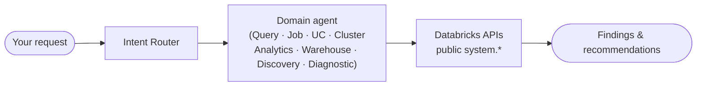

# Quickstart

Install Starboard and run your first Databricks analysis. Starboard runs entirely from
the command line (and from AI coding assistants via skills) — there is no server to
stand up and no database to provision. The default install is **store-free**: state is
in-memory and analytics context comes from curated reference files, not a vector database.

---

## Prerequisites

| Requirement | Version | Check |
|-------------|---------|-------|
| Python | 3.12+ | `python --version` |
| Databricks workspace | — | A profile, host + token, or OAuth service principal |
| LLM access | — | An OpenAI-compatible key, or Databricks Model Serving |

You do **not** need Redis, Postgres, SQLite, or a vector database.

---

## Install

```bash
pip install starboard
starboard --help   # verify
```

### Install options

| Command | What you get |
|---------|--------------|
| `pip install starboard` | Full experience: CLI, agents, `starboard_x`, optional MCP server. Pulls **no** store/vector drivers. |
| `pip install starboard-core` | Pure kernel + `python -m starboard_x.<cap>` middle-tier helpers. Lightweight. |
| `pip install starboard-skills` | Canonical skills tree + `starboard-helper` (for Claude Code / Cursor). |

The Redis cache backend is opt-in: `pip install 'starboard[redis]'`.

---

## Authenticate

Starboard uses **auth by subtraction** — it delegates to the Databricks SDK credential
chain. Provide credentials any one of these ways:

```bash
# Option A — ~/.databrickscfg profile (recommended)
starboard auth login --host https://your-workspace.cloud.databricks.com --profile my-ws
starboard auth status          # verify the resolved identity — no secrets printed

# Option B — environment variables (PAT)
export DATABRICKS_HOST="https://your-workspace.cloud.databricks.com"
export DATABRICKS_TOKEN="dapi..."

# Option C — OAuth service principal
export DATABRICKS_CLIENT_ID="..."
export DATABRICKS_CLIENT_SECRET="..."
```

Then set an LLM key:

```bash
export LLM_API_KEY="<your-api-key>"

# Optional overrides:
export LLM_MODEL="databricks-claude-sonnet-4-5"              # default model
export LLM_BASE_URL="https://<workspace>/serving-endpoints"  # for Model Serving
```

Starboard auto-loads a `.env` file from the current directory, so you can put these
there instead of exporting each session. See the [CLI reference](./cli.md) for every
flag and variable.

---

## Run your first analysis

### Workload Review — ranked, evidence-cited findings

Runs over **public `system.*` data only** and prints a ranked, evidence-cited set of findings:

```bash
starboard review                          # default domains: jobs,sql,warehouse
starboard review --domains warehouse,sql  # narrow the scope
starboard review --json                   # machine-readable envelope
```

Cost-based findings are **list-price DBU estimates**, labelled as such. The review
is read-only — it never writes back to your workspace.

### Discover your whole workspace

```bash
starboard --discover                       # 30-day workspace health assessment
starboard --discover --lookback-days 90    # 30 | 60 | 90
starboard --discover --data-only           # skip LLM analysis, raw data only
```

### General natural-language goals

```bash
starboard --goal "Optimize query with statement_id 01ef-abc123-def456"
starboard --goal "Why did job 12345 fail in its last run?"
starboard --chat                           # interactive multi-turn session
```

Add `--output-path ./reports/` to save JSON + Markdown reports, or `--json` for a
structured envelope. Modes: `--mode online` (default, full API access) · `offline`
(no API calls, useful with `--input-file`) · `diagnostic` (cross-domain investigation).

---

## How requests flow



`starboard review` and `--discover` are deterministic public-data paths that skip the
full agent loop. `--goal` and `--chat` run the multi-agent conversation. See
[Agents](../overview/agents.md) for the full domain agent catalog.

---

## From Claude Code / Cursor (skills)

```bash
pip install starboard-skills
```

Point your assistant at the skills tree to run analyses in natural language directly from
your IDE. See [Skills](./skills.md) for setup and the full catalog of 10 skills.

---

## From a notebook

The `examples/` notebooks run Starboard inside Databricks via
`from starboard.sdk import StarboardClient`. Start with
`examples/Starboard AI Agent.ipynb` for the general flow, or
`examples/Starboard AI Agent - Workspace Discovery.ipynb` for discovery.

---

## Common issues

| Symptom | Fix |
|---------|-----|
| `No Databricks auth resolved` | Provide `--profile <name>`, `--host` + `--token`, or `DATABRICKS_HOST` + `DATABRICKS_TOKEN`. Or run `starboard auth login`. |
| `LLM_API_KEY not set` | `export LLM_API_KEY="<your-api-key>"` |
| Agent exceeds token budget | `starboard --llm-max-tokens 120000 --goal "..."` |

See [Troubleshooting](./troubleshooting.md) for more.

---

## Next steps

- [CLI Reference](./cli.md) — every command, flag, and environment variable
- [Skills](./skills.md) — run Starboard from Claude Code / Cursor
- [Workflows](./workflows.md) — step-by-step task recipes
- [What is Starboard?](../overview/what-is-starboard.md) — architecture overview
