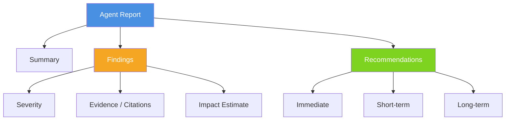

# Reports

How to read and act on Starboard output — findings, evidence, severity, and interactive reasoning.

---

## Report Types

| Surface | What it produces |
|---------|-----------------|
| `starboard review` | Ranked workload-review findings (deterministic, evidence-cited) |
| `starboard --discover` | Domain-graded workspace health scorecard (A–F per domain) |
| `starboard --goal "..."` | Advisor, diagnostic, analytics, or UC report from the matching agent |

---

## Workload Review Findings (`starboard review`)

`starboard review` is deterministic: it runs query packs against public `system.*` data and ranks
findings. Each finding includes:

| Field | Meaning |
|-------|---------|
| `severity` | `critical` / `high` / `medium` / `low` |
| `priority_score` | 0–1 impact/effort rank used to order the list |
| `suggested_fix` | The concrete change to make |
| `evidence` | The query-pack `query_id` and specific data row that triggered the finding |
| `domain` | `jobs` / `sql` / `warehouse` |

Cost figures are **list-price DBU estimates** from public `system.billing.*` tables — not
finance-grade billing numbers.

**Useful flags:**

```bash
starboard review --min-severity high         # suppress low-signal items
starboard review --min-score 0.5             # suppress low-priority items
starboard review --json                      # machine-readable envelope
starboard review --snapshot-out before.json  # save baseline
starboard review --since before.json         # show resolved-rate delta vs baseline
```

---

## Agent Report Structure

Advisor, diagnostic, discovery, and analytics reports share this layout:

```
Report
├── Header   (agent, domain, report type)
├── Summary  (1–3 sentences)
├── Findings
│   ├── Severity     (critical / high / medium / low / info)
│   ├── Evidence     (metrics, config, trends, code analysis)
│   └── Impact estimate  (expected improvement + confidence)
├── Recommendations  (immediate → short-term → long-term)
└── Next Steps       (follow-up questions you can ask)
```



### Severity levels

| Level | Meaning | Action |
|-------|---------|--------|
| **Critical** | Active failure, data loss, or major cost waste | Fix immediately |
| **High** | Significant performance or cost issue | Fix within days |
| **Medium** | Optimization opportunity with meaningful impact | Next sprint |
| **Low** | Minor improvement or best-practice suggestion | When convenient |
| **Info** | Observation, no action required | Awareness only |

### Evidence citations

Every finding cites the data the agent used to reach its conclusion:

- **Metrics** — API numbers (e.g., "query duration: 47 min, rows scanned: 2.1B")
- **Configuration** — settings that contribute to the issue (e.g., "autoscaling disabled, fixed at 2 workers")
- **Trends** — patterns over time (e.g., "job duration increased 3× over 14 days")
- **Code analysis** — anti-patterns in source (e.g., "unbounded `.collect()` on 50M-row DataFrame")

For workload review, the evidence is a specific `query_id` and data row from the query pack.

### Impact estimates

| Component | Meaning |
|-----------|---------|
| Expected improvement | Estimated gain (e.g., "40–60% faster query execution") |
| Confidence | **High** (strong data) · **Medium** (partial data) · **Low** (educated estimate) |
| Basis | What data backs the estimate (e.g., "30-day history, 142 runs") |

Use impact estimates to prioritize which recommendations to try first — not as guarantees.

---

## Discovery Report Cards

The workspace discovery report grades each active domain A–F:

| Grade | Score | Meaning |
|-------|-------|---------|
| A | 90–100 | Excellent — following best practices |
| B | 80–89 | Good — minor opportunities |
| C | 65–79 | Fair — several areas need attention |
| D | 50–64 | Poor — significant issues detected |
| F | 0–49 | Critical — immediate action required |

Grades are backed by system table query data and deterministic heuristic rules —
never assigned from assumptions.

---

## JSON Envelope

All commands support `--json`, which emits a shared envelope to stdout:

```json
{
  "ok": true,
  "domain": "warehouse",
  "command": "review",
  "data": { "...findings or result..." },
  "meta": { "lookback_days": 30, "generated_at": "..." }
}
```

On error, `"ok": false` and `"error"` replaces `"data"`.
Exit codes: `0` ok · `1` auth · `2` not-found · `3` api-error · `4` arg-error.

---

## Interactive and Interruptible Reasoning

Starboard agents support **multi-turn reasoning**: you steer analysis between turns rather
than waiting for a complete result and starting over.

### How to use it

```bash
# Interactive session — streams tool calls and reasoning to the terminal
starboard --chat

# Named session — persists context across separate invocations
starboard --goal "Analyze job 12345" --session my-project
starboard --goal "Focus on the cluster config you mentioned" --session my-project
```

Steering is **turn-based**: you provide input after the agent finishes a turn and returns
output, not while a single turn is still executing.

### When to steer

| Situation | What to say |
|-----------|-------------|
| Agent analyzing the wrong resource | "That is the wrong job — I meant job 67890." |
| You have additional context | "The table was recently migrated from Hive to UC." |
| You want to narrow scope | "Focus only on cluster config, skip the code review." |
| Analysis taking too long | "Give me a quick summary of what you have found." |
| Clarifying your original question | "I want cost trends by team, not by warehouse." |

### How the agent responds

When you send a follow-up turn, the agent chooses a strategy:

| Strategy | What it means |
|----------|---------------|
| **Continue** | Acknowledged, no change to plan |
| **Soft replan** | Adjusts approach, keeps data already fetched |
| **Hard replan** | Restarts reasoning with new context (fetched data still retained) |
| **Cancel** | Stops and summarizes what it has so far |

### Agent questions

The agent may ask you a clarifying question when it hits ambiguity, repeated errors, or
missing critical information. In `--chat`, it pauses and waits for your reply. In a
single `--goal` run, it proceeds with best-effort assumptions — use `--chat` or
`--session` if you need to respond to clarifying questions.

### Example

```
You: "Analyze job 12345"
Agent: [resolves job, pulls run history, identifies OOM in transform_data]

You: "We doubled input data volume last week — could that be related?"
Agent: [soft replan — factors in data growth]
Agent: "Yes — the cluster was sized for 2TB; it now processes 4TB with the same
        2-worker config, causing spill. Increasing max_workers to 8 would resolve this."

You: "What would driver memory need to be after that change?"
Agent: [continues with full prior context] "..."
```

---

## Tips

- **Be specific.** "Analyze job 12345" produces a better report than "help with my job."
- **Provide context.** "Job 12345 used to run in 20 minutes, now takes 2 hours" focuses the investigation.
- **Watch tool calls.** The CLI streams tool calls to the terminal — if the agent is calling
  the right tools on the right resources, let the turn finish.
- **Verify results.** After applying a fix, re-run or continue in a `--session` to compare:
  ```bash
  starboard --goal "Re-analyze query 01ef-abc123 after optimization" --session my-project
  ```

---

## See Also

- [Workflows](./workflows.md) — commands for each use case
- [CLI reference](./cli.md) — all flags and environment variables
- [Agents overview](../overview/agents.md) — which agent handles what
- [Troubleshooting](./troubleshooting.md) — common issues and solutions
