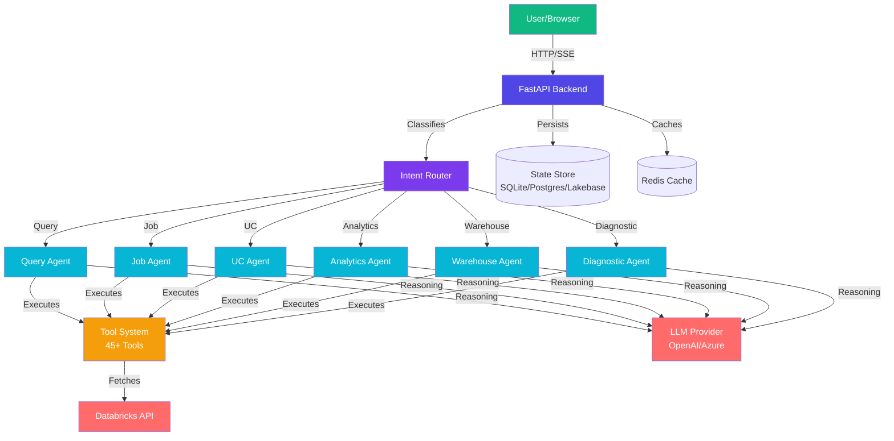
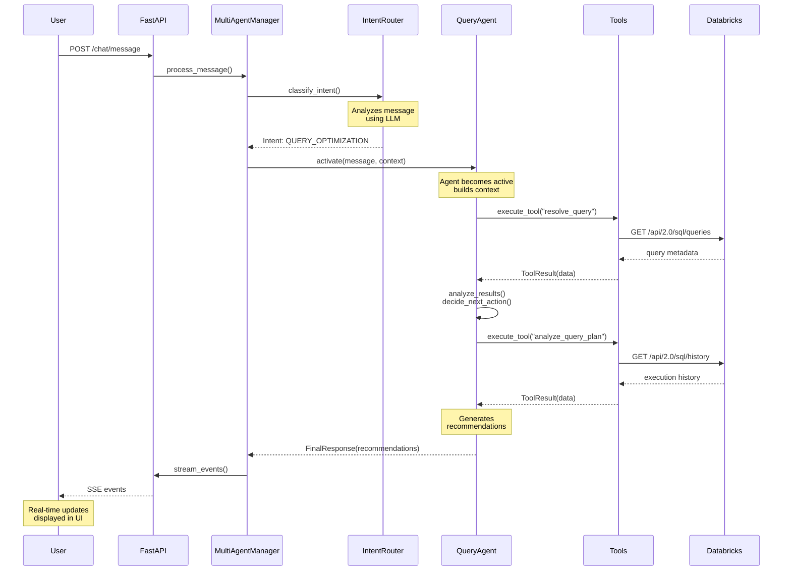

# Starboard AI Agent Documentation

Welcome to the Starboard AI Agent documentation — an AI-powered analysis and optimization platform for Databricks workloads.

## Overview

Starboard uses **8 domain-specialized AI agents** that reason step-by-step, dynamically select from **45+ tools**, and stream results in real time. Ask questions in natural language and get actionable recommendations for SQL queries, jobs, pipelines, costs, and infrastructure.



*High-level system architecture showing the main components and their interactions*

---

## Start Here

| I want to... | Go to |
|--------------|-------|
| **Understand what Starboard does** | [What is Starboard?](overview/what-is-starboard.md) |
| **Get running in 5 minutes** | [Quickstart](QUICKSTART.md) |
| **Learn the web interface** | [Web UI Guide](user-guide/web-ui.md) |
| **Use the CLI** | [CLI Reference](user-guide/cli.md) |
| **Optimize a slow query** | [Query Optimization Workflow](user-guide/workflows/query-optimization.md) |
| **Debug a failing job** | [Job Debugging Workflow](user-guide/workflows/job-debugging.md) |
| **Analyze costs** | [Cost Analysis Workflow](user-guide/workflows/cost-analysis.md) |
| **Integrate via REST API** | [API Quickstart](integration/api-quickstart.md) |
| **Deploy to production** | [Deployment Guide](DEPLOYMENT.md) |
| **Contribute code** | [Developer Getting Started](guides/GETTING_STARTED.md) |

---

## Documentation Sections

### [Overview](overview/what-is-starboard.md)
Product introduction, agent catalog, quickstart, and configuration.

### [User Guide](user-guide/web-ui.md)
Web interface walkthrough, CLI reference, end-to-end workflows for common tasks (query optimization, job debugging, cost analysis, table governance, workspace discovery).

### [Agents](agents/README.md)
Deep documentation for all 8 domain agents — Query, Job, UC, Cluster, Analytics/FinOps, Warehouse, Discovery, and Diagnostic — plus the Intent Router framework.

### [Architecture](architecture/SYSTEM_ARCHITECTURE.md)
System architecture, multi-agent reasoning patterns, tool system design, frontend architecture, and output contracts.

### [Developer Guide](guides/GETTING_STARTED.md)
Setup, contributing, testing, engineering standards, agent/tool development guides, API reference, tool catalog, and package documentation.

### [Operations](DEPLOYMENT.md)
Deployment, runbooks, cloud authentication, state backend configuration, monitoring, and operational procedures.

---

## Agent System



*Multi-agent coordination flow showing how requests are routed and processed*

| Agent | Domain | Key Capability |
|-------|--------|---------------|
| [Query](agents/domain/query.md) | SQL Optimization | Query plan analysis, rewrite suggestions |
| [Job](agents/domain/job.md) | Job Performance | Failure debugging, config optimization |
| [UC](agents/domain/uc.md) | Unity Catalog | Metadata, lineage, governance, storage |
| [Cluster](agents/domain/cluster.md) | Compute | Right-sizing, health, utilization |
| [Analytics](agents/domain/analytics.md) | FinOps & Cost | Cost analysis, chargeback, forecasting |
| [Warehouse](agents/domain/warehouse.md) | SQL Warehouses | Portfolio optimization, SLO config |
| [Discovery](agents/domain/discovery.md) | Workspace Health | Assessment, inventory, health scoring |
| [Diagnostic](agents/domain/diagnostic.md) | Troubleshooting | Root cause analysis, cross-domain debugging |

See the full [Agent Catalog](overview/agents.md) for capabilities matrix and cross-agent scenarios.

---

## Package Structure

```
packages/
├── starboard-core/         # Core domain models, prompts, shared types
├── starboard-server/       # FastAPI backend with multi-agent system
├── starboard-log-parser/   # Log parsing with cloud storage
└── starboard-cli/          # Command-line interface

frontend/                   # Next.js 16 web UI (React 19, MUI v7)
```

---

## Development Commands

```bash
# Setup
make setup              # Bootstrap environment

# Development
make dev                # Start both backend and frontend
make dev-server         # Backend only (http://localhost:8000)
make dev-frontend       # Frontend only (http://localhost:3000)

# Testing
make test               # Run all tests
make test-unit          # Unit tests only
make test-coverage      # With coverage report

# Code Quality
make lint               # Run linter
make type-check         # Run type checking
make format             # Auto-format code
make pre-commit         # Format + lint + type-check

# Documentation
make diagrams           # Generate diagrams
make docs-serve         # Serve docs locally
```

---

## Community

- **GitHub**: [Repository](https://github.com/starboard-ai/job-agent)
- **Issues**: [Bug Reports & Feature Requests](https://github.com/starboard-ai/job-agent/issues)
- **Discussions**: [Community Discussions](https://github.com/starboard-ai/job-agent/discussions)

## License

See [LICENSE](../LICENSE) file in repository root.

---

**Last Updated**: {{ git_revision_date_localized }}
