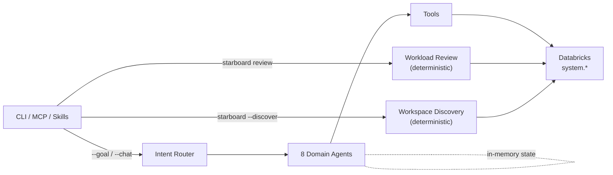

# Starboard

Starboard is an AI-powered analysis and optimization tool for Databricks workloads. It ships three surfaces over one kernel: a **CLI** (`starboard`) for natural-language goal-driven analysis and deterministic workspace commands, an optional **MCP server** (`starboard-mcp`) for Claude Code / Cursor integration, and **Skills** (a Claude Code plugin). All three share the same domain agents, tools, and Databricks connectivity.

```mermaid
graph LR
    in["CLI / MCP / Skills"]

    in -->|"--goal / --chat"| router["Intent Router"]
    router --> agents["8 Domain Agents"]
    agents --> tools["Tools"]
    tools --> db["Databricks<br/>system.*"]

    in -->|"starboard review"| review["Workload Review<br/>(deterministic)"]
    in -->|"starboard --discover"| discover["Workspace Discovery<br/>(deterministic)"]
    review --> db
    discover --> db

    agents -. "in-memory state" .- agents
```

## Start Here

| I want to… | Go to |
|---|---|
| Understand what Starboard does | [What is Starboard?](overview/what-is-starboard.md) |
| Get running in 5 minutes | [Quickstart](guide/quickstart.md) |
| Use the CLI | [CLI Reference](guide/cli.md) |
| Run a Workload Review | [Reports](guide/reports.md) |
| Automate multi-step workflows | [Workflows](guide/workflows.md) |
| Use skills in Claude Code / Cursor | [Skills](guide/skills.md) |
| See the agent catalog | [Agents](overview/agents.md) |

## Documentation Map

| Section | Contents |
|---------|----------|
| **Overview** | [What is Starboard](overview/what-is-starboard.md) · [Agents](overview/agents.md) · [Glossary](overview/glossary.md) · [Changelog](overview/changelog.md) |
| **Guide** | [Quickstart](guide/quickstart.md) · [CLI](guide/cli.md) · [Workflows](guide/workflows.md) · [Reports](guide/reports.md) · [Skills](guide/skills.md) · [Troubleshooting](guide/troubleshooting.md) |
| **Architecture** | [System Architecture](architecture.md) |
| **Contributing** | [Contributing](contributing.md) |
