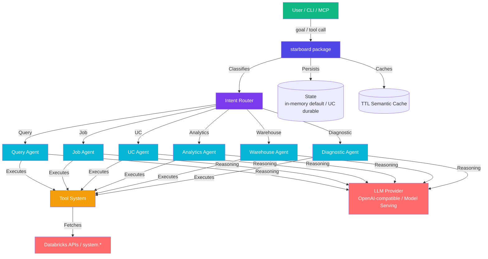
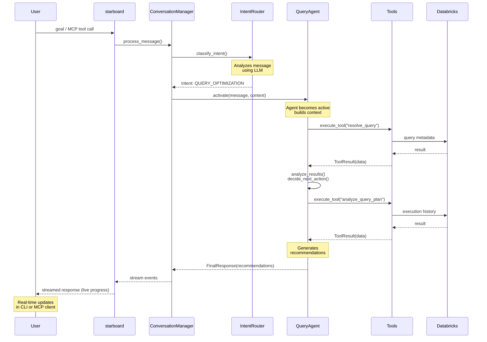

# Starboard AI Agent Documentation

Welcome to the Starboard AI Agent documentation — an AI-powered analysis and optimization platform for Databricks workloads.

## Overview

Starboard runs from the **command line** (and from AI coding assistants via skills). It uses **domain-specialized AI agents** that reason step-by-step, dynamically select tools, and stream live progress in the terminal. Ask questions in natural language and get actionable recommendations for SQL queries, jobs, pipelines, costs, and infrastructure.

Beyond free-form goals, Starboard ships two high-signal, deterministic surfaces over public `system.*` data: **Workload Review** (`starboard review`) and **workspace discovery** (`starboard --discover`).


```mermaid
%%{init: {'theme':'default', 'themeVariables': {'fontSize':'16px'}}}%%

graph TB
    User[User / CLI / MCP] -->|goal / tool call| API[starboard package]
    API -->|Classifies| Router[Intent Router]

    Router -->|Query| QueryAgent[Query Agent]
    Router -->|Job| JobAgent[Job Agent]
    Router -->|UC| UCAgent[UC Agent]
    Router -->|Analytics| AnalyticsAgent[Analytics Agent]
    Router -->|Warehouse| WarehouseAgent[Warehouse Agent]
    Router -->|Diagnostic| DiagAgent[Diagnostic Agent]

    QueryAgent -->|Executes| Tools[Tool System]
    JobAgent -->|Executes| Tools
    UCAgent -->|Executes| Tools
    AnalyticsAgent -->|Executes| Tools
    WarehouseAgent -->|Executes| Tools
    DiagAgent -->|Executes| Tools

    Tools -->|Fetches| Databricks[Databricks APIs / system.*]

    QueryAgent -->|Reasoning| LLMProvider[LLM Provider<br/>OpenAI-compatible / Model Serving]
    JobAgent -->|Reasoning| LLMProvider
    UCAgent -->|Reasoning| LLMProvider
    AnalyticsAgent -->|Reasoning| LLMProvider
    WarehouseAgent -->|Reasoning| LLMProvider
    DiagAgent -->|Reasoning| LLMProvider

    API -->|Persists| StateStore[(State<br/>in-memory default / UC durable)]
    API -->|Caches| Cache[(TTL Semantic Cache)]

    style User fill:#10b981,color:#fff
    style API fill:#4f46e5,color:#fff

    style Router fill:#7c3aed,color:#fff
    style QueryAgent fill:#06b6d4,color:#fff
    style JobAgent fill:#06b6d4,color:#fff
    style UCAgent fill:#06b6d4,color:#fff
    style AnalyticsAgent fill:#06b6d4,color:#fff
    style WarehouseAgent fill:#06b6d4,color:#fff
    style DiagAgent fill:#06b6d4,color:#fff
    style Tools fill:#f59e0b,color:#fff
    style Databricks fill:#ff6b6b,color:#fff
    style LLMProvider fill:#ff6b6b,color:#fff
```

*High-level system architecture showing the main components and their interactions*

---

## Start Here

| I want to... | Go to |
|--------------|-------|
| **Understand what Starboard does** | [What is Starboard?](overview/what-is-starboard.md) |
| **Get running in 5 minutes** | [Quickstart](QUICKSTART.md) |
| **Use the CLI** | [CLI Reference](user-guide/cli.md) |
| **Run a Workload Review** | [Understanding Reports](user-guide/understanding-reports.md) |
| **Ask a question (agent `--goal`)** | [CLI Reference](user-guide/cli.md) |
| **Discover a workspace (`--discover`)** | [Workspace Discovery Workflow](user-guide/workflows/workspace-discovery.md) |
| **Optimize a slow query** | [Query Optimization Workflow](user-guide/workflows/query-optimization.md) |
| **Debug a failing job** | [Job Debugging Workflow](user-guide/workflows/job-debugging.md) |
| **Analyze costs** | [Cost Analysis Workflow](user-guide/workflows/cost-analysis.md) |
| **Use skills in Claude Code / Cursor** | [Skills](SKILLS.md) |
| **Integrate via MCP** | [Claude Code Integration](CLAUDE_CODE_INTEGRATION.md) |
| **Deploy to production** | [Deployment Guide](DEPLOYMENT.md) |
| **Contribute code** | [Contributing](guides/CONTRIBUTING.md) |

---

## Documentation Sections

### [Overview](overview/what-is-starboard.md)
Product introduction, agent catalog, glossary, quickstart, and configuration.

### [User Guide](user-guide/cli.md)
CLI reference, skills, end-to-end workflows for common tasks (query optimization, job debugging, cost analysis, table governance, workspace discovery), and troubleshooting.

### [Agents](agents/README.md)
Deep documentation for all 8 domain agents — Query, Job, UC, Cluster, Analytics/FinOps, Warehouse, Discovery, and Diagnostic — plus the Intent Router framework.

### [Architecture](architecture/SYSTEM_ARCHITECTURE.md)
System architecture, interruptible reasoning design, tool system, token budgeting, and output contracts.

### [Developer Guide](guides/CONTRIBUTING.md)
Contributing, testing, release process, engineering standards, agent/tool development guides, API reference, tool catalog, and package documentation.

### [Operations](DEPLOYMENT.md)
Deployment, runbooks, state backend configuration, monitoring, and operational procedures.

---

## Agent System


```mermaid
%%{init: {'theme':'default', 'themeVariables': {'fontSize':'16px'}}}%%

sequenceDiagram
    participant U as User
    participant API as starboard
    participant MM as ConversationManager
    participant IR as IntentRouter
    participant QA as QueryAgent
    participant T as Tools
    participant DB as Databricks

    U->>API: goal / MCP tool call
    API->>MM: process_message()
    MM->>IR: classify_intent()

    Note over IR: Analyzes message<br/>using LLM

    IR-->>MM: Intent: QUERY_OPTIMIZATION
    MM->>QA: activate(message, context)

    Note over QA: Agent becomes active<br/>builds context

    QA->>T: execute_tool("resolve_query")
    T->>DB: query metadata
    DB-->>T: result
    T-->>QA: ToolResult(data)

    QA->>QA: analyze_results()<br/>decide_next_action()

    QA->>T: execute_tool("analyze_query_plan")
    T->>DB: execution history
    DB-->>T: result
    T-->>QA: ToolResult(data)

    Note over QA: Generates<br/>recommendations

    QA-->>MM: FinalResponse(recommendations)
    MM-->>API: stream events
    API-->>U: streamed response (live progress)

    Note over U: Real-time updates<br/>in CLI or MCP client
```

*Multi-agent coordination flow showing how requests are routed and processed*

| Agent | Domain | Key Capability |
|-------|--------|---------------|
| [Query](agents/domain/query.md) | SQL Optimization | Query plan analysis, rewrite suggestions |
| [Job](agents/domain/job.md) | Job Performance | Failure debugging, config optimization |
| [UC](agents/domain/uc.md) | Unity Catalog | Metadata, lineage, governance, storage |
| [Cluster](agents/domain/cluster.md) | Compute | Right-sizing, health, utilization |
| [Analytics](agents/domain/analytics.md) | FinOps & Cost | Cost analysis, chargeback, forecasting (list-price DBU estimates) |
| [Warehouse](agents/domain/warehouse.md) | SQL Warehouses | Portfolio optimization, SLO config |
| [Discovery](agents/domain/discovery.md) | Workspace Health | Assessment, inventory, health scoring |
| [Diagnostic](agents/domain/diagnostic.md) | Troubleshooting | Root cause analysis, cross-domain debugging |

See the full [Agent Catalog](overview/agents.md) for the capabilities matrix and cross-agent scenarios.

---

## Package Structure

```
packages/
├── starboard-core/          # Pure kernel: domain models, analyzers, Finding + the starboard_x middle tier
├── starboard/               # Full experience: CLI + MCP server + agents + tools
├── starboard-skills/        # Claude Code / Cursor skills + Databricks helper scripts
├── starboard-internal/      # Internal-index-only seam (never published)
└── starboard-plugin-sample/ # Reference scaffold for the starboard.mcp_tools plugin seam
```

See the [Package Integration Guide](integration/PACKAGE_INTEGRATION.md) for how these fit together.

---

## Development Commands

```bash
# Setup
make setup              # Bootstrap the local environment

# Quality gates
make check              # Lint + type-check + unit + architecture tests
make lint               # Run linter
make type-check         # Run type checking
make format             # Auto-format code
make test-unit          # Unit tests only

# Documentation
python scripts/generate_diagrams.py   # Regenerate diagram PNGs from .mmd sources
make docs               # Build the docs site (mkdocs --strict)
make docs-serve         # Serve docs locally
```

---

## Community

- **GitHub**: [Repository](https://github.com/starboard-ai/job-agent)
- **Issues**: [Bug Reports & Feature Requests](https://github.com/starboard-ai/job-agent/issues)
- **Discussions**: [Community Discussions](https://github.com/starboard-ai/job-agent/discussions)

## License

See the [LICENSE](https://github.com/starboard-ai/job-agent/blob/main/LICENSE) file in the repository root.

---

**Last Updated**: {{ git_revision_date_localized }}
