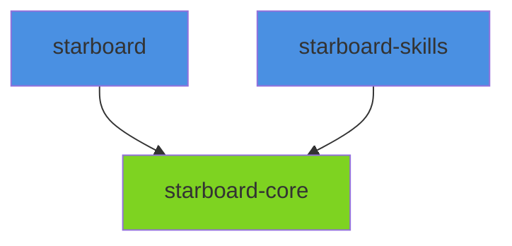

# Package Integration Guide

> **Docs** > **Packages** > **Integration Guide**
> Reading time: 10 minutes

**What you'll learn:**

- How the 3 Python packages relate to each other
- Dependency flow and integration patterns
- Data flow between packages
- Import conventions and best practices

---

## Overview

The Starboard AI Agent is organized as a **monorepo** with 3 Python packages. Each package has a specific responsibility, and they integrate through well-defined interfaces.

### Package Responsibilities

| Package | Purpose | Dependencies |
|---------|---------|--------------|
| **starboard-core** | Domain models, prompts, shared types, log parsing | None (pure domain) |
| **starboard** | Multi-agent system, API, CLI, SDK, 45+ tools | starboard-core |
| **starboard-skills** | Optional skill extensions | starboard-core, databricks-sdk |

### Design Principle

**Dependency Flow**: starboard/starboard-skills --> starboard-core (never the reverse)

---

## Package Dependency Graph



*Package dependency graph showing all 3 Python packages. Green nodes have no Python dependencies. Blue nodes depend on starboard-core.*

### Dependency Matrix

| Package | starboard-core | databricks-sdk |
|---------|---------------|----------------|
| **starboard-core** | -- | -- |
| **starboard** | Yes | -- |
| **starboard-skills** | Yes | Yes |

---

## Package Details

### starboard-core

**Role**: Pure domain layer with zero I/O dependencies. Includes domain models, prompt templates, and the Spark event log parser.

```python
# Domain models
from starboard_core.domain.models.llm import OptimizationMode
from starboard_core.domain.models.conversation import Message, Conversation

# Prompt templates
from starboard_core.prompts import get_prompt_template

# Log parsing (formerly starboard-log-parser)
from starboard_core.log_parser import create_spark_application
from starboard_core.log_parser.adapters import S3Adapter
```

**Rules**: No network calls, no file I/O, no database access. All logic must be pure and deterministic.

### starboard

**Role**: The core backend -- multi-agent system, FastAPI API, tool implementations, CLI, and SDK. Located at `packages/starboard/`.

```python
# Agent system
from starboard.agents.agent_factory import AgentFactory
from starboard.agents.conversation import MultiAgentConversationManager
from starboard.agents.routing.intent_router import IntentRouter

# Tools
from starboard.agents.tool_categories import TOOL_CATEGORIES
from starboard.tools.adapters import resolve_query

# Config
from starboard.infra.core.config import EnvConfig, get_config

# CLI entry point
from starboard.cli.main import main, create_agent_manager

# SDK
from starboard.sdk import StarboardClient, ConversationSession, AgentResponse
```

### starboard-skills

**Role**: Optional skill extensions that depend on starboard-core and the Databricks SDK.

```python
from starboard_skills import register_skills
```

---

## Integration Patterns

### starboard uses starboard-core models

```python
# starboard imports domain models from starboard-core
from starboard_core.domain.models.llm import OptimizationMode
from starboard_core.domain.models.conversation import Message
```

### starboard uses starboard-core log parser

```python
# Log parsing is now part of starboard-core
from starboard_core.log_parser import create_spark_application

app = create_spark_application(log_content)
stages = app.stages
```

### CLI uses starboard agent internals

```python
# CLI creates the agent manager directly (in-process, no HTTP)
from starboard.agents.conversation import MultiAgentConversationManager
from starboard.agents.agent_factory import AgentFactory
```

### SDK uses CLI bootstrapping

```python
# SDK reuses CLI's agent manager creation
from starboard.cli.main import create_agent_manager

manager, api, vector_store = await create_agent_manager(config)
```

### MCP and CLI are the primary integration surfaces

Starboard exposes its functionality via the MCP protocol (for Claude Code, Cursor, and other MCP-compatible clients) and the CLI. There is no web frontend.

---

## Data Flow

```
User Input
    |
    v
[CLI / SDK / MCP]
    |
    v
[starboard]
    |-- Uses starboard-core models for domain logic
    |-- Uses starboard-core log parser for Spark log analysis
    |-- Calls Databricks APIs via adapters
    |-- Calls LLM provider via adapters
    |
    v
[Agent Response]
    |
    v
[CLI: Rich terminal / SDK: AgentResponse / MCP: structured tool response]
```

---

## Best Practices

1. **Never import starboard from starboard-core** -- Dependency flow is one-way
2. **Use core models at boundaries** -- Domain models from starboard-core are the shared language
3. **Log parsing lives in starboard-core** -- Import from `starboard_core.log_parser`, not a separate package
4. **SDK wraps, does not duplicate** -- SDK reuses CLI/agent internals
5. **MCP and CLI are the integration surfaces** -- No web frontend; external clients use MCP or the CLI

---

## Related Documentation

- [System Architecture](../architecture/SYSTEM_ARCHITECTURE.md) -- Full system design
- [starboard-core](../packages/starboard-core/index.md) -- Core package docs
- [starboard](../packages/starboard/index.md) -- Server/CLI/SDK package docs
- [Configuration Guide](../CONFIGURATION.md) -- Environment variables

---

**Last Updated**: 2026-03-24
**Version**: 2.0
