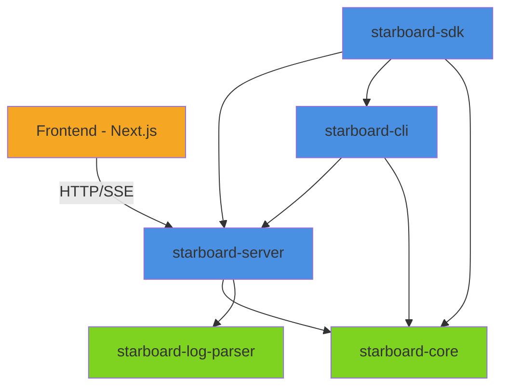

# Package Integration Guide

> **Docs** > **Packages** > **Integration Guide**
> Reading time: 10 minutes

**What you'll learn:**

- How the 5 Python packages relate to each other
- Dependency flow and integration patterns
- Data flow between packages
- Import conventions and best practices

---

## Overview

The Starboard AI Agent is organized as a **monorepo** with 5 Python packages and 1 Next.js frontend. Each package has a specific responsibility, and they integrate through well-defined interfaces.

### Package Responsibilities

| Package | Purpose | Dependencies |
|---------|---------|--------------|
| **starboard-core** | Domain models, prompts, shared types | None (pure domain) |
| **starboard-log-parser** | Spark event log parsing | None (standalone) |
| **starboard-server** | Multi-agent system, API, 45+ tools | core, log-parser |
| **starboard-cli** | Command-line interface | core, server |
| **starboard-sdk** | Python SDK for programmatic access | core, server, cli |
| **frontend** | Web UI (Next.js) | None (HTTP client to server) |

### Design Principle

**Dependency Flow**: CLI/SDK --> Server --> Core (never the reverse)

---

## Package Dependency Graph



*Package dependency graph showing all 5 Python packages plus the frontend. Green nodes have no Python dependencies. Blue nodes are backend Python packages. Orange is the frontend.*

### Dependency Matrix

| Package | core | log-parser | server | cli | sdk | frontend |
|---------|------|------------|--------|-----|-----|----------|
| **core** | -- | -- | -- | -- | -- | -- |
| **log-parser** | -- | -- | -- | -- | -- | -- |
| **server** | Yes | Yes | -- | -- | -- | -- |
| **cli** | Yes | -- | Yes | -- | -- | -- |
| **sdk** | Yes | -- | Yes | Yes | -- | -- |
| **frontend** | -- | -- | HTTP | -- | -- | -- |

---

## Package Details

### starboard-core

**Role**: Pure domain layer with zero I/O dependencies.

```python
# Domain models
from starboard_core.domain.models.llm import OptimizationMode
from starboard_core.domain.models.conversation import Message, Conversation

# Prompt templates
from starboard_core.prompts import get_prompt_template
```

**Rules**: No network calls, no file I/O, no database access. All logic must be pure and deterministic.

### starboard-log-parser

**Role**: Standalone Spark event log parser with credential provider framework.

```python
from starboard_log_parser import create_spark_application
from starboard_log_parser.adapters import S3Adapter
```

**Rules**: Independent of all other packages. Can be used standalone for log parsing.

### starboard-server

**Role**: The core backend -- multi-agent system, FastAPI API, tool implementations.

```python
# Agent system
from starboard.agents.agent_factory import AgentFactory
from starboard.agents.conversation import MultiAgentConversationManager
from starboard.agents.routing.intent_router import IntentRouter

# Tools
from starboard.agents.tool_categories import TOOL_CATEGORIES
from starboard.tools.adapters import resolve_query

# Config
from starboard.infra.core.config import EnvConfig, get_config
```

### starboard-cli

**Role**: Natural language command-line interface.

```python
# Entry point
from starboard.cli.cli.main import main, create_agent_manager
```

### starboard-sdk

**Role**: Programmatic Python client for multi-turn conversations.

```python
from starboard.sdk import StarboardClient, ConversationSession, AgentResponse
```

**Rules**: Uses `create_agent_manager` from CLI to bootstrap the agent stack. Adds session management and a clean API surface.

---

## Integration Patterns

### Server uses Core models

```python
# Server imports domain models from Core
from starboard_core.domain.models.llm import OptimizationMode
from starboard_core.domain.models.conversation import Message
```

### Server uses Log Parser

```python
# Server uses log parser for Spark log analysis in Job Agent tools
from starboard_log_parser import create_spark_application

app = create_spark_application(log_content)
stages = app.stages
```

### CLI uses Server internals

```python
# CLI creates the agent manager directly (in-process, no HTTP)
from starboard.agents.conversation import MultiAgentConversationManager
from starboard.agents.agent_factory import AgentFactory
```

### SDK uses CLI bootstrapping

```python
# SDK reuses CLI's agent manager creation
from starboard.cli.cli.main import create_agent_manager

manager, api, vector_store = await create_agent_manager(config)
```

### Frontend uses Server API

```typescript
// Frontend communicates via HTTP REST + SSE
const response = await fetch(`${API_URL}/api/chat/conversations`, { method: 'POST' });
const eventSource = new EventSource(`${API_URL}/api/chat/conversations/${id}/stream`);
```

---

## Data Flow

```
User Input
    |
    v
[CLI / SDK / Frontend]
    |
    v
[starboard-server]
    |-- Uses starboard-core models for domain logic
    |-- Uses starboard-log-parser for Spark log analysis
    |-- Calls Databricks APIs via adapters
    |-- Calls LLM provider via adapters
    |
    v
[Agent Response]
    |
    v
[CLI: Rich terminal / SDK: AgentResponse / Frontend: React UI]
```

---

## Best Practices

1. **Never import server from core** -- Dependency flow is one-way
2. **Use core models at boundaries** -- Domain models from core are the shared language
3. **Frontend only uses HTTP** -- No direct Python package imports
4. **SDK wraps, does not duplicate** -- SDK reuses CLI/server internals
5. **Log parser is standalone** -- Can be used independently of the agent system

---

## Related Documentation

- [System Architecture](../architecture/SYSTEM_ARCHITECTURE.md) -- Full system design
- [starboard-core](../packages/starboard-core/index.md) -- Core package docs
- [starboard-server](../packages/starboard-server/index.md) -- Server package docs
- [Configuration Guide](../CONFIGURATION.md) -- Environment variables

---

**Last Updated**: 2026-03-24
**Version**: 2.0
