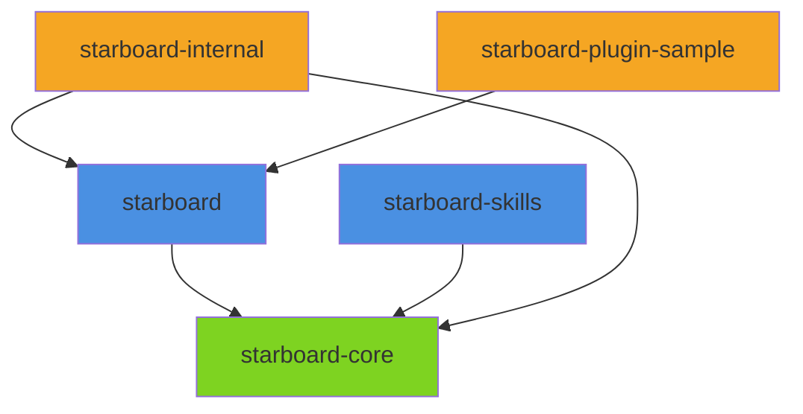

# Package Integration Guide

> **Docs** > **Integration** > **Package Integration**
> Reading time: 10 minutes

**What you'll learn:**

- The 5 packages and how they relate
- The one-way dependency rule and the enforced boundaries
- The kernel / `starboard_x` split inside `starboard-core`
- The two entry-point seams (port adapters, tool plugins)

---

## Overview

Starboard is a **uv-workspace monorepo** with **5 packages**. Two are public wheels a
user installs (`starboard`, `starboard-core`), one is an optional skills tree
(`starboard-skills`), and two are boundary demonstrators: `starboard-internal`
(internal-index-only) and `starboard-plugin-sample` (a reference plugin scaffold).

| Package | Import name(s) | Role | Depends on |
|---------|----------------|------|------------|
| **starboard-core** | `starboard_core`, `starboard_x` | Pure kernel (DTOs, ports, analyzers, rules, log parser) **+** `starboard_x` progressive CLIs | stdlib only in the kernel |
| **starboard** | `starboard` | FastAPI server + adapters + tools + CLI + MCP; exposes the public API facade | starboard-core |
| **starboard-skills** | `starboard_skills` | Canonical skills tree + `starboard-helper` | starboard-core, databricks-sdk |
| **starboard-internal** | `starboard_internal` | Gated internal port adapters (never in a public wheel) | starboard, starboard-core |
| **starboard-plugin-sample** | `starboard_plugin_sample` | Reference per-domain tool plugin (scaffold) | starboard |

> **Nav note (for the docs lead):** the mkdocs nav references `packages/starboard-server`
> and `packages/starboard-log-parser`, which are **not** real packages. The server lives
> inside `starboard`; the log parser lives inside `starboard-core` (`starboard_core.log_parser`).
> Package docs should cover the five packages above.

---

## Dependency graph


```mermaid
graph TD
    SRV[starboard] --> CORE[starboard-core]
    SKL[starboard-skills] --> CORE
    INT[starboard-internal] --> SRV
    INT --> CORE
    PLG[starboard-plugin-sample] --> SRV

    style CORE fill:#7ED321
    style SRV fill:#4A90E2
    style SKL fill:#4A90E2
    style INT fill:#F5A623
    style PLG fill:#F5A623
```

*The kernel (`starboard-core`) sits at the bottom. The dependency edge only ever flows
`internal -> public`, never the reverse — enforced by import-linter (see below).*

### Enforced boundaries (import-linter — `make test-architecture`)

Four **kept** contracts (root `pyproject.toml`):

1. **Kernel purity** — `starboard_core` imports no `databricks-sdk` / `openai` /
   `fastapi` / `mcp`.
2. **`starboard_x` diagnostics-core trio is stdlib-only** (no SDK / heavy deps).
3. **`starboard_x` pure analyzers** (`warehouse` / `uc` / `review`) are SDK-free.
4. **Public packages import no `starboard_internal`** — the internal seam flows one way.

---

## The kernel / `starboard_x` split (`starboard-core`)

`starboard-core` ships two import namespaces from one wheel:

- **`starboard_core`** — the pure kernel: domain models/DTOs, ports (protocols), rules
  (RuleRegistry + `Finding` scorer), the Spark log parser, and reference-file RAG
  knowledge. No SDK/LLM/FastAPI/MCP imports.
- **`starboard_x`** — progressive, self-contained CLIs (`python -m starboard_x.<cap>`)
  with a stable JSON envelope + exit-code contract (`starboard_x.contract`). Shipped
  caps: `diagnostic`, `discovery`, `review`, `sparklog`, `uc`, `warehouse`.

```python
# Kernel — pure domain
from starboard_core.domain.models.finding import Finding, score_and_bucket
from starboard_core.domain.rules.registry import RuleRegistry
from starboard_core.log_parser import create_spark_application

# starboard_x — progressive CLI helpers (console script: starboard-x)
#   python -m starboard_x.review   / starboard-x review
```

---

## The public API facade (`starboard`)

First-party experiences (the CLI) compose the app through a **curated public API**
re-exported lazily from `starboard/__init__.py` (PEP 562) — they must not reach into
`starboard.infra` / `starboard.adapters` / `starboard.tools` directly. The boundary is
enforced by `tests/architecture/test_package_boundaries.py`.

```python
from starboard import (
    get_logger,
    describe_auth, resolve_workspace_client,   # auth resolver (SDK credential chain)
    create_llm_client,
    AnalyticsSqlAdapter, LLMSQLGenerator,       # NL->SQL
    WorkloadReviewService,                      # workload review orchestrator
)
```

`import starboard` performs **no** heavy work — none of `openai` / `databricks.sdk` /
`fastapi` is pulled into `sys.modules` until a symbol is first accessed.

---

## The two entry-point seams

Both seams are opt-in and degrade cleanly when nothing is installed.

### 1. Port adapters — `starboard.port_adapters` (internal-data gate)

The public packages ship the **ports + public adapters + the registry + the entry-point
contract**. Gated internal adapters live only in `starboard-internal`, which registers
providers under `[project.entry-points."starboard.port_adapters"]`
(`log_retrieval`, `diagnostic_backend`, `fleet_sql`, `nl_query`). Discovery
(`starboard.ports.discovery`) loads them and lets an internal-tier provider supersede
the public adapter **only when the enablement gate is open**
(`internal_context_host_allowlist` — empty = closed). Public docs describe this seam,
never the internal contents.

### 2. Tool plugins — `starboard.mcp_tools`

Per-domain tool plugins are separate thin wheels that register a `ToolPlugin`
(`starboard.tools.plugins`) under `[project.entry-points."starboard.mcp_tools"]`.
`starboard-plugin-sample` demonstrates the full contract
(`sample_jobs_health = starboard_plugin_sample.plugin:sample_plugin`). With no plugin
installed, discovery returns an empty catalog and every built-in tool keeps working.
**Plugins are not MCP servers.**

---

## Data flow

```
User Input
    |
    v
[ CLI (in-process) | MCP host (stdio/HTTP) | starboard_x.<cap> ]
    |
    v
[starboard]  ── composes via the public API facade
    |-- starboard-core models + rules + log parser
    |-- Databricks adapters (SDK credential chain)
    |-- LLM adapters (multi-provider)
    |-- (gate open) starboard-internal port adapters
    |
    v
[ Agent response / WorkloadReview / NL->SQL result ]
```

---

## Best practices

1. **Never import `starboard` from `starboard-core`** — the dependency flow is one-way.
2. **Never import `starboard_internal` from a public package** — use the port + registry.
3. **Compose the CLI/experience tier through the public API facade**, not internals.
4. **Keep the kernel pure** — no SDK/LLM/FastAPI/MCP in `starboard_core` / analyzer
   `starboard_x` caps.
5. **Log parsing lives in `starboard-core`** — `from starboard_core.log_parser import ...`.

---

## Related documentation

- [System Architecture](../architecture/SYSTEM_ARCHITECTURE.md) — full system design
- [Tool Architecture](../TOOL_ARCHITECTURE.md) — tool layering + seams
- [starboard-core](../packages/starboard-core/index.md) — kernel + `starboard_x`
- [starboard](../packages/starboard/index.md) — server / CLI / MCP package
- [Configuration Guide](../CONFIGURATION.md) — environment variables

---

**Last Updated**: 2026-08-27
