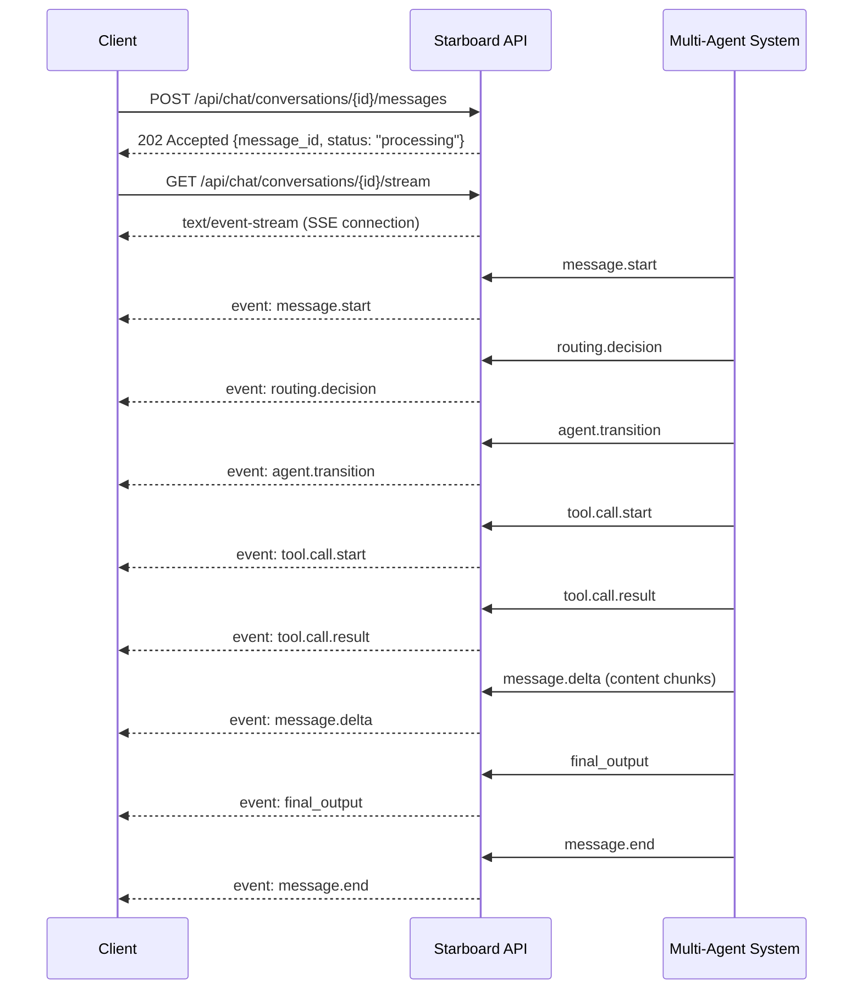

# SSE Streaming Guide

Server-Sent Events (SSE) is the primary mechanism for receiving real-time responses from the Starboard AI Agent. When a user sends a message, the agent reasons step by step -- routing to a specialist, calling tools, generating analysis -- and each step is streamed as a typed event to the client.

This guide covers the protocol details, every event type and its schema, and parsing examples for JavaScript, Python, and curl.

---

## Overview



---

## Connection Setup

### Endpoint

```
GET /api/chat/conversations/{conversation_id}/stream
```

### Response Headers

```http
Content-Type: text/event-stream
Cache-Control: no-cache
X-Accel-Buffering: no
Connection: keep-alive
```

The `X-Accel-Buffering: no` header disables nginx proxy buffering so events arrive immediately.

### Initial Frame

The first frame from the server sets the client reconnection interval:

```
retry: 3000
```

This tells the browser's `EventSource` to wait 3 seconds before attempting to reconnect after a dropped connection.

### Heartbeats

The server sends an SSE comment every **15 seconds** to keep the connection alive through proxies and load balancers:

```
: heartbeat
```

SSE comments (lines starting with `:`) are silently ignored by `EventSource` clients. They prevent TCP idle timeouts.

---

## Event Wire Format

Every event follows the SSE specification:

```
event: <event_type>
data: <json_payload>

```

The JSON payload is always a `ChatEvent` object:

```json
{
  "event_id": "evt_a1b2c3d4e5f6",
  "type": "<event_type>",
  "data": { ... },
  "timestamp": "2026-03-01T10:30:05.123Z"
}
```

| Field | Type | Description |
|---|---|---|
| `event_id` | `string` | Unique event ID (e.g., `evt_a1b2c3d4e5f6`) |
| `type` | `string` | Event type (matches the `event:` line) |
| `data` | `object` | Event-specific payload (varies by type) |
| `timestamp` | `string` | ISO 8601 UTC timestamp |

!!! info "Nested structure"
    The SSE `data:` line contains the full `ChatEvent` JSON, which itself has a `data` field with the event-specific payload. When parsing, access the inner payload as `event.data.data` (or `parsed.data` after extracting the SSE data line).

---

## Event Types Reference

The Starboard backend emits **22 event types**, organized into five categories. The table below lists every type; detailed schemas follow.

### Summary Table

| Category | Event Type | Description |
|---|---|---|
| **Message Lifecycle** | `message.start` | New assistant message begins |
| | `message.delta` | Streaming content chunk |
| | `message.end` | Message processing complete |
| **Tool Execution** | `tool.call.start` | Tool invocation begins |
| | `tool.progress` | Tool execution progress update |
| | `tool.call.result` | Tool invocation completes |
| **Agent Orchestration** | `routing.decision` | Intent router selects domain agent |
| | `agent.transition` | Conversation handed off between agents |
| | `step.start` | Enhanced thinking step with sub-tasks |
| | `step.complete` | Reasoning step completed |
| | `thinking` | Agent reasoning content (streaming text) |
| **Output** | `final_output` | Complete analysis report |
| | `next_steps` | Suggested follow-up actions |
| | `friendly_name.update` | Auto-generated conversation title |
| | `error` | Processing error occurred |
| **Interruptible Reasoning** | `user_input_request` | Agent asks user a question |
| | `user_input_response` | User response acknowledged |
| | `checkpoint` | Reasoning checkpoint created |
| | `interrupt.received` | Interrupt signal received |
| | `replan` | Agent replanning its strategy |
| | `solicitation` | Agent soliciting information |
| | `clarification.request` | Agent requesting disambiguation |

---

## Event Schemas

### Message Lifecycle Events

#### `message.start`

Signals the beginning of a new assistant message. Create a placeholder message in the UI.

```json
{
  "event_id": "evt_a1b2c3",
  "type": "message.start",
  "data": {
    "message_id": "msg_xyz789abc",
    "conversation_id": "conv_abc123"
  },
  "timestamp": "2026-03-01T10:30:05Z"
}
```

| Field | Type | Description |
|---|---|---|
| `message_id` | `string` | Unique message ID (format: `msg_[a-zA-Z0-9_]+`) |
| `conversation_id` | `string` | Parent conversation ID (optional) |

---

#### `message.delta`

Streaming content chunk. Append the `delta.content` to the current message.

```json
{
  "event_id": "evt_d4e5f6",
  "type": "message.delta",
  "data": {
    "message_id": "msg_xyz789abc",
    "delta": {
      "content": "Based on my analysis of your Databricks workspace, "
    },
    "tool_positions": [
      {
        "tool_call_id": "call_abc",
        "position": 42,
        "display": "inline"
      }
    ]
  },
  "timestamp": "2026-03-01T10:30:08Z"
}
```

| Field | Type | Description |
|---|---|---|
| `message_id` | `string` | Target message ID |
| `delta.content` | `string` | Text content to append |
| `tool_positions` | `array` | Optional inline tool rendering positions |

---

#### `message.end`

Signals that message processing is complete. Mark the message as `completed` in the UI and stop streaming indicators.

```json
{
  "event_id": "evt_p6q7r8",
  "type": "message.end",
  "data": {
    "message_id": "msg_xyz789abc"
  },
  "timestamp": "2026-03-01T10:30:12Z"
}
```

---

### Tool Execution Events

#### `tool.call.start`

A domain tool is being invoked. Show a "running" indicator in the UI.

```json
{
  "event_id": "evt_g7h8i9",
  "type": "tool.call.start",
  "data": {
    "message_id": "msg_xyz789abc",
    "tool_call": {
      "tool_call_id": "call_abc123",
      "tool_name": "resolve_query",
      "friendly_name": "Resolving Query",
      "arguments": {"statement_id": "abc123"},
      "status": "running"
    },
    "tool_positions": [
      {
        "tool_call_id": "call_abc123",
        "position": 0,
        "display": "inline"
      }
    ]
  },
  "timestamp": "2026-03-01T10:30:06Z"
}
```

| Field | Type | Description |
|---|---|---|
| `tool_call.tool_call_id` | `string` | Unique ID for this tool invocation |
| `tool_call.tool_name` | `string` | Internal tool name (e.g., `resolve_query`) |
| `tool_call.friendly_name` | `string` | Human-readable name for UI display |
| `tool_call.arguments` | `object` | Input arguments passed to the tool |
| `tool_call.status` | `string` | Always `"running"` for start events |
| `tool_positions` | `array` | Where to render the tool inline in the message |

---

#### `tool.progress`

Progress update during a long-running tool execution.

```json
{
  "event_id": "evt_prog1",
  "type": "tool.progress",
  "data": {
    "message_id": "msg_xyz789abc",
    "tool_call_id": "call_abc123",
    "progress_message": "Scanning 150 tables...",
    "progress_percentage": 45
  },
  "timestamp": "2026-03-01T10:30:07Z"
}
```

| Field | Type | Description |
|---|---|---|
| `tool_call_id` | `string` | Which tool invocation this update is for |
| `progress_message` | `string` | Human-readable progress description |
| `progress_percentage` | `number` | 0--100 completion percentage (optional) |

---

#### `tool.call.result`

Tool execution completed (success or failure). Update the tool status in the UI.

```json
{
  "event_id": "evt_j0k1l2",
  "type": "tool.call.result",
  "data": {
    "message_id": "msg_xyz789abc",
    "tool_call": {
      "tool_call_id": "call_abc123",
      "tool_name": "resolve_query",
      "friendly_name": "Resolving Query",
      "status": "completed",
      "result": {"rows_returned": 10, "execution_time_ms": 450},
      "duration_ms": 1200
    }
  },
  "timestamp": "2026-03-01T10:30:07Z"
}
```

| Field | Type | Description |
|---|---|---|
| `tool_call.status` | `string` | `"completed"` or `"failed"` |
| `tool_call.result` | `any` | Tool output (structure varies by tool) |
| `tool_call.error` | `string` | Error message if `status` is `"failed"` |
| `tool_call.duration_ms` | `number` | Execution time in milliseconds |

---

### Agent Orchestration Events

#### `routing.decision`

The intent router has classified the user's request and selected a domain agent.

```json
{
  "event_id": "evt_route1",
  "type": "routing.decision",
  "data": {
    "domain": "query",
    "confidence": 0.95,
    "reasoning": "User asked about query performance and cost optimization",
    "clarification_needed": false
  },
  "timestamp": "2026-03-01T10:30:05Z"
}
```

| Field | Type | Description |
|---|---|---|
| `domain` | `string` | Selected agent domain (e.g., `query`, `job`, `uc`, `cluster`, `analytics`, `warehouse`, `diagnostic`) |
| `confidence` | `number` | Router confidence score (0.0 -- 1.0) |
| `reasoning` | `string` | Why this domain was selected |
| `clarification_needed` | `boolean` | Whether the router needs more info from the user |

---

#### `agent.transition`

The conversation is being handed off from one agent to another.

```json
{
  "event_id": "evt_trans1",
  "type": "agent.transition",
  "data": {
    "from_agent": "router",
    "to_agent": "query",
    "reason": "User query classified as SQL optimization request",
    "context_passed": {"intent": "optimize_query", "entities": ["job_12345"]}
  },
  "timestamp": "2026-03-01T10:30:05Z"
}
```

| Field | Type | Description |
|---|---|---|
| `from_agent` | `string` | Agent handing off |
| `to_agent` | `string` | Agent receiving the handoff |
| `reason` | `string` | Explanation for the transition |
| `context_passed` | `object` | Shared context transferred between agents |

---

#### `step.start`

An enhanced thinking step with rich progress information, including sub-tasks.

```json
{
  "event_id": "evt_step1",
  "type": "step.start",
  "data": {
    "message_id": "msg_xyz789abc",
    "thinking_step": {
      "step_id": "analyze_query_plan",
      "title": "Analyzing Query Execution Plan",
      "status": "in_progress",
      "start_time": 1709290205.123,
      "progress": 30,
      "sub_tasks": [
        {
          "id": "parse_plan",
          "description": "Parsing execution plan",
          "status": "completed",
          "value": "12 stages"
        },
        {
          "id": "identify_bottlenecks",
          "description": "Identifying bottlenecks",
          "status": "in_progress"
        }
      ],
      "metadata": {"plan_complexity": "high"}
    }
  },
  "timestamp": "2026-03-01T10:30:06Z"
}
```

| Field | Type | Description |
|---|---|---|
| `thinking_step.step_id` | `string` | Unique step identifier |
| `thinking_step.title` | `string` | Human-readable step name |
| `thinking_step.status` | `string` | `pending`, `in_progress`, `completed`, or `failed` |
| `thinking_step.start_time` | `number` | Unix timestamp (seconds) |
| `thinking_step.end_time` | `number` | Unix timestamp when completed |
| `thinking_step.progress` | `number` | 0--100 percentage |
| `thinking_step.sub_tasks` | `array` | Nested sub-task progress |
| `thinking_step.metadata` | `object` | Additional context |

---

#### `step.complete`

A reasoning step has finished.

```json
{
  "event_id": "evt_stepc1",
  "type": "step.complete",
  "data": {
    "message_id": "msg_xyz789abc",
    "reasoning": "Query plan analysis reveals full table scan on orders table",
    "tools_called": ["resolve_query", "analyze_query_plan"]
  },
  "timestamp": "2026-03-01T10:30:08Z"
}
```

---

#### `thinking`

Raw agent reasoning/thinking content. Treat this like `message.delta` -- append content to the message.

```json
{
  "event_id": "evt_think1",
  "type": "thinking",
  "data": {
    "message_id": "msg_xyz789abc",
    "content": "I need to first resolve the query to get its execution plan...",
    "step": 1
  },
  "timestamp": "2026-03-01T10:30:05Z"
}
```

---

### Output Events

#### `final_output`

The agent has completed its analysis. Contains the full report, cost metrics, and optional next steps.

```json
{
  "event_id": "evt_final1",
  "type": "final_output",
  "data": {
    "message_id": "msg_xyz789abc",
    "output": {
      "status": "success",
      "formatted_report": "## Query Optimization Report\n\n...",
      "complete_report": {
        "summary": "Full table scan detected...",
        "recommendations": ["Add partition pruning", "Create index"],
        "estimated_savings": "$1,200/month"
      },
      "next_steps": [
        {
          "id": "ns_1",
          "number": 1,
          "title": "Analyze cluster configuration",
          "description": "Check if the cluster is right-sized for this workload",
          "action_type": "route",
          "target_agent": "cluster"
        },
        {
          "id": "ns_2",
          "number": 2,
          "title": "Show query history",
          "description": "View execution trends over the past 30 days",
          "action_type": "continue"
        }
      ],
      "tokens_used": 1523,
      "cost_usd": 0.023,
      "duration_seconds": 7.2,
      "steps_taken": 4
    },
    "formatted_markdown": "## Query Optimization Report\n\n..."
  },
  "timestamp": "2026-03-01T10:30:12Z"
}
```

| Field | Type | Description |
|---|---|---|
| `output.status` | `string` | `success`, `error`, `budget_exceeded`, `max_steps_reached`, or `unknown` |
| `output.formatted_report` | `string` | Markdown-formatted report |
| `output.complete_report` | `object` | Structured report data (for programmatic access) |
| `output.next_steps` | `array` | Suggested follow-up actions |
| `output.tokens_used` | `number` | Total tokens consumed |
| `output.cost_usd` | `number` | Total cost in USD |
| `output.duration_seconds` | `number` | Wall-clock processing time |
| `output.steps_taken` | `number` | Number of reasoning steps |
| `formatted_markdown` | `string` | Top-level formatted markdown (may differ from `output.formatted_report`) |

---

#### `next_steps`

Suggested follow-up actions sent as a separate event (used when next steps arrive independently of `final_output`).

```json
{
  "event_id": "evt_ns1",
  "type": "next_steps",
  "data": {
    "message_id": "msg_xyz789abc",
    "next_steps": [
      {
        "id": "ns_1",
        "number": 1,
        "title": "Deep dive into job configuration",
        "description": null,
        "action_type": "continue",
        "target_agent": null,
        "tool_name": null,
        "parameters": null
      }
    ]
  },
  "timestamp": "2026-03-01T10:30:12Z"
}
```

Each next step has an `action_type`:

| Action Type | Behavior |
|---|---|
| `continue` | Send the title as a follow-up message in the same conversation |
| `route` | Route to the agent specified in `target_agent` |
| `tool_call` | Invoke the tool specified in `tool_name` with `parameters` |

---

#### `friendly_name.update`

The system has auto-generated a human-readable title for the conversation.

```json
{
  "event_id": "evt_fn1",
  "type": "friendly_name.update",
  "data": {
    "friendly_name": "Top 10 Most Expensive Jobs Analysis"
  },
  "timestamp": "2026-03-01T10:30:06Z"
}
```

---

#### `error`

An error occurred during processing.

```json
{
  "event_id": "evt_err1",
  "type": "error",
  "data": {
    "message_id": "msg_xyz789abc",
    "error": {
      "message": "Failed to connect to Databricks API",
      "code": "ConnectionError",
      "details": {"endpoint": "sql/history", "timeout_ms": 30000}
    }
  },
  "timestamp": "2026-03-01T10:30:07Z"
}
```

| Field | Type | Description |
|---|---|---|
| `error.message` | `string` | Human-readable error description |
| `error.code` | `string` | Machine-readable error code |
| `error.details` | `object` | Additional debugging context (optional) |

---

### Interruptible Reasoning Events

These events support the agent's ability to ask questions mid-reasoning and accept user input without restarting.

#### `user_input_request`

The agent needs information from the user to continue.

```json
{
  "event_id": "evt_uir1",
  "type": "user_input_request",
  "data": {
    "message_id": "msg_xyz789abc",
    "request_id": "req_input_001",
    "question": "Which service principal should I use for the Unity Catalog analysis?",
    "context": "Multiple service principals found with UC access",
    "suggestions": ["sp-prod-databricks", "sp-analytics-read"],
    "timeout_seconds": 120
  },
  "timestamp": "2026-03-01T10:30:07Z"
}
```

Respond via `POST /api/chat/conversations/{id}/inject-input` or `POST /api/chat/conversations/{id}/respond-to-solicitation`.

---

#### `checkpoint`

A reasoning checkpoint was created. The user can inject input at this point.

```json
{
  "event_id": "evt_ckpt1",
  "type": "checkpoint",
  "data": {
    "message_id": "msg_xyz789abc",
    "checkpoint_id": "ckpt_step5",
    "description": "Before analyzing downstream tables"
  },
  "timestamp": "2026-03-01T10:30:08Z"
}
```

---

#### `clarification.request`

The agent needs the user to disambiguate something before proceeding.

```json
{
  "event_id": "evt_clar1",
  "type": "clarification.request",
  "data": {
    "message_id": "msg_xyz789abc",
    "conversation_id": "conv_abc123",
    "clarification_id": "clar_001",
    "clarification_type": "ambiguous_entity",
    "question": "I found multiple tables matching 'orders'. Which one do you mean?",
    "options": [
      {"option_id": "opt_1", "display_text": "catalog.schema.orders", "value": "catalog.schema.orders"},
      {"option_id": "opt_2", "display_text": "catalog.staging.orders", "value": "catalog.staging.orders"}
    ],
    "allow_custom_response": true,
    "is_required": true,
    "target_tool": "get_table_metadata"
  },
  "timestamp": "2026-03-01T10:30:07Z"
}
```

Clarification types: `ambiguous_entity`, `missing_parameter`, `vague_reference`, `insufficient_context`.

Respond via `POST /api/conversations/{conversation_id}/clarifications/{clarification_id}/respond`.

---

## Parsing Examples

### JavaScript (EventSource)

The browser-native `EventSource` API is the simplest approach. Because the backend sends **typed events** (each event has an `event:` line), you must register listeners for specific event types rather than using the generic `onmessage` handler.

```javascript
const conversationId = "conv_abc123def456";
const url = `http://localhost:8000/api/chat/conversations/${conversationId}/stream`;

const eventSource = new EventSource(url);

// Connection lifecycle
eventSource.addEventListener("open", () => {
  console.log("SSE connection established");
});

eventSource.addEventListener("error", (event) => {
  console.error("SSE error:", event);
  // EventSource auto-reconnects using the server's retry: interval (3s)
});

// Register handlers for each event type
const EVENT_TYPES = [
  "message.start",
  "message.delta",
  "message.end",
  "tool.call.start",
  "tool.progress",
  "tool.call.result",
  "final_output",
  "error",
  "thinking",
  "step.start",
  "step.complete",
  "routing.decision",
  "agent.transition",
  "user_input_request",
  "user_input_response",
  "friendly_name.update",
  "next_steps",
  "clarification.request",
];

EVENT_TYPES.forEach((eventType) => {
  eventSource.addEventListener(eventType, (event) => {
    const data = JSON.parse(event.data);
    handleEvent(eventType, data);
  });
});

function handleEvent(type, chatEvent) {
  const payload = chatEvent.data; // inner data object

  switch (type) {
    case "message.start":
      console.log("New message:", payload.message_id);
      break;
    case "message.delta":
      // Append content to the message
      process.stdout.write(payload.delta?.content || "");
      break;
    case "tool.call.start":
      console.log(`Tool started: ${payload.tool_call.friendly_name}`);
      break;
    case "tool.call.result":
      console.log(`Tool completed: ${payload.tool_call.tool_name} (${payload.tool_call.duration_ms}ms)`);
      break;
    case "final_output":
      console.log("\nAnalysis complete:", payload.output.status);
      console.log(`Tokens: ${payload.output.tokens_used}, Cost: $${payload.output.cost_usd}`);
      eventSource.close(); // Done -- close connection
      break;
    case "error":
      console.error("Agent error:", payload.error.message);
      break;
  }
}
```

!!! warning "Do not use `onmessage`"
    The generic `eventSource.onmessage` handler only fires for events **without** an `event:` type line. Since the Starboard backend always sends typed events, `onmessage` will never fire. Use `addEventListener` for each event type instead.

---

### Python (httpx async streaming)

```python
import asyncio
import json
import httpx


async def stream_events(base_url: str, conversation_id: str) -> None:
    """Stream and parse SSE events from a conversation."""
    url = f"{base_url}/api/chat/conversations/{conversation_id}/stream"

    async with httpx.AsyncClient(timeout=120.0) as client:
        async with client.stream("GET", url) as response:
            event_type: str | None = None

            async for line in response.aiter_lines():
                # SSE comment (heartbeat)
                if line.startswith(":"):
                    continue

                # Event type line
                if line.startswith("event: "):
                    event_type = line[7:]
                    continue

                # Data line
                if line.startswith("data: "):
                    raw = line[6:]
                    chat_event = json.loads(raw)
                    payload = chat_event.get("data", {})

                    if event_type == "message.delta":
                        content = payload.get("delta", {}).get("content", "")
                        print(content, end="", flush=True)

                    elif event_type == "tool.call.start":
                        tool = payload.get("tool_call", {})
                        print(f"\n  >> Tool: {tool.get('friendly_name')} ...", flush=True)

                    elif event_type == "tool.call.result":
                        tool = payload.get("tool_call", {})
                        status = tool.get("status")
                        ms = tool.get("duration_ms", "?")
                        print(f"  << {tool.get('tool_name')}: {status} ({ms}ms)", flush=True)

                    elif event_type == "final_output":
                        output = payload.get("output", {})
                        print(f"\n\nDone: {output.get('status')}")
                        print(f"  Tokens: {output.get('tokens_used')}")
                        print(f"  Cost:   ${output.get('cost_usd', 0):.4f}")
                        return  # Stream complete

                    elif event_type == "error":
                        error = payload.get("error", {})
                        print(f"\nERROR: {error.get('message')}")
                        return

                    event_type = None  # Reset for next event


# Usage:
# asyncio.run(stream_events("http://localhost:8000", "conv_abc123"))
```

---

### Python (sseclient-py)

For a higher-level approach using the `sseclient-py` library:

```python
import json
import requests
import sseclient


def stream_with_sseclient(base_url: str, conversation_id: str) -> None:
    """Stream events using sseclient-py."""
    url = f"{base_url}/api/chat/conversations/{conversation_id}/stream"

    response = requests.get(url, stream=True)
    client = sseclient.SSEClient(response)

    for event in client.events():
        if not event.data:
            continue

        chat_event = json.loads(event.data)
        payload = chat_event.get("data", {})
        event_type = event.event  # SSE event type

        if event_type == "message.delta":
            print(payload.get("delta", {}).get("content", ""), end="")
        elif event_type == "final_output":
            output = payload.get("output", {})
            print(f"\n\nDone: {output.get('status')}, "
                  f"tokens={output.get('tokens_used')}, "
                  f"cost=${output.get('cost_usd', 0):.4f}")
            break
        elif event_type == "error":
            print(f"\nError: {payload.get('error', {}).get('message')}")
            break
```

Install with: `pip install sseclient-py requests`

---

### curl

```bash
# Stream all events (raw SSE output)
curl -N "http://localhost:8000/api/chat/conversations/${CONV_ID}/stream"

# Parse with jq for readable output (requires GNU grep)
curl -N "http://localhost:8000/api/chat/conversations/${CONV_ID}/stream" 2>/dev/null | \
  grep --line-buffered "^data: " | \
  sed -u 's/^data: //' | \
  jq -c '{type: .type, message_id: .data.message_id}'
```

---

## Reconnection and Error Handling

### Automatic Reconnection

The `EventSource` API handles reconnection automatically:

1. **Server sets `retry: 3000`** -- the client waits 3 seconds before reconnecting.
2. **On connection drop**, `EventSource` fires an `error` event, then attempts to reconnect.
3. **On HTTP 404** (conversation not found), close the connection -- do not retry.

### Reconnection Strategy for Custom Clients

If you are not using the browser `EventSource` API, implement exponential backoff:

```
Attempt 1: wait 1s
Attempt 2: wait 2s
Attempt 3: wait 4s
Attempt 4: wait 8s
Attempt 5: wait 16s (max 30s cap)
Add random jitter of 0-1s to each delay.
Max attempts: 5
```

### Error Scenarios

| Scenario | HTTP Status | Action |
|---|---|---|
| Conversation not found | 404 | Do not reconnect. Remove conversation from UI. |
| Server error | 500 | Reconnect with backoff. |
| Connection dropped | N/A | Auto-reconnect (EventSource handles this). |
| Rate limited | 429 | Wait `retry_after_seconds`, then reconnect. |
| Server restart | N/A | Conversations are lost (in-memory). Create a new one. |

### Frontend Error Types

The Starboard frontend defines structured error classes for SSE failures:

| Error Class | Code | When |
|---|---|---|
| `ConversationNotFoundError` | `CONVERSATION_NOT_FOUND` | 404 on validation or stream |
| `EventValidationError` | `EVENT_VALIDATION_ERROR` | Zod schema validation fails |
| `ConnectionError` | `CONNECTION_ERROR` | Max reconnection attempts exceeded |
| `MissingDataError` | `MISSING_DATA_ERROR` | Required field missing from event |

---

## Best Practices for Production Consumers

### 1. Always Validate Events

The frontend uses Zod schemas to validate every incoming event. Implement similar validation in your consumer to catch schema mismatches early:

```typescript
import { validateStreamingEvent } from "@/lib/validation/event-schemas";

const result = validateStreamingEvent(parsed);
if (!result.success) {
  console.error("Invalid event:", result.error);
  return; // Skip invalid events, do not crash
}
```

### 2. Handle Missing Messages Defensively

Events can arrive out of order or with a missed `message.start`. Always check if the target message exists before updating it, and create a placeholder if needed:

```javascript
if (!existingMessage) {
  // Create placeholder -- message.start was missed
  createMessage(messageId, { role: "assistant", content: "", status: "processing" });
}
```

### 3. Open the Stream Before Sending Messages

To avoid missing early events, establish the SSE connection **before** posting a message. If you use `initial_message` in the conversation creation request, open the stream immediately after getting the `conversation_id`.

### 4. Validate Conversation Existence on Reconnect

After a page reload, the conversation may no longer exist (server restart clears in-memory state). Use the HEAD endpoint to check:

```bash
curl -I http://localhost:8000/api/chat/conversations/{id}
# 204 = exists, 404 = gone
```

### 5. Respect Heartbeats

If you stop receiving heartbeats for more than 30 seconds (2 missed intervals at 15s each), the connection is likely dead. Close and reconnect.

### 6. Close Connections When Done

After receiving `final_output` and `message.end`, close the SSE connection to free server resources. The connection is per-conversation, not per-message, so keep it open if the user will send follow-up messages.

### 7. Handle `final_output` as the Primary Completion Signal

The `final_output` event contains the complete analysis results, cost metrics, and next steps. Use it as the primary indicator that the agent has finished. The `message.end` event that follows is a cleanup signal.

---

## Related Documentation

- **[API Quickstart](api-quickstart.md)** -- Create conversations and send messages in 5 minutes
- **[API Reference](../api/API_REFERENCE.md)** -- Complete reference for all 22 endpoints
- **[Interruptible Reasoning](../INTERRUPTIBLE_REASONING.md)** -- Architecture of checkpoints, input injection, and solicitations
- **[Frontend Architecture](../FRONTEND_ARCHITECTURE.md)** -- How the Next.js frontend consumes SSE events
