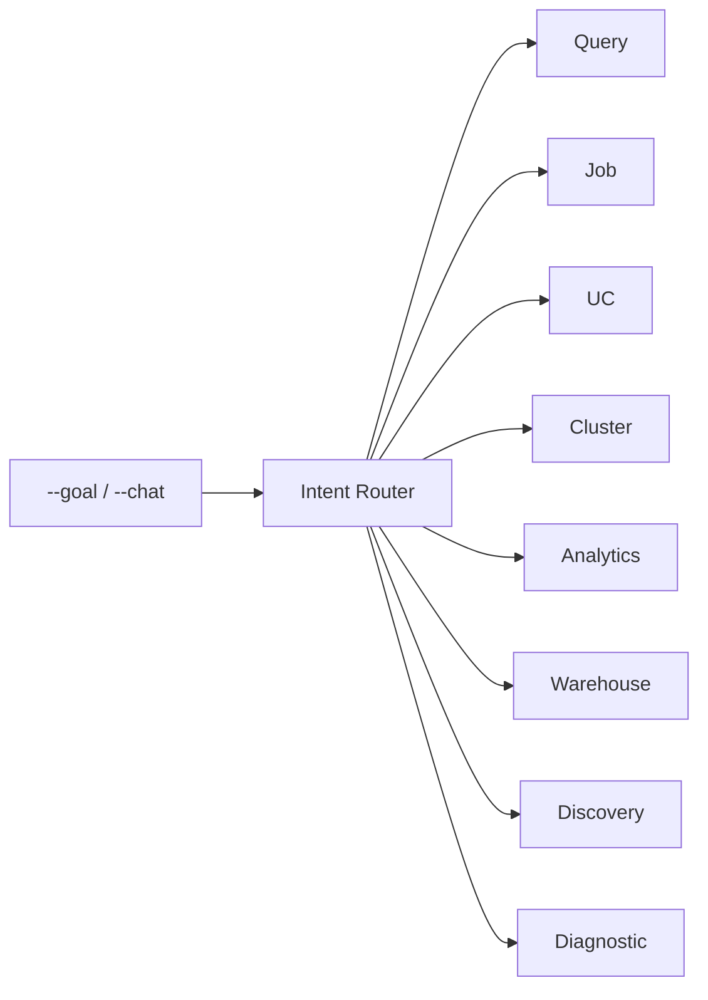

# Agent Catalog

Agents power the `--goal` and `--chat` surfaces. When you send a natural-language goal, the **Intent Router** scores it against domain keyword patterns, extracts explicit identifiers (e.g. `statement_id`, `job_id`), and dispatches to the right specialist. Agents can hand off to each other when they surface issues outside their own domain.

For a surface overview (CLI, skills, MCP tools) see [What is Starboard?](what-is-starboard.md) and the [CLI reference](../guide/cli.md).

---

## Routing

The router uses parallel domain scoring. Explicit identifiers give immediate high-confidence routes. At medium confidence (0.4–0.6) it presents numbered options; after one clarification attempt it makes a best-effort decision.

---

## Agents

### Query

**Domain:** SQL query optimization
**Fires on:** `statement_id`, "optimize sql", "slow query", "full table scan", "scanning too much data"
**Capabilities:** Fetches the execution plan (`EXPLAIN`), analyzes data scanning and shuffle, checks table schema and partitioning, quantifies cost savings.
**Example:** `--goal "Why is statement_id:abc123 scanning 10 TB?"`

---

### Job

**Domain:** Databricks jobs and workflow optimization
**Fires on:** `job_id`, "job failed", "slow pipeline", "OOM in task", "task keeps retrying"
**Capabilities:** Inspects source code (notebooks/scripts) for anti-patterns, branches on serverless vs. standard compute (skips Spark logs on serverless), reads run output and task logs, prioritizes the critical path in multi-task workflows.
**Example:** `--goal "Job 266829928906781 keeps failing at the aggregate task"`

---

### UC (Unity Catalog)

**Domain:** Unity Catalog governance and table management
**Fires on:** `catalog.schema.table`, "lineage", "schema drift", "who has access to", "list tables in"
**Capabilities:** Asset discovery, table metadata and Delta history, lineage tracing (upstream/downstream), access grant inspection, storage optimization, schema drift detection.
**Example:** `--goal "Show upstream lineage for cprice_main.core.orders"`

---

### Cluster

**Domain:** Databricks cluster configuration and health
**Fires on:** `cluster_id`, "cluster health", "autoscaling", "over-provisioned", "rightsizing"
**Capabilities:** Fleet overview, 0–100 health scoring with per-metric breakdown, CPU/memory/IO utilization, autoscaling and spot-vs-on-demand recommendations. Routes SQL warehouse work to the Warehouse agent.
**Example:** `--goal "Is cluster 1201-090640-dwj7ygpe over-provisioned?"`

---

### Analytics (FinOps)

**Domain:** Cost and DBU consumption analysis
**Fires on:** "cost", "billing", "DBU spend", "expensive", "waste", "chargeback", "budget"
**Capabilities:** Builds and executes SQL over `system.*` billing tables using curated reference-file context; self-corrects on SQL generation failures (up to 3 attempts); generates visualizations; attributes spend by workspace, job, warehouse, or user. All `$` figures are **list-price DBU estimates**.
**Example:** `--goal "Which jobs consumed the most DBUs in the last 30 days?"`

---

### Warehouse

**Domain:** SQL warehouse portfolio optimization
**Fires on:** `warehouse_id`, "warehouse health", "chargeback", "SLO", "consolidate warehouses"
**Capabilities:** Portfolio overview, workload fingerprinting (P50–P99 latency baselines), 0–100 health scoring, SLO compliance tracking, user-level chargeback, topology and consolidation analysis.
**Example:** `--goal "Generate a chargeback report for analytics-warehouse"`

---

### Discovery

**Domain:** Workspace-wide health assessment
**Fires on:** "workspace health", "health check", "audit my workspace", "--discover"
**Capabilities:** 4-phase pipeline — audit active products → run query packs → analyze domains → synthesize graded report cards (A–F). Supports 30/60/90-day lookback. This is the same engine as `starboard --discover`.
**Example:** `--goal "Run a 90-day workspace health check"`

---

### Diagnostic

**Domain:** Troubleshooting and root cause analysis
**Fires on:** "error", "exception", "exit code 137", "debug", "OOM", stack traces, log files
**Capabilities:** Artifact-first analysis (logs, stack traces, query profiles, code). Confidence-calibrated findings (HIGH/MEDIUM/LOW) with line-level evidence citations. Interprets exit codes (HOW vs. WHY). Has unrestricted tool access. Emits a structured fingerprint for specialist routing.
**Example:** `--goal "Why did my job fail with exit code 137?"` (attach logs)

---

## How to choose a surface

| I want to… | Use |
|---|---|
| Natural-language analysis inside a chat host | Skill (e.g. `starboard-job`) — routes to the right agent automatically |
| Natural-language analysis from a terminal | `starboard --goal "…"` or `starboard --chat` |
| Ranked, deterministic findings over public `system.*` data | `starboard review` |
| Workspace health / inventory scan | `starboard --discover` |
| Call a single typed operation | MCP tool (`mcp__starboard__*`) |
| Offline / minimal install | `python -m starboard_x.<cap>` |

See [What is Starboard?](what-is-starboard.md) and the [CLI reference](../guide/cli.md) for full surface details.
