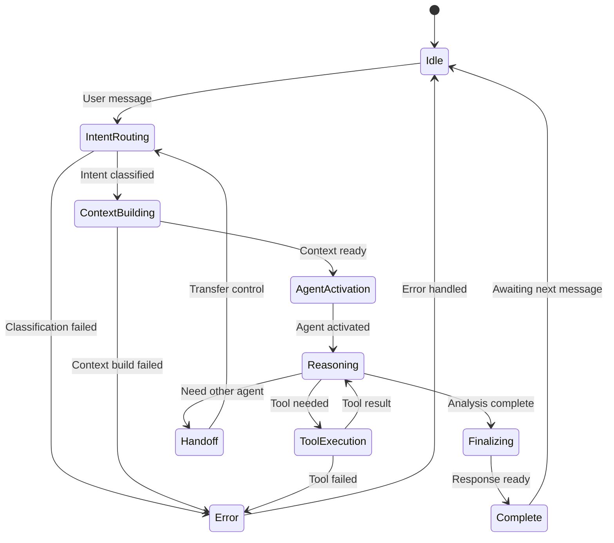

# starboard-server Architecture

**Package**: `starboard-server`  
**Version**: 0.1.0  
**Purpose**: FastAPI backend with multi-agent system  
**Last Updated**: 2025-12-18  
**Complexity**: ⭐⭐⭐⭐⭐ (Highest - 400+ files)

---

## Overview

`starboard-server` is the core backend of the Starboard AI Agent platform. It orchestrates multiple specialized AI agents, executes 45+ tools, integrates with Databricks APIs, and streams real-time reasoning to clients.

### Key Responsibilities

1. **Multi-Agent Orchestration**: Coordinate domain-specialized agents (Query, Job, UC, Cluster, Analytics/FinOps, Warehouse, Diagnostic)
2. **Real-time Streaming**: Server-Sent Events (SSE) for live agent reasoning
3. **Tool Execution**: 45+ tools for Databricks analysis and optimization
4. **State Management**: Conversation persistence and memory
5. **External Integration**: Databricks API, OpenAI/LLM, storage backends

### Design Philosophy

- **Async-first**: All I/O operations are non-blocking
- **Event-driven**: Streaming events for real-time UX
- **Agent-centric**: Domain experts, not monolithic system
- **Observable**: Comprehensive logging, tracing, metrics
- **Resilient**: Circuit breakers, retries, graceful degradation

---

## High-Level Architecture

```
┌─────────────────────────────────────────────────────────┐
│                    FastAPI Server                        │
├─────────────────────────────────────────────────────────┤
│  API Layer (api/)                                        │
│  ├── REST endpoints (/api/chat/*)                         │
│  ├── SSE streaming (/api/chat/events)                    │
│  └── Dependencies & container integration               │
├─────────────────────────────────────────────────────────┤
│  Agent System (agents/)                                  │
│  ├── MultiAgentManager (orchestrator)                   │
│  ├── IntentRouter (classification)                      │
│  ├── DomainAgents (specialists)                         │
│  ├── ToolRegistry (tool mapping)                        │
│  └── EventBroadcaster (SSE)                            │
├─────────────────────────────────────────────────────────┤
│  Service Layer (services/)                               │
│  ├── Context management                                  │
│  ├── Intent analysis                                     │
│  ├── Memory operations                                   │
│  └── Feedback processing                                 │
├─────────────────────────────────────────────────────────┤
│  Tool System (tools/)                                    │
│  ├── Domain logic (tools/domain/)                       │
│  ├── Services (tools/services/)                         │
│  └── Adapters (tools/adapters/)                         │
├─────────────────────────────────────────────────────────┤
│  Adapter Layer (adapters/)                               │
│  ├── LLM clients (OpenAI, etc.)                        │
│  ├── Databricks API client                              │
│  ├── State stores (SQLite/Postgres/Redis)              │
│  └── HTTP clients                                       │
├─────────────────────────────────────────────────────────┤
│  Infrastructure (infra/)                                 │
│  ├── Configuration & DI container                       │
│  ├── Caching (SDK LRU cache, query result cache)       │
│  ├── Logging & observability                           │
│  ├── Authentication & authorization                      │
│  └── Reliability (circuit breakers, retries)           │
└─────────────────────────────────────────────────────────┘
```

---

## Package Structure

```
starboard-server/
├── starboard_server/
│   ├── main.py                 # FastAPI application entry point
│   │
│   ├── api/                    # REST API layer (23 files)
│   │   ├── chat/               # Chat endpoints
│   │   ├── dependencies.py     # FastAPI dependencies
│   │   ├── streaming.py        # SSE implementation
│   │   ├── event_converter.py  # Event format conversion
│   │   └── ...                 # Query, visualization, etc.
│   │
│   ├── agents/                 # Multi-agent system (70+ files)
│   │   ├── agent_factory.py    # Agent creation
│   │   ├── conversation/       # Multi-agent coordination (6 files)
│   │   │   ├── multi_agent_manager.py     # Main orchestrator
│   │   │   ├── handoff_coordinator.py     # Agent handoffs
│   │   │   ├── lifecycle_manager.py       # Lifecycle control
│   │   │   └── ...
│   │   ├── domain/             # Domain agent implementation (7 files)
│   │   │   ├── domain_agent.py         # Base domain agent
│   │   │   ├── reasoning_engine.py     # LLM reasoning
│   │   │   ├── tool_executor.py        # Tool execution
│   │   │   └── ...
│   │   ├── routing/            # Intent routing (4 files)
│   │   │   ├── intent_router.py        # Classify user intent
│   │   │   └── specialist_context_builder.py
│   │   ├── config/             # Agent configuration (5 files)
│   │   ├── events/             # Event definitions (8 files)
│   │   ├── state/              # Agent state management (5 files)
│   │   ├── clarification/      # Clarification handling
│   │   ├── output/             # Response formatting
│   │   └── tools/              # Tool schemas and registry
│   │
│   ├── tools/                  # Tool system (95+ files)
│   │   ├── domain/             # Business logic (no I/O)
│   │   │   ├── query/          # Query optimization tools
│   │   │   ├── job/            # Job analysis tools
│   │   │   ├── uc/             # Unity Catalog tools
│   │   │   ├── cluster/        # Cluster config tools
│   │   │   ├── warehouse/      # Warehouse portfolio tools
│   │   │   ├── analytics/      # Analytics & templates
│   │   │   └── diagnostic/     # Diagnostic tools
│   │   ├── services/           # Service orchestration (13 files)
│   │   └── adapters/           # LLM-facing adapters (10 files)
│   │
│   ├── services/               # Business logic layer (45 files)
│   │   ├── context/            # Context management (23 files)
│   │   │   ├── builders/       # Context builders per agent
│   │   │   ├── enrichers/      # Context enrichment
│   │   │   └── ...
│   │   ├── intent/             # Intent analysis
│   │   ├── memory/             # Memory operations
│   │   ├── clarification/      # Clarification logic
│   │   └── feedback/           # User feedback
│   │
│   ├── adapters/               # External integrations (30+ files)
│   │   ├── llm/                # LLM clients
│   │   │   ├── openai/         # OpenAI implementation
│   │   │   └── base.py         # LLM interface
│   │   ├── apis/databricks/    # Databricks API client
│   │   ├── state/              # State storage implementations
│   │   │   ├── sqlite/         # SQLite + sqlite-vec
│   │   │   ├── postgres/       # PostgreSQL + pgvector
│   │   │   ├── inmemory/       # In-memory (testing)
│   │   │   ├── redis/          # Redis cache
│   │   │   └── databricks/     # Lakebase (Postgres-compatible)
│   │   └── databricks/         # SQL executor, cache
│   │
│   ├── infra/                  # Infrastructure (20+ files)
│   │   ├── core/               # Config, DI container
│   │   ├── cache/              # Caching infrastructure
│   │   │   ├── async_lru_cache.py    # Async LRU with single-flight
│   │   │   └── ...
│   │   ├── observability/      # Logging, tracing, metrics
│   │   ├── auth/               # Authentication
│   │   ├── reliability/        # Circuit breakers, retries
│   │   └── constraints/        # Rate limiting, budgets
│   │
│   ├── prompts/                # LLM prompts (20 files)
│   │   ├── query/              # Query agent prompts
│   │   ├── job/                # Job agent prompts
│   │   ├── uc/                 # UC agent prompts
│   │   ├── cluster/            # Cluster agent prompts
│   │   ├── warehouse/          # Warehouse agent prompts
│   │   ├── analytics/          # Analytics prompts
│   │   ├── diagnostic/         # Diagnostic prompts
│   │   └── router/             # Intent router prompts
│   │
│   ├── domain/                 # Domain models
│   │   ├── auth/               # Auth models
│   │   └── models/             # Domain entities
│   │
│   └── repositories/           # Data access
│       ├── conversation_patterns_repository.py
│       ├── clarification_repository.py
│       └── feedback_repository.py
│
└── tests/
    ├── unit/                   # Unit tests (90+ files)
    ├── integration/            # Integration tests (7 files)
    └── golden/                 # Golden tests (3 files)
```

**Scale**: 400+ source files, 100+ test files

---

## Core Subsystems

### 1. Multi-Agent System (`agents/`)

The heart of the platform - orchestrates domain-specialized AI agents.

#### Architecture

```
User Message
     │
     ▼
MultiAgentManager
     │
     ├──> IntentRouter ──> Classify: QUERY | JOB | UC | CLUSTER | ANALYTICS | WAREHOUSE | DIAGNOSTIC
     │
     ├──> SpecialistContextBuilder ──> Build context for agent
     │
     ├──> DomainAgent (QueryAgent/JobAgent/UCAgent/ClusterAgent/etc.)
     │    │
     │    ├──> ReasoningEngine ──> LLM reasoning loop
     │    │    │
     │    │    ├──> Analyze situation
     │    │    ├──> Select tools
     │    │    ├──> Plan actions
     │    │    └──> Decide next step
     │    │
     │    ├──> ToolExecutor ──> Execute selected tools
     │    │    └──> ToolRegistry ──> Map to implementations
     │    │
     │    └──> EventStreamer ──> Broadcast SSE events
     │
     ├──> HandoffCoordinator ──> Manage agent transitions
     │
     └──> OutputBuilder ──> Format final response
```

#### Key Components

**MultiAgentConversationManager** (`conversation/multi_agent_manager.py`)
- Main orchestrator coordinating all agents
- Manages conversation lifecycle
- Routes messages to appropriate agents
- Handles agent handoffs
- Broadcasts events to clients

**IntentRouter** (`routing/intent_router.py`)
- Classifies user intent using LLM
- Determines which specialist agent to activate
- Extracts key entities (query_id, job_id, table_name, etc.)
- Confidence scoring for routing decisions

**DomainAgent** (`domain/domain_agent.py`)
- Base class for all specialist agents
- Implements continuous reasoning loop
- Dynamic tool selection based on context
- Step-by-step execution with interruption support
- Adaptive planning (can change strategy mid-execution)

**Specialist Agents**:
- **QueryAgent**: SQL optimization and query analysis
- **JobAgent**: Databricks job performance tuning
- **UCAgent**: Unity Catalog metadata, lineage, governance, storage optimization
- **DiagnosticAgent**: Troubleshooting and debugging

**HandoffCoordinator** (`conversation/handoff_coordinator.py`)
- Manages transitions between agents
- Preserves context across handoffs
- Intelligent agent selection for follow-ups

#### Agent Lifecycle



---

### 2. Tool System (`tools/`)

45+ tools organized in three-layer architecture:

```
Domain (Pure Logic)
      ↓
Service (Orchestration)
      ↓
Adapter (LLM Interface)
```

#### Tool Categories

**Query Tools** (10+ tools):
- `resolve_query`: Get query metadata and execution history
- `analyze_query_plan`: Analyze execution plan
- `get_query_stats`: Get performance statistics
- `optimize_query`: Generate optimization recommendations

**Job Tools** (10+ tools):
- `resolve_job`: Get job configuration and history
- `get_job_runs`: Get recent run history
- `analyze_job_performance`: Performance analysis
- `get_task_metadata`: Task-level details

**UC Tools** (14 tools):
- `list_uc_assets`: List catalogs, schemas, tables, volumes, functions
- `get_table_metadata`: Comprehensive table metadata
- `get_table_lineage`: Upstream/downstream dependencies
- `get_table_grants`: Access policies and permissions
- `analyze_table_schema`: Schema analysis and anomaly detection
- `get_table_history`: Delta table version history
- `analyze_access_patterns`: Query frequency and reader/writer tracking
- `detect_schema_drift`: Schema evolution tracking
- `recommend_storage_optimization`: OPTIMIZE/VACUUM recommendations
- `analyze_query_impact`: Predict query performance impact
- `get_table_fingerprint`: Comprehensive table profile
- `attribute_table_costs`: Cost breakdown
- `generate_schema_diff`: Compare schema versions
- `analyze_policy_coverage`: Security policy assessment

**Compute Tools** (5+ tools):
- `get_warehouse_config`: Warehouse configuration
- `get_cluster_config`: Cluster configuration
- `analyze_compute_usage`: Usage patterns

**Analytics Tools** (7+ tools):
- `run_analytics_query`: Execute parameterized queries
- `top_k_jobs_by_cost`: Cost analysis
- `top_k_queries_by_runtime`: Performance analysis
- `cost_trend_analysis`: Cost trends over time

#### Tool Architecture

Each tool follows three-layer pattern:

```python
# Layer 1: Domain (tools/domain/)
# Pure business logic, no I/O
def analyze_query_logic(
    query_text: str,
    execution_plan: dict,
) -> QueryAnalysis:
    # Pure computation
    pass

# Layer 2: Service (tools/services/)
# Orchestration, API calls
class QueryService:
    async def analyze_query(
        self,
        query_id: str,
    ) -> QueryAnalysis:
        # Fetch data
        plan = await databricks_client.get_plan(query_id)
        # Call domain logic
        analysis = analyze_query_logic(query.text, plan)
        return analysis

# Layer 3: Adapter (tools/adapters/)
# LLM-facing interface
@tool_v2("analyze_query")
async def analyze_query_tool(query_id: str) -> ToolResult:
    """Analyze a Databricks SQL query."""
    service = get_query_service()
    result = await service.analyze_query(query_id)
    return ToolResult(data=result)
```

**Benefits**:
- **Testable**: Domain logic has no I/O
- **Composable**: Services can use multiple domain functions
- **Evolvable**: Can change adapters without touching logic

---

### 3. API Layer (`api/`)

FastAPI-based REST + SSE API.

#### Endpoints

**Chat API** (`/api/chat/`):
- `POST /conversations` - Create conversation
- `POST /conversations/{id}/messages` - Send message
- `GET /conversations/{id}/history` - Get history
- `GET /events/{conversation_id}` - SSE streaming

**Data API** (`/api/data/`):
- Data retrieval and analysis endpoints

**Visualization API** (`/api/visualization/`):
- Chart generation and data visualization

#### Streaming Implementation

Server-Sent Events (SSE) for real-time agent reasoning:

```python
# api/streaming.py
@router.get("/events/{conversation_id}")
async def stream_events(
    conversation_id: str,
    manager: MultiAgentManagerDep,
):
    async def event_generator():
        async for event in manager.stream_events(conversation_id):
            # Format as SSE
            yield format_sse_event(event)
    
    return EventSourceResponse(event_generator())
```

**Event Types**:
- `thinking_step`: Agent reasoning step
- `tool_call`: Tool execution
- `tool_result`: Tool completion
- `agent_handoff`: Agent transition
- `final_response`: Complete answer
- `error`: Error occurred

---

### 4. Service Layer (`services/`)

Business logic not tied to agents or tools.

**Context Management** (`services/context/`):
- Build rich context for agents
- Enrich with metadata, history, facts
- 23 files for different context builders

**Intent Analysis** (`services/intent/`):
- Analyze user messages
- Extract entities and intents
- Confidence scoring

**Memory Operations** (`services/memory/`):
- Store and recall conversation summaries
- Extract facts
- Manage user profiles

**Clarification** (`services/clarification/`):
- Generate clarification questions
- Parse user responses
- Resolve ambiguities

---

### 5. Adapter Layer (`adapters/`)

External service integrations.

#### LLM Adapters (`adapters/llm/`)

```python
class LLMClient(Protocol):
    """Abstract LLM interface."""
    
    async def complete(
        self,
        messages: list[Message],
        tools: list[Tool],
        **kwargs
    ) -> LLMResponse:
        """Generate completion."""
        ...

class OpenAIClient:
    """OpenAI implementation."""
    # Implements LLMClient protocol
```

**Features**:
- Streaming support
- Function calling
- Token tracking
- Cost calculation
- Retry logic

#### Databricks Adapter (`adapters/apis/databricks/`)

```python
class DatabricksAPI:
    """Databricks REST API client."""
    
    async def get_query(self, query_id: str) -> Query: ...
    async def get_job(self, job_id: str) -> Job: ...
    async def list_tables(self, catalog: str) -> list[Table]: ...
    # 20+ methods

class CachedDatabricksAPI:
    """Cached wrapper for DatabricksAPI."""
    
    async def get_job_async(self, job_id: int) -> dict: ...  # Cached
    async def get_cluster_async(self, cluster_id: str) -> dict: ...  # Cached
    # Async cached methods + sync passthrough
```

**Features**:
- Async HTTP client
- Automatic retries
- Rate limiting
- Response caching (see CachedDatabricksAPI)
- Error handling
- **Automatic warehouse ID resolution**: If `DATABRICKS_WAREHOUSE_ID` is not set, automatically fetches the workspace's default warehouse

#### State Adapters (`adapters/state/`)

Multiple storage backends:

**SQLite** (`sqlite/`):
- Embedded database
- sqlite-vec for vector similarity
- Fast, local development

**PostgreSQL** (`postgres/`):
- Production backend
- pgvector extension
- Migrations with SQL files

**Redis** (`redis/`):
- Session cache
- Rate limiting
- TTL-based expiry

**Databricks Lakebase** (`databricks/`):
- Postgres-compatible
- OAuth token refresh
- Delta Lake storage

**In-Memory** (`inmemory/`):
- Testing only
- No persistence

---

### 6. Caching Infrastructure (`infra/cache/`)

Multi-layer caching for performance optimization.

#### AsyncLRUCache

Async-safe LRU cache with per-key locking to prevent stampede:

```python
from starboard_server.infra.cache import AsyncLRUCache

cache = AsyncLRUCache(max_size=500, default_ttl=300)

@cache.cached(key_prefix="job", ttl=600)
async def get_job(job_id: int) -> dict:
    return await fetch_job_from_api(job_id)
```

**Features**:
- LRU eviction when max_size reached
- TTL expiration with reset-on-hit option
- Per-key locking (single-flight pattern) to prevent duplicate concurrent requests
- Hit rate metrics tracking

#### CachedDatabricksAPI

Cached wrapper for Databricks SDK calls:

```python
from starboard_server.adapters.apis.databricks import CachedDatabricksAPI

api = CachedDatabricksAPI(cfg=config)

# Cached with 10 min TTL
job = await api.get_job_async(123)

# Second call returns cached value
job = await api.get_job_async(123)  # Cache hit!
```

**Cache TTLs**:
| Resource | TTL |
|----------|-----|
| Job metadata | 10 minutes |
| Cluster metadata | 5 minutes |
| Warehouse metadata | 5 minutes |
| Table metadata | 10 minutes |
| Job runs | 1 minute |

#### QueryResultCache

Layer 2 cache for query results (frontend chart/table toggle):

- 60 minute default TTL
- Reset-on-hit keeps frequently accessed data warm
- Supports Polars DataFrame serialization

---

### 7. Infrastructure (`infra/`)

Cross-cutting concerns.

#### Configuration (`infra/core/`)

```python
class AppConfig:
    """Application configuration."""
    environment: str
    database_backend: str
    database_url: str
    databricks_host: str
    openai_api_key: str
    # 30+ fields
    
    @classmethod
    def from_env(cls) -> AppConfig:
        """Load from environment."""
        ...
```

#### Dependency Injection (`infra/core/container.py`)

```python
class Container:
    """DI container for all dependencies."""
    
    def __init__(self, config: AppConfig):
        self.config = config
        self._state_store = None
        self._memory_store = None
        # Lazy initialization
    
    async def initialize(self):
        """Initialize all services."""
        self._state_store = await self._create_state_store()
        # ...
```

#### Observability (`infra/observability/`)

**Structured Logging**:
```python
log.info(
    "llm_call_completed",
    trace_id=trace_id,
    model="gpt-4",
    tokens_used=1234,
    latency_ms=567,
    cost_usd=0.02,
)
```

**Metrics**:
- Request counts
- Latency histograms
- Error rates
- Token usage
- Cost tracking

**Tracing**:
- Distributed traces
- Span tracking
- Performance profiling

#### Reliability (`infra/reliability/`)

**Circuit Breakers**:
```python
@circuit_breaker(
    failure_threshold=5,
    recovery_timeout=30,
)
async def call_databricks_api():
    # Protected call
    ...
```

**Retries**:
```python
@retry(
    max_attempts=3,
    backoff=exponential,
    retryable_exceptions=[HTTPError, Timeout],
)
async def fetch_data():
    ...
```

---

## Data Flow

### Request Lifecycle

```
1. HTTP Request
   └─> FastAPI endpoint

2. Dependency Injection
   └─> Container provides services

3. Message Processing
   └─> MultiAgentManager.process_message()

4. Intent Classification
   └─> IntentRouter.classify()
   
5. Context Building
   └─> ContextBuilder.build()

6. Agent Activation
   └─> DomainAgent.run_stream()
   
7. Reasoning Loop
   ├─> LLM generates reasoning
   ├─> Selects tools
   ├─> Executes tools
   ├─> Analyzes results
   └─> Decides next action

8. Event Streaming
   └─> SSE to client

9. Response Formatting
   └─> Final answer

10. State Persistence
    └─> Save conversation
```

### Tool Execution Flow

```
Agent needs tool
     │
     ▼
ToolRegistry.get_tool(name)
     │
     ▼
ToolAdapter.execute(params)
     │
     ├──> Validate params
     ├──> Check cache
     │    └──> Return if hit
     ├──> Check circuit breaker
     │    └──> Fail fast if open
     ├──> Execute tool
     │    ├──> ToolService.execute()
     │    │    └──> Databricks API call
     │    └──> Domain logic
     ├──> Cache result
     └──> Return ToolResult
```

---

## Key Design Patterns

### 1. Hexagonal Architecture

Core domain isolated from I/O:

```
Domain Logic (agents, tools/domain)
      ↕ (protocols)
Ports (state_store, llm_client)
      ↕
Adapters (sqlite, openai)
      ↕
External World (DB, APIs)
```

### 2. Event-Driven Architecture

Everything is an event:

```python
@dataclass
class ThinkingStepEvent:
    """Agent reasoning step."""
    step_number: int
    thought: str
    action: str | None

# Stream events
async for event in agent.run_stream():
    await broadcast(event)
```

### 3. Repository Pattern

High-level data operations:

```python
class ConversationRepository:
    def __init__(self, store: StateStore):
        self._store = store
    
    async def add_message(self, conv_id: str, message: Message):
        conversation = await self._store.load(conv_id)
        conversation.add_message(message)
        await self._store.save(conversation)
```

### 4. Strategy Pattern

Pluggable implementations:

```python
# Different state backends
state_store: StateStore = (
    SQLiteStateStore() if dev_mode
    else PostgresStateStore()
)
```

### 5. Chain of Responsibility

Agent handoffs:

```python
# QueryAgent determines it needs UCAgent
await handoff_coordinator.request_handoff(
    from_agent="query",
    to_agent="uc",
    reason="Need table schema information"
)
```

---

## Configuration

### Environment Variables

**Required**:
- `DATABRICKS_HOST`: Databricks workspace URL
- `DATABRICKS_TOKEN`: Access token
- `OPENAI_API_KEY`: OpenAI API key

**Optional**:
- `DATABRICKS_WAREHOUSE_ID`: SQL Warehouse ID (auto-resolves from workspace default if not set)
- `DATABASE_BACKEND`: sqlite|postgres|databricks (default: sqlite)
- `DATABASE_URL`: Connection string
- `REDIS_URL`: Redis connection
- `LOG_LEVEL`: DEBUG|INFO|WARNING|ERROR (default: INFO)
- `PORT`: Server port (default: 8000)

See [Configuration Guide](../../CONFIGURATION.md) for complete list.

---

## Testing Strategy

### Unit Tests (`tests/unit/`)

- 90+ test files
- Fast execution (<5s total)
- Mock all I/O
- 85%+ coverage for agent system

### Integration Tests (`tests/integration/`)

- Real Databricks calls
- Real LLM calls
- End-to-end flows
- Slower execution

### Golden Tests (`tests/golden/`)

- Prompt snapshot testing
- LLM output validation
- Regression prevention

---

## Performance Characteristics

### Typical Metrics

- **Cold start**: ~2-3 seconds
- **Intent classification**: ~500ms
- **Tool execution**: 100ms - 5s (varies by tool)
- **LLM reasoning step**: 1-3 seconds
- **Full conversation turn**: 5-15 seconds

### Scalability

- **Horizontal**: Multiple server instances
- **Vertical**: Async I/O handles high concurrency
- **Database**: PostgreSQL for production scale
- **Caching**: Redis for shared cache across instances

---

## Related Documentation

- [System Architecture](../../architecture/SYSTEM_ARCHITECTURE.md) - Overall system design
- [Tool Catalog](../../tools/TOOL_CATALOG.md) - All 45+ tools documented
- [Tool Development Guide](../../tools/TOOL_DEVELOPMENT_GUIDE.md) - Build new tools
- [API Reference](../../api/API_REFERENCE.md) - REST API docs
- [Deployment Guide](../../DEPLOYMENT.md) - Production deployment

---

## Next Steps

- See [Common Tasks](../../guides/COMMON_TASKS.md) for adding features
- See [Testing Guide](../../TESTING.md) for test strategies
- See [Package Integration](../../integration/PACKAGE_INTEGRATION.md) for cross-package patterns

---

**Last Updated**: 2025-12-06

