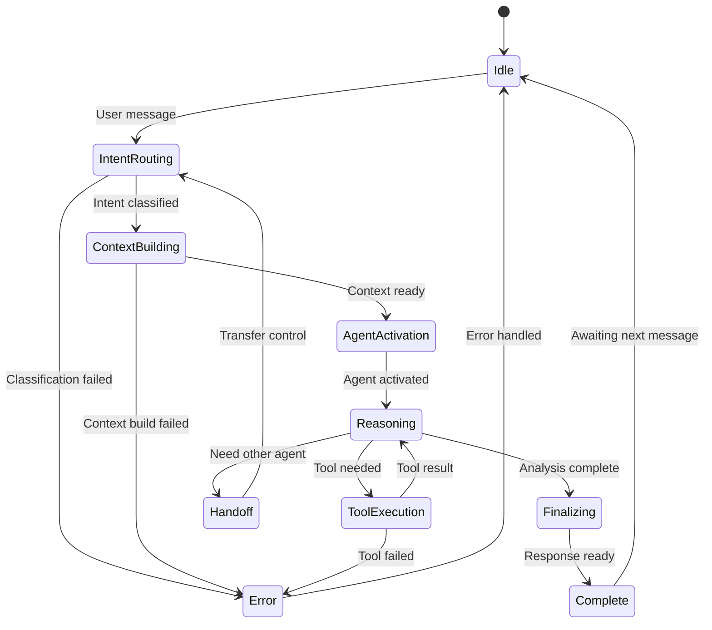

# starboard Architecture

**Package**: `starboard`
**Version**: 0.1.0
**Purpose**: MCP server + CLI with multi-agent system + public API facade
**Last Updated**: 2026-08-27
**Complexity**: ⭐⭐⭐⭐⭐ (Highest)

---

## Overview

`starboard` is the server/experience package of the Starboard AI Agent platform. It
orchestrates domain-specialized AI agents, executes the tool surface, integrates with
Databricks APIs, and is consumed primarily via a CLI (`starboard`) and an MCP server
(`starboard-mcp`). A minimal FastAPI process (`starboard-server`) exists for health
probes and an optional MCP HTTP mount — it is **not** a chat/REST API.

### Key Responsibilities

1. **Multi-Agent Orchestration**: coordinate domain agents (Query, Job, UC, Cluster,
   Analytics/FinOps, Warehouse, Discovery, Diagnostic) behind the Intent Router.
2. **In-process event stream**: typed reasoning/tool/output events surfaced to the
   CLI/SDK (not an HTTP SSE endpoint).
3. **Tool Execution**: three-layer tools + the `starboard.mcp_tools` plugin seam.
4. **Workload Review**: the `WorkloadReviewService` + validator council over public
   `system.*` data.
5. **Ports + internal-data gate**: public port adapters + the `starboard.port_adapters`
   contract (internal adapters registered only by `starboard-internal`, closed by default).
6. **Public API facade**: `starboard/__init__.py` re-exports a curated API (PEP 562) that
   the CLI composes instead of reaching into internals.
7. **State + external integration**: pluggable state backends, Databricks API, LLM adapters.

### Design Philosophy

- **Async-first**: All I/O operations are non-blocking
- **Event-driven**: in-process event stream for real-time UX
- **Agent-centric**: Domain experts, not monolithic system
- **Observable**: Comprehensive logging, tracing, metrics
- **Resilient**: Circuit breakers, retries, graceful degradation

---

## High-Level Architecture

```
┌─────────────────────────────────────────────────────────┐
│  Entrypoints                                             │
│  ├── starboard          (CLI, in-process)               │
│  ├── starboard-mcp       (stdio MCP server)             │
│  └── starboard-server    (FastAPI: /health + /mcp only) │
├─────────────────────────────────────────────────────────┤
│  Public API facade (starboard/__init__.py, PEP 562)     │
├─────────────────────────────────────────────────────────┤
│  Agent System (agents/)                                  │
│  ├── MultiAgentConversationManager (orchestrator)       │
│  ├── IntentRouter (classification)                      │
│  ├── DomainAgents (specialists)                         │
│  └── ToolRegistry (thread-isolated execution)           │
├─────────────────────────────────────────────────────────┤
│  Tool System (tools/) + plugin seam (starboard.mcp_tools)│
│  ├── Domain logic (tools/domain/)                       │
│  ├── Services (tools/services/)  ── WorkloadReviewService│
│  └── Adapters (tools/adapters/)                         │
├─────────────────────────────────────────────────────────┤
│  Ports + adapters (ports/, adapters/)                    │
│  ├── Public port adapters                               │
│  ├── starboard.port_adapters contract (internal gate)   │
│  ├── LLM clients (multi-provider)                       │
│  └── Databricks API client                              │
├─────────────────────────────────────────────────────────┤
│  Infrastructure (infra/)                                 │
│  ├── Configuration & DI container                       │
│  ├── Caching (SDK LRU cache, query result cache)       │
│  ├── Logging & observability                           │
│  ├── Authentication (auth-by-subtraction resolver)     │
│  └── Reliability (circuit breakers, retries)           │
└─────────────────────────────────────────────────────────┘
```

---

## Package Structure

```
starboard/
├── starboard/
│   ├── __init__.py             # Public API facade (PEP 562 lazy re-exports)
│   ├── main.py                 # Minimal FastAPI app (health + optional /mcp)
│   ├── bootstrap.py            # Compose agent runtime (llm, api, tools, factory)
│   │
│   ├── cli/                    # CLI: main + subcommands (review, genie, auth)
│   ├── mcp/                    # MCP server (stdio + streamable-http transports)
│   │
│   ├── agents/                 # Multi-agent system
│   │   ├── agent_factory.py    # Agent creation
│   │   ├── conversation/       # Multi-agent coordination + handoffs
│   │   ├── domain/             # Base domain agent + reasoning loop
│   │   ├── routing/            # Intent router
│   │   ├── tools/              # Tool registry (thread-isolated execution)
│   │   └── tool_categories.py  # Domain-to-tool mappings
│   │
│   ├── tools/                  # Tool system (3-layer)
│   │   ├── domain/             # Business logic (no I/O): query/job/uc/cluster/
│   │   │                       #   warehouse/analytics/discovery/diagnostic/...
│   │   ├── services/           # Orchestration + WorkloadReviewService,
│   │   │                       #   validator_council, direct_chart_builder
│   │   ├── adapters/           # LLM-facing tool adapters
│   │   └── plugins.py          # ToolPlugin contract (starboard.mcp_tools seam)
│   │
│   ├── ports/                  # Port registry + entry-point discovery
│   │   ├── discovery.py        # starboard.port_adapters loader (gate)
│   │   └── registry.py
│   │
│   ├── discovery/              # Query-pack executor + registry
│   ├── adapters/               # External integrations
│   │   ├── llm/                # LLM clients (multi-provider)
│   │   ├── apis/databricks/    # Databricks API client
│   │   ├── ports/              # Public port adapters (analytics_sql, ...)
│   │   └── state/              # State backends: sqlite/postgres/inmemory/redis/lakebase
│   │
│   ├── infra/                  # Config, DI, caching, observability, auth, reliability
│   ├── prompts/                # Domain + router prompts
│   ├── domain/                 # Server-tier domain models
│   ├── sdk/                    # Programmatic client
│   └── repositories/           # conversation_patterns_repository, feedback_repository
│
└── tests/
    ├── unit/
    ├── integration/
    └── golden/
```

> Removed in the cleanup baseline (do **not** document): `api/` REST layer, the
> multi-agent `services/{messaging,clarification,intent,feedback}` island,
> `services/memory/memory_consolidation.py`, `clarification_repository.py`, and the
> chart `chart_renderer`/`chart_config_validator` (chart path is now
> `direct_chart_builder.py`). See the close-out cleanup report.

---

## Core Subsystems

### 1. Multi-Agent System (`agents/`)

The heart of the platform - orchestrates domain-specialized AI agents.

#### Architecture

```
User Message
     │
     ▼
MultiAgentManager
     │
     ├──> IntentRouter ──> Classify: QUERY | JOB | UC | CLUSTER | ANALYTICS | WAREHOUSE | DIAGNOSTIC
     │
     ├──> SpecialistContextBuilder ──> Build context for agent
     │
     ├──> DomainAgent (QueryAgent/JobAgent/UCAgent/ClusterAgent/etc.)
     │    │
     │    ├──> ReasoningEngine ──> LLM reasoning loop
     │    │    │
     │    │    ├──> Analyze situation
     │    │    ├──> Select tools
     │    │    ├──> Plan actions
     │    │    └──> Decide next step
     │    │
     │    ├──> ToolExecutor ──> Execute selected tools
     │    │    └──> ToolRegistry ──> Map to implementations
     │    │
     │    └──> EventStreamer ──> Broadcast SSE events
     │
     ├──> HandoffCoordinator ──> Manage agent transitions
     │
     └──> OutputBuilder ──> Format final response
```

#### Key Components

**MultiAgentConversationManager** (`conversation/multi_agent_manager.py`)
- Main orchestrator coordinating all agents
- Manages conversation lifecycle
- Routes messages to appropriate agents
- Handles agent handoffs
- Broadcasts events to clients

**IntentRouter** (`routing/intent_router.py`)
- Classifies user intent using LLM
- Determines which specialist agent to activate
- Extracts key entities (query_id, job_id, table_name, etc.)
- Confidence scoring for routing decisions

**DomainAgent** (`domain/domain_agent.py`)
- Base class for all specialist agents
- Implements continuous reasoning loop
- Dynamic tool selection based on context
- Step-by-step execution with interruption support
- Adaptive planning (can change strategy mid-execution)

**Specialist Agents**:
- **QueryAgent**: SQL optimization and query analysis
- **JobAgent**: Databricks job performance tuning
- **UCAgent**: Unity Catalog metadata, lineage, governance, storage optimization
- **DiagnosticAgent**: Troubleshooting and debugging

**HandoffCoordinator** (`conversation/handoff_coordinator.py`)
- Manages transitions between agents
- Preserves context across handoffs
- Intelligent agent selection for follow-ups

#### Agent Lifecycle



---

### 2. Tool System (`tools/`)

45+ tools organized in three-layer architecture:

```
Domain (Pure Logic)
      ↓
Service (Orchestration)
      ↓
Adapter (LLM Interface)
```

#### Tool Categories

**Query Tools** (10+ tools):
- `resolve_query`: Get query metadata and execution history
- `analyze_query_plan`: Analyze execution plan
- `get_query_stats`: Get performance statistics
- `optimize_query`: Generate optimization recommendations

**Job Tools** (10+ tools):
- `resolve_job`: Get job configuration and history
- `get_job_runs`: Get recent run history
- `analyze_job_performance`: Performance analysis
- `get_task_metadata`: Task-level details

**UC Tools** (14 tools):
- `list_uc_assets`: List catalogs, schemas, tables, volumes, functions
- `get_table_metadata`: Comprehensive table metadata
- `get_table_lineage`: Upstream/downstream dependencies
- `get_table_grants`: Access policies and permissions
- `analyze_table_schema`: Schema analysis and anomaly detection
- `get_table_history`: Delta table version history
- `analyze_access_patterns`: Query frequency and reader/writer tracking
- `detect_schema_drift`: Schema evolution tracking
- `recommend_storage_optimization`: OPTIMIZE/VACUUM recommendations
- `analyze_query_impact`: Predict query performance impact
- `get_table_fingerprint`: Comprehensive table profile
- `attribute_table_costs`: Cost breakdown
- `generate_schema_diff`: Compare schema versions
- `analyze_policy_coverage`: Security policy assessment

**Compute Tools** (5+ tools):
- `get_warehouse_config`: Warehouse configuration
- `get_cluster_config`: Cluster configuration
- `analyze_compute_usage`: Usage patterns

**Analytics Tools** (7+ tools):
- `run_analytics_query`: Execute parameterized queries
- `top_k_jobs_by_cost`: Cost analysis
- `top_k_queries_by_runtime`: Performance analysis
- `cost_trend_analysis`: Cost trends over time

#### Tool Architecture

Each tool follows three-layer pattern:

```python
# Layer 1: Domain (tools/domain/)
# Pure business logic, no I/O
def analyze_query_logic(
    query_text: str,
    execution_plan: dict,
) -> QueryAnalysis:
    # Pure computation
    pass

# Layer 2: Service (tools/services/)
# Orchestration, API calls
class QueryService:
    async def analyze_query(
        self,
        query_id: str,
    ) -> QueryAnalysis:
        # Fetch data
        plan = await databricks_client.get_plan(query_id)
        # Call domain logic
        analysis = analyze_query_logic(query.text, plan)
        return analysis

# Layer 3: Adapter (tools/adapters/)
# LLM-facing interface
@tool_v2("analyze_query")
async def analyze_query_tool(query_id: str) -> ToolResult:
    """Analyze a Databricks SQL query."""
    service = get_query_service()
    result = await service.analyze_query(query_id)
    return ToolResult(data=result)
```

**Benefits**:
- **Testable**: Domain logic has no I/O
- **Composable**: Services can use multiple domain functions
- **Evolvable**: Can change adapters without touching logic

---

### 3. Server + entrypoints (`main.py`, `cli/`, `mcp/`)

The FastAPI app (`main.py`) is minimal — it registers `/`, `/health/live`,
`/health/ready`, and conditionally mounts the MCP streamable-HTTP transport at `/mcp`.
There is **no** REST chat/data/visualization API and **no** HTTP SSE endpoint. The
agent's typed event stream is delivered **in-process** to the CLI/SDK.

Primary entrypoints:

- **`starboard`** (`cli/main.py:main`) — flag-based CLI + subcommands `review`,
  `genie ask`, `auth {login,status}`.
- **`starboard-mcp`** (`mcp/cli.py:main`) — stdio MCP server.
- **`starboard-server`** (`main.py:run`) — the minimal FastAPI process.

The public API facade (`starboard/__init__.py`) is what the CLI composes:
`get_logger`, `describe_auth`, `resolve_workspace_client`, `create_llm_client`,
`AnalyticsSqlAdapter`, `LLMSQLGenerator`, `CouncilConfig`, `build_council`,
`WorkloadReviewService`.

---

### 4. Workload Review (`tools/services/`)

`WorkloadReviewService` (`tools/services/workload_review_service.py`) orchestrates the
Phase-3 flagship: it resolves rules from the kernel `RuleRegistry`, runs only the
evidence query-pack queries those rules need (`discovery/executor.py`), and hands rows
to the pure kernel evaluator that returns a ranked `WorkloadReview`. Optional gates: a
pure severity gate and the model-calling `ValidatorCouncil`
(`tools/services/validator_council.py`, `CouncilConfig`/`build_council`). See
[System Architecture → Workload Review](../../architecture/SYSTEM_ARCHITECTURE.md#workload-review).

---

### 5. Adapter Layer (`adapters/`)

External service integrations.

#### LLM Adapters (`adapters/llm/`)

```python
class LLMClient(Protocol):
    """Abstract LLM interface."""
    
    async def complete(
        self,
        messages: list[Message],
        tools: list[Tool],
        **kwargs
    ) -> LLMResponse:
        """Generate completion."""
        ...

class OpenAIClient:
    """OpenAI implementation."""
    # Implements LLMClient protocol
```

**Features**:
- Streaming support
- Function calling
- Token tracking
- Cost calculation
- Retry logic

#### Databricks Adapter (`adapters/apis/databricks/`)

```python
class DatabricksAPI:
    """Databricks REST API client."""
    
    async def get_query(self, query_id: str) -> Query: ...
    async def get_job(self, job_id: str) -> Job: ...
    async def list_tables(self, catalog: str) -> list[Table]: ...
    # 20+ methods

class CachedDatabricksAPI:
    """Cached wrapper for DatabricksAPI."""
    
    async def get_job_async(self, job_id: int) -> dict: ...  # Cached
    async def get_cluster_async(self, cluster_id: str) -> dict: ...  # Cached
    # Async cached methods + sync passthrough
```

**Features**:
- Async HTTP client
- Automatic retries
- Rate limiting
- Response caching (see CachedDatabricksAPI)
- Error handling
- **Automatic warehouse ID resolution**: If `DATABRICKS_WAREHOUSE_ID` is not set, automatically fetches the workspace's default warehouse

#### State Adapters (`adapters/state/`)

Multiple storage backends:

**SQLite** (`sqlite/`):
- Embedded database
- sqlite-vec for vector similarity
- Fast, local development

**PostgreSQL** (`postgres/`):
- Production backend
- pgvector extension
- Migrations with SQL files

**Redis** (`redis/`):
- Session cache
- Rate limiting
- TTL-based expiry

**Databricks Lakebase** (`databricks/`):
- Postgres-compatible
- OAuth token refresh
- Delta Lake storage

**In-Memory** (`inmemory/`):
- Testing only
- No persistence

---

### 6. Caching Infrastructure (`infra/cache/`)

Multi-layer caching for performance optimization.

#### AsyncLRUCache

Async-safe LRU cache with per-key locking to prevent stampede:

```python
from starboard.infra.cache import AsyncLRUCache

cache = AsyncLRUCache(max_size=500, default_ttl=300)

@cache.cached(key_prefix="job", ttl=600)
async def get_job(job_id: int) -> dict:
    return await fetch_job_from_api(job_id)
```

**Features**:
- LRU eviction when max_size reached
- TTL expiration with reset-on-hit option
- Per-key locking (single-flight pattern) to prevent duplicate concurrent requests
- Hit rate metrics tracking

#### CachedDatabricksAPI

Cached wrapper for Databricks SDK calls:

```python
from starboard.adapters.apis.databricks import CachedDatabricksAPI

api = CachedDatabricksAPI(cfg=config)

# Cached with 10 min TTL
job = await api.get_job_async(123)

# Second call returns cached value
job = await api.get_job_async(123)  # Cache hit!
```

**Cache TTLs**:
| Resource | TTL |
|----------|-----|
| Job metadata | 10 minutes |
| Cluster metadata | 5 minutes |
| Warehouse metadata | 5 minutes |
| Table metadata | 10 minutes |
| Job runs | 1 minute |

#### QueryResultCache

Layer 2 cache for query results (MCP client display):

- 60 minute default TTL
- Reset-on-hit keeps frequently accessed data warm
- Supports Polars DataFrame serialization

---

### 7. Infrastructure (`infra/`)

Cross-cutting concerns.

#### Configuration (`infra/core/`)

```python
class AppConfig:
    """Application configuration."""
    environment: str
    database_backend: str
    database_url: str
    databricks_host: str
    openai_api_key: str
    # 30+ fields
    
    @classmethod
    def from_env(cls) -> AppConfig:
        """Load from environment."""
        ...
```

#### Dependency Injection (`infra/core/container.py`)

```python
class Container:
    """DI container for all dependencies."""
    
    def __init__(self, config: AppConfig):
        self.config = config
        self._state_store = None
        self._memory_store = None
        # Lazy initialization
    
    async def initialize(self):
        """Initialize all services."""
        self._state_store = await self._create_state_store()
        # ...
```

#### Observability (`infra/observability/`)

**Structured Logging**:
```python
log.info(
    "llm_call_completed",
    trace_id=trace_id,
    model="gpt-4",
    tokens_used=1234,
    latency_ms=567,
    cost_usd=0.02,
)
```

**Metrics**:
- Request counts
- Latency histograms
- Error rates
- Token usage
- Cost tracking

**Tracing**:
- Distributed traces
- Span tracking
- Performance profiling

#### Reliability (`infra/reliability/`)

**Circuit Breakers**:
```python
@circuit_breaker(
    failure_threshold=5,
    recovery_timeout=30,
)
async def call_databricks_api():
    # Protected call
    ...
```

**Retries**:
```python
@retry(
    max_attempts=3,
    backoff=exponential,
    retryable_exceptions=[HTTPError, Timeout],
)
async def fetch_data():
    ...
```

---

## Data Flow

### Request Lifecycle

```
1. HTTP Request
   └─> FastAPI endpoint

2. Dependency Injection
   └─> Container provides services

3. Message Processing
   └─> MultiAgentManager.process_message()

4. Intent Classification
   └─> IntentRouter.classify()
   
5. Context Building
   └─> ContextBuilder.build()

6. Agent Activation
   └─> DomainAgent.run_stream()
   
7. Reasoning Loop
   ├─> LLM generates reasoning
   ├─> Selects tools
   ├─> Executes tools
   ├─> Analyzes results
   └─> Decides next action

8. Event Streaming
   └─> SSE to client

9. Response Formatting
   └─> Final answer

10. State Persistence
    └─> Save conversation
```

### Tool Execution Flow

```
Agent needs tool
     │
     ▼
ToolRegistry.get_tool(name)
     │
     ▼
ToolAdapter.execute(params)
     │
     ├──> Validate params
     ├──> Check cache
     │    └──> Return if hit
     ├──> Check circuit breaker
     │    └──> Fail fast if open
     ├──> Execute tool
     │    ├──> ToolService.execute()
     │    │    └──> Databricks API call
     │    └──> Domain logic
     ├──> Cache result
     └──> Return ToolResult
```

---

## Key Design Patterns

### 1. Hexagonal Architecture

Core domain isolated from I/O:

```
Domain Logic (agents, tools/domain)
      ↕ (protocols)
Ports (state_store, llm_client)
      ↕
Adapters (sqlite, openai)
      ↕
External World (DB, APIs)
```

### 2. Event-Driven Architecture

Everything is an event:

```python
@dataclass
class ThinkingStepEvent:
    """Agent reasoning step."""
    step_number: int
    thought: str
    action: str | None

# Stream events
async for event in agent.run_stream():
    await broadcast(event)
```

### 3. Repository Pattern

High-level data operations:

```python
class ConversationRepository:
    def __init__(self, store: StateStore):
        self._store = store
    
    async def add_message(self, conv_id: str, message: Message):
        conversation = await self._store.load(conv_id)
        conversation.add_message(message)
        await self._store.save(conversation)
```

### 4. Strategy Pattern

Pluggable implementations:

```python
# Different state backends
state_store: StateStore = (
    SQLiteStateStore() if dev_mode
    else PostgresStateStore()
)
```

### 5. Chain of Responsibility

Agent handoffs:

```python
# QueryAgent determines it needs UCAgent
await handoff_coordinator.request_handoff(
    from_agent="query",
    to_agent="uc",
    reason="Need table schema information"
)
```

---

## Configuration

### Environment Variables

**Required**:
- `DATABRICKS_HOST`: Databricks workspace URL
- `DATABRICKS_TOKEN`: Access token
- `OPENAI_API_KEY`: OpenAI API key

**Optional**:
- `DATABRICKS_WAREHOUSE_ID`: SQL Warehouse ID (auto-resolves from workspace default if not set)
- `DATABASE_BACKEND`: memory|sqlite|postgres|lakebase|uc (default: **memory**)
- `DATABASE_URL`: Connection string (postgres/lakebase)
- `REDIS_URL`: Redis connection
- `LOG_LEVEL`: DEBUG|INFO|WARNING|ERROR (default: INFO)
- `PORT`: Server port (default: 8000)

See [Configuration Guide](../../CONFIGURATION.md) for complete list.

---

## Testing Strategy

### Unit Tests (`tests/unit/`)

- 90+ test files
- Fast execution (<5s total)
- Mock all I/O
- 85%+ coverage for agent system

### Integration Tests (`tests/integration/`)

- Real Databricks calls
- Real LLM calls
- End-to-end flows
- Slower execution

### Golden Tests (`tests/golden/`)

- Prompt snapshot testing
- LLM output validation
- Regression prevention

---

## Performance Characteristics

### Typical Metrics

- **Cold start**: ~2-3 seconds
- **Intent classification**: ~500ms
- **Tool execution**: 100ms - 5s (varies by tool)
- **LLM reasoning step**: 1-3 seconds
- **Full conversation turn**: 5-15 seconds

### Scalability

- **Horizontal**: Multiple server instances
- **Vertical**: Async I/O handles high concurrency
- **Database**: PostgreSQL for production scale
- **Caching**: Redis for shared cache across instances

---

## Related Documentation

- [System Architecture](../../architecture/SYSTEM_ARCHITECTURE.md) - Overall system design
- [Tool Catalog](../../tools/TOOL_CATALOG.md) - Tool reference
- [Tool Development Guide](../../tools/TOOL_DEVELOPMENT_GUIDE.md) - Build new tools
- [HTTP / MCP Reference](../../api/API_REFERENCE.md) - Server surface (health + MCP)
- [Deployment Guide](../../DEPLOYMENT.md) - Production deployment

---

## Next Steps

- See [Common Tasks](../../guides/COMMON_TASKS.md) for adding features
- See [Testing Guide](../../TESTING.md) for test strategies
- See [Package Integration](../../integration/PACKAGE_INTEGRATION.md) for cross-package patterns

---

**Last Updated**: 2025-12-06

