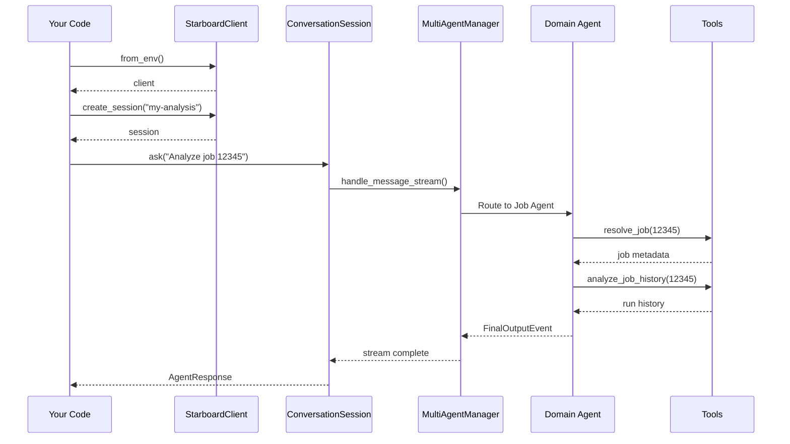

# SDK Usage Guide

> **Docs** > **User Guide** > **SDK Usage**
> Reading time: 10 minutes

## What You'll Learn

- How to install and configure the Starboard SDK
- How to create conversations and send messages programmatically
- How to stream real-time agent events
- How to use the SDK in Jupyter and Databricks notebooks
- How to handle errors and timeouts

---

## Installation

Install the SDK package using `pip` or `uv`:

```bash
# Using pip
pip install starboard-sdk

# Using uv (recommended in the monorepo)
uv sync --all-packages
```

The SDK depends on `starboard-server` and `starboard-core`, which are installed automatically.

!!! note "Monorepo users"
    If you are working inside the Starboard monorepo, all packages are already installed after running `make setup`.

---

## Authentication and Configuration

The SDK reads configuration from environment variables, the same ones used by the CLI and server.

### Required Variables

| Variable | Description |
|----------|-------------|
| `DATABRICKS_HOST` | Your Databricks workspace URL (e.g., `https://my-workspace.cloud.databricks.com`) |
| `DATABRICKS_TOKEN` | Databricks personal access token |
| `LLM_API_KEY` | API key for your LLM provider (OpenAI, Azure, or Databricks-hosted) |

### Optional Variables

| Variable | Default | Description |
|----------|---------|-------------|
| `LLM_MODEL` | `databricks-claude-sonnet-4-5` | Model to use for all agents |
| `LLM_BASE_URL` | -- | Custom OpenAI-compatible endpoint |
| `LLM_TEMPERATURE` | `0.4` | Sampling temperature (0.0--2.0) |
| `DATABRICKS_WAREHOUSE_ID` | auto-detected | SQL warehouse for queries |

### Setting Up a `.env` File

Create a `.env` file in your project directory:

```bash
DATABRICKS_HOST=https://your-workspace.cloud.databricks.com
DATABRICKS_TOKEN=dapi_your_token_here
LLM_API_KEY=<your-api-key>
LLM_MODEL=databricks-claude-sonnet-4-5
```

The SDK loads `.env` automatically when you call `StarboardClient.from_env()`.

---

## Basic Usage

### Creating a Client

The simplest way to get started is with `from_env()`, which reads all configuration from your environment:

```python
from starboard_sdk import StarboardClient

# Create a client from environment variables
client = await StarboardClient.from_env()
```

!!! tip "Use async context managers"
    The client manages resources (database connections, HTTP clients) that should be cleaned up when you are done. Use `async with` for automatic cleanup:

    ```python
    async with await StarboardClient.from_env() as client:
        session = await client.create_session()
        response = await session.ask("Analyze job 12345")
        print(response.report)
    # Resources are cleaned up automatically
    ```

### Creating a Session

A session represents a multi-turn conversation. The agent remembers everything you discussed in previous turns:

```python
# Create a new session
session = await client.create_session(name="etl-tuning")
```

If you provide a `name`, the session is persisted to disk. You can resume it later, even across Python process restarts.

### Sending Messages

Use `session.ask()` to send a message and wait for the complete response:

```python
response = await session.ask("Analyze job 12345 and suggest optimizations")

# Check if the response succeeded
if response.ok:
    print(response.report)       # Formatted markdown report
    print(response.domain)       # Which agent handled it (e.g., "job")
    print(response.tools_used)   # Tools the agent called
    print(response.duration_seconds)
else:
    print(f"Error: {response.error}")
```

### Multi-Turn Conversations

Because sessions maintain context, follow-up questions work naturally:

```python
session = await client.create_session(name="query-analysis")

# Turn 1: Initial analysis
r1 = await session.ask("Why is query 01ef-abc123-def456 running slowly?")
print(r1.report)

# Turn 2: Follow-up using context from Turn 1
r2 = await session.ask("Would liquid clustering help the tables you found?")
print(r2.report)

# Turn 3: Another follow-up
r3 = await session.ask("Show me the CREATE TABLE statement for the largest table")
print(r3.report)

print(f"Completed {session.turn_count} turns")
```

---

## Streaming Responses

For long-running analyses, you can stream events in real time instead of waiting for the full response:

```python
from starboard_server.agents.events import (
    ThinkingEvent,
    ToolStartEvent,
    ToolEndEvent,
    FinalOutputEvent,
)

session = await client.create_session()

async for event in session.ask_stream("Run a workspace health check"):
    if isinstance(event, ThinkingEvent):
        print(f"Thinking: {event.content[:80]}...")
    elif isinstance(event, ToolStartEvent):
        print(f"  Calling tool: {event.tool_name}")
    elif isinstance(event, ToolEndEvent):
        print(f"  Tool complete: {event.tool_name}")
    elif isinstance(event, FinalOutputEvent):
        print("--- Final Report ---")
        print(event.output)
```

!!! tip "When to stream"
    Streaming is useful when you want to show progress to users (e.g., in a notebook cell) or when you need to process individual tool results as they arrive.

---

## Sequence Diagram



*SDK request flow: your code creates a client and session, then sends messages that flow through the multi-agent system.*

---

## Common Workflows

### Query Analysis

```python
async with await StarboardClient.from_env() as client:
    session = await client.create_session()

    response = await session.ask(
        "Analyze and optimize query with statement ID 01ef-abc123-def456"
    )

    if response.ok:
        print(f"Agent: {response.domain}")
        print(f"Tools used: {', '.join(response.tools_used)}")
        print(response.report)
```

### Job Debugging

```python
async with await StarboardClient.from_env() as client:
    session = await client.create_session(name="job-investigation")

    # Investigate the failure
    r1 = await session.ask("Job 67890 failed in the last 3 runs. What is wrong?")
    print(r1.report)

    # Ask for code-level analysis
    r2 = await session.ask("Check the source code for anti-patterns")
    print(r2.report)
```

### Cost Analysis

```python
async with await StarboardClient.from_env() as client:
    session = await client.create_session()

    response = await session.ask(
        "Show Databricks cost trends for the last 30 days, broken down by compute type"
    )
    print(response.report)

    # Access raw data for further processing
    if response.raw_output:
        data = response.raw_output
        print(f"Tokens used: {response.tokens_used}")
        print(f"Estimated cost: ${response.cost_usd:.4f}")
```

---

## Resuming Sessions

Named sessions persist across process restarts:

```python
# Script 1: Start an investigation
async with await StarboardClient.from_env() as client:
    session = await client.create_session(name="incident-42")
    await session.ask("Analyze job 12345")
```

```python
# Script 2 (later): Continue the investigation
async with await StarboardClient.from_env() as client:
    session = await client.resume_session("incident-42")
    # The agent remembers the previous analysis
    response = await session.ask("What about the cluster configuration?")
    print(response.report)
```

### Listing Sessions

```python
sessions = await client.list_sessions()
for s in sessions:
    print(f"  {s.session_name} (turns: {s.turn_count})")
```

---

## Optimization Modes

You can control whether the agent makes live Databricks API calls:

```python
from starboard_core.domain.models.llm import OptimizationMode

# Online (default): Full API access
session = await client.create_session(mode=OptimizationMode.ONLINE)

# Offline: No live API calls (code review, cached data only)
session = await client.create_session(mode=OptimizationMode.OFFLINE)

# Override per-turn
response = await session.ask(
    "Review this query for anti-patterns",
    mode=OptimizationMode.OFFLINE,
)
```

---

## Error Handling

### Timeouts

The default timeout is 5 minutes per turn. Adjust it for complex analyses:

```python
# Increase timeout for complex analyses
response = await session.ask(
    "Run a full workspace health check",
    timeout=600.0,  # 10 minutes
)

# No timeout (wait indefinitely)
response = await session.ask(
    "Run a full workspace health check",
    timeout=None,
)
```

If a timeout occurs, a `TimeoutError` is raised:

```python
try:
    response = await session.ask("Complex analysis...", timeout=60.0)
except TimeoutError:
    print("The agent did not respond in time. Try increasing the timeout.")
```

### Agent Errors

Non-fatal agent errors are captured in the response rather than raising exceptions:

```python
response = await session.ask("Analyze job 99999")

if not response.ok:
    print(f"Agent error: {response.error}")
else:
    print(response.report)
```

### Authentication Errors

If your credentials are missing or invalid, the client raises an error at creation time:

```python
try:
    client = await StarboardClient.from_env()
except Exception as e:
    print(f"Configuration error: {e}")
    print("Check that DATABRICKS_HOST, DATABRICKS_TOKEN, and LLM_API_KEY are set.")
```

---

## Notebook Integration

### Jupyter Notebook

```python
import asyncio
from starboard_sdk import StarboardClient

async def analyze():
    async with await StarboardClient.from_env() as client:
        session = await client.create_session()
        response = await session.ask("Analyze cost trends for the last 7 days")
        return response

# In Jupyter, you can use await directly in cells
response = await analyze()

# Display as formatted markdown
from IPython.display import Markdown
Markdown(response.markdown)
```

### Databricks Notebook

```python
# Cell 1: Setup
%pip install starboard-sdk

# Cell 2: Configure (use Databricks secrets)
import os
os.environ["DATABRICKS_HOST"] = dbutils.secrets.get("starboard", "host")
os.environ["DATABRICKS_TOKEN"] = dbutils.secrets.get("starboard", "token")
os.environ["LLM_API_KEY"] = dbutils.secrets.get("starboard", "llm_key")

# Cell 3: Run analysis
from starboard_sdk import StarboardClient

client = await StarboardClient.from_env()
session = await client.create_session(name="notebook-analysis")

response = await session.ask("Analyze job 12345")
displayHTML(f"<div>{response.markdown}</div>")
```

### Pipeline Integration

Use the SDK in automated pipelines for scheduled analysis:

```python
import asyncio
from starboard_sdk import StarboardClient

async def nightly_health_check():
    async with await StarboardClient.from_env() as client:
        session = await client.create_session()
        response = await session.ask("Run a workspace health check")

        if response.ok:
            # Write report to a file or send via email
            with open("reports/health_check.md", "w") as f:
                f.write(response.markdown)
            print(f"Report generated in {response.duration_seconds:.1f}s")
        else:
            print(f"Health check failed: {response.error}")
            raise SystemExit(1)

asyncio.run(nightly_health_check())
```

---

## AgentResponse Reference

Every call to `session.ask()` returns an `AgentResponse` object:

| Property | Type | Description |
|----------|------|-------------|
| `ok` | `bool` | `True` if the turn succeeded (no fatal errors) |
| `report` | `str` or `None` | Formatted markdown report |
| `markdown` | `str` | Report as markdown (with fallback for errors) |
| `raw_output` | `dict` | Full agent output dictionary |
| `tools_used` | `list[str]` | Tool names invoked during the turn |
| `tokens_used` | `int` or `None` | Total tokens consumed |
| `cost_usd` | `float` or `None` | Estimated cost in USD |
| `duration_seconds` | `float` | Wall-clock time in seconds |
| `domain` | `str` or `None` | Domain agent that handled the request |
| `conversation_id` | `str` | Underlying conversation identifier |
| `turn_number` | `int` | Which turn this response corresponds to |
| `error` | `str` or `None` | Error message if the turn failed |

---

## Next Steps

- [Web Interface Guide](web-ui.md) -- Use the browser-based UI for interactive analysis
- [CLI Reference](cli.md) -- Use the command-line interface for scripting
- [Understanding Reports](understanding-reports.md) -- Learn how to interpret agent reports
- [Workflow: Cost Analysis](workflows/cost-analysis.md) -- End-to-end cost analysis example
