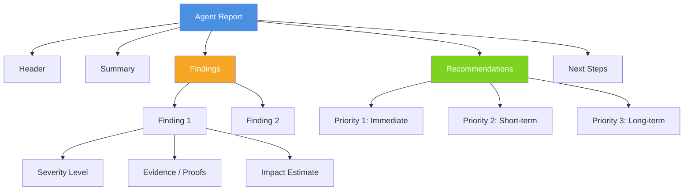

# Understanding Agent Reports

> **Docs** > **User Guide** > **Understanding Reports**
> Reading time: 8 minutes

## What You'll Learn

- The structure of agent reports (findings, evidence, impacts, recommendations)
- How to interpret severity levels and confidence scores
- How to prioritize and act on recommendations
- What each report type looks like across different agents

---

## Report Structure Overview

Every Starboard agent produces a structured report after completing its analysis. While the exact content varies by domain, all reports follow a consistent structure:

```
Report
├── Header (agent, domain, report type)
├── Summary (1--3 sentence overview)
├── Findings
│   ├── Finding 1
│   │   ├── Severity (critical / high / medium / low / info)
│   │   ├── Evidence (data the agent gathered)
│   │   └── Impact estimate (% improvement, confidence)
│   ├── Finding 2
│   └── ...
├── Recommendations (prioritized action items)
└── Next Steps (follow-up questions you can ask)
```



*Anatomy of a Starboard agent report showing the hierarchy from header through findings to actionable recommendations.*

---

## Reading Findings

### Severity Levels

Each finding is tagged with a severity level that tells you how urgent it is:

| Severity | Meaning | Action Required |
|----------|---------|-----------------|
| **Critical** | Active problem causing failures, data loss, or major cost waste | Fix immediately |
| **High** | Significant performance or cost issue | Fix within days |
| **Medium** | Optimization opportunity with meaningful impact | Plan for next sprint |
| **Low** | Minor improvement or best-practice suggestion | Address when convenient |
| **Info** | Observation with no action required | For awareness only |

!!! warning "Critical findings"
    If a report contains critical findings, address them before moving to lower-severity items. Critical findings often indicate active failures, security risks, or runaway costs.

### Evidence and Proofs

Every finding includes evidence -- the actual data the agent gathered to support its conclusion. Evidence appears as:

- **Metrics**: Numbers from Databricks APIs (e.g., "query duration: 47 minutes, rows scanned: 2.1 billion")
- **Configuration details**: Settings that contribute to the issue (e.g., "autoscaling disabled, fixed at 2 workers")
- **Historical trends**: Patterns over time (e.g., "job duration increased 3x over the last 14 days")
- **Code analysis**: Anti-patterns found in source code (e.g., "full table scan on unpartitioned table")

Evidence is what separates Starboard recommendations from generic advice. The agent shows you the data it used to reach its conclusion, so you can verify the reasoning.

### Understanding Impact Estimates

Many findings include an impact estimate that predicts the improvement you can expect:

| Component | What It Means |
|-----------|---------------|
| **Expected improvement** | The estimated gain from fixing the issue (e.g., "40--60% faster query execution") |
| **Confidence** | How certain the agent is about the estimate: **High** (strong data support), **Medium** (partial data), **Low** (educated estimate) |
| **Basis** | What data the estimate is based on (e.g., "based on 30-day run history with 142 runs") |

!!! tip "Treat impact estimates as directional guidance"
    Impact estimates are based on the data available at analysis time. Actual results depend on workload patterns, data volumes, and concurrent usage. Use them to prioritize which recommendations to try first, not as guarantees.

---

## Acting on Recommendations

### Priority Ordering

Recommendations are ordered by expected impact. The report typically groups them into:

1. **Immediate** -- Changes you can make right now with high confidence of improvement. These are often configuration changes or simple query rewrites.
2. **Short-term** -- Changes that require some planning or testing. These might involve schema changes, cluster resizing, or workflow restructuring.
3. **Long-term** -- Strategic changes that address root causes. These might involve architecture changes, data modeling improvements, or process changes.

### Implementation Steps

Each recommendation includes enough detail to act on it:

- **What to change** -- The specific setting, query, or configuration to modify.
- **How to change it** -- The exact command, SQL statement, or UI action.
- **Expected result** -- What you should see after the change.
- **Risk** -- What could go wrong and how to mitigate it.

### Verifying Results

After implementing a recommendation, you can ask Starboard to verify the improvement:

**Web UI:**
```
I applied the partition pruning recommendation from the last analysis.
Can you re-analyze query 01ef-abc123-def456 and compare the results?
```

**CLI:**
```bash
starboard --goal "Re-analyze query 01ef-abc123-def456 after optimization"
```

---

## Report Types by Agent

### Advisor Reports

Produced by: **Query Agent**, **Job Agent**, **Cluster Agent**, **Warehouse Agent**

Advisor reports focus on optimization. They analyze a specific resource (a query, job, cluster, or warehouse) and provide targeted recommendations.

**Example summary:**

> **Query Analysis Report**
> Statement `01ef-abc123-def456` is a SELECT query scanning 2.1B rows from `sales.orders` with 3 JOINs. The query completes in 47 minutes. Two critical findings: (1) full table scan on unpartitioned `orders` table, (2) skewed shuffle in the final aggregation stage.

**Key sections to focus on:**
- **Findings** -- What is wrong and why
- **Recommendations** -- Specific changes to make
- **Impact estimates** -- Which changes give the biggest improvement

### Diagnostic Reports

Produced by: **Diagnostic Agent**, **Job Agent** (when debugging failures)

Diagnostic reports focus on root cause analysis. They investigate failures, errors, or unexpected behavior and trace back to the underlying cause.

**Example summary:**

> **Job Diagnostic Report**
> Job `12345` has failed in 3 of the last 5 runs. Root cause: OOM (Out of Memory) error in task `transform_orders` caused by a broadcast join on a 4.2 GB table. The cluster is configured with 8 GB executor memory, insufficient for this operation.

**Key sections to focus on:**
- **Root cause** -- The primary reason for the failure
- **Contributing factors** -- Secondary issues that made it worse
- **Fix** -- The specific change needed to resolve the failure
- **Prevention** -- How to avoid the issue in the future

### Discovery Reports

Produced by: **Discovery Agent**

Discovery reports provide a workspace-wide health assessment. They grade multiple domains (billing, compute, governance, jobs) and identify the highest-impact optimization opportunities across your entire Databricks workspace.

**Example summary:**

> **Workspace Discovery Report**
> Assessed 6 active products across 4 domains. Overall health: B+ (82/100). Two critical findings: (1) 12 idle clusters consuming $840/month, (2) 3 Unity Catalog tables with no access controls. Top opportunity: decommissioning idle clusters would save an estimated $10,000/year.

**Key sections to focus on:**
- **Domain grades** -- A--F grade for each domain (billing, compute, governance, jobs)
- **Top priorities** -- The highest-impact findings across all domains
- **Executive summary** -- One-page overview suitable for sharing with leadership

### Analytics Reports

Produced by: **Analytics Agent** (FinOps)

Analytics reports answer data-driven questions about costs, usage, and trends. They generate and execute SQL queries against Databricks system tables to produce numerical answers.

**Example summary:**

> **Cost Analysis Report**
> Total Databricks spend for the last 30 days: $47,230. Top cost driver: SQL Warehouses ($28,100, 59.5%). Month-over-month change: +12.3%. Three warehouses account for 78% of total warehouse spend.

**Key sections to focus on:**
- **Data tables** -- Raw numbers the agent queried
- **Trends** -- How metrics changed over time
- **Breakdowns** -- Cost or usage split by dimension (team, warehouse, job, etc.)
- **Anomalies** -- Unexpected spikes or drops

---

## Tips for Getting Better Reports

1. **Be specific.** "Analyze job 12345" produces a better report than "help with my job."
2. **Provide context.** "Job 12345 used to run in 20 minutes but now takes 2 hours" helps the agent focus its investigation.
3. **Ask follow-up questions.** Reports are a starting point. Ask the agent to dig deeper into specific findings.
4. **Use interruptible reasoning.** If you see the agent going in the wrong direction, provide a correction mid-analysis. See [Interruptible Reasoning](interruptible-reasoning.md).
5. **Share statement IDs and job IDs.** Specific identifiers let the agent pull real data instead of relying on descriptions.

---

## Next Steps

- [Interruptible Reasoning](interruptible-reasoning.md) -- Guide the agent mid-analysis
- [Workflow: Query Optimization](workflows/query-optimization.md) -- End-to-end query analysis walkthrough
- [Workflow: Job Debugging](workflows/job-debugging.md) -- End-to-end job investigation walkthrough
- [Workflow: Cost Analysis](workflows/cost-analysis.md) -- End-to-end cost analysis walkthrough
- [Workflow: Workspace Discovery](workflows/workspace-discovery.md) -- Full workspace health assessment
- [Troubleshooting](troubleshooting.md) -- Solutions for common issues
