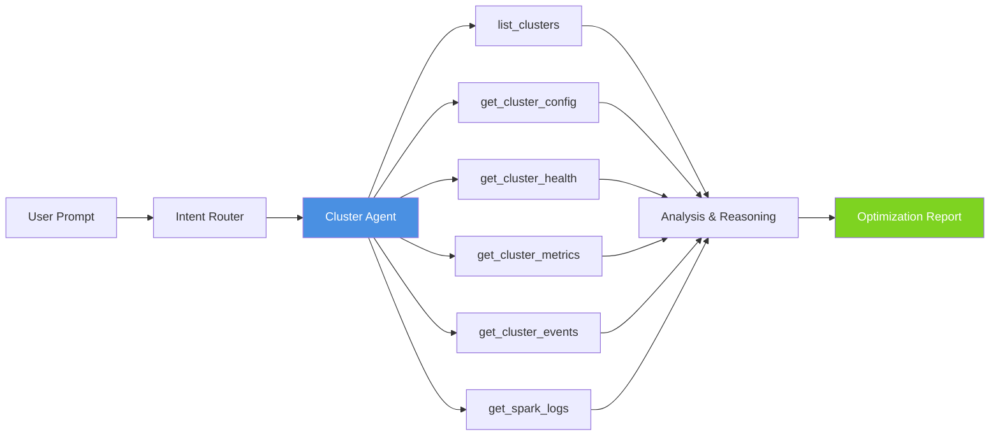

# Workflow: Cluster Optimization

This guide walks through an end-to-end workflow for analyzing Databricks cluster
configurations using the Starboard AI agent. You will learn what to ask, how the
Cluster agent investigates, and how to interpret the optimization recommendations.

---

## When to Use This Workflow

- You want to right-size clusters to reduce cost without sacrificing performance.
- A cluster is showing high CPU, memory pressure, or shuffle spill.
- You suspect autoscaling is not configured optimally.
- You need to compare configurations across multiple clusters.
- You are preparing for a capacity planning review.
- You want to identify idle or underutilized clusters.

---

## What the Cluster Agent Can Do

The Cluster Expert agent has access to the following tools:

| Tool | Purpose |
|------|---------|
| `list_clusters` | List all clusters with recent activity and basic metrics. |
| `get_cluster_config` | Retrieve cluster settings (node types, autoscaling, Spark config). |
| `get_cluster_health` | Health scoring with risk analysis and SLO compliance. |
| `get_cluster_metrics` | CPU, memory, I/O, and shuffle metrics from system tables. |
| `get_cluster_events` | Review scaling events, restarts, and failures. |
| `get_spark_logs` | Analyze Spark driver and executor logs for resource issues. |

---

## Step 1: Start the Conversation

### Scenario A: Optimize a specific cluster

If you have a cluster ID (from the Databricks Clusters UI):

**Web UI:**
```
Analyze cluster 0123-456789-abcdef and recommend optimizations.
```

**CLI:**
```bash
starboard --goal "Optimize cluster 0123-456789-abcdef for cost and performance"
```

### Scenario B: Right-size for a specific workload

```
My nightly ETL runs on cluster 0123-456789-abcdef and takes 3 hours.
Can we make it faster or cheaper?
```

### Scenario C: Fleet-wide review

For a broad assessment of all clusters in your workspace:

**Web UI:**
```
List all active clusters and identify which ones are oversized or idle.
```

**CLI:**
```bash
starboard --goal "Review all active clusters and find cost optimization opportunities"
```

### Scenario D: Investigate a performance issue

```
Cluster 0123-456789-abcdef is showing high memory pressure.
What is causing it and how do I fix it?
```

### Scenario E: Offline review

To review a cluster configuration without making live API calls:

**CLI:**
```bash
starboard --mode offline \
          --goal "Review best practices for a Standard_DS4_v2 cluster with 8 workers"
```

---

## Step 2: What the Agent Does

Once you submit your request, the Cluster Expert follows a systematic investigation:

### Phase 1: Cluster Resolution

```
-> List Clusters  (if no specific cluster ID provided)
-> Get Cluster Config
```

The agent retrieves the cluster configuration, including:

- Node types (driver and worker)
- Autoscaling settings (min/max workers)
- Spark configuration overrides
- Runtime version and libraries
- Cluster policies applied

### Phase 2: Health Assessment

```
-> Get Cluster Health
-> Get Cluster Metrics
```

The agent scores the cluster health across several dimensions:

- **Utilization** -- CPU, memory, and I/O efficiency
- **Cost efficiency** -- Spend vs. workload requirements
- **Configuration** -- Best-practice compliance
- **Stability** -- Error rate and restart frequency

### Phase 3: Event Analysis

```
-> Get Cluster Events
```

The agent reviews recent cluster events to identify:

- Scaling events (scale up, scale down, autoscaling decisions)
- Restarts and failures
- Configuration changes
- Long idle periods

### Phase 4: Deep Dive (if needed)

```
-> Get Spark Logs
```

For performance issues, the agent examines Spark logs for:

- Shuffle spill and memory pressure
- Task skew and straggler tasks
- GC overhead
- Network bottlenecks

---

## Step 3: Interpret the Report

The Cluster agent produces an advisor report with the following sections:

### Cluster Summary

A snapshot of the cluster configuration and current state, including node types,
worker count, runtime, and uptime.

### Health Score

An overall health grade (A through F) with sub-scores for utilization, cost
efficiency, configuration, and stability.

### Findings

Specific issues found during analysis. Each finding includes:

- **Severity** -- Critical, High, Medium, Low, or Info
- **Evidence** -- The data that supports the finding
- **Impact** -- Estimated cost savings or performance improvement

Common findings include:

| Finding | What It Means |
|---------|---------------|
| Cluster is oversized | Worker count or node type exceeds workload requirements |
| Autoscaling not enabled | Fixed-size cluster could benefit from dynamic scaling |
| Autoscaling range too wide | Min/max range causes excessive scaling churn |
| High shuffle spill | Workers running out of memory during shuffle operations |
| Idle cluster consuming credits | Cluster is running but not executing workloads |
| Outdated runtime version | A newer Databricks Runtime has performance improvements |
| Suboptimal Spark config | Spark settings do not match workload characteristics |

### Recommendations

Prioritized actions you can take, ordered by expected impact. Each recommendation
includes the specific configuration change, expected improvement, and any risks.

---

## Example Prompts

Here are effective prompts for common cluster optimization scenarios:

```
Analyze cluster 0123-456789-abcdef and recommend the optimal node type and worker count.
```

```
My cluster is using i3.xlarge nodes. Would switching to i3.2xlarge with fewer workers be cheaper?
```

```
Compare the configurations of clusters A and B. Which is more cost-effective?
```

```
Cluster 0123-456789-abcdef has been running for 72 hours with low utilization.
Should I enable auto-termination?
```

```
Review the Spark configuration on cluster 0123-456789-abcdef for a shuffle-heavy ETL workload.
```

---

## Workflow Diagram



*Cluster optimization workflow: the user prompt is routed to the Cluster Agent, which calls tools to gather data, reasons over the results, and produces an optimization report.*

---

## Related Workflows

- [Job Debugging](job-debugging.md) -- Jobs run on clusters; if a job is slow, the cluster may be the bottleneck
- [Warehouse Optimization](warehouse-optimization.md) -- SQL warehouses are managed clusters with a different optimization model
- [Cost Analysis](cost-analysis.md) -- Cluster costs are a major component of Databricks spend
- [Workspace Discovery](workspace-discovery.md) -- The Discovery agent assesses compute health across all clusters

---

## Next Steps

- [Understanding Reports](../understanding-reports.md) -- How to read findings, impacts, and recommendations
- [Interruptible Reasoning](../interruptible-reasoning.md) -- Guide the agent mid-analysis
- [Troubleshooting](../troubleshooting.md) -- Common issues and solutions
