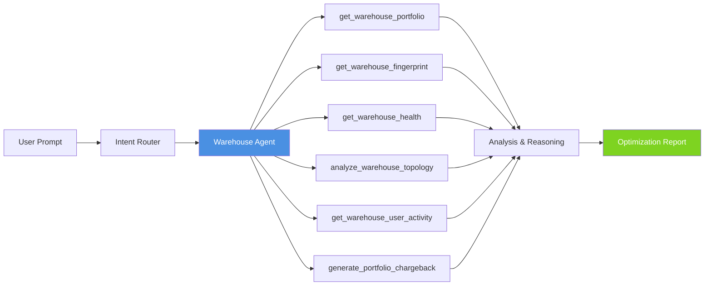

# Workflow: Warehouse Optimization

This guide walks through an end-to-end workflow for analyzing Databricks SQL
warehouse configurations using the Starboard AI agent. You will learn what to
ask, how the Warehouse agent investigates, and how to interpret the portfolio
analysis and optimization recommendations.

---

## When to Use This Workflow

- You want to optimize your SQL warehouse portfolio for cost and performance.
- You need to generate chargeback reports for internal teams.
- A warehouse is not meeting its SLO targets (query latency, queue time).
- You suspect warehouses could be consolidated to reduce costs.
- You want to track per-user or per-team warehouse activity.
- You need to configure or tune SLO targets for a warehouse.

---

## What the Warehouse Agent Can Do

The Warehouse Expert agent has access to the following tools:

| Tool | Purpose |
|------|---------|
| `get_warehouse_portfolio` | List all warehouses with utilization metrics and costs. |
| `get_warehouse_fingerprint` | Deep analysis of a specific warehouse (workload profile, query patterns). |
| `get_warehouse_health` | Health scoring and SLO compliance assessment. |
| `get_query_runtime_metrics` | Query-level performance metrics for warehouse analysis. |
| `configure_warehouse_slo` | Set or update SLO targets (latency, queue time, availability). |
| `analyze_warehouse_topology` | Cross-warehouse analysis for consolidation opportunities. |
| `get_warehouse_user_activity` | Per-user activity breakdown for a warehouse. |
| `generate_warehouse_chargeback` | Generate a chargeback report for a single warehouse. |
| `generate_portfolio_chargeback` | Generate a chargeback report across all warehouses. |

---

## Step 1: Start the Conversation

### Scenario A: Portfolio overview

Get a high-level view of all SQL warehouses in your workspace:

**Web UI:**
```
Show me all SQL warehouses with their utilization and cost breakdown.
```

**CLI:**
```bash
starboard --goal "Analyze the SQL warehouse portfolio and identify optimization opportunities"
```

### Scenario B: Single warehouse deep dive

Analyze a specific warehouse by name or ID:

**Web UI:**
```
Analyze the "Production Analytics" warehouse and check if it meets SLO targets.
```

**CLI:**
```bash
starboard --goal "Deep analysis of warehouse abc123 including health, SLO compliance, and user activity"
```

### Scenario C: Chargeback reporting

Generate cost allocation reports for internal billing:

**Web UI:**
```
Generate a chargeback report for all SQL warehouses for the last month,
broken down by team.
```

**CLI:**
```bash
starboard --goal "Generate a portfolio-wide chargeback report for the last 30 days"
```

### Scenario D: Consolidation analysis

Identify warehouses that could be merged:

**Web UI:**
```
Are there any SQL warehouses that could be consolidated? Check for low
utilization and overlapping workloads.
```

### Scenario E: SLO configuration

Set or review SLO targets:

**Web UI:**
```
The "Production Analytics" warehouse should have a p95 query latency under
10 seconds and queue time under 30 seconds. Configure these SLO targets.
```

---

## Step 2: What the Agent Does

Once you submit your request, the Warehouse Expert follows a systematic investigation:

### Phase 1: Portfolio Discovery

```
-> Get Warehouse Portfolio
```

The agent retrieves all SQL warehouses with:

- Current state (running, stopped, auto-stopped)
- Size configuration (cluster size, min/max scaling)
- Utilization metrics (queries/hour, peak concurrency)
- Cost data (DBU consumption, estimated monthly cost)

### Phase 2: Individual Analysis

```
-> Get Warehouse Fingerprint
-> Get Warehouse Health
```

For each warehouse of interest, the agent builds a detailed profile:

- **Workload fingerprint** -- Query types, patterns, peak hours
- **Health score** -- Overall grade with sub-scores
- **SLO compliance** -- Whether the warehouse meets its performance targets

### Phase 3: Cross-Warehouse Analysis (if needed)

```
-> Analyze Warehouse Topology
```

When comparing warehouses or looking for consolidation:

- Workload overlap between warehouses
- Usage patterns by time of day
- Consolidation candidates based on complementary peak hours

### Phase 4: User Activity and Chargeback (if requested)

```
-> Get Warehouse User Activity
-> Generate Warehouse Chargeback  /  Generate Portfolio Chargeback
```

For cost allocation and user tracking:

- Per-user query counts and resource consumption
- Team-level cost allocation
- Historical usage trends

---

## Step 3: Interpret the Report

### Portfolio Summary

A table of all warehouses with key metrics: size, utilization, monthly cost,
and health grade.

### Health Scores

Each warehouse receives a health grade (A through F) based on:

| Dimension | What It Measures |
|-----------|-----------------|
| **Utilization** | How efficiently the warehouse uses its allocated resources |
| **SLO Compliance** | Whether query latency and queue time meet targets |
| **Cost Efficiency** | Cost per query relative to workload complexity |
| **Configuration** | Whether settings follow best practices |

### Findings

Common findings from warehouse analysis:

| Finding | What It Means |
|---------|---------------|
| Warehouse oversized | The cluster size exceeds workload requirements |
| Low utilization | Warehouse is mostly idle; consider auto-stop or consolidation |
| SLO breach | Query latency or queue time exceeds configured targets |
| No SLO configured | Warehouse has no performance targets defined |
| Peak concurrency mismatch | Max scaling does not match peak usage patterns |
| Consolidation candidate | Two or more warehouses serve similar workloads at different times |
| High per-query cost | Individual queries are expensive; check query optimization |

### Chargeback Reports

If you requested chargeback, the report includes:

- Cost allocation by user, team, or department
- Query counts and resource consumption per entity
- Month-over-month trends
- Anomalies (users or teams with unexpected cost spikes)

---

## Example Prompts

Here are effective prompts for common warehouse optimization scenarios:

```
Show me the top 5 most expensive SQL warehouses and suggest how to reduce their cost.
```

```
Which SQL warehouses have utilization below 20%? Should any be consolidated or removed?
```

```
Generate a chargeback report for warehouse "Prod Analytics" for March 2026.
```

```
Warehouse "Data Science" has slow query performance. Check its health and SLO compliance.
```

```
Compare the "ETL Warehouse" and "Reporting Warehouse" to see if they could be consolidated.
```

---

## Workflow Diagram



*Warehouse optimization workflow: the user prompt is routed to the Warehouse Agent, which calls tools to gather portfolio data, reasons over the results, and produces an optimization report.*

---

## Related Workflows

- [Cluster Optimization](cluster-optimization.md) -- Clusters and warehouses share compute concepts but have different optimization models
- [Cost Analysis](cost-analysis.md) -- Warehouse costs are often the largest component of Databricks spend
- [Workspace Discovery](workspace-discovery.md) -- The Discovery agent includes compute health in its assessment

---

## Next Steps

- [Understanding Reports](../understanding-reports.md) -- How to read findings, impacts, and recommendations
- [Interruptible Reasoning](../interruptible-reasoning.md) -- Guide the agent mid-analysis
- [Troubleshooting](../troubleshooting.md) -- Common issues and solutions
